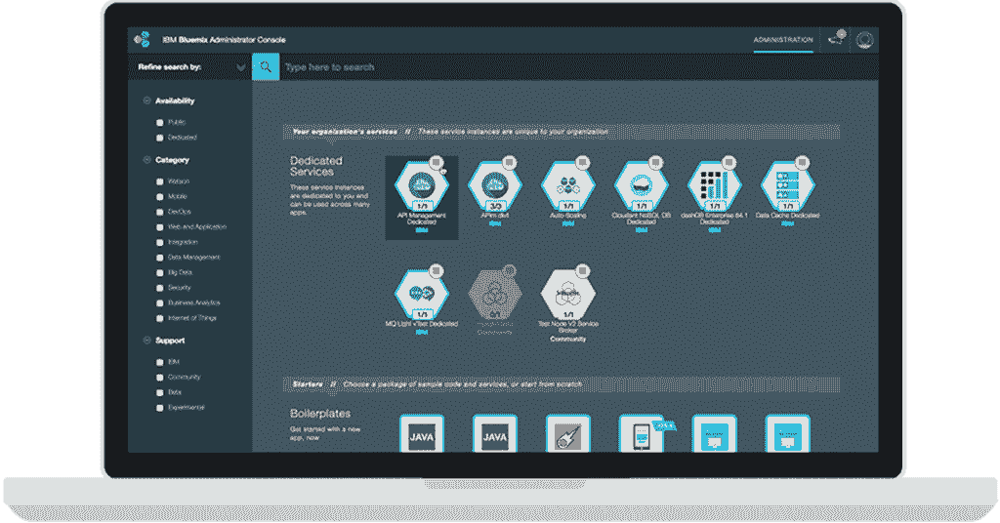

# IBM 如何将其 Bluemix 云植入您的防火墙之后

> 原文：<https://thenewstack.io/ibm-plant-bluemix-cloud-behind-firewall/>

IBM 希望将一些被大肆吹捧的云计算优点带给那些宁愿将数据和应用程序放在防火墙后面的组织。

周四，IBM 扩展了它的 Bluemix 平台服务，这样它们就可以在一个组织自己的内部网络中运行。

IBM 认为这种名为 Bluemix Local 的方法将会吸引许多高度监管的行业，尤其是银行、医疗保健和金融服务。

在防火墙后运行外部云服务听起来很矛盾，或者说是某种严重的营销柔术。但它是这样工作的:客户端建立一个服务器集群，运行 VMware stack 或 OpenStack。然后，IBM 将在服务器上安装和配置 Bluemix 软件，IBM 在自己的 Bluemix 云服务中使用的也是这种软件。

IBM 云平台服务副总裁 Damion Heredia 表示:“我们将它构建出来，加载所有服务，并像管理我们的数据中心一样管理它。客户只担心维护服务器和 OpenStack 或 VMware 的副本；IBM 管理栈中更高层次的所有软件。

内部的 Bluemix 可以通过两种方式之一与 IBM 捆绑在一起。Heredia 说，用户可以建立一个虚拟专用网络，或者直接连接到 IBM 在世界各地的 60 个“网点”之一。

IBM Bluemix 本地目录。

诚然，这种通常被称为混合云的通用方法已经被其他企业 IT 软件和系统提供商所接受，特别是[微软](https://thenewstack.io/azure-stack-its-not-windows-server/)和[惠普](https://thenewstack.io/hp-embraces-rivals-in-bid-for-hybrid-cloud-business-developer-love/)。

混合云背后的想法是，如果云类似于其内部 it 设置，组织将更容易将其运营转移到云。例如，一家微软商店可能会发现将业务转移到微软 Azure 比转移到亚马逊网络服务更容易。

Heredia 坚持认为，IBM 的混合方法优于其他未具名的竞争对手，这些竞争对手提供云软件，但将维护杂务留给客户。

“我们将 Bluemix 作为一项服务提供给你，就像我们在公共环境中做的一样，只是它是在你的硬件上，”Heredia 说。随着对内部云需求的增加或减少，客户可以调整所需的服务器数量。

BlueMix Local 依赖于名为 Relay 的 IBM 软件，该软件将 BlueMix 的本地副本(包括任何更新和安全补丁)与 IBM 维护的版本同步，以运行自己的服务。当 Bluemix 更新准备好应用时，管理员会收到警报，并有三周的时间来安排更新。

系统管理员使用控制台与所有的 Bluemix 服务进行交互，控制台跟踪组织运行的公共和私有 Bluemix 实例。根据 Heredia 的说法，在本地和公共云之间移动应用程序需要将应用程序重新绑定到新位置，这一操作只需点击几下鼠标即可完成。

“我们有一种运行应用程序的方式，你可以选择应用程序在哪里运行，”Heredia 说。IBM 还准备了一些工具，让数据迁移变得尽可能轻松。

IBM Bluemix 本地管理控制台

IBM 在 2014 年 6 月推出了 Bluemix。它基于 [Cloud Foundry](https://www.cloudfoundry.org/) ，是 Pivotal 管理的开源云平台软件。Bluemix 现在提供 120 种不同的平台服务，来自 IBM 和第三方提供商。

IBM 的 Bluemix 服务集[包括大多数 PaaS 服务上的标准运行时，包括 Node.js、Go、PHP、Python 和其他服务。Bluemix 还包括一套独特的沃森品牌认知服务。一种服务将语音转换成文本，另一种可以识别图像中的物体。](https://console.ng.bluemix.net/catalog/?cm_mc_uid=76333299396113982849080&cm_mc_sid_50200000=1443814262)

其他服务提供软件开发、安全和业务分析功能。

IBM 设想了许多 Bluemix 混合方法如何在企业中发挥作用的场景。一家公司可以在云中建立一个面向公众的应用程序，但让它从运行在 Bluemix Local 上的数据库中提取数据。或者，一个组织可以在内部开发一个应用程序，然后将其转移到云中用于生产。

在今年早些时候的测试中，西班牙金融机构 CaixaBank 开始使用 Bluemix Local 运行业务应用程序，这些应用程序是从私有云 Foundry 部署迁移而来的。

当然，尽管 IBM 对保守企业进行了巧妙的推销，但现在评估 Bluemix Local 的部署还为时过早。(9 月份的一份关于该公司[的 Forrester 报告讽刺道](https://www.forrester.com/Brief+IBMs+Future+Is+Digital+in+Asia+Pacific+But+Its+Delivery+Capabilities+Must+Match+Its+Vision/fulltext/-/E-res126021)IBM 的交付能力偶尔会“落后于其投资组合战略”)。

然而， [SMB Group IT 分析公司](http://www.smb-gr.com/)的联合创始人 Laurie McCabe 说，管理混合战略对 IBM 及其客户来说是一个明智的战略。

Laurie McCabe，中小企业集团

IBM 的主要客户是大型企业和政府机构，它们对如何维护数据和运营有监管限制。例如，医疗保健公司必须确保他们的系统符合健康保险流通和责任法案(HIPAA)。因此，在未来一段时间内，他们将把大部分业务留在内部。

“老实说，出于不同的原因，许多公司永远不会转向纯云环境。IBM 希望让这些人能够在私有云和公共云中做一些事情，”McCabe 说。"对 IBM 来说，这是非常务实的一步."

惠普、IBM、Pivotal 和 VMware 是新体系的赞助商。

<svg xmlns:xlink="http://www.w3.org/1999/xlink" viewBox="0 0 68 31" version="1.1"><title>Group</title> <desc>Created with Sketch.</desc></svg>