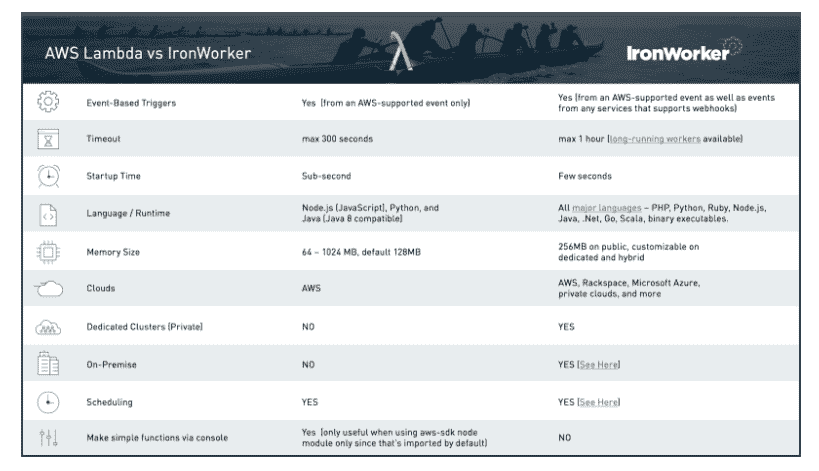
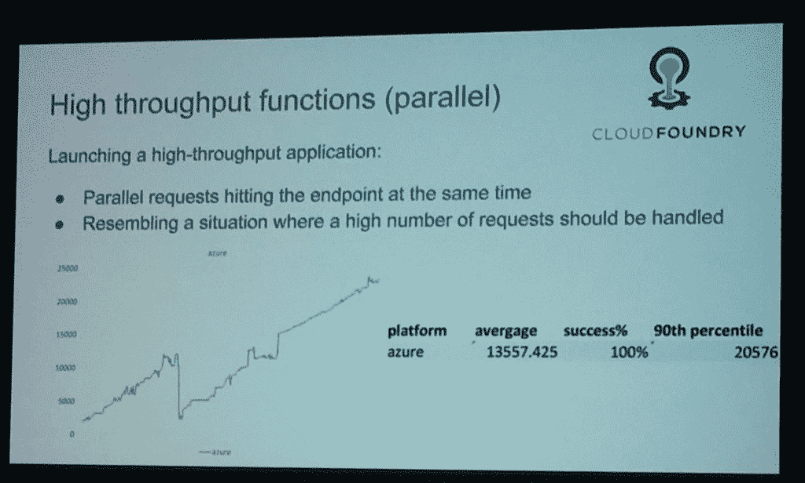
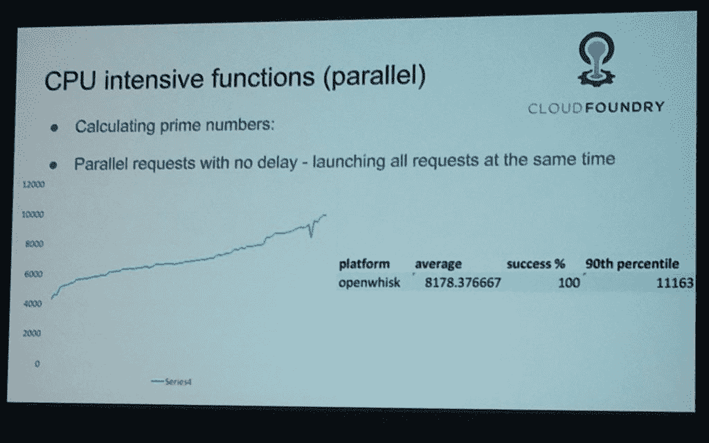
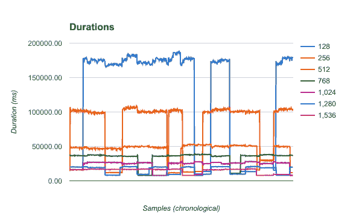

# 无服务器基准测试:IBM 科学家设计了一个测试套件来量化性能

> 原文：<https://thenewstack.io/ibm-scientists-set-quantify-serverless-performance/>

[无服务器技术](/category/serverless/)承诺简化可扩展性。虽然将运行功能的工作委托给云提供商，并让其决定如何管理执行，听起来是个好主意，但开发人员需要知道在基线性能方面会有什么期望。

两位 IBM 研究人员正在开发一个测试套件，以便更好地理解和比较无服务器平台的性能特征。

“我们想做的是有一种方法来理解这些无服务器平台是如何工作的，”IBM 工程师[迈克尔“马克斯博士”马克西米利安](https://twitter.com/maximilien)说，他在 2017 年硅谷[云铸造峰会](https://www.cloudfoundry.org/event_subpages/schedule-sv-2017/)的一次会议上，与 IBM 云工程师同事[尼玛·卡维亚尼](https://twitter.com/nimak)一起介绍了这项工作。

[https://www.youtube.com/embed/5JAINnKXI_8?list=PLhuMOCWn4P9hTlDEWJZV8JbVsW01avHF1](https://www.youtube.com/embed/5JAINnKXI_8?list=PLhuMOCWn4P9hTlDEWJZV8JbVsW01avHF1)

视频

以覆盖超级计算社区的 [SPEC 系列基准](https://www.spec.org/benchmarks.html)的伟大传统命名， [SPECserverless](https://docs.google.com/document/d/1e7xTz1P9aPpb0CFZucAAI16Rzef7PWSPLN71pNDa5jg/edit#heading=h.hs3id0lz5anm) 将是一组用于定义无服务器产品基准性能的测试。

为了表征无服务器性能，他们设计了四种类型的无服务器作业:

*   CPU 密集型，涉及寻找一个大质数。
*   内存密集型，有很多矩阵乘法。
*   高度依赖后端数据源(如数据库)的工作。
*   对网络要求高的工作。

他们还观察了三个维度:

*   调用:随机、峰值或周期性工作负载的差异。
*   有效负载:工作负载的输入和输出的大小。
*   并发性:一个服务可以并行执行的作业数量。

作为测试过程的一部分，还可以捕获许多特性。它们包括:

1.  价格
2.  超时
3.  结构
4.  目标云
5.  公共、专用或本地部署
6.  调度支持
7.  仪表板界面
8.  服务水平协议
9.  保留

在会议上，两人分享了在四个无服务器软件包上运行测试套件的一些初步结果，这四个软件包是 IBM OpenWhisk、微软 Azure Functions、Iron.io 和亚马逊网络服务的 Lambda，都是在 2016 年第三季度左右进行的。

他们还建立了自己的[基于云铸造](https://www.cloudfoundry.org/)的服务，昵称为“cf serverless ”,以比较无服务器和建立内部基于 PaaS 的服务的性能。

研究人员故意避免在不同的无服务器平台之间进行任何性能比较，无论如何，这些数字可能已经发生了变化，Kaviani 指出(“如果你得出任何比较结论，你自己去做吧，”他补充道)。这次运行的目的是更好地理解平台的一般行为。

“如果你发起大量并行请求，了解你的云平台如何扩展是很重要的，”Kaviani 说。

## 关于基线的一切

IBM 工程师分享了他们工作中一些有趣的结果，比如处理并发性的结果。例如，使用 Azure Functions，同时发送给服务的作业越多，每个作业的响应时间就越慢，直到作业总数达到某个阈值。过了这个阈值*，*完成工作的时间实际上减少了:

Kaviani 指出，响应时间变得更好的点可能是服务启动另一个容器来执行作业的点。他说，Lambda 和 OpenWhisk 都能够更好地适应不断增加的工作负载，而在响应时间上没有太大的差异。

那些按顺序启动的内存密集型函数——在服务在后端设置一个容器来运行函数的初始预热期之后——在执行时间上是非常线性的。然而，如果一些内存密集型功能的多个实例并行启动，那么“它会显著降低系统的性能，”Kaviani 说，他推测太多的作业可能会使容器崩溃，然后需要重新启动。

“对于大量内存密集型的东西，我们注意到当有大量请求进入时，Azure 无法很好地处理和扩展，”Kaviani 说。

从测试中得出的一个结论是，在无服务器上花更多的钱并不总是能保证相应的性能提高。“这在很大程度上取决于平台的架构，他们管理功能的方式，他们管理容器的方式，”Kaviani 说。

当然，SPECserverless 的时机是恰当的，因为许多调查使用无服务器的人正在量化他们自己对该技术的体验。

例如， [Symphonia](https://www.symphonia.io/) 无服务器咨询公司的联合创始人 [John Chapin](https://twitter.com/johnchapin) ，在试图建立 Lambda 如何响应低内存请求的基准时经历了很多挫折。

“仅仅使用几次 Lambda 调用来建立性能基线…根本不足以预测 Lambda 在更长时间内的行为，”Chapin 在描述他的工作的博客文章中写道[。](https://blog.symphonia.io/the-occasional-chaos-of-aws-lambda-runtime-performance-880773620a7e)

Chapin 使用 Java 8 编写了一个基本的 AWS Lambda 函数来执行递归 Fibonacci 算法。由于不同的 Lambda 定价等级是基于使用的内存量，Chapin 推测获得的内存越多，性能就越好。“为 256MB 内存配置的 Lambda 将是 128MB 内存的两倍，1GB 内存应该是 512MB 内存的两倍，”他写道。

然而事实证明并非如此。反正不是一直都是。

Symphonia 使用不同的内存选项在 AWS Lambda 上运行其示例函数的结果。

AWS 将性能扩展建立在最糟糕的时间基础上。因此，有时 128MB 服务的性能可能与昂贵得多的 1.5GB 服务相当。AWS 只是声称在 1.5GB 环境中运行的东西的最差性能不会比在 128MB 环境中运行的差。

在其他地方，[太空猿游戏](http://www.spaceapegames.com/)的高级开发人员[崔琰](https://twitter.com/theburningmonk)，查看了 AWS Lambda 的开始时间，也发现了一些差异。他发现静态类型语言(C#和 Java)的冷启动时间比动态类型语言(如 Python 和 Node.js/JavaScript.)高 100 多倍，但他也注意到，然而，[你购买的内存越多，启动时间就越快](https://read.acloud.guru/does-coding-language-memory-or-package-size-affect-cold-starts-of-aws-lambda-a15e26d12c76)。

[Cloud Foundry](https://www.cloudfoundry.org/) 是新堆栈的赞助商。

专题图片:马克斯博士，在硅谷云铸造峰会。

<svg xmlns:xlink="http://www.w3.org/1999/xlink" viewBox="0 0 68 31" version="1.1"><title>Group</title> <desc>Created with Sketch.</desc></svg>