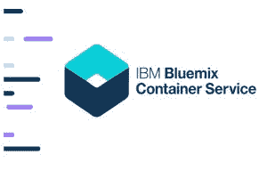

# IBM 为 Bluemix 容器服务开发 Kubernetes

> 原文：<https://thenewstack.io/ibm-taps-kubernetes-bluemix-container-service/>

IBM 继续为开发人员提供在云中构建认知应用的新服务和功能，提供一种新的云服务，利用 [Kubernetes](https://thenewstack.io/kubernetes-an-overview/) 容器编排系统和 [Docker](https://thenewstack.io/ebookseries/) 容器的力量。

在该公司的 [InterConnect 2017](https://thenewstack.io/ibm-empowers-financial-services-app-developers-new-tools-services/) 活动上推出的新 [IBM Bluemix 容器服务](https://www.ibm.com/cloud-computing/bluemix/containers)，是 IBM 的 [Bluemix](https://www.ibm.com/cloud-computing/bluemix/) 云平台上的一项容器服务，可以帮助开发者使用 Kubernetes 和 Docker 引擎简化应用的创建和管理。

IBM 研究员兼副总裁兼 IBM 云平台首席技术官 Jason McGee 表示，IBM Bluemix 容器服务可以自动供应、更新和监控开发人员用来创建应用程序的容器，帮助他们更容易地构建能够利用 IBM 实时安全智能的认知应用程序。

## 容器的力量

McGee 在一份声明中说:“用容器构建微服务有助于开发人员通过创建和拼接协同工作的不同服务来做他们最擅长的事情——发明。”。“我们的服务通过使用 Kubernetes 来自动化应用环境的关键部分，以简单明了的方式实现这一点，同时让开发人员能够构建认知智能、区块链和物联网服务。”

IBM 表示，容器处于开发人员向微服务发展的最前沿，因为它们使开发人员能够快速迭代、交付和操作应用程序的组件，而不局限于一个底层基础设施或云提供商。

容器的流行使其成为目前最热门的开发领域之一，451 Research 预测到 2020 年容器的市场机会将超过 26 亿美元。

IBM Bluemix 容器服务包括完全托管的 [Kubernetes](/category/kubernetes/) 集群，用于在构建应用程序时部署、扩展和管理容器，以及基于 Bluemix 构建的本地 Kubernetes APIs。McGee 说，它还具有自动负载平衡功能，并为用户提供跨多个平台和存储库存储和访问数据的选择，以及灵活的隔离和容量控制，以设计一个容器集群来满足应用程序的特定需求和预算限制。

Bluemix 容器服务还提供每个容器集群的性能指标，并提供对 IBM 云服务的访问，如 Watson APIs、区块链、云数据服务、物联网工具等。

## 针对企业进行了优化

McGee 说，总的来说，这项技术是“相当水平的”, IBM 已经在运输、金融服务、媒体、保险和其他许多行业采用了这项技术。

“我们没有为某些行业做很多优化，”他指出。“我们围绕我们认为客户可能会有的企业需求做了大量优化工作。我们在隔离和选择公共云之外做了很多工作。我们围绕安全性和漏洞分析做了大量工作。我们看他们的容器图像。我们与 X-Force 进行了集成，以获取有关行业安全状况的最新情报，并将其应用于工作负载。我们甚至会分析他们的应用程序开发功能，看看他们在部署时是否存在漏洞。”

事实上，安全功能是内置的。例如，IBM 的[漏洞顾问](https://www.ibm.com/blogs/bluemix/2017/02/assessing-security-risk-containers-vulnerability-advisor/)，Bluemix 用于扫描和标记容器内安全问题的工具，是 IBM Bluemix 容器服务的关键组件。该服务将通过与该公司的威胁情报共享平台 [IBM X-Force Exchange](https://exchange.xforce.ibmcloud.com/) 的集成，持续监控每个集装箱。

## 社区和贡献

McGee 表示，自该项目于 2014 年启动以来，IBM 一直在为 Kubernetes 的开发做出贡献。蓝色巨人也为 Docker 项目做出了贡献。

IBM 在一份声明中表示，通过将 Docker 驱动的引擎与 Kubernetes 的简单管理功能相结合，Bluemix 开发人员可以访问一个高度可用的界面和仪表板，以便在一个容器内轻松编写代码，并快速将其部署到多个应用程序。

IBM 负责云技术和架构的副总裁安吉尔·迪亚兹说:“Kubernetes 真的很重要。“我们在 Kubernetes 中为集群内容提供的单一租户可以帮助使用 Docker 的人减轻负担。这不是巧合。在过去两年多的时间里，我一直在将这些世界联系在一起。我们通过[开放集装箱倡议](https://thenewstack.io/open-container-initiative-launches-container-image-format-spec/)开放了 Docker。我站在台上扮演谷歌的 [OSCON](https://thenewstack.io/oscon-2016-capital-one-going-open-source/) 并打开了 Kubernetes，我刚刚把 Docker 带到了 CNCF 的[云本地计算基金会](https://www.cncf.io/)聚会上，他们刚刚宣布了 [containerd](https://thenewstack.io/docker-spins-containerd-independent-open-source-project/) 。对我来说，这是最基本的一点。”

McGee 指出，IBM 在 Bluemix 中提供容器服务已经两年了，因为人们正在研究如何构建下一代应用程序，以及容器在构建这些新应用程序中的作用

“集装箱被视为一项非常酷的技术，”他说。“我认为过去一年左右发生的事情是，人们开始从使用容器进行开发过渡到使用容器作为他们进行打包的开发过程的一部分。但除了早期采用者，大多数人还没有改变他们的运营模式。他们将容器放入虚拟机中，在生产中运行，就像它是虚拟机一样。他们使用旧的流程。但现在开始发生的是，他们正在使用越来越多的容器，试图获得更大的灵活性，并试图找出如何在操作上采用容器模型。这就是为什么你会看到像 Kubernetes 这样的编排系统越来越受欢迎，越来越成熟，贡献越来越大。”

此外，当 IBM 从云的角度看待企业 IT 领域时，“就像云中的许多东西一样，我们认为这些功能的‘即服务’交付具有真正的价值，可以消除客户设置和管理容器系统的负担，使他们可以专注于构建应用程序，”McGee 告诉 New Stack。“因此，我们试图通过容器服务为您提供这些高级容器编排系统的所有功能，但我们负责设置、管理、升级、扩展和集成这些系统，并以服务的形式为您提供所有这些功能，从而消除所有这些干扰。”

## 原始 Bluemix 容器服务

IBM 在 Bluemix 上最初的容器服务在几个方面有所不同。一是它是两年前在容器编排真正出现之前建立的。它提供了一个模型，在这个模型中，您可以简单地运行一个容器或同一容器的一个集群——IBM 负责运行一切，并以多租户方式运行它。

McGee 说:“因此，你有了像今天使用虚拟机一样的用户体验。“如果您现在转向云，并希望运行虚拟机，您不会先安装虚拟机管理程序，然后在其上运行虚拟机。你只需要运行一个虚拟机。我们就是这样开始的。”

他补充说，事实是，这很可能是 IBM 的落脚点。但这不是现在的市场，也不是现在的技术。他指出，事实上，好主意也需要好时机。

因此，在过去的六个月里，IBM 退一步说他们需要一个社区驱动的编排解决方案。由于蓝色巨人做了大量的分析，并且活跃在 Docker 和 Kubernetes 社区，他们选择了 Kubernetes。

“我们觉得集装箱市场还没有选出一个赢家，所以我不会说 Kubernetes 是赢家，”McGee 说。“我认为我们觉得他们最有动力。这是一个非常好的架构，我们都是贡献者。我认为它最好地代表了你真正用容器构建一个有意义的生产应用程序所需要的所有概念。所以，我们认为这是最好的技术。”

IBM 也将自己的服务押在了 Kubernetes 上。McGee 说，该公司正在 Kubernetes 上构建 Bluemix 栈的大部分，包括 Watson 和其他东西。

“现在，如果你想广泛打入市场，另一个大玩家是 Docker，”他指出。“我们使用 Docker 引擎，Kubernetes 使用 Docker 引擎。好吧，Docker Swarm orchestration 是另一大亮点。很明显，我们会有一个故事。我们现在还没有，但我们认为市场需要你对两者都有一个故事。我们会看到市场走向。

IBM 在达拉斯开始了其 Bluemix 容器服务的测试，并将扩展到其他市场，因为该公司准备很快使其普遍可用。

云计算原生计算基金会技术监督委员会主席、 [Weaveworks](https://www.weave.works/) 首席执行官 [Alexis Richardson](https://twitter.com/monadic) 在一份声明中说:“IBM 通过利用一个主要的社区项目——Kubernetes——作为其新容器服务的基础，正在推进开放技术，这真是太棒了。“利用 Kubernetes 和 Bluemix 的灵活性和控制力，我们希望看到更多的开发者访问并利用认知服务和 Watson APIs 来构建应用。”

[云本地计算基金会](https://www.cncf.io/)是新堆栈的赞助商。

由 [Ryan Wilson](https://unsplash.com/@rbwilson) 通过 [Unsplash](https://unsplash.com/@rbwilson?photo=YdpDztAnW9w) 拍摄的特征图像。

<svg xmlns:xlink="http://www.w3.org/1999/xlink" viewBox="0 0 68 31" version="1.1"><title>Group</title> <desc>Created with Sketch.</desc></svg>