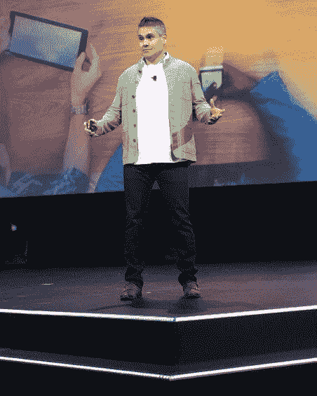
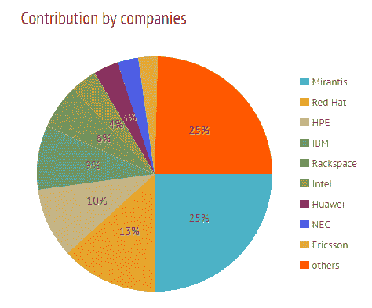

# IBM 的安吉尔·迪亚兹:没有云是孤岛

> 原文：<https://thenewstack.io/ibms-angel-diaz-no-cloud-island/>

正如我们所知道的蓝色巨人队伍中的任何人一样，安吉尔·迪亚兹是新 IBM 的代言人。迪亚兹似乎拥有无限的能量，是 IBM 的新一代高管，一个充满活力、风度翩翩的人，不知疲倦地在商展上建立联系，宣传 API、 [IBM Watson 认知平台](http://www.ibm.com/smarterplanet/us/en/ibmwatson/)，以及公司对开发人员的新投入，IBM 认为开发人员是企业的新守门人。

在上个月的 OpenStack 峰会上，我们采访了[迪亚兹](https://twitter.com/angelluisdiaz)。他热情但困倦，在[集装箱酒吧](https://www.yelp.com/biz/container-bar-austin)呆了一个深夜，仍然有些昏昏沉沉，这是他晚上到达奥斯汀时才听说的一家酒吧。这是一个由集装箱制成的酒吧。“我的意思是，你必须去，对不对？”他问。

Diaz 是 IBM 的云技术和架构副总裁。迪亚兹和他的团队负责监督 IBM 混合、开放和安全云背后的技术、架构和战略。他也是 IBM 开放技术的核心人物。他从 IBM 起步，在 IBM Research 工作，参与开发了我们今天在 Web 上使用的许多开放标准。

我们希望了解更多关于 IBM 参与 OpenStack 和 Cloud Foundry 的信息，了解 IBM 如何帮助公司应对开源带来的新开发方法。我们不禁问起迪亚兹在技术方面的丰富历史。

**TNS** :你最初是怎么进入科技行业的？

迪亚兹:事情是这样的，我在波多黎各的一个农场长大。那是在 70 年代末 80 年代初，我还年轻，对吗？我不得不跟着奶牛挤奶，清理它们的粪便，这是你上学前的一项标准工作。我就想，“你知道吗？一定有办法让这个自动化。我真的不应该这样做，对不对？”我想造一个机器人，一个人工智能。所以我开始真正投入其中。我会在大学读六年级，阅读来自马文·明斯基的关于人工智能的书籍。我不理解他们，但我对这个着迷，对技术着迷，对让我们的生活变得更好着迷。

在我成长的过程中，在科学方面，我有一些非常优秀的导师。我建造了我的第一台电脑，一台 Timex/Sinclair，并重新编程了整个操作系统，因为我需要更多的内存。长话短说，我跳过了几级，去了 RPI Rensselaer，获得了计算机科学博士学位，并于 97 年直接进入了 IBM 研究院。我和一位著名的奥地利计算机科学家埃里克·卡尔托芬一起工作。

当时，这是互联[计算]能力的开端。一台机器永远无法完成计算，但我可以拥有十台机器，一百台机器，一千台遍布世界各地的大学的机器。你如何把这些电脑连接在一起？在那段时间，我一直在和(欧洲粒子物理研究所的)T2·安德斯·贝里隆德(T3)一起工作。我们在做网络，HTML。我在做数学，他在做物理。我们开始致力于各种成为网络标准的项目。我一直关心的是语义，事物的意义，因为要用数学计算，你需要理解它。所以我与人合著了许多原始的 web 标准、标记标准，比如每个人都在 JavaScript 中使用的 [DOM](https://www.w3.org/TR/2004/NOTE-DOM-Requirements-20040226/) 。我是委员会成员。我参与了级联样式表。我帮助创建了 XSLT 和 XSL-FO。我写了 XML 的第一个用例，Jon Bosak 正在做。我们编写了有史以来第一个 XML 解析器，并把它放在那里。它实际上是用 C++写的，我们不得不用 Java 重写，以便人们使用。

所以我对多模态的概念非常感兴趣。你如何为看不见的人做标记，对吗？那么如何把文字和语音结合起来呢？所以我跑了 IBM 的自然语言组，现在是 Watson 的一大部分。Watson 远不止这些，但是你必须理解这种语言，并将其转换成标记化的形式，然后可以对其进行分析，对吗？这是一个非常困难的问题，因为你必须训练系统，你必须理解语言。

安吉尔·迪亚兹在二月份的 IBM 互联大会上发言。

无论如何，那时史蒂夫·米尔斯正在运行软件，他请求我和其他一些人一起帮助他构建下一代交易系统。事情大概就是这样发生的。

我的生活中没有任何事情是计划好的，它就这样发生了。我只是顺其自然。

**TNS** :那么是什么让 IBM 参加 OpenStack 大会呢？IBM 最近的 OpenStack 故事是什么？

大约在 2000 年，我们当然知道云计算、计算机存储和网络正在大众化，并且有可能出现互联网式的创新爆炸。一旦你这样做了，你无法想象的事情就会发生。

因此，在 2010 年左右，我们必须做出选择，是开始构建基于专有技术还是开放技术的云。一个 IBM 的研究员，[戴夫·林德奎斯特](https://twitter.com/d_lindquist)，我和史蒂夫聊天，每个人都说，“哇，看看所有这些社区。”有很多不错的云堆栈。我们可以自己开，但为什么不加入呢？我们为什么不帮忙？“我也许能够激励社区，因为当时社区非常分散。

大概有十个潜在的项目。有了 OpenStack，所以我见到了[乔纳森布莱斯](https://twitter.com/jbryce?lang=en)。当时他在 Rackspace。OpenStack 的伟大之处在于它的代码可能不是最好的，但当时社区有相当多的用户。你知道，每当你看开源，用户胜过代码。代码会变得更好。但是这种氛围，我们过去称之为 OpenStack 的方式很棒。那是一个小社区。所以我们在 2012 年帮助建立了 OpenStack 基金会。

顺便说一句，我们正在用 Cloud Foundry 做同样的事情。我们即将举办[云铸造峰会](https://www.cloudfoundry.org/events/)。我们预计那里会有 2500 到 3000 人。它比 OpenStack 发展得更快。我们正在创造这些构成云架构的重心，一个开放的云架构。

那么我们为什么要这么做呢？这是关于一致性的选择。我们希望我们的客户能够构建他们的应用程序，无论他们关注的是基础设施还是平台，并且在任何云上都可以工作。没有云是孤岛。只有一个公共云供应商或一个公共云是一种幻觉。当然，会有私有云。当然，越来越多的公共云和来自多个供应商的云将会出现。

TNS:对。所以你总是会有多重云？

迪亚兹:是什么让网络工作？互操作性，对吗？通过代码，通过 API，通过测试实现互操作性，对吗？这就是它的工作原理。当你在 IBM.com 或 ESPN 或美国有线电视新闻网或梅西百货，无论什么，你不担心它是否会工作。它只是工作，你不关心什么网络服务在另一边，你不关心你用的是什么浏览器。

顺便说一下，在那些日子里，我曾经和网景和微软坐在一个房间里，因为 IBM 没有浏览器，我有点像是中间的猴子。他们在争夺眨眼标记。我知道这听起来很可笑，但让我告诉你，对他们来说，这是当时的一个区别。

来自 Stackalytics 的公司对 OpenStack 的贡献

所以无论是 Cloud Foundry 还是 OpenStack，都是关于互操作性的。我们是 OpenStack 最大的贡献者之一。我们有大量的项目负责人。我们有数百名开发人员百分之百地为 OpenStack 开发代码。

TNS:那是他们的全职工作…

广告:全职工作。这融入了我们的产品组合，但我们在这次会议上试图明确的是，为了让供应商真正做到这一点，我们真的需要更快地展示互操作性。

TNS:好的。你谈到了整个社区…

AD:是的，不仅仅是社区，还有供应商，对吗？你走进这里，你看到 9000 人，这不是一个 IBM 的会议，但这里的每个人都有 IBM 的技能，因为我们的云有 OpenStack。

我可以雇佣他们；我们的客户可以雇佣他们。想想吧。如果你是一个供应商，你有自己的专有软件，你必须建立自己的技能基础和自己的小爱好者。我们也做得很好。你能做那件事，但是它是许多工作。构建云并不是维护云。不容易。代码有很多变化。

但是最终，我们所有的客户都不是软件提供商。因此，他们最终与像我们这样的供应商合作，我们提供技术，但他们获得互操作性。他们能够从更大的基础上获得所需的技能，而不仅仅是单一来源。

**TNS** :关于你为企业提供的服务， [Bluemix](https://thenewstack.io/ibm-plant-bluemix-cloud-behind-firewall/) 在客户的防火墙后提供这些云服务。

**迪亚兹** : [Bluemix](http://www.ibm.com/cloud-computing/bluemix) 是云代工容器吧？我们可以向公众提供，或者你也可以在本地获得开源 Bluemix。我们实际上有能力对抗云，并为我们的客户远程管理云。我们有一个叫做接力赛的东西。我们将处理所有的更新，所有的补丁，一切。因此，您可以专注于使用您的私有云，并建立一个大规模的运营团队，这是必需的。

并非所有服务都是内部提供的。但是很多最普通的东西都在那里。你可以结合使用它们。你可以用外面和里面的东西。你可以使用其他供应商，无论如何。所以我们的主要推动力是互操作性。

https://youtu.be/8swCjq3s5t0

**TNS** :我们注意到在新的云环境中，开发人员和系统管理社区之间的责任平衡发生了变化。一些大型商店的开发人员越来越多地承担起运营职责…

**Diaz** :这是关于文化和你如何开发代码的问题。因此，云让开发者备受关注。无处可藏。如果有什么东西坏了，你就修理它。修复。修复。修复。迭代。迭代。迭代。

当你是 28 岁的旧金山或圣何塞人时，这很容易做到。一旦你有了一个住在圣拉蒙的人，那个开发者就不在日常生活中了。所以问题是，“你如何真正获得编程的那种严格性和纪律性，就像它在内部一样？你如何大规模地做到这一点？”

你猜怎么着，开源社区正在这么做，对吗？因此，我们所做的是，大约三年前，我们开始在内部转变我们构建代码的方式。在过去的四年里，我们已经重组和重新培训了大约 4000 名云开发人员，并围绕这一点创建了方法。我们称之为 [Bluemix 车库法](https://www.ibm.com/devops/method/)。

https://youtu.be/Qmm7wGZDc5c

**TNS** :是什么？

迪亚兹:所以这个方法大约有 25 个基本代数元素。你如何做单口相声？你如何任人唯贤？你是怎么做修复编程的？你是如何远程配对的？你如何做旋转样本？基本的东西。

所以我们描述这些，然后通过我们称之为路径把它们串在一起。不知道大家还记不记得 [Java Trails](https://docs.oracle.com/javase/tutorial/collections/) ，总之我们称之为路径。举例来说，如果你正在构建一个新的应用程序，那么这里有一条你要走的路。如果你有一个现有的团队尝试这样做，这里有另一条路。如果你正在构建一个移动应用程序，这里有另一种方法。它向你展示了如何重组团队，如何进行开发，以及如何使用开源工具链。顺便说一下，它是抽象的，但我们也在 Bluemix 中将其具体化。因此，您可以利用我们的工具链和其他工具，在 Bluemix 中实现这一点。

**TNS** :所以现在有很多公司把软件开发作为业务的核心部分，所以 Bluemix Garage 真的能帮上忙……

迪亚兹:发展是商业中绝对重要的一部分。所以问题是在这个新世界里你该怎么做。顺便说一下，这不仅仅是为了速度，对吗？你需要速度；你需要创新和诸如此类的东西，但坦率地说，[Bluemix Garage]是一种留住人才和吸引技能的机制。

并非每家公司都在加州设有办事处。这些公司可以以他们愿意支付的任何价格得到他们需要的任何人才，对吗？在纽约、西雅图、奥斯汀，有一些开发商集中的地方。但是你到处都有不在这些地方的公司。他们如何留住和吸引帮助？文化。

如果你想让新一代的开发者感到舒服，你必须有这种工作方式。这就是他们今天的工作方式。

TNS:因为在工作面试中，当开发人员问:“我为什么要在这里工作？”然后你可以给他们看…

AD:你向他们展示了你的工作方式，你不像被困在地狱的瀑布里，80%的时间花在构建图表上，而不是写代码。这也是你组织空间的方式，实验室建造的方式。

所以整个文化方面非常重要。它可能帮助我们获得人才，留住人才，吸引人才，它也帮助您的客户。我不知道任何其他供应商或大供应商有这种方法。

IBM 是新堆栈的赞助商。

<svg xmlns:xlink="http://www.w3.org/1999/xlink" viewBox="0 0 68 31" version="1.1"><title>Group</title> <desc>Created with Sketch.</desc></svg>