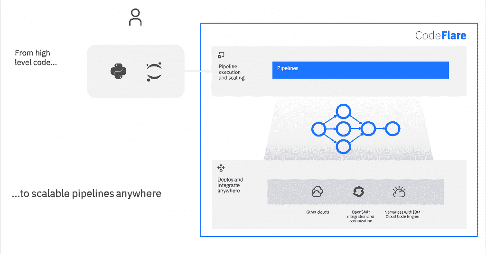

# IBM 基于 K8s 的 CodeFlare 框架将人工智能从笔记本电脑带到了云端

> 原文：<https://thenewstack.io/ibms-k8s-based-codeflare-framework-takes-ai-from-laptop-to-the-cloud/>

[IBM](https://www.ibm.com/cloud?utm_content=inline-mention) 已经[推出了 CodeFlare](https://www.research.ibm.com/blog/codeflare-ml-experiments) ，这是一个新的开源框架，用于简化大数据和人工智能工作流的集成和扩展。建立在机器学习应用的分布式计算框架 [Ray](https://rise.cs.berkeley.edu/projects/ray/) 之上的 [CodeFlare](https://github.com/Codeflare) 瞄准了一个共同的问题，特别是在人工智能领域——允许开发人员轻松地从他们的笔记本电脑直接扩展到云，以利用高性能计算和规模，而无需基础设施专业知识。

IBM Research 云平台研究主管 Priya Nagpurkar[表示:“我们看到的是机器学习、模拟和大数据处理的融合，最终你试图构建的大工作流或应用程序需要将这些功能的各个方面结合在一起，困难在于在云上执行可扩展性。“当谈到数据科学家或高性能计算领域专家可扩展地运行这些东西所需的技能和专业知识时，仍然存在一些困难和挑战。这就是为什么，从云和平台以及运行时的角度来看，我们说的是，“我们如何发展我们的云平台来迎合这些新出现的工作负载？”"](https://www.linkedin.com/in/priya-nagpurkar)

正在讨论的人工智能工作流处理各种任务——从数据清理到特征提取和模型优化。Nagpurkar 解释说，目前，开发人员和数据科学家正在使用不同的框架将这些工作流缝合在一起，特别是在处理并行化和扩展时，每种框架都可能使用不同的语言。CodeFlare 希望通过使用 Python(这种语言已经成为数据科学中的一种常用工具)将所有内容缩小到一个运行时，并根据需要处理扩展这些流程的任务，来简化这一过程。

“在其他地方存在的德沃普鸿沟在这里也存在，”Nagpurkar 说。“我在我的笔记本电脑上开发，我建立了这些管道，但当它出现时，我现在需要针对大数据集运行它们，随着规模的扩大，它完全崩溃了。我基本上要去分别麻痹它的碎片。”

在一篇进一步描述 CodeFlare 如何工作的[博客文章](https://medium.com/codeflare/codeflare-pipelines-d5edf72306d6)中，一组 IBM 研究人员解释说，“云原生平台是显而易见的选择，但使用容器来实现并行性太粗粒度了:从数据科学家的角度来看，扩展 Python 函数不应该需要建立容器。”答案是在 Ray 的基础上构建，它不仅提供了 Python 函数级别的伸缩性，还提供了用于对象共享的分布式对象存储。

至于 CodeFlare 如何实现其承诺，将这些工作流从笔记本电脑转移到云，答案仍然是 Kubernetes。然而，该框架抽象出了建立容器的过程，使得开发人员在 Python 中完成所有工作的同时，仍能享受到 Kubernetes 带来的并行化和可伸缩性的好处。在其公告中，IBM 特别提到了该公司的新无服务器平台 IBM Cloud Code Engine 以及 Red Hat OpenShift，作为 CodeFlare 易于部署的云平台，但 Nagpurkar 解释说，Kubernetes 是常见的必要底层。

“这里的共同点是 Kubernetes。这就是云原生框架和新框架结合的地方，”Nagpurkar 说。“我认为数据科学、大数据以及机器学习社区肯定会认识到 Kubernetes 环境是在云上运行的方式。Kubernetes 通过多集群、可伸缩性、安全性、隔离、多租户解决了所有问题，我们希望利用所有这些，但 Ray 作为一个框架为我们提供了一种围绕任务和参与者的抽象和 API。”

正如许多这种性质的开发一样，CodeFlare 被[描述为](https://www.research.ibm.com/blog/codeflare-ml-experiments)为数据科学家提供了一致性，这将允许他们“将更多的注意力放在他们的实际研究上，而不是配置和部署的复杂性上。”Nagpurkar 说，在同样的意义上，Kubernetes 上操作的一致性也将有助于不仅将不同的工作流缝合在一起，而且将孤立的应用程序缝合在一起。

“我们谈论人工智能被注入商业应用等等，这就是未来。今天，它仍然是孤立的，”他指出。“你做你的数据科学，你在这里用一套不同的工具建立你的模型，然后你在运行和 Knative 等方面有你的业务应用。我们今天在 CodeFlare 中做的一件事是暂时通过事件连接这些世界。例如，如果你有一个简单的仪表板，它被实现为在 Knative 上运行的微服务，你可以很容易地想象一个 CodeFlare 管道发出事件来更新 Knative 上的那个东西。”

<svg xmlns:xlink="http://www.w3.org/1999/xlink" viewBox="0 0 68 31" version="1.1"><title>Group</title> <desc>Created with Sketch.</desc></svg>