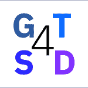

# IBM 的开源 GT4SD 为科学家提供了灵感

> 原文：<https://thenewstack.io/ibms-open-source-gt4sd-generates-ideas-for-scientists/>

全球信息技术公司 [IBM](https://www.ibm.com/cloud?utm_content=inline-mention) 发布了一个开源库，科学发现的[生成工具包(GT4SD)，希望](https://github.com/GT4SD/gt4sd-core)[在](https://research.ibm.com/blog/what-is-accelerated-discovery)[机器学习](https://thenewstack.io/category/machine-learning/)领域加速发现。

GT4SD 旨在不仅使高级生成模型更易于使用，而且在将它们应用于发现工作流时更高效，它托管了 IBM Research 开发的生成算法，用于设计具有独特应用的新材料和科学文档的语言模型。

在一篇解释 GT4SD 的[博客文章](https://research.ibm.com/blog/generative-models-toolkit-for-scientific-discovery?social_post=6575028361&linkId=156745614)中，IBM 将该项目描述为“一个开源库，用于加速科学发现过程中的假设生成，从而简化最先进的生成模型的采用。”IBM 研究科学家和 GT4SD [的主要创造者 Matteo Manica](https://www.linkedin.com/in/matteo-manica-drugilsberg/?originalSubdomain=ch) 在接受 New Stack 采访时发表了他对该工具包的见解。

“这是 IBM Research 内部不同研究人员之间的公开交流。我们注意到，在社区和其他领域，有一种简化这些人工智能技术的冲动。我们还注意到了生成模型中需要填补的空白，”他说。“去年，我们开始收集从事该课题研究的各种研究人员的意见。我们正在开发许多不同的技术，所以要将来自不同实验室的所有想法整合到一个研究项目中，需要付出巨大的努力。”

“与发表研究成果通常需要的时间相比，我们的速度非常快。从一个算法的最初构思开始，可能需要一年左右的时间才能将其发表。到那个时候，它已经老了，你有很多其他的想法，”马尼卡开玩笑说。“相反，这项计划的美妙之处在于它非常专注于快速开发一项技术。我们从已经在 IBM Research 创建的算法开始，然后寻找我们希望在我们的库中可用的某些东西。这是一项最多持续十个月或十一个月的努力。”

## 真实世界使用

将人工智能与假设生成相结合，可以给几个研究领域带来前所未有的好处。在药物发现中，目前人类已知的类似药物的分子数不胜数，用常规的试错工作流程几乎不可能找到完美的组合。使用 GTS4D，这一过程可以成倍加快。

“生成模型非常擅长查看您已经知道的内容并列出示例，如属性，然后根据新的示例进行推断。你可以把这个过程看作是点与点之间的连接，”马尼卡评论道。“想象你有一个类似波洛克的画布，上面有许多点(属性)，你可以在这些点之间画线。沿着这些线，你会发现许多不存在的点，因为它们还没有被发现。生成模型为您提供了一种模拟发现这些点的方法。如果发现的属性符合搜索标准，它们可能是发现过程的最佳候选对象。”

尽管药物发现是一个可以立即识别的用例，Manica 指出 GTS4D 可以用于“任何分子科学应用”

“例如，你可以优化酶来催化特定的反应。这很酷，因为酶工程和设计对更绿色的化学过程非常重要。你不需要极端的温度，有毒的溶剂，或者消耗大量的能量，”Manica 说。“这是一个完美的例子，其中生成模型可以帮助科学家使过程更加可持续和有效。”

在发布 GT4SD 的文章中，IBM 详细描述了该工具包非常有用的许多场景。以下是几个例子:

*   **材料发现**和**药物发现**科学家可以使用该库提供模型，这些模型可以根据特定的属性生成新的分子设计，如目标蛋白质、目标组学特征、支架距离、结合能、HOMO 和 LUMO 能量等。
*   **使用生成模型的科学家和学生**被提供了一个集中的环境来访问和试验不同的模型，通过一致的命令使用默认参数设置进行推理或再训练来简化模型的使用。
*   **构建生成模型的 AI/ML 从业者**可以从 GT4SD 熟悉的框架中受益，这使得模型更容易被更广泛的社区访问。

IBM 写道:“在发现过程中，手动过程和人为偏见的替代对依赖生成模型的应用程序有着重要影响，导致专家知识的加速发展。”

“我们的重点是材料设计，因为这是我们进行大部分研究的领域。然而，该工具包被设计为尽可能通用，以便生成模型可以用于各种应用，”Manica 说。

## 开放研究资源

Manica 表示，GT4SD 从一开始就是开源的。“我是开源项目的坚定信徒，我认为这是在科学界实现大目标的最佳方式。”

他接着说，“我们开源工具包的目标是让研究在生成建模领域更快地发展。对于任何公司来说，收入显然是重要的，并且很难看到你如何从一个开源项目中获得收入。但我们在这里寻求的主要回报是创建一个用户和贡献者社区，帮助我们建立更好的模型，以及我们可以帮助谁建立更好的模型。”

开源技术已经在工程和编码社区掀起了波澜，但 Manica 相信科学家也能从中受益。使用这个工具包的人越多，它就越先进。

## 展望未来

GT4SD 已经发布供公众使用，但它不是马尼卡所说的成品。“令人高兴的是，这不是最终产品。当然，它是现成可用的，但是该库是一种用于生成建模的开放工厂。我们打算继续开发它，不仅是为了我们自己在 IBM 的研究，也是为了更广泛的研究社区共同建设。这只是一个开始，我们希望贡献者和用户能够改进这个库，并在他们自己的项目中使用它。”

他继续说道，“在五年内，我希望看到 GTS4D 真正成长并发展成为一个真正的社区。无论是在生物化学领域、聚合物物理还是任何其他行业。归根结底，我们主要关心的是在未来十年内实现大幅加速发现的目标。”

该工具包从上周开始就可以使用了。Manica 最后敦促潜在用户“尝试 GT4SD。在你的研究中使用它，打破它，并报告任何问题。它是为科学界开发的，我们希望每个人都参与进来。”

<svg xmlns:xlink="http://www.w3.org/1999/xlink" viewBox="0 0 68 31" version="1.1"><title>Group</title> <desc>Created with Sketch.</desc></svg>