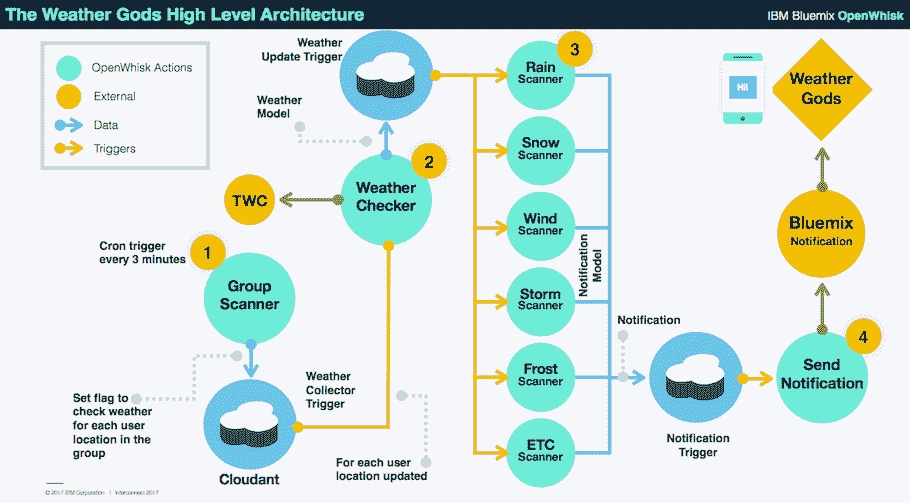
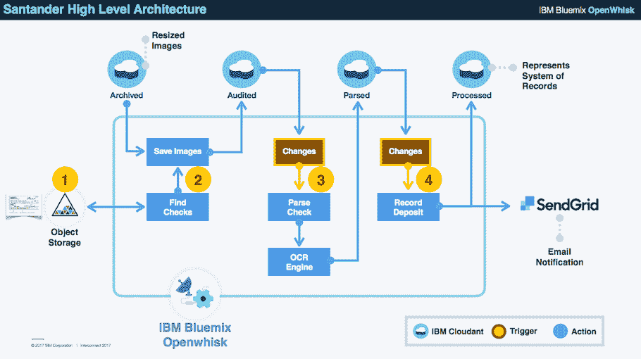
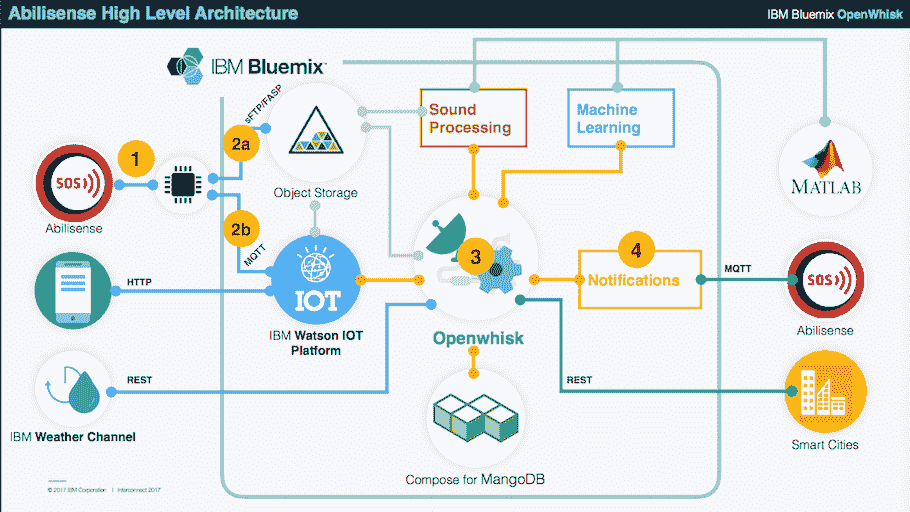

# IBM OpenWhisk 无服务器平台的 5 个新兴用例

> 原文：<https://thenewstack.io/ibms-openwhisk-serverless/>

渴望利用新技术获得突破性优势的初创企业，以及希望从工作负载中特别繁琐的角落获得效率和成本节约的老牌企业，都在探索和选择无服务器作为云架构选项。

甚至在[无服务器](/category/serverless/)的早期，我们也看到了一些[常见的无服务器设计模式](https://thenewstack.io/serverless-architecture-five-design-patterns/)和无服务器用例。例如， [Apache OpenWhisk](https://openwhisk.incubator.apache.org/) 平台似乎吸引了一些客户，这些客户担心被供应商锁定，甚至可能矛盾地着眼于在未来将他们的无服务器功能托管在他们自己的基础设施上(或与另一家供应商一起)，据 IBM 高级技术人员兼 OpenWhisk 技术产品经理 Andreas Nauerz 称，IBM 去年开放了 OpenWhisk。

Nauerz 将 OpenWhisk 的用户分为两类，一类是渴望使用新事物并构建完全无服务器应用程序的初创企业，另一类是希望使用无服务器来完成特定任务的现有企业，尤其是在处理可被安排为短期处理任务的不稳定工作负载时。

在 OpenWhisk 社区中，有五个用例正在成为当今生产中如何使用无服务器的主要趋势。这些是:

1.  移动后端开发
2.  数据处理
3.  认知加工
4.  流式分析
5.  物联网。

## 移动后端开发

通过帮助企业创建具有 API 后端的无服务器微服务，无服务器可以帮助开发人员更好地分离前端和后端开发。Nauerz 说:“客户实现很少的功能或动作来处理特定的业务逻辑，比如创建或查询客户。“然后，通过开发 API 网关功能并将 API 端点提供给前端开发人员来调用，这些功能将暴露给前端开发人员。”

尤其是，Nauerz 指出，是无服务器的移动后端环境。“我们通常遇到的问题是，移动应用需要服务器端逻辑，但移动开发者是前端专家。因此，OpenWhisk 使他们能够轻松开发他们的前端应用程序，并访问已经为其他人实现的服务器端逻辑。使用 API 网关，移动开发人员可以调用它们。对于简单的东西，移动开发人员甚至可以在后端用 Swift 这样的语言来做。我们为 iOS 提供 SDK 来使用这些功能。”

这就是手机应用 [WeatherGods](https://itunes.apple.com/us/app/weather-gods/id1041512978?mt=8) 使用 OpenWhisk 的方式。这个程序用一个不同的神化身来代表每一个气候现象(例如降雪)。移动用户可以选择他们感兴趣的特定天气事件，比如在柏林下雪时得到通知。

“在架构上，[该应用程序]使用气象公司的服务器定期扫描天气状况，然后检查每个用户的配置，然后在天气模型上执行 OpenWhisk 操作(称为扫描器)。如果它识别出用户感兴趣的东西，比如柏林的雪，它会在天气事件发生前 15、30 或 45 分钟触发，移动用户会收到动画天气神通知。”

## 数据处理

无论平台如何，数据处理对于无服务器来说都是一个非常重要的领域，这也是 OpenWhisk 的一个关键用例趋势。特别是，图像处理或其他任务，如声音文件中的降噪，是最常见的。诺尔兹所看到的是，尤其是多媒体文件的数据处理的使用越来越多。

正如杰森·麦吉今年早些时候在奥斯丁的 [Serverlessconf 上提到的，支票的图像处理利用无服务器架构来处理关键的需求高峰，而不是在其余时间维护不必要的计算资源(例如，对于一个客户来说，大多数支票需要在发薪日星期五处理)。](https://thenewstack.io/serverless-works-best-api-architectures/)

当然其他业务都是在无服务器做图像处理。最普遍的无服务器设计模式和用例之一是使用混合模型，其中对象存储图像的图像处理(例如将图像调整为标准选项库)在无服务器中进行，然后将结果反馈到现有的架构工作流中。

## 认知加工

与数据处理场景类似的是认知处理，其中 OpenWhisk 与 [IBM Watson ML](https://console.bluemix.net/catalog/) 算法结合使用，对多媒体文件执行一些认知任务。IBM [一直在宣传一家保险公司的用例](https://thenewstack.io/serverless-computing-use-cases-image-processing-social-cognition/)，该公司使用无人机拍摄财产图像，然后在无服务器环境中使用认知处理来识别财产损失，加快保险支付计算或进行风险评估。

“一架无人机在某个区域上空飞行，不断拍照，”Nauerz 解释道。“一旦图像被存入数据库，它们就会被分析。例如，你可以训练沃森检测屋顶是否有冰雹损坏。你可以让无人机飞越整个区域，并立即获得结果。”

https://www.youtube.com/watch?v=AFETvKDIfWY

对于 IBM 来说，这是一个如此引人注目的用例，以至于他们已经建立了无服务器示例项目 [Skylink](https://github.com/IBM-Bluemix/skylink) 专门帮助保险公司实现这个想法。然而，在与几家保险公司的非正式讨论中，很难确定是否有任何企业准备在生产中实现这样的用例。

到目前为止，只有 9 个 GitHub 成员开发了 Skylink 项目示例，其中只有一个看起来像是在有潜在用例的企业中工作，其余的都是业余爱好者或在 IBM 工作。Nauerz 承认，对于成熟的传统行业来说，能够使用无服务器来管理这样一个过程中的所有步骤，从而创建生产级工作流可能仍处于早期阶段。

## 流式分析

“到目前为止，在这些使用案例中，我们一直在谈论静态数据。但你还想用无服务器对实时数据流做出反应，”Nauerz 说。

他描述了与 Kafka 和 Bluemix 的集成，Kafka 中发布的数据可以立即开始分析。他提出，金融用例是关键的纯流分析无服务器示例之一。另一个，他说，应该有一个单独的类别，即…

## 物联网

Nauerz 说:“设备不断处理数据，但如果你处理单个数据点，那将是成本密集型的。相反，他看到一种常见的设计模式正在出现，其中数据被推送到 Watson，这可能有简单的规则来确定阈值。在达到这些阈值的情况下，例如，传感器读数报告温度超过某一水平，然后触发附加处理，例如启动喷洒器。

Nauerz 指出，abili sense T1 是一家使用 T2 沃森 T3 和 OpenWhisk 为听力障碍者管理物联网通讯平台的企业。Abilisense 提供了一种家用设备，它可以连续记录环境噪声，在出现峰值时提取音频，例如在烟雾警报或窗户被打破时可能出现的峰值，分析该噪声，然后向用户发送适当的光或其他通知信号，以便他们可以做出响应。

“音频文件将被推送到对象存储，然后进行分析，同时来自其他传感器的任何读数也将通过 MQTT 推送到物联网平台。Nauerz 说:“因此，音频文件本身以及来自其他传感器的数据都是通过定义规则来管理的，这些规则会在必要时调用 OpenWhisk 操作。

Nauerz 说，在 Abilisense 的案例中，他们能够根据预期的数千台设备进行一些使用需求假设。“他们知道他们预期的动作调用次数、内存消耗等，因此他们可以进行成本计算。他们估计每月不到 15 美元就可以处理所有的月负载。

Nauerz 还提到了以色列智能城市初创公司 [GreenQ](https://greenq.gq/) 使用 OpenWhisk 作为“垃圾互联网”平台。GreenQ 正在优化特拉维夫的垃圾处理卡车路线，估计通过使用无服务器架构来跟踪卡车位置、称重垃圾箱并分析垃圾箱内容的照片，他们可以计算出最佳路线，降低城市碳排放，并节省高达 50%的市政成本。OpenWhisk 与 Watson 结合使用，以提高每条路线后城市垃圾处理管理需求的知识。

今年早些时候 API 网关功能的可用性已经成为 OpenWhisk 的一个关键可用性因素，并增加了 OpenWhisk 作为一些无服务器架构选择的可行性。在用例趋势中，有趣的是，虽然该平台是开源的，Nauerz 认为缺乏供应商锁定是关键的决策因素之一，但用户迄今为止并没有回避生产用例，并且已经超越了仅使用 OpenWhisk 进行实验的范围。特别是，Santander 和 GreenQ 的例子表明，无服务器作为一种通用技术正在被越来越多的人接受，并被用于商业生产。

人物形象由[伯纳德·塔克](https://unsplash.com/photos/NIAYlj9OWzM?utm_source=unsplash&utm_medium=referral&utm_content=creditCopyText)在 [Unsplash。](https://unsplash.com/?utm_source=unsplash&utm_medium=referral&utm_content=creditCopyText)

<svg xmlns:xlink="http://www.w3.org/1999/xlink" viewBox="0 0 68 31" version="1.1"><title>Group</title> <desc>Created with Sketch.</desc></svg>