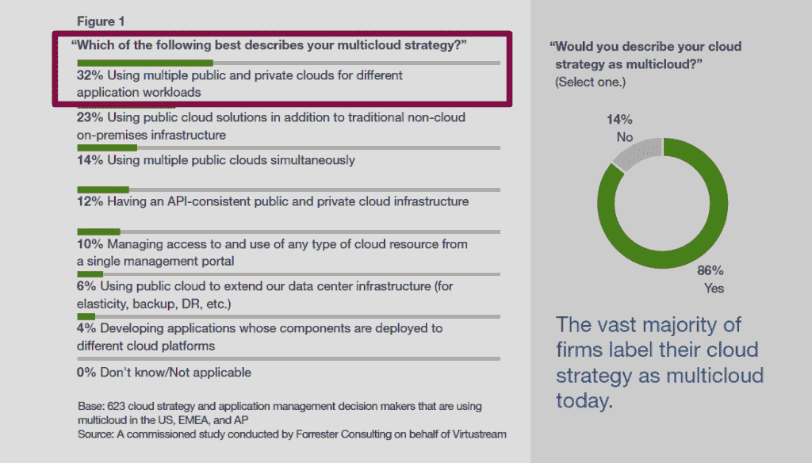
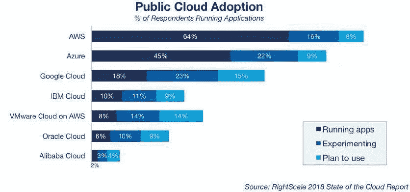
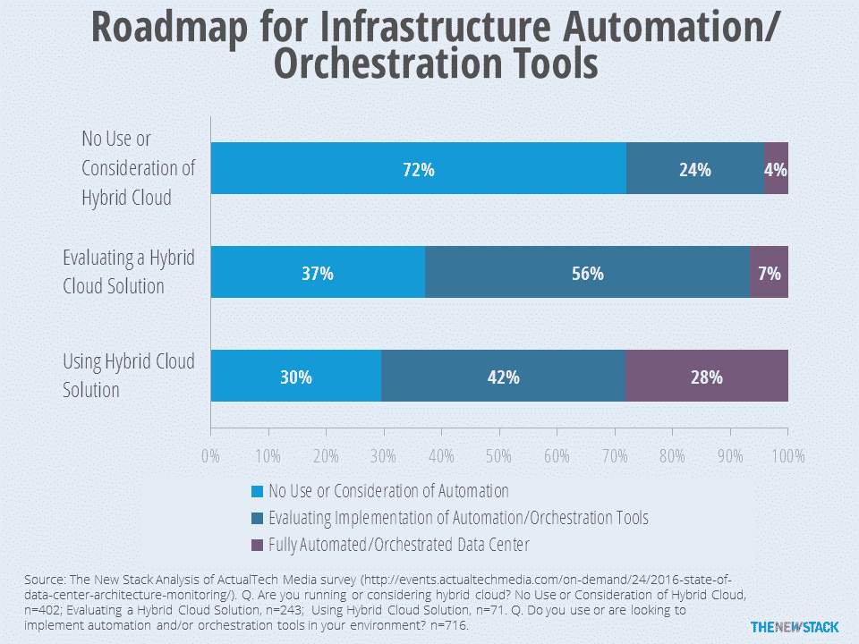
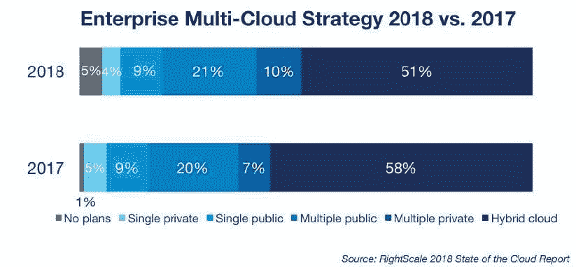

# IBM 的红帽收购旨在将“混合云”带入企业

> 原文：<https://thenewstack.io/ibms-red-hat-buy-aims-to-bring-the-hybrid-cloud-to-the-enterprise/>

IBM 混合云高级副总裁兼 IBM 研究部主任 [Arvind Krishna](https://www-03.ibm.com/press/us/en/biography/45780.wss) 在周一与媒体的电话会议上宣称，IBM 以 340 亿美元的价格对 Red Hat 的待决[收购](https://thenewstack.io/red-hat-acquisition-will-be-the-key-to-ibms-future-in-the-cloud/)“改变了云市场的一切”。

在新闻发布会上，Krishna 概述了 IBM 计划使用 Red Hat 的技术和专业知识作为企业充分使用云资源的入口，包括内部资源和公共服务提供的资源，如 IBM 自己的资源。

IBM 正专注于服务企业混合云，这提供了将工作负载从内部环境转移到云提供商的能力。这一战略的关键是云原生工具，如 Kubernetes，红帽以及红帽[今年早些时候收购的 CoreOS 帮助开发了这些工具。](https://www.redhat.com/en/about/press-releases/red-hat-acquire-coreos-expanding-its-kubernetes-and-containers-leadership)

有了这样的开放技术，“我们可以帮助(客户)将他们的应用程序和业务流程从一个云安全、自由地转移到另一个云，”Krishna 说。

反过来，此次收购将有助于红帽公司更好地进入其核心企业软件市场，红帽公司仍将是 IBM 的一个独立业务部门。“我们仍然是一家相对较小的公司，客户将开放式混合云视为将公共云引入其 IT 基础设施的唯一途径，”Red Hat 执行副总裁保罗·科尔米耶在同一次 IBM 简报会上说。“以我们目前的规模，我们无法认识到这种需求的真正潜力。IBM 帮助我们将这一战略推广到全球 170 个国家。”

2018 年 2 月，红帽[报告了](https://investors.redhat.com/news-and-events/press-releases/2018/03-26-2018-211600973)29 亿美元的年收入，其中 88%来自企业订阅。

## 混合云还是多云？

“混合云”在炒作周期中已经达到了顶峰，“多云”是目前更流行的术语。RightScale 在 2 月份进行的一项调查[显示](https://www.rightscale.com/lp/state-of-the-cloud)混合云作为主导战略的比例从 58%下降到 51%。在 Virtustream 的另一项调查中，86%的人表示他们正在使用多云策略。

多云并不完全等同于混合云。在 Virtustream 调查中，32%的受访者表示他们的多云战略描述了“针对不同的应用程序工作负载使用多个公共云和私有云”两年前，网络安全管理软件产品[发现](https://www.actualtechmedia.com/wp-content/uploads/2018/01/SolarWinds-Survey-Report-Finalv1.pdf)大多数 56%的人甚至没有考虑使用混合云，但在使用混合云的人中，72%的人正在使用或考虑用于基础架构的自动化/流程编排工具。

【T2

只有 15%的云用户实际上会使用“混合”，即使用多个云来交付特定的业务功能。这里我们[收集的一些数据已经超过一年了](https://thenewstack.io/parity-check-announcements-private-clouds-death-premature/)，但是百分比并没有太大变化，因为大多数仍然只是分别管理多个云。

科尔米耶指出，随着 Red Hat 的起步，Linux 发行版的市场是一个商品市场，在这个市场中，Linux 作为专有 Unix 操作系统的一个更低成本、有时更健壮的替代产品。随着时间的推移，Red Hat 建立并购买了一个中间件产品组合，包括从 JBoss application server for enterprise Java 到云原生技术(如 Istio service mesh)的所有产品。红帽现在提供了两个而不是一个 Kubernetes 发行版，红帽自己的 OpenShift 和 CoreOS structural。简而言之，该公司拥有管理云工作负载的技术堆栈，既可以在内部运行，也可以在公共云上运行。

## 对开源的影响最小

科尔米耶说，总的来说，此次收购应该不会对红帽目前维护的所有开源项目产生影响。“在我们关门的第二天，我不打算做任何与我们每隔一天所做的不同的事情，”他说。“我们根据客户的需求制定路线图，所以我认为不会有任何变化。”

就 IBM 而言，它可以很容易地融入红帽正在做的工作。“Kubernetes 是我们云原生战略的中心，”Krishna 说。IBM 和 Red Hat 都对 Kubernetes 生态系统做出了贡献。去年，K8s 贡献的 16%来自 Red Hat，2%来自 IBM(谷歌仍以 26%的份额高居榜首)。

甚至在这一计划收购之前，Red Hat 和 IBM 已经[开始合作](https://www.govconwire.com/2018/09/hortonworks-ibm-red-hat-partner-on-open-hybrid-architecture-initiative/)，双方都同意通往混合云的道路将来自使用基于 Linux containers 和 Kubernetes 的公共架构，以及支持该架构的所有自动化和安全工具。

Krishna 说，“我们相信容器和 Kubernetes 加在一起就像 TCP/IP”或 HTML/HTTP 一样大，并指出这些开放协议如何为不同的网络共同工作铺平了道路，因为用户更喜欢它们而不是各种专有的解决方案。

人们可能会忘记 IBM 有一大群开源开发者。总体而言，IBM 的开发人员/程序员数量是 Red Hat 的 23 倍，尽管只有 1%的 IBM 开发人员在 GitHub 上是可识别的(通过他们的电子邮件地址)，而 25%的 Red Hat 员工在 GitHub 上使用他们的公司电子邮件地址。

IBM 确实计划将 OpenShift(科尔米耶称之为迄今为止最成功的 Kubernetes 发行版)引入 IBM Cloud(IBM Cloud ),尽管 IBM 会小心翼翼地保持 Red Hat 在不同云服务提供商中维护的软件的公正性。

许多现任和前任红帽员工都表示担心，IBM 将如何保持红帽培育的独特的开源文化。当被问到时，Krishna 回答说，他希望保留 Red Hat 的工程驱动文化，一种“允许工程师讨论如何最好地满足客户”的文化，他说。“这与自上而下的等级制度无关。”

同样，IBM 本身对开源并不陌生，它创建了一个广泛的流行开源工具库，从[open whish](https://serverless.com/framework/docs/providers/openwhisk/)无服务器软件到 [Node-Red](https://nodered.org/) Node.js 物联网发行版。因此，IBM 可能有经验可以分享给 Red Hat，告诉他们如何管理开源项目。

“这并不意味着我们正在改变红帽的文化，”克里希纳说。“这只是意味着他们可以添加一些东西，但取决于他们觉得合适的决定。”

两家公司估计，这笔交易将于 2019 年底完成。届时，Red Hat 将作为一个独立的部门成为 IBM 混合云部门的一部分。吉姆·怀特赫斯特和红帽公司目前的管理团队将继续管理公司，而怀特赫斯特将加入 IBM 的高级管理团队。

红帽是新堆栈的赞助商。

米歇尔马希尔的特色形象设计。

<svg xmlns:xlink="http://www.w3.org/1999/xlink" viewBox="0 0 68 31" version="1.1"><title>Group</title> <desc>Created with Sketch.</desc></svg>