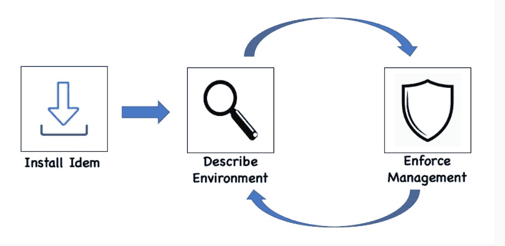

# 同上:VMware 的 Salt 项目能解决多云混乱吗？

> 原文：<https://thenewstack.io/idem-vmwares-salt-project-solves-the-multicloud-mess/>

DevOps 团队知道管理多云和众多 API 是多么的复杂。该过程仍然是组织在扩展时面临的主要资源消耗挑战之一。此外，尽管有非常有用的流程，如 GitOps 和许多其他解决方案，但每个 CI/CD 生产管道通常都需要为部署应用程序的每个环境进行大量的配置和手动管理。

存在许多替代方案，它们在所有这些不同的 API 和云环境之上提供接口，旨在简化复杂性。然而，它们没有解决根本问题:如何通过与每个部署相关联的数量惊人的代码库，自动执行大量手动解析过程。

这要求从根本上改变配置数据的呈现方式，并使其可用于每个云环境和 API，以便数据可被访问和处理，并产生可操作的结果。

在过去的几年里，SaltStack(2020 年被 VMware 收购)和由 salt stack 创始人兼首席技术官[汤姆·哈奇](https://www.linkedin.com/in/thhatch/)领导的 VMware 工程师开始寻找解决方案，从而产生了开源 [Idem 项目](https://learnidem.github.io/)。由此产生的开源工具旨在降低将每个云部署和 API 的大量代码库编排成一种格式的巨大复杂性，该格式由项目创建者表示人类思维可以轻松理解和管理的数据组成。

Idem 项目可能会解决一个与为多个云环境开发微服务应用程序相关的“基础性”问题，[Torsten Volk](https://www.linkedin.com/in/torstenvolk/)，[Enterprise Management Associates(EMA)](https://www.enterprisemanagement.com/)的分析师告诉新堆栈。

“毫无疑问，消除所有这些复杂性是通用云自动化平台的基础，”沃尔克说。“在 2022 年的开发运维中，VMware 是否真的在一定程度上覆盖了核心 IaaS 使用情形，这可能是最值得关注的事情之一。”

Volk 说，主要问题是 AWS、Azure、Google Cloud、CloudFlare“和朋友们如何提供不同的 API 来设置、配置和管理存储、网络、计算、数据库、消息传递等相同的核心服务”。“这使得定义真正相同的应用程序环境变得棘手且耗费人力。如果没有相同的环境，你无法提前知道相同的基础设施代码要求是否会在性能、可用性、可靠性、安全性、合规性甚至运行时组件方面产生相同的结果，”Volk 说。“Idem 引入了‘幂等性’的概念来描述平台在不同云上执行应用代码时定义和执行一致结果的能力。您可以将这一雄心描述为‘圣杯’，它提供了通向真正的云计算前景的途径。”

## 基础设施作为数据

这样，Idem“减少”了云配置。根据 Idem 文档，Idem 将基础设施交付为数据，而不是代码形式的基础设施。

Idem 提供了“定制的高级自动化，以简化多云和多个 API 的复杂编排。我们必须从根本上看我们正在处理的许多问题，以及真正的瓶颈在哪里，这又回到了人的问题上，因为缺乏自动化，”哈奇说。"所以，让我们假设我们是 Idem 提供的自动化背后的人."

[VMware 收购 SaltStack](https://thenewstack.io/vmware-to-acquire-saltstack-for-advanced-multicloud-automation/) 很大程度上是为了扩展其多云和基础架构自动化。例如，对于 VMware，这种自动化与 SaltStack 旗下的开源 Salt 和其他开源工具一起适用于 VMware v realize cloud automation 软件的云本机部署。当然，VMware 不断扩大的云覆盖范围现在还包括用于迁移 vSphere 工作负载的 VMware HCX。

Hatch 说:“收购 SaltStack 的目标之一是弄清楚如何在多种产品下使用相同的引擎，这是令人兴奋的事情之一，即 Idem 已经被 VMware 内部的多种产品使用，人们已经在说‘如果你不试图为每个 API 构建自己的云连接器，一切都会容易得多’”。

## 流行连接

Idem 从 SaltStack 的开源[面向插件的编程(POP)](https://github.com/saltstack/pop) 中汲取了许多功能，这是在 11 月的 SaltConf2019 上推出的，POP 允许开发人员在解耦的代码库或存储库中处理代码。然后，对应用程序的更改会以插件的形式自动扩展到多个数据中心和多云环境。因此，标准化的插件配置适用于所有环境，从而消除了许多单独的操作工作，以确保新代码在部署应用的整个应用生态系统上工作。

Idem 遵循 POP 的面向插件的编程。“POP 是我们获得力量的源泉:事实上，一切都是插上电源的，一切都是可插拔的。Hatch 说:“我们正在使用从 POP for Idem 获得的微服务软件设计模式，这使我们能够轻松创建许多不同的云支持和 repos，并将其动态合并在一起，但仍然非常快速和高效。“这让我们很容易召集大量分布式团队，并确保所有这些组件都可以以微服务风格的方式编写，同时仍然能够以简单易用的方式部署软件。”

## 更深入的分析

Idem 的工程团队正在努力为部署了 Idem 的每个云环境或 API 添加更多更深入的分析。“我们正在努力使 Idem 不仅检查和描述云，而且还可以对正在发生的事情，你的配置在哪里，你的不同资源在哪里进行真正的深度数据分析，并动态地将其转化为真正可管理的代码，”Hatch 说。“Idem 将能够利用整个云，以高度简化的方式构建您需要的所有旋钮和杠杆，只需说一句‘推动并移动’，您的云就会随之移动，这至少可以显著降低代码开销。”

<svg xmlns:xlink="http://www.w3.org/1999/xlink" viewBox="0 0 68 31" version="1.1"><title>Group</title> <desc>Created with Sketch.</desc></svg>