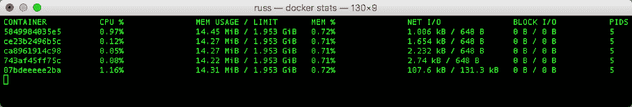
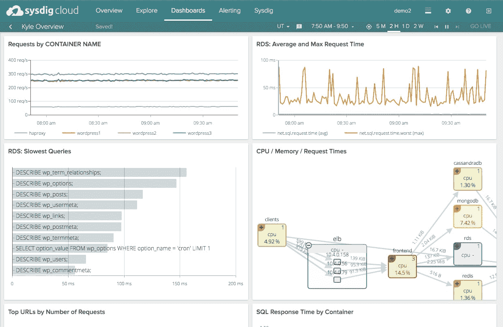

# 监控集装箱的工具和流程

> 原文：<https://thenewstack.io/identifying-collecting-container-data/>

[](http://russ.mckendrick.io/)

[Russ Mckendrick](http://russ.mckendrick.io/)

[Russ 是一位经验丰富的解决方案架构师，在 IT 和相关行业工作了 23 年。在他的职业生涯中，他在许多不同的部门承担过不同的责任，从照看整个 IT 基础架构到为大型和小型组织的面向客户和内部团队提供一线、二线和高级支持。Russ 几乎只使用 Linux，在 Node4 Limited 的公共云和私有云中托管的专用硬件和虚拟机上使用开源系统和工具，他在 node 4 Limited 领导开源解决方案团队。在业余时间，他写了三本关于 Docker 的书。“Monitoring Docker”&“Extending Docker”均可从 Packt 获得，其中“Docker Data Management with Flocker”将于 2017 年 1 月发布。他还买了太多的黑胶唱片。](http://russ.mckendrick.io/)

[](http://russ.mckendrick.io/)[](http://russ.mckendrick.io/)

随着容器和微服务的引入，监控解决方案必须处理比以往更多的短期服务和服务器实例。尽管基础架构环境发生了变化，但运营团队仍需要监控中央处理器(CPU)、随机存取存储器(RAM)、硬盘驱动器(HDD)、网络利用率和应用程序端点可用性方面的相同信息。

虽然您可以对传统基础架构使用较旧的工具或现有的监控服务，但现在有了更新的基于云的产品，可以确保监控解决方案像正在构建和监控的服务一样可扩展。许多基于云的自托管工具都是专门为容器构建的。无论您使用什么解决方案或服务，您仍然需要知道如何收集您希望监控的指标。

[cyclone slider id = " ebook-5-赞助商"]

从容器中收集指标时，有很多选择。本文研究了一些可用于容器监控的软件和服务。我们将自托管开源解决方案和基于商业云的服务相结合，以反映当前的形势。然而，重要的是要记住，与各种各样的可用解决方案相比，我们包括的示例相对较少。这些例子旨在说明解决收集指标问题的几种不同方法。

## 码头工人

Docker 引擎本身提供了对我们希望收集的大部分核心指标的访问，作为其本机监控功能的一部分。运行 **docker stats** 命令将使您能够访问主机上运行的所有容器的 CPU、内存、网络和磁盘利用率。



图 1:运行 docker stats 命令。

数据流会自动产生，如果您需要在任何给定时刻快速浏览您的容器，这是非常有用的。您可以添加一些标志，例如:

*   标志**–all**显示您停止的容器，尽管您看不到它们的任何指标。
*   标志**–无流**显示第一次运行的输出，然后停止度量流。

有一些缺点。首先，数据不会存储在任何地方—您无法回头查看指标。看着一个不断刷新的没有参考点的终端也很乏味。很难发现数据中发生了什么。

幸运的是， **docker stats** 命令实际上是 stats 应用程序接口(API)端点的一个接口。stats API 公开了 stats 命令中的所有信息等等。要自己查看，请运行以下命令:

```
curl  --unix-socket  /var/run/docker.sock http:/containers/container_name/stats

```

从输出中可以看到，返回了更多的信息，所有这些信息都封装在一个 JavaScript Object Notation (JSON)数组中，可以被第三方工具接收。

## 管理员

[cAdvisor](https://github.com/google/cadvisor) 是 Google 的一个容器监控工具，支持 Docker 容器。它是一个守护进程，收集、聚合、处理和导出关于正在运行的容器的信息。对 cAdvisor 的最好理解是，它是您运行**docker stats–all**命令所得到的图形版本。

```
docker run  \
 --volume=/:/rootfs:ro  \
   --volume=/var/run:/var/run:rw  \
   --volume=/sys:/sys:ro  \
   --volume=/var/lib/docker/:/var/lib/docker:ro  \
   --publish=8080:8080  \
   --detach=true  \
   --name=cadvisor  \
   google/cadvisor:latest

```

cAdvisor 易于安装和运行，因为它是用一个集装箱装运的。您所要做的就是运行上面的命令来启动一个 cAdvisor 容器，并在端口 8080 上显示 web 界面。

一旦启动，cAdvisor 将把自己挂接到在您的主机上运行的 Docker 守护进程，并立即开始收集所有正在运行的容器的指标，包括 cAdvisor 容器本身。在浏览器中打开 [http://localhost:8080/](http://localhost:8080/) 会直接把你带到 web 界面。


图 2:访问本地主机 web 界面。

正如你从*图 2* 中看到的，有一分钟的数据在实时流动；但是，如果只是标准安装 cAdvisor，就不能查看任何更早的指标。幸运的是，谷歌为您提供了将数据从 cAdvisor 导出到时间序列数据库的选项，如 [Elasticsearch](https://www.elastic.co/products) 、 [InfluxDB](https://www.influxdata.com/) 、 [BigQuery](https://cloud.google.com/bigquery/) 和 [Prometheus](https://prometheus.io/) 。

总之，cAdvisor 是一个很好的工具，可以快速了解正在运行的容器的情况。它易于安装，并且比 Docker 提供了更多的粒度指标。它还可以充当其他工具的监控代理，就像过去使用 Zabbix 或 Nagios 代理一样。

## 普罗米修斯

[Prometheus](https://github.com/prometheus/prometheus) 是一个开源的监控系统和时间序列数据库，最初由 SoundCloud 构建。它目前由[云本地计算基金会](https://www.cncf.io/) (CNCF)以及其他项目如 [Kubernetes](https://github.com/kubernetes/kubernetes) 和 [OpenTracing](https://github.com/opentracing) 主持。在阅读服务的描述时，它可能听起来像一个非常传统的服务器和代理设置；然而，普罗米修斯的工作方式不同。它没有自己的代理，而是从主机上的数据点抓取数据，并将其存储在自己的时间序列数据库中。

2016 年 10 月底，Docker 引擎本身中一个对[公开一个度量端点](https://github.com/docker/docker/pull/25820)的 pull 请求被合并。这可能意味着 Docker 的一个即将发布的版本将支持 Prometheus 从盒子中取出你的容器度量；但是，在该版本发布之前，您需要使用一个中介服务，比如 cAdvisor。从 1.13 开始，Docker 引擎支持可选的“/metrics”普罗米修斯端点。值得注意的是，这目前公开了内部 Docker 引擎指标和容器指标。有[正在讨论](https://github.com/docker/docker/issues/27307)将它扩展到容器度量，并可能完全取代 Stats API。

普罗米修斯最大的优势是作为数据源。你可以用 [Grafana](http://grafana.org/) 来前置普罗米修斯正在抓取的数据，Grafana 从 2015 年年中开始支持普罗米修斯，现在是普罗米修斯推荐的前置。像我们看到的大多数工具一样，Grafana 也可以作为一个容器启动。

一旦启动并运行，唯一需要的配置就是添加您的 Prometheus URL 作为数据源，然后导入一个预定义的 [Prometheus 仪表板](https://grafana.net/dashboards)。


图 3:存储在 Prometheus 中并与 Grafana 一起显示的指标。

*图 3* 中的仪表板显示了来自 cAdvisor 的一个多小时的指标，这些指标存储在 Prometheus 中，并在 Grafana 中呈现。由于 Prometheus 实际上是在拍摄当前 cAdvisor 状态的快照，所以它也记录了很久以前被移走的容器的指标。

普罗米修斯也有预警能力。通过使用内置的报告语言，您可以创建如下警报:

```
ALERT InstanceDown
   IF up  ==  0
   FOR  5m
   LABELS  {  severity  =  "page"  }
   ANNOTATIONS  {
     summary  =  "Instance {{ $labels.instance }} down",
     description  =  "{{ $labels.instance }} of job {{ $labels.job }} has been down for more than 5 minutes.",
   }

```

一旦您的警报被编写并部署到 Prometheus 服务器上，您就可以使用 Prometheus [警报管理器](https://prometheus.io/docs/alerting/alertmanager/)来路由您的警报。在上面的例子中，我们分配了一个标签 **severity = "page"** 。Alertmanager 将拦截该警报，并将其转发给一个服务，如[page duty](https://www.pagerduty.com/)、 [OpsGenie](https://www.opsgenie.com/) 、一个 [Slack](https://slack.com/) 或 HipChat 通道，或者任意数量的[不同端点](https://prometheus.io/docs/alerting/configuration/)。

Prometheus 是一个强大的平台，作为不同技术之间的中间人，它工作得非常出色。很容易从基本安装开始，就像上面描述的那样，然后扩展它，给出容器和主机实例的单一窗格视图。

## 无代理系统爬虫

[无代理系统爬虫](https://github.com/cloudviz/agentless-system-crawler) (ASC)是 IBM 的一款云监控工具，支持容器。它从运行的容器中收集监控信息，包括指标、系统状态和配置信息。ASC 为安全性和配置分析提供了对容器的深入了解，而不仅仅是利用率和性能指标。它被设计为一个管道，用于构建容器功能的收集插件、动态数据聚合或分析的函数插件以及目标监控和分析端点的输出插件。提供的插件包括传统的数据收集功能，如利用率指标、在容器中运行的进程和监听端口，以及关于配置文件和应用程序包的数据。

ASC 既可以部署为 Python 包，也可以部署为具有特权的单个容器。例如，ASC 通过与 Docker 守护进程、容器 cgroups 和名称空间交互来运行。下面是如何将 ASC 作为一个容器启动:

```
docker run  \
      --privileged  \
      --net=host  \
      --pid=host  \
      -v  /cgroup:/cgroup:ro  \
         -v  /var/lib/docker:/var/lib/docker:ro  \
      -v  /sys/fs/cgroup:/sys/fs/cgroup:ro  \
      -v  /var/run/docker.sock:/var/run/docker.sock  \
      -it  crawler  --crawlmode  OUTCONTAINER  ${CRAWLER_ARGS}

```

一旦运行，它就向 Docker 守护进程订阅事件，并定期监控系统中运行的所有容器。ASC 可以很容易地用定制数据收集插件来扩展，这有助于收集容器和环境信息。每个插件只是为它们特定的被监控特性导出一个 **crawl()** 方法；ASC 迭代每个 **crawl()** 函数，这些函数由在其部署配置中启用的集合插件实现。ASC 目前可以配置为将数据发送到 Kafka、Graphite、文件系统和控制台作为端点，并允许附加的输出插件。图 4 显示了 ASC 配置的示例视图，将容器数据发送到 Graphite/Grafana 端点。


图 4:使用石墨/Grafana 终点监控 ASC 容器的视图。

ASC 监控的一个用例是更深入地了解容器执行。以下示例显示了 ASC 的基本输出框架，该框架被配置为收集容器的流程和连接功能以及基本指标。基于此帧，我们可以看到这是一个以 100%的 CPU 利用率运行的容器，有一个 Python 进程在端口 5000 上侦听。

```
metadata    "metadata"   {"id":"ef0fc187dc0a4b85a3cb",  …}
cpu         "cpu-0" {…  ,"cpu_util":100.0}
process     "python/1"   {"cmd":"python web.py",...
  "python","pid":74,  …}
connection  "74/127.0.0.1/5000"...
  {"pid":74,…,"connstatus":"LISTEN"}

```

这使用户能够将监控与系统状态结合起来，以便更好地了解容器行为，并推动额外的分析。例如，我们可以更深入地挖掘容器中使用的 Python 进程，并通过启用另一个特性插件(在本例中为“python-package ”)来跟踪应用程序使用的底层 Python 包，这为我们提供了关于应用程序中使用的包和版本的更多信息:

```
python-package  "click"       {"ver":"6.6","pkgname":"click"}
python-package  "Flask"       {"ver":"0.11.1","pkgname":"Flask"}
python-package  "itsdangerous"{"ver":"0.24",...
  "pkgname":"itsdangerous"}
python-package  "Jinja2"      {"ver":"2.8","pkgname":"Jinja2"}
python-package  "pip"         {"ver":"8.1.2","pkgname":"pip"}
python-package   "setuptools"  {"ver":"20.8.0",...
  "pkgname":"setuptools"}
python-package   "Werkzeug"    {"ver":"0.11.11",...
  "pkgname":"Werkzeug"}

```

总之，ASC 是一个设置和使用简单的工具；它类似于 cAdvisor，用于获得运行容器的可见性。除了基本的监控指标，ASC 还非常重视对集装箱状态和配置的深入了解，以实现监控、安全和其他分析解决方案。它为数据收集的可扩展性和对不同端点的支持提供了一种简单的、基于插件的方法。

## Sysdig

Sysdig 有两个不同的版本。第一种是开源版本，它在你的主机上安装一个内核模块。第二个是名为 [Sysdig Cloud](https://sysdig.com/sysdig/) 的云和内部解决方案，它使用开源版本，并将收集的指标传输到 Sysdig 自己的服务器。

### 开源系统摘要

Sysdig 的开源版本就像在类固醇上运行 **docker stats** 命令。该服务与主机内核挂钩，这意味着它不完全依赖于从 Docker 守护进程获取指标。

使用 Csysdig，内置的基于 [ncurses](https://en.wikipedia.org/wiki/Ncurses) 的命令接口，您可以查看主机上的各种信息。例如，运行命令 **csysdig -vcontainers** 会给出图 5 中的视图。


图 5:使用 Sysdig 的命令界面。

如您所见，这显示了主机上运行的所有容器。您还可以深入到容器中，查看单个进程正在消耗哪些资源。与运行 **docker stats** 命令和使用 cAdvisor 非常相似，Sysdig 的开源版本是为了获得容器的实时视图；但是，您可以使用以下内容来记录和重放系统活动:

*   命令 **sysdig -w trace.scap** 将系统活动记录到跟踪文件中。
*   命令 **csysdig -r trace.scap** 重放跟踪文件。

Sysdig 的开源版本不是你传统的监控工具；它允许您深入到您的容器中，访问更广泛的信息。它还允许您通过直接挂接到 orchestrator 来添加编排上下文，从而允许您通过 pod、集群、名称空间等进行故障排除。

### Sysdig 云

Sysdig Cloud 获取开源版本捕获的所有数据，并通过强大的仪表板呈现出来，并具有警报功能。在图 6 中，您可以看到一个显示集装箱利用率实时视图的仪表板。您还可以深入到单个流程。



图 Sysdig 云中的仪表板视图。

例如，使用 Docker Compose 运行 WordPress 会启动两个容器:一个运行 Apache，PHP 用于主要的 WordPress 代码，另一个运行 MySQL 用于数据库。使用 Sysdig Cloud，您可以应用一个过滤器来洞察您的数据库的性能，允许您发现诸如缓慢的查询之类的事情，或者哪个查询运行得最多。

大多数常见服务都有类似的过滤器，比如 [NGINX](https://www.nginx.com/) 、 [PHP-FPM](https://php-fpm.org/) 、 [PostgreSQL](https://www.postgresql.org/) 、 [MongoDB](https://www.mongodb.com/) 和 [Apache Tomcat](http://tomcat.apache.org/) 。这些过滤器和指标警报可以随时添加。这些警报可以在被触发时发送给 Slack 或 PagerDuty 等服务，并且会实时自动生成系统活动记录。在调查事故时，拥有这种详细程度的快照是非常宝贵的。

## 收集数据的其他工具

如前所述，有相当多的服务可以收集、整理和报告来自容器和主机实例的指标。我们创建了其他可用工具的概述；还有更多列在*容器监控目录*中。

## 结论

我们介绍的所有工具都能够让您开始了解容器可见性和监控。由您决定需要什么样的工具组合来收集有助于您监控和优化应用程序和系统的信息。我们讨论了每个人都需要知道的基础知识，包括使用 Docker 的 Stats API 和 cAdvisor 的原生功能。这将大大有助于向用户介绍监控容器的基本需求。我们还讨论了较新的解决方案，如 Prometheus 和 Sysdig。

有许多方法可以监控容器，解决方案供应商也有解决这些问题的方法。您可能认为这是在开源和 SaaS 解决方案之间的选择，但它更多的是为了找到适合您工作负载的解决方案组合。无论您最终如何构建您的监控堆栈，您仍然需要知道如何收集您希望监控的指标。

<svg xmlns:xlink="http://www.w3.org/1999/xlink" viewBox="0 0 68 31" version="1.1"><title>Group</title> <desc>Created with Sketch.</desc></svg>