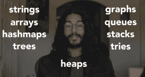
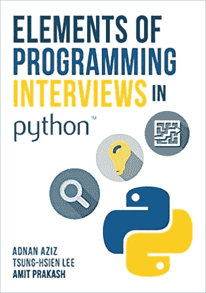

# “如果我能重新开始”:一个关于如何学习的真实世界的编码器

> 原文：<https://thenewstack.io/if-i-could-start-over-a-real-world-coder-on-how-to-learn/>

自 4 月 15 日以来，近 200 万人观看了 24 岁的软件工程师纳曼·卡普尔上传的视频[:](https://github.com/namanhkapur)[我将如何学习编码(如果我可以重新开始)](https://www.youtube.com/watch?v=k9WqpQp8VSU)

这个受欢迎的演示的承诺是显而易见的:对于一个新的开发人员来说，您真正需要知道的编程知识是什么？你真的需要一个四年的计算机科学学位来甩代码吗？

卡普尔本周在休斯顿的家中接受电子邮件采访时，将如此高的收视率描述为“疯狂”和“我从来没有预料到的事情”但是他也相信这个视频满足了当今世界的真实需求。“我认为很多人对编码和软件工程感兴趣，但不知道从哪里开始……这就是为什么我的视频引起了他们的共鸣。

“我还认为疫情迫使我们长时间呆在室内，这给了人们很多时间来成长和完善自己。”

卡普尔·昂立*在五个月前创办了*YouTube 频道，探索诸如“[真正重要的软件工程益处](https://www.youtube.com/watch?v=D0WXVilQ0Oc)”和[“我为什么学习计算机科学(你也应该学习)](https://www.youtube.com/watch?v=opv7gkGwjSw)”等话题

但是观众对 Kapur 关于如何成为一名程序员的有见地的建议反应最大，所有这些都被浓缩到一个简洁的 13 分钟的处方中，最后是关于你第一次编码面试的实践的建议。

它还从一个愉快和新鲜的角度审视了我们如何为编程生涯做准备:用辉煌的 20/20 后见之明。

卡普尔说，它收到的评论是“积极的”和“温暖人心的”但是有一个反应特别令人满意:“说我的视频的人说服他们冒险开始他们的软件工程或编码之旅…

“我认为编码是每个人都应该知道的通用技能，所以我很高兴越来越多的人开始他们的旅程。”

## 未选择的道路

从卡普尔在 LinkedIn 上的简介来看，他的教育经历丰富而全面。Kapur 毕业于莱斯大学，获得计算机科学硕士学位，然后在 Schlumberger 和微软完成了软件工程实习，并在 Kleiner Perkins 获得了工程奖学金。

自 2020 年 6 月以来，卡普尔一直是在线结账公司 [Bolt](https://www.bolt.com/) (他将其描述为一家高速增长的初创公司)的软件工程师。一份[在线简历](https://drive.google.com/file/d/1jcZY6UO2SFdARQFa8X0Tm4eukC9awvOF/view)显示，他甚至在 Bolt 的两次内部黑客马拉松中名列第一。

Kapur 的视频首先强调的一点是，成为一名程序员不需要训练营，甚至不需要大学文凭。“这肯定更难，但如果你愿意投入工作，你肯定可以自学如何编码。”

“事实上，如果我能回到过去，我不知道 T4 是否会去上大学，”他说

正如视频的描述所解释的，“如果我可以重新开始，我会花更多的时间做实际项目，而不是专注于理论。”

但即使在此之前，Kapur 在视频中的第一条建议是“采用编码思维”——也就是说，简单地相信每个 bug *都有*的解决方案，等待着用一些耐心和毅力去发现。

卡普尔警告说，这种心态也不可避免地导致寻找常见问题的解决方案，如坏掉的烤面包机或闪烁的互联网调制解调器——但这是一种超能力，会让你的朋友和亲戚来找你寻求技术支持。

“我花了很多年才意识到，并不是每个人都是这样的，”卡普尔在视频中解释道。因此，尽管你糊涂的父母可以像你一样用谷歌搜索，但他们不相信他们可以。作为一名程序员，你需要*相信*你可以，这是一个基本的事实。

“因为当凌晨 4 点，你正在做一个编程任务，你已经尝试了所有的方法，但你仍然不能找出错误——唯一能让你坚持下去的是知道有一个解决方案。你只需要找到它。”

Kapur 的视频还建议谦虚——记住他停止责备他的计算机并承认他的代码有错误的那一天。“当我意识到这一点并真正内化的时候，就是我开始在编码之旅中成长的那一天。”

> “要成为一名优秀的程序员，你不一定要成为一名优秀的计算机科学家。但你必须是一个体面的问题解决者。”

但这也意味着愿意学习，这是编码思维的另一个关键方面。在视频中，Kapur 分享了他在各种公司的经历教会了他一件事:总是有新的堆栈，总是有新的语言要学习，或者是一个全新的范式或平台。

“在黑客马拉松上，我的队友会想用‘机器学习’和‘云’这样的时髦词汇，但我不知道他们在说什么。但我会想出办法的，”他说。

卡普尔的结论？“要成为一名优秀的程序员，你不一定要成为一名优秀的计算机科学家。但你必须是一个体面的问题解决者。”

从那里开始，学习数据结构(如数组和哈希映射)以及代码执行的基本顺序(以及它如何受逻辑运算符和循环的影响)只是一小步，最终将学习面向对象编程的基本原则。

“在我看来，这些是收益最高的话题，”他说。

但是作为一个单独的步骤，Kapur 还建议学习脚本，用于繁重的日常琐事，如重命名文件或数据操作。"或者有时候你只想写代码让*产生*代码."Kapur 提供了一个为内部数据库生成 SQL 查询字符串的快速脚本示例。

这些日常代码不需要在一个成熟的网络应用程序后面运行——但是创建它仍然会提高你的能力。

"再加上编码思维，你现在有了一个实用的工具来解决你的一些日常问题."Kapur 还提供了一个更具体的建议:选择一种编程语言进行深入学习。

## 做中学

为了获得更多的实践经验，Kapur 的视频还建议参加黑客马拉松。“你会学到很多东西，你会和其他人一起工作，并且会让你体验现实生活中软件工程的感觉…

“除了现实生活中的软件工程项目不是在 48 小时内完成的，你实际上必须测试你的代码。你也不会像以前那样睡眠不足。”

但是你确实获得了将成品交付给客户的经验——在这种情况下，是交付给你的法官。“学习编程的最好方法是通过*做*，”Kapur 强调说。"理想的情况是，你从事自己热爱的工作."

"所以，选择一个你感兴趣的话题，然后构建一些东西."

新程序员的最后一步？为他们在找全职软件工程工作的路上不可避免会遇到的编码面试而练习。

有书可以帮忙。Kapur 推荐了“[Python 编程面试的元素](https://elementsofprogramminginterviews.com/sample/epilight_python_new.pdf)”，并提供了一个可能出现的主题列表。甚至有网站让你和一个搭档轮流进行模拟面试。

但我最喜欢这个视频的一点是，它将关于学习什么和如何学习的实用建议与实践程序员的真实生活经验相结合。

在推荐递归和排序算法研究的同时，Kapur 指出了编码工作面试的一个讽刺之处。“你在实际工作中会用到这些吗？接近于零。你在面试中见过这些概念吗？挺高的。”

Kapur 的视频还建议熟悉现实世界开发环境中使用的工具——在这一点上，Kapur 转向了终端窗口的纯文本界面。当好莱坞在电影中展示黑客盯着写有复杂字符的黑屏时，“他们做对的一件事是他们正在使用终端。”

“我向你保证，迟早，你会习惯这个终端的。所以你不妨现在就开始。”

随着视频接近尾声，Kapur 向他的有抱负的程序员观众提供了热情和鼓励的混合。

“我不能说旅途永远是美好的。但我保证这将是令人满意的。”

[https://www.youtube.com/embed/k9WqpQp8VSU?feature=oembed](https://www.youtube.com/embed/k9WqpQp8VSU?feature=oembed)

视频

* * *

# WebReduce

<svg xmlns:xlink="http://www.w3.org/1999/xlink" viewBox="0 0 68 31" version="1.1"><title>Group</title> <desc>Created with Sketch.</desc></svg>