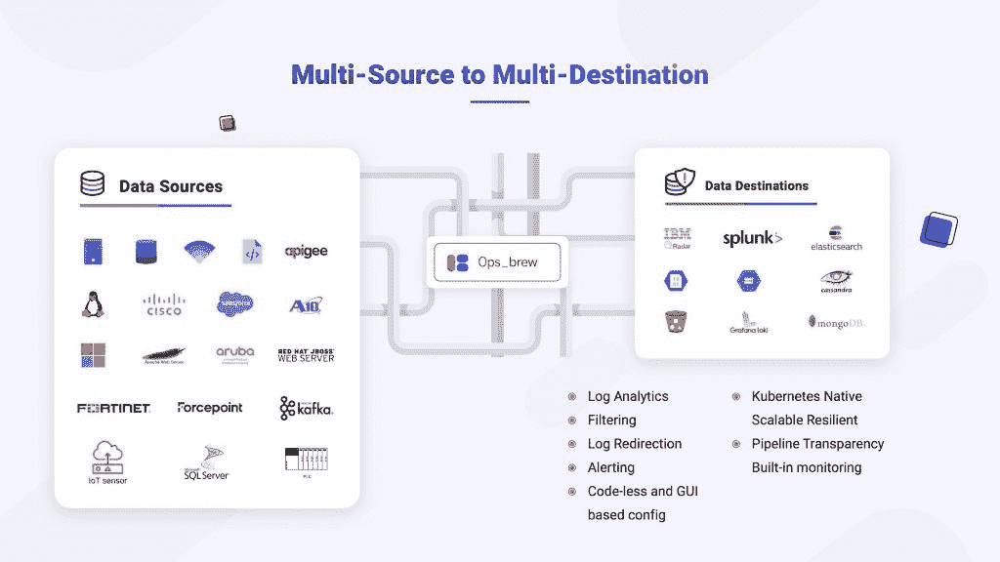
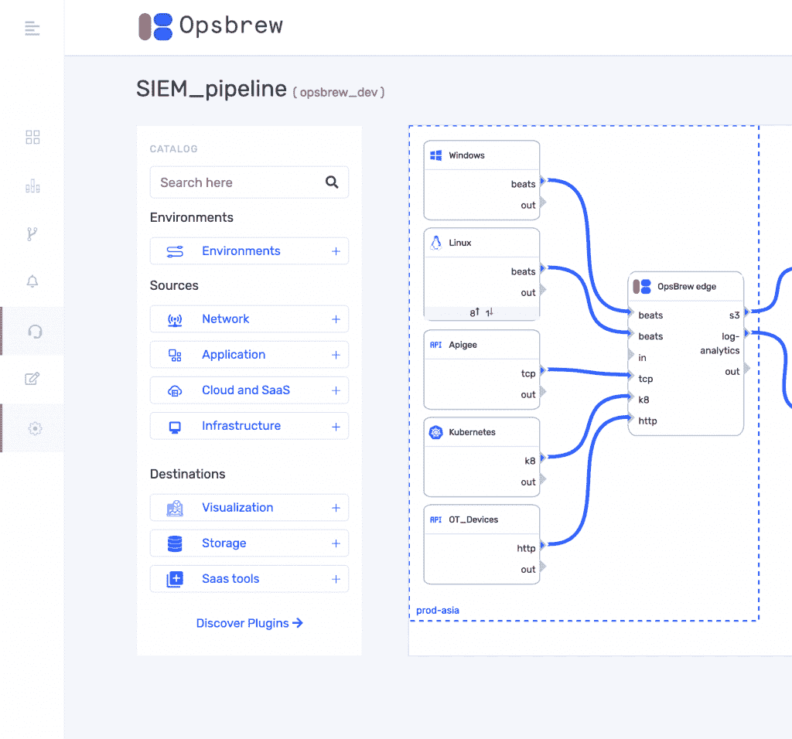

# Ignite: Opsbrew 关注多云日志管理

> 原文：<https://thenewstack.io/ignite-opsbrew-sets-sight-on-multicloud-log-management/>

吐温·泰勒

吐温·泰勒在谷歌开始了他的职业生涯，在那里他为 AdWords 团队提供技术支持。

微软最近举办了 Azure Sentinel 黑客马拉松，邀请用户为其安全信息和事件管理(SIEM)平台构建解决方案。 [Opsbrew](https://opsbrew.com/) 凭借其日志管道管理工具赢得了这次黑客马拉松，该工具从不同的来源收集日志数据，并将它们路由到 SIEM 解决方案，如 Azure Sentinel。Opsbrew 是“为企业和服务提供商提供的复杂解决方案”，微软杰出的工程师和微软威胁情报中心总经理约翰·兰伯特曾说过。

### 开源日志聚合工具

现在有许多工具可以提供日志接收和路由。其实最知名的都是开源。Fluentd 和 Logstash 是云原生堆栈的日志聚合器。他们提出了很棒的 DIY 日志解决方案，而且非常强大。但是，它们很难大规模管理，而且是资源密集型的。有一些更简单、更轻量级的替代方法，如 Fluentbit 和 Filebeat，在一定程度上有所帮助，但它们是以牺牲全部功能为代价的。

### 多云日志记录

随着活动云位置数量的增加，现代云原生堆栈会生成越来越多的日志。这造成了孤岛，因为不同的团队和环境都有自己的 SIEM 解决方案。例如，一个组织可能使用 Splunk 来满足其内部 SIEM 需求，并使用弹性搜索来满足云 SIEM 需求。这样做，他们牺牲了日志数据的统一视图。

### SIEM 蔓延

一些组织可能会发现 SIEM 或日志分析工具在内部被多个团队使用，随着时间的推移，这会推高云成本。结果是信息过载，团队发现日志数据压倒一切，而不是有用的。Opsbrew 旨在跨多云和不同的 SIEM 工具统一日志管理。

### Opsbrew 对日志管理的看法

Opsbrew 将日志管道作为服务提供。随着组织使用的云平台数量的增加，监控和管理云平台所需的日志基础设施也在增加。需要从每个来源收集日志数据，对其进行清理，然后使用日志分析工具进行分析。Opsbrew 通过将日志从任何目的地运送到任何来源来填补这一空白。Opsbrew 在每个环境中都放置了一个日志收集器代理，无论是在本地还是在云中。

Opsbrew 架构

Opsbrew 具有可视化管道，带来了日志管理工具所不具备的简单和优雅。此外，它还能够使用过滤来转换日志数据，以便丢弃不必要的数据，只将有用的日志数据发送到目标工具。

Opsbrew 中的管道

它还能够屏蔽密码和安全令牌等机密信息，并在传输过程中实现加密。另一个显著的特点是 Opsbrew 的提醒。这些不是基于日志数据的警报，而是当日志未生成、日志量突然激增或其他类似异常时触发的端点警报。这为安全运营带来了更好的态势感知。

在赢得黑客马拉松之后，Opsbrew 的联合创始人 Arun Mohan 被邀请在今年的虚拟微软 Ignite 大会上发言。Opsbrew 希望在最初成功的基础上再接再厉，为多云世界实现统一的情景感知日志记录。

*披露:本文作者曾为 Opsbrew 做过一些咨询工作。*

<svg xmlns:xlink="http://www.w3.org/1999/xlink" viewBox="0 0 68 31" version="1.1"><title>Group</title> <desc>Created with Sketch.</desc></svg>