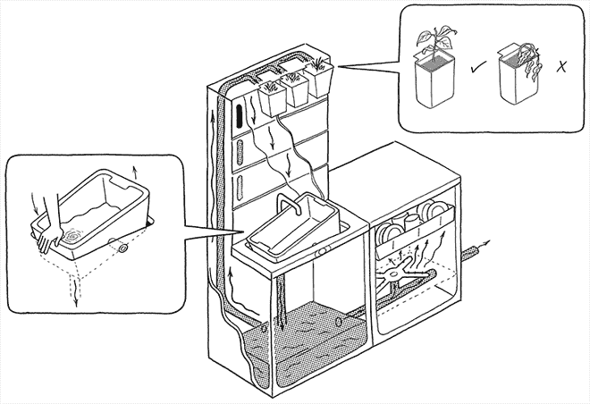

# 宜家 2025 年的概念厨房:烹饪、互动和堆肥

> 原文：<https://thenewstack.io/ikeas-concept-kitchen-of-2025-it-cooks-interacts-and-composts/>

这个 2025 年的概念厨房将智能家居技术与感应烹饪和环保做法(如堆肥、节水和回收)相结合，指向了一种新的生活方式。它展示了我们的住所将如何改变，我们的气候以及我们在人口越来越密集的城市中的生活方式也将如此。

自上世纪中叶以来，厨房经历了一系列技术革命。制冷技术在工业化国家变得更加普及，各种各样的电器如 T2 洗碗机和 T4 食品加工机出现了，减少了保持家庭清洁和食物的日常劳动。老式广告描绘了一个未来，厨房是方便和丰富的大而闪亮的竞技场，一个不仅烹饪食物，而且展示最新技术发展的地方。

但是厨房的角色在不断演变，人类的习惯也是如此。日益增长的城市化和日益紧迫的可持续性问题意味着厨房是某种意义上的“归零地”,通过限制食物浪费、产生堆肥以及将多功能家具整合到越来越小的空间中，可以减少碳排放。[智能家居概念](https://en.wikipedia.org/wiki/Home_automation)和[物联网](https://thenewstack.io/what-does-it-mean-to-be-on-the-internet-of-things/)的逐渐主流化也会给厨房带来意想不到的技术创新。

这就是 2025 年概念厨房背后的前提，这是宜家、IDEO London 与隆德大学和埃因霍温大学学生的合作。基于人口老龄化、城市密集化、智能技术以及食物和水等越来越有限的资源等新兴因素，概念厨房提出了一个问题:“2025 年我们将如何对待食物”？

### 更小、更智能、更可持续的空间

看来，在 10 年内，像厨房这样的空间可能会与生活区合并。概念厨房的核心是生活桌，这是一个多功能的工作台面，用于准备食物、用餐、工作台，甚至是儿童游戏区。

桌子上方是一台相机和投影仪，下面隐藏着感应线圈，可以将桌面变成炉子或电子设备的充电器。当联网在一起并连接到互联网时，当食物被放在摄像机下并被摄像机识别时，食谱可以通过投影仪显示。设计师说互动将是内置的:

> 这是“休闲技术”:在我们需要时给我们控制和指导的工具，但在其他方面是隐藏的——这是一种表面上的简单，最大限度地减少分心，并允许专注地参与食物。

[https://www.youtube.com/embed/qD60cBQOABY?feature=oembed](https://www.youtube.com/embed/qD60cBQOABY?feature=oembed)

视频

目的是利用技术减少食物浪费，提高厨房效率。烹饪将成为一项无缝的活动，而不是令人挠头的家务，这项技术将特别有助于烹饪方面的挑战。食物储存也将发生变化:不再是一个洞穴般的冰箱，里面的东西会被遗忘，留在后面腐烂，而是使用相同的感应技术和传感器的货架将在特殊的容器中冷却食物，采用磁性不锈钢钆合金底座，在众目睽睽之下展示，可以快速使用。

射频识别(RFID)标签伴随着食物，可以从包装转移到容器，所以货架传感器知道它应该储存在什么温度。当转移到餐桌上生活时，这些多用途容器将转换为热量。低技术含量的赤土容器——一个古老思想的现代诠释——被用来储存块茎和大蒜。

鼓励个人可持续发展的元素也被巧妙地整合到厨房中，并预示着未来的城市将向居民收取每磅垃圾的费用，并奖励他们回收利用。回收是手工分类，电子记录和分析，为居民赢得能源信用或借记。

节约用水是通过一个水槽来实现的，这个水槽可以向一个方向倾斜，将灰水引向上方的一个综合迷你花园；黑水可以通过操纵水槽的另一种方式被引走。

堆肥藏在水槽下面，一个装置将从废弃的食物中提取水分，并将其压缩成一个“干燥、无味”的圆盘，以备市政当局收集。

### 一种人性化的、富有表现力的技术方法

尽管概念厨房提出了一系列新的可能性，但关于设计如何存储、处理和分析这种厨房无疑会产生的大量数据，仍有一些挥之不去的问题。随着“不引人注目”的技术在这样一个日常避难所中的集成，我们最终会产生什么样的“T3”数据耗尽，以及如何在结构上组织和共享这些数据？

埃因霍温大学博士生 Jelle Stienstra 说，这些细节并不清楚，但这不是重点，他指导了该项目的设计学生。Stienstra 告诉我们，概念厨房是从更加主观、人性化和[现象学](https://en.wikipedia.org/wiki/Phenomenology_(architecture))的角度设计的，而不是从客观工程的角度，他解释道:

> 不是人们根据技术来调整他们的行为，而是技术尊重用户的独特性，并进一步使用户发现和发展自己。[厨房的设计]确实允许用户发展自己的技能。他们会更加热衷于烹饪。
> 
> 从伦理上讲，我认为厨房中的参与和自我表达是一个理想的方向，而不是一个为你做饭的厨房(支持懒惰)。专注于食物是可持续发展的一种形式，这在设计中得到了支持。

这不是未来的自动化厨房，而是需要互动和有意识参与的厨房，允许用户按照自己的节奏学习。即使技术细节需要几年的时间来解决，这种流线型、环保厨房的元素能在 10 年内广泛实施吗？最终，这里有很多东西值得喜欢:2025 年的概念厨房是一种节省空间的设计，强调多种用途的功能——随着生活空间变得越来越小，这种趋势正在发展。智能技术整合得如此之好，以至于几乎察觉不到，让用户在厨房里有更大程度的自我表达。互动和烹饪的中央工作平台的想法很聪明，尽管一些铁杆厨师可能会认为它可能会从传统烹饪中去掉一些直观的创造力。

然而，能够将一种配料放在柜台上并立即获得食谱或其他数据的想法是非常诱人的。最重要的是，考虑到宜家在全球的受欢迎程度，将水、垃圾和回收利用整合到一个完整的厨房设备中，将是向全球数百万家庭推广可持续实践迈出的重要一步。这是一种不自命不凡的厨房，实际上可能是有用的，可以减少我们的集体碳足迹。概念厨房 2025 可以在米兰的[宜家临时](http://ikeatemporary.com/)展览上看到；你可以在 2025 年的[概念厨房找到更多信息。](http://www.conceptkitchen2025.com/)

<svg xmlns:xlink="http://www.w3.org/1999/xlink" viewBox="0 0 68 31" version="1.1"><title>Group</title> <desc>Created with Sketch.</desc></svg>