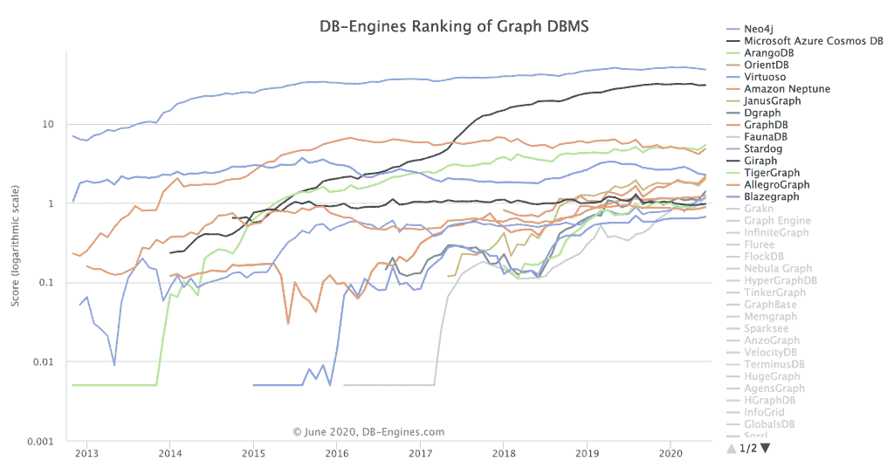
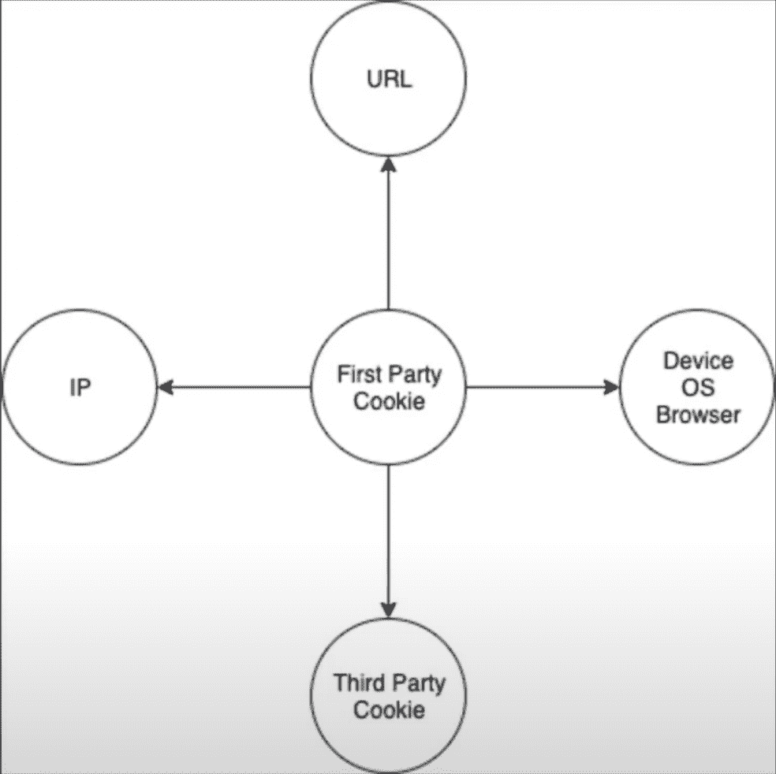

# 用 Neo4j 的图形数据库照亮匿名

> 原文：<https://thenewstack.io/illuminating-the-anonymous-with-neo4js-graph-database/>

 [理查德·麦克马努斯

理查德是《新书库》的高级编辑，每周撰写一篇关于云原生互联网未来发展的专栏文章。此前，他在 2003 年创立了读写网，并将其打造为全球最具影响力的科技新闻和分析网站之一。](https://twitter.com/ricmac) 

图表数据库公司 [Neo4j](https://neo4j.com/) 的首席科学家[吉姆·韦伯](https://www.linkedin.com/in/jim-webber-a3b5033/)上周告诉我，“公司再也不能忽视互联数据在提高数据科学模型和预测准确性方面的力量。虽然这听起来像是我们从科技公司得到的通常的宏大、全面的声明，但这一次有一个坚实的案例研究来支持它。

4 月，Neo4j 公布了最新产品:[Neo4j for Graph Data Science](https://neo4j.com/use-cases/graph-data-science-artificial-intelligence/?ref=pr-)，一个面向企业的预测平台。媒体集团[梅雷迪思](https://www.meredith.com/)使用该产品将大量匿名网站访问者的数据转化为客户资料，方法是将数据绘制成数十亿个节点，然后对其应用机器学习。

梅雷迪思称之为“照亮匿名”，这是一个有点令人毛骨悚然的短语(并且提醒人们，隐私不是给定的，即使你认为你正在匿名浏览)。但是，如果你看一下隐私问题，Meredith 的所作所为说明了机器学习与云和图形技术相结合的巨大力量。

顾名思义，图形数据库系统以图形结构表示数据——节点之间的关系图。这是人工智能系统“学习”的一种方式；通过运行算法来寻找这些数据关系中的模式。

谷歌是图形如何成为人工智能软件核心的最好例子。其最初的产品谷歌搜索本质上是一个图形数据库。从那时起，它就建立在这个基础上。如今，图表是谷歌机器学习努力的中心。

至于 Neo4j，根据 DB-Engines 的说法，它是世界上最流行的图形数据库系统[。](https://db-engines.com/en/ranking/graph+dbms)

Neo4j 的创始人兼首席执行官 [Emil Eifrem](https://twitter.com/emileifrem) 几年前告诉新的 Stack当谈到人工智能，特别是机器学习(ML)时，“我们正处于九局游戏的第一局”。所以我问吉姆·韦伯，我们现在在哪一局？

作为英国人，韦伯决定用板球来代替棒球。一天的板球比赛有两局，而不是九局。根据韦伯的说法，我们在人工智能的第一局结束了。

“ML 已经到来，并对我们的行业和我们支持的垂直行业产生了巨大影响，”他说。“我最近的一次谈话——如果你愿意的话，是接下来的几局——一直围绕着图表和机器学习的集成。例如，像亚马逊和谷歌这样的公司一只脚涉足这项技术的细节，而另一只脚则涉足垂直领域。[他们]正致力于以图表为基础的更好的 ML 技术，而不仅仅是大量的数据。这里还有很多事情要做，但现在 graph AI 是未来最有希望的候选人，我认为从长远来看它会胜出。”

将图表与 ML 结合起来最有趣的是，通过将一段数据与其他数据联系起来，可以从这段数据中推断出很多东西。这又让我们回到了梅雷迪思的案例研究。在 Neo4j 四月底的虚拟活动中， [Connections](https://neo4j.com/connections/graph-data-science/) ，Meredith 高级数据科学家 [Ben Squire](https://www.linkedin.com/in/benjamin-squire/) 详细介绍了这个项目。

“我们的大多数消费者都是匿名的，没有登录，”他开始说道。然而，数百万匿名用户中的每一个都留下了可识别的痕迹——主要是通过 cookies。Meredith 收集了“数以亿计的 cookies”，但是分析这些数据非常困难。Squire 将“cookie 丢失、设备多样性和 ITTP 2.3 浏览器”列为主要挑战，这使得对独立用户的衡量“充其量只能说是模糊的”

[https://www.youtube.com/embed/atPc_qeq_Ic?feature=oembed](https://www.youtube.com/embed/atPc_qeq_Ic?feature=oembed)

视频

这就是 Neo4j 的图形数据库的用武之地。每个匿名用户都可以首先通过第一方 cookie(即 Meredith 自己创建的 cookie)来识别，但这需要一些繁重的计算来将它与其他数据连接起来。此外，其他一些数据也有问题——例如，IP 地址不断变化，使其成为不可靠的数据(至少就个人身份而言)。

来源:梅雷迪思

20 个月后，Meredith 的图形数据库拥有了 144 亿个节点、676 亿个属性和 206 亿个关系。

Squire 说，从所有这些数据中，Meredith 能够从 3.46 亿个第一方 cookies 中创建 1.63 亿个用户档案，“这些用户档案在以前会被认为是独特的个人”。然后，他们使用这些档案来提供个性化的内容和广告。

从这个案例研究中，您可以看到如何使用图形数据库来大规模地(在数亿用户中)消除数据的匿名性。在 Meredith 的案例中，关键是找到主要数据类型(第一方 cookie)和其他更有问题的数据流之间的关系。

但是其他类型的数据库系统呢，尤其是关系数据库。难道它们不能用来做类似于梅雷迪思所做的事情吗？

“问题是，”Webber 说，“关联数据比关系(面向行的)数据更有价值，数量也更多。”他还指出，图形的分析传统很强，并且与机器学习很好地匹配——“将图形特性融入 ML 有助于实现令人难以置信的改进。”

我很想知道 Webber 如何看待 Neo4j 融入云原生生态系统。我提到了 DataStax 的 Sam Ramji 的评论(that Kubernetes 和 NoSQL 的数据库 Cassandra“就像花生酱和巧克力一样……,是云世界中数据和计算的完美组合。”

“在 Neo4j，我们也是 Kubernetes 的忠实信徒，”Webber 说。“我们对它进行了大量投资，使它能够与 Neo4j 图形数据库这样的有状态系统协同工作。”

他指出，Kubernetes 支持其图形数据库即服务 [Neo4j Aura](https://neo4j.com/aura/) 。韦伯说，Aura 的控制平面“是标准化的、商品化的和跨云平台可移植的”，他认为这是“相对于那些用 bash 脚本和管道胶带去云的数据库的技术支持。”

当我撰写这一系列关于人工智能时代的数据库系统的专栏时，我学到的一件事是，21 世纪 20 年代很可能是人工智能和人工智能应用程序丰富的十年。那么，Neo4j 在云原生、数据密集型应用的新兴格局中处于什么位置呢？

“有了云原生解决方案，”他回答说，“开发人员可以编写、构思、部署和升级项目，以降低摩擦，从而提高迭代速度和敏捷性。但我们已经看到，没有单一的云——的确，可能有一些流行的云，但在这场竞赛中没有彻底的胜利者。”

Webber 说，这意味着开发人员需要的工具——如 graph ML——需要在未来的每个云平台上都有。因此，底层架构必须是云不可知的。

“我们为 Neo4j 的云架构选择 Kubernetes 反映了这一现实，”他继续说道。“这意味着我们可以相对容易地迁移到开发人员和企业希望我们现在和将来去的云平台。我们的目的是确保 Neo4j 与云玩家推出的 ML 处理服务并行。这是基础设施和应用技术的完美融合，非常引人注目。”

确实是个好地方。尤其是当你看到像 Meredith 这样的大型企业结合云、ML 和 Neo4j 的图形数据库可以做什么的时候。现在想象一下，成百上千的初创公司将会用同样的技术在应用领域构建什么。

DataStax 是新堆栈的赞助商。

通过 Pixabay 的特征图像。

目前，新堆栈不允许直接在该网站上发表评论。我们邀请所有希望讨论某个故事的读者通过推特(Twitter)或脸书(T2)与我们联系。我们也欢迎您通过电子邮件发送新闻提示和反馈:[反馈@thenewstack.io](mailto:feedback@thenewstack.io) 。

<svg xmlns:xlink="http://www.w3.org/1999/xlink" viewBox="0 0 68 31" version="1.1"><title>Group</title> <desc>Created with Sketch.</desc></svg>