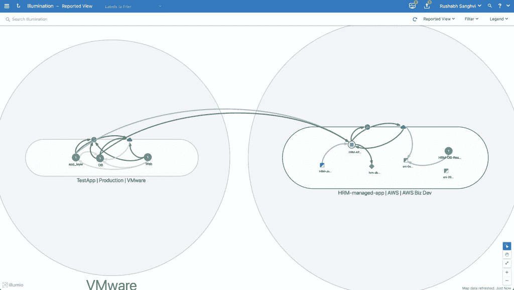

# Illumio 通过 CloudSecure 增加无代理安全性

> 原文：<https://thenewstack.io/illumio-adds-agentless-security-with-cloud-secure/>

安全平台提供商 [Illumio](https://www.illumio.com/what-we-do) 自 2013 年成立以来一直提供一种“零信任”安全形式，现在该公司正在将其核心产品中提供的一些相同功能引入公共云，本周[推出了](https://www.illumio.com/blog/cloud-security-innovations-cloudsecure) [Illumio CloudSecure](https://www.illumio.com/resource-center/datasheet-illumio-core-secure-cloud) 的。Illumio 使用一艘潜艇和它用分隔来遏制泄漏的方法来比喻它的安全方法，它同样试图使用它所谓的"[微分段"](https://www.illumio.com/solutions/micro-segmentation)"来遏制漏洞。

Illumio Core 使用一个代理来提供对应用环境的洞察并提供这种微分段，但是，根据 Illumio 首席技术官兼联合创始人 PJ·科尔纳的说法，最近有三种趋势促使 Illumio 推出了 CloudSecure。

首先，转向托管服务，无论是 Kubernetes 还是数据库或其他服务，都将许多应用带入了 Illumio 传统的基于代理的服务不适用的环境。其次，基础设施即代码和 DevOps 实践的增加导致越来越多的个人参与到基础设施的构建中，这使得理解和解决基础设施变得更加困难。第三，无论是出于合规性原因、特定运营的物流需求，还是为了利用各种公共云提供商的各种优势，公司都在不断转向多云和混合云。

“代理的价值在于能够进入操作系统，了解更接近应用程序的情况，但有些地方你不能放置代理，所以你也需要一个基于无代理的解决方案，”Kirner 说。Illumio 将这两者都带到了桌面上，并提供了跨各种环境的统一可见性，无论是托管环境还是很久以前的 AIX 服务器。"

Kirner 解释说，这三种趋势的最终结果是复杂性增加，公司不仅无法了解他们的混合多云环境，而且 Illumio Core 也无法提供洞察力和保护。Kirner 说，Illumio CloudSecure 做了三件特别的事情来解决这个问题。

“它以一种无代理的方式从您的公共云环境中收集整个对象元数据和流量遥测，它以只读方式访问，并在某种程度上了解您的公共云环境。然后，其次，它建立一个模型，最重要的是一个地图，以了解所有这些组件是如何协同工作的。“然后，它做的第三件事是查看本机云安全控制，并推荐风险优化规则，然后使用基础架构作为代码模式来帮助人们自动化这些控制。”

因此，Illumio CloudSecure 提供了与 Illumio Core 类似的功能，但以无代理的方式为亚马逊网络服务(AWS)和微软 Azure 提供服务，谷歌云平台将于 2022 年推出。

“这两个解决方案，Illumio Core 和 CloudSecure，实际上可以相互补充，”Kirner 说。“该图实际上可以由这两种解决方案共同填充，因此您可以在那里解决一些混合问题。我们可以获得基于代理的遥测技术，您可以看到它是如何与 VPC 内部的这些 Lambda 函数进行通信的，并在一种统一的单一玻璃面板中实现这一切。”

展望未来，Kirner 说，“我们希望将其他背景因素纳入其中”，例如将风险和漏洞直接纳入这些地图，从而提供“一个更深入、更丰富的背景，以便做出这些安全决策。”

<svg xmlns:xlink="http://www.w3.org/1999/xlink" viewBox="0 0 68 31" version="1.1"><title>Group</title> <desc>Created with Sketch.</desc></svg>