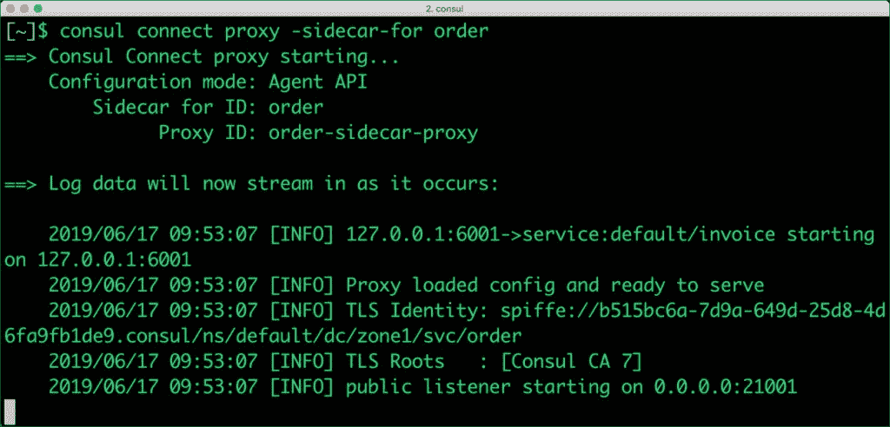
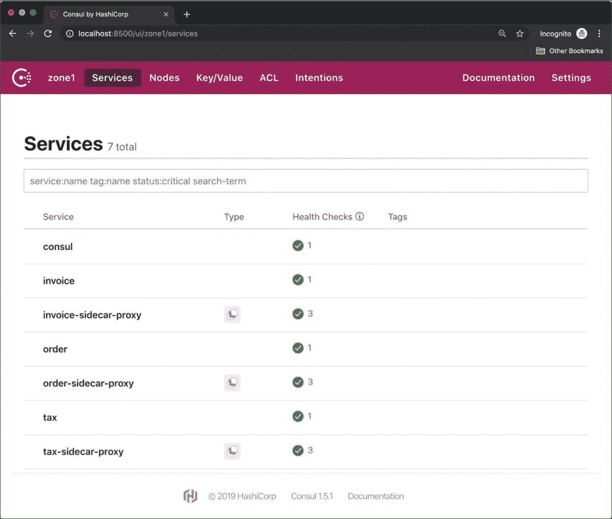
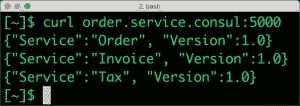
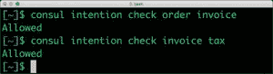
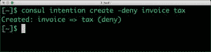
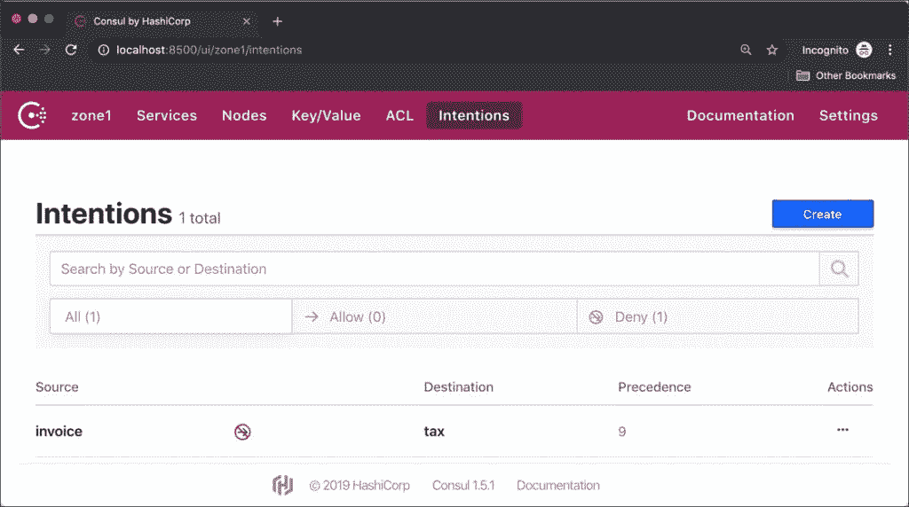
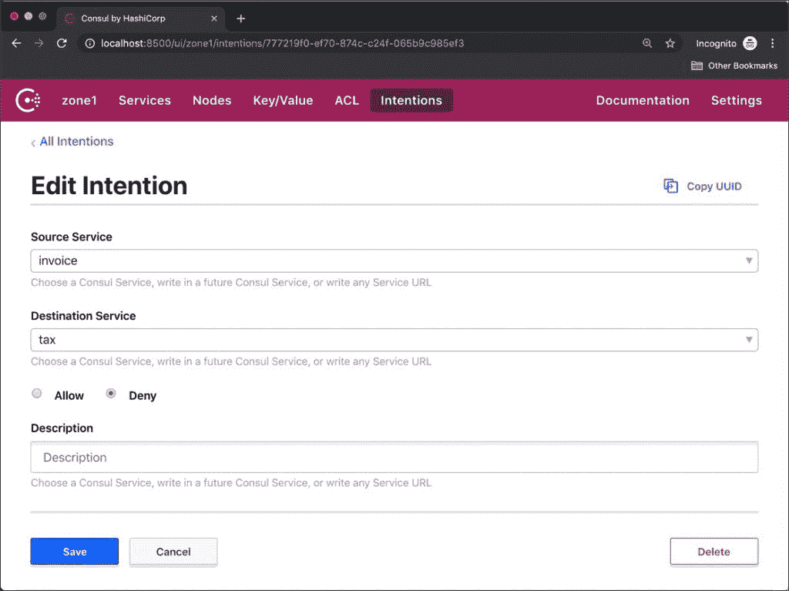

# 使用 Consul Connect 实现服务网格

> 原文：<https://thenewstack.io/implement-a-service-mesh-with-consul-connect/>

像 Istio 和 Linkerd 等其他服务网格技术一样，HashiCorp 的 [Consul Connect](https://www.hashicorp.com/products/consul/) 附带了一个代理，它被部署为 sidecar。该代理透明地保护微服务之间的通信，并通过称为意图的概念实现策略定义。在我之前的[教程](https://thenewstack.io/implementing-service-discovery-of-microservices-with-consul/)中，我们探讨了 Consul 的服务发现概念。在本教程中，我们将扩展服务定义以包括代理，然后切换服务 URL 以使用 sidecar。之后，我们将学习如何允许和拒绝两个端点之间的流量。

## 向咨询服务定义添加代理

为了[实现服务网格](https://thenewstack.io/category/service-mesh/)并利用其功能，我们需要将上游服务(也称为后端服务)添加到服务定义中。在我们的用例中，订单服务有一个名为 invoice 的上游服务，而 invoice 又有 tax 作为上游服务。即使调用链以税务服务结束，我们也将包括一个代理。

先说纳税服务。使用以下内容创建一个名为 tax.json 的文件。

```
{
"service":  {
"name":  "tax",
"port":  5002,
"connect":  {  "sidecar_service":  {}  }

}

```

注意添加了一个名为 connect 的新元素。sidecar_service 节点为空，因为税务服务是链中的最后一个。

我们将把税务服务代理与发票服务连接起来。下面是发票服务的服务定义。

```
{
"service":  {
"name":  "invoice",
"port":  5001,
"connect":  {
"sidecar_service":  {
"proxy":  {
"upstreams":  [{
"destination_name":  "tax",
"local_bind_port":  6002
}]

}

```

注意 upstreams 部分是如何声明的。它指示 Consul runtime 将流量路由到在 6002 上监听的税务服务代理，而不是默认端口 5002。

除发票代理外，订单服务定义具有相同的规则。

```
{
"service":  {
"name":  "order",
"port":  5000,
"connect":  {
"sidecar_service":  {
"proxy":  {
"upstreams":  [{
"destination_name":  "invoice",
"local_bind_port":  6001
}]

}

```

我们基本上指示 Consul Connect 在 6001 和 6002 上运行各自的税务和发票服务代理，而原始端点继续在 5001 和 5002 上运行。

通过切换到代理端点，我们获得了两个优势–安全通信和流量路由策略。

用更新的 JSON 文件替换 consul.d 目录中的原始服务定义文件。

### 为微服务运行代理边车

如果 Consul 代理仍在运行，请停止并重新启动它，以确保新定义生效。

除了重新启动 Consult agent，我们还需要为每个服务定义运行代理。这可以从命令行完成。

以下命令运行服务代理，并为每个微服务部署一个 sidecar。

```
consul connect proxy  -sidecar-for order  &
consul connect proxy  -sidecar-for invoice  &
consul connect proxy  -sidecar-for tax  &

```

当 Consul Connect 作为容器编排引擎(如 Nomad 或 Kubernetes)的一部分运行时，不需要此手动步骤。

请注意，Consul 正在向端点添加 TLS 证书，以实现相互 TLS (mTLS)。

[](https://thenewstack.io/implement-a-service-mesh-with-consul-connect/consul-2-0/)

访问位于 http://localhost:8500/ui/zone 1/services 的 Consul 仪表板，查看添加到列表中的代理服务。

[](https://thenewstack.io/implement-a-service-mesh-with-consul-connect/consul-2-1/) 
现在，每个微服务都有一个关联的 sidecar 代理服务来公开一个安全端点。

### 从默认微服务端点切换到安全微服务端点

为了利用基于 mTLS 的通信，我们将切换到 sidecar 代理暴露的新端点。

终止运行 Flask REST 端点的 Python 进程，并使用下面的配置重新启动:

```
python tax.py  &
TAX_SVC_URL=http://tax.service.consul:6002  python invoice.py  &
INV_SVC_URL=http://invoice.service.consul:6001  python order.py  &

```

注意我们如何通过 URI 的环境变量将上游服务指向 sidecar 代理。

当我们调用订单服务时，它与发票和税务的安全端点进行对话。

[](https://thenewstack.io/implement-a-service-mesh-with-consul-connect/consul-2-2/)

### 定义允许或拒绝流量的意图

有了 sidecar 代理，我们现在可以利用 Consul Connect 意图，这是一种允许或拒绝请求的机制。

运行下面的命令来探索这个概念。

```
consul intention check order invoice
consul intention check invoice tax

```

[](https://thenewstack.io/implement-a-service-mesh-with-consul-connect/consul-2-3/)

如上面的输出所示，流量从订单服务流向发票和税务。我们可以断然拒绝发票和税之间的流量来测试功能。

[](https://thenewstack.io/implement-a-service-mesh-with-consul-connect/consul-2-4/)

现在，当我们试图调用订单服务时，由于发票和税收之间的拒绝意图，它失败了。

这也可以通过 web UI 来验证。

[](https://thenewstack.io/implement-a-service-mesh-with-consul-connect/consul-2-5/)

[](https://thenewstack.io/implement-a-service-mesh-with-consul-connect/consul-2-6/)

删除拒绝意图会恢复微服务之间的流量。

HashiCorp 的 Consul 是实现服务发现、存储键/值对和配置服务网格的强大工具。

贾纳基拉姆·MSV 的网络研讨会系列“机器智能和现代基础设施(MI2)”提供了涵盖前沿技术的信息丰富、见解深刻的会议。在 [http://mi2.live](http://mi2.live) 注册参加即将举行的 MI2 网络研讨会。

<svg xmlns:xlink="http://www.w3.org/1999/xlink" viewBox="0 0 68 31" version="1.1"><title>Group</title> <desc>Created with Sketch.</desc></svg>