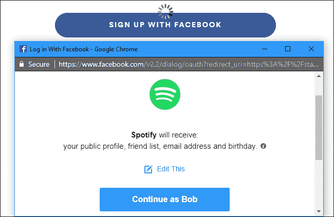
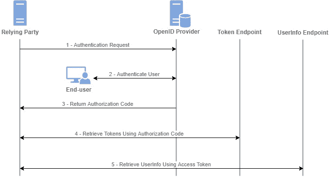

# 通过 OpenID Connect 身份验证实现 Okta 单点登录的授权访问

> 原文：<https://thenewstack.io/implement-delegated-access-with-openid-connect-authentication-for-okta-single-sign-on/>

你能想象为了一个电子邮件地址而不得不向 Spotify 提供你在脸书的登录信息吗？！



 [维拉格么迪

Virag 于 2020 年 1 月加入 gravity，此前他与人共同创立了一家以太坊应用软件代码审计公司。加入 quality 后，Virag 继续学习趋势技术，并制作高质量的文字和视频内容。闲暇时，维拉格喜欢攀岩、电子游戏和遛狗。](https://twitter.com/Mad_Eye_Mody) 

当然不是。一定有更好的方法。我们在这里寻找的概念是委托访问。我们如何在不提供登录凭证的情况下将某种程度的访问权委托给第三方实体？这就是 OAuth 所做的。但是该协议有一件事*没有*做，那就是传达关于谁在请求特权的可识别信息。授予 Spotify 访问你的脸书账户数据的权限和让 Spotify 以你的身份发帖有很大的不同。通过引入 ID 令牌，OpenID Connect authentic ation(OIDC)为 OAuth 强大的授权实用程序添加了一个身份验证特性。

通过运行一个支持 Okta 单点登录(SSO)的样例 OIDC 实现，我们将看到一个额外令牌的引入是如何做到 OAuth 所不能做到的。

## **案例研究:用于传送的 Okta SSO**

OAuth 使用不同的授权和流程来确定事件的顺序。我们将查看最常见的类型，即[授权码授予](https://developer.okta.com/blog/2018/04/10/oauth-authorization-code-grant-type)，并一步一步地进行。



(图 1) OIDC 授权码授权流程

### 第一步

Teleport 提示用户通过其组织的 SSO 提供商登录。在这种情况下，让我们使用 Okta 作为我们的 IDP。

### 第二步

Teleport 用户点击“登录”并被重定向到 [Okta 的授权 API 端点](https://developer.okta.com/docs/reference/api/oidc/)，HTTPS 请求中包含以下参数:

```
authorization_server
response_type=code
client_id
redirect_uri
scope
state

```

这些参数是什么意思？

*   `authorization_server`是 Okta 接触到的网址。所有的 IDPs 都会提供一个 URL 来重定向，通常是一个 API。对于 Okta 来说，这是`https://${yourOktaDomain}/oauth2/default/v1/authorize`
*   `response_type=code`会让 Okta 知道传送需要授权码。
*   `client_id`向 Okta 提供一个字符串，它可以检查授权客户的注册。像 Okta 这样的国内流离失所者将要求客户进行注册，以帮助识别他们。让我们用`12345`作为 Teleport 的注册 ID。
*   `redirect_uri`通知 Okta 将传送用户引导回哪个预先配置的 URL，以及传送需要的所有变量。对于这个例子，我们可以将 gravity[文档](https://gravitational.com/teleport/docs/enterprise/sso/oidc/)中提供的示例重定向 URL 作为`https://proxy.example.com:3080/v1/webapi/oidc/callback`
*   `scope`定义了访问资源的限制。对于 OAuth，这些范围是由资源应用程序内部定义的。但是回想一下，创建 OIDC 是为了标准化获取基本身份信息的方式。至少，我们必须使用图 6 中的标准声明`openid`和一个额外的标准声明`email`。
*   `state`是由 Teleport 随机生成的字符串，与 Okta 来回传递。通过传递这个字符串，Teleport 和 Okta 都知道它们在通信之间与同一个设备进行对话。对于这个例子，假设状态字符串是`syl`(我的狗的名字)。

将所有这些参数放在一起，一个传送用户在接受登录提示后被定向到的 URI 将看起来像:

```
https://${yourOktaDomain}/oauth2/default/v1/authorize?response_type=code&client_id=12345&redirect_uri=https://proxy.example.com:3080/v1/webapi/oidc/callback&scope=openid,email&state=syl

```

### 第三步

一旦 Okta 接收到查询，它将根据一个内部注册中心为 Teleport 应用程序验证`client_id`。知道了 Teleport 正在期待一个授权码，Okta 将把用户发送回重定向 URL，其中包含代码和所传递的状态参数。我们的下一站是:

```
https://proxy.example.com:3080/v1/webapi/oidc/callback?code=pkzdZumQi1&state=syl

```

### 第四步

收到代码后，Teleport 会自动查询 [Okta 令牌端点](https://developer.okta.com/docs/reference/api/oidc/#token)，将代码换成包含`code`、`redirect_uri`和`client_id`参数的令牌。存在两个附加参数:

*   `grant_type=authorization_code`通知 Okta 流程为`authorization_code`
*   `client_secret`来自 Okta 在客户端注册过程中。该字符串应该是保密的，不能公开访问。因为 Teleport 是托管在我们自己的基础设施上的，我们知道这是安全的，所以我们可以放心地传递这个参数。否则，我们将使用 [PKCE 扩展](https://aaronparecki.com/oauth-2-simplified/?utm_source=thenewstack&utm_medium=website&utm_campaign=platform#single-page-apps)并散列生成的字符串。在这种情况下，我们的秘密是`gravitational`

这种交换是通过一个类似于
的 post 请求进行的

```
POST https://${yourOktaDomain}/oauth2/default/v1/token
grant_type=authorization_code&  
code=pkzdZumQi1&  
redirect_uri=https://proxy.example.com:3080/v1/webapi/oidc/callback
client_id=12345&  
client_secret=gravitational

```

使用`client_secret`和`code`，Okta 能够验证 Teleport 客户机的请求，并发布一个用不记名令牌、到期时间和刷新令牌编码的 JSON 有效载荷。一个成功的响应可能看起来像:

```
{
"id_token":"FW6AlBeyalZtDIRXxA0u5XBbZkLzjYzKUQBloxQXSSGPFmRS8eSfDu0A4nS4GF1aQP9PRxQk7gIh9bjaX99aa4vDSzP1E2ajsgIomlNGhNxBqEDV5Exp0xISE9bZ4HUzM91pbzPPj7Bq5ZQUWcSuSVD0NAfkAoG6qDpbQfxPjWRyfthz3pUEXwZe8Cz4eOXOM45UKB4Q0VnVSChVF84MWkeBFKzhrRNXd2dFv0HTlkQr6vXGlYsocMxR06wo38HvGiKjkUmL2YUyPOjZaoUN4ovfwlwdGdjNR2GVcRsXzjxCPszJ9dTXztoL5wo2ycEpuxkkNp57BuZ9YRexoNnRHahFKH76XrFsTvdvAYk3fBVUqrO5vvyxHAFrAIKpV0FvaMiBwKNfaE84oRC6aBXnzS3q4uVyGcHveHQMJB1temgB599rfVH3pBqurUmQCd0tVexRZj4PUkrDocf8Z0QKkCD0eonH0Q1bRpQPY5vATiLkpF8RArU7wyB2FxhB3egtQBvwDgsVjyix7u8Cx4P9oy3IJje6SZfc6Lz61uEQttpVhyqfzgFYUqVoQacw6rocCn3u61dM0moB"
"access_token":"IEZKr6ePPtxZBEd",
"token_type":"bearer",
"scope":"read:org",
"expires_in":3600
}

```

`id_token`作为 JWT 发布，必须[解码](https://www.jsonwebtoken.io/)。给定我们选择的范围`openid`和`email`，我们可以期望 JSON 有效载荷读作:

```
{
"sub":"virag",
"iss":"https://${yourOktaDomain}/oauth2/",
"aud":"client_12345",
"iat":"1595977376",
"exp":"1595980976",
"email":"virag@gravitational.com",
"email_verified":"true"
}

```

### 第五步

现在我们已经获得了访问令牌，剩下的就是代表 Teleport 用户发出 API 请求并接收所需的资源。我们通过在 HTTPS [授权头](https://developer.mozilla.org/en-US/docs/Web/HTTP/Headers/Authorization)中传递访问令牌作为载体凭证来实现这一点。

## **结论**

考虑到它所解决的问题的规模，OIDC 在 OAuth 上的工作有一种简单的美。然而，开发人员在设计与 OIDC 兼容的应用程序时必须非常小心，因为它会处理敏感和隐私的用户信息。

<svg xmlns:xlink="http://www.w3.org/1999/xlink" viewBox="0 0 68 31" version="1.1"><title>Group</title> <desc>Created with Sketch.</desc></svg>