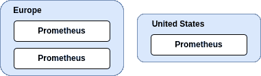
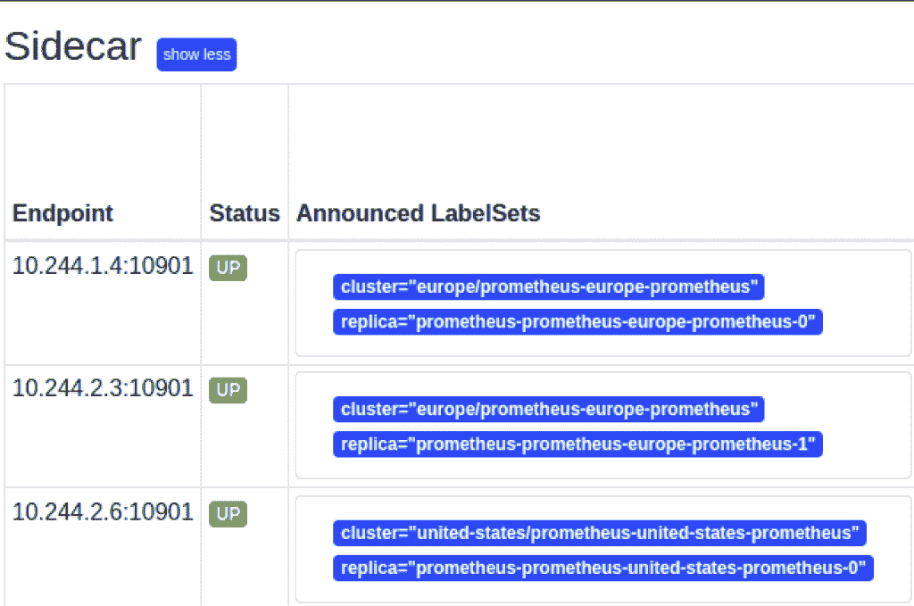
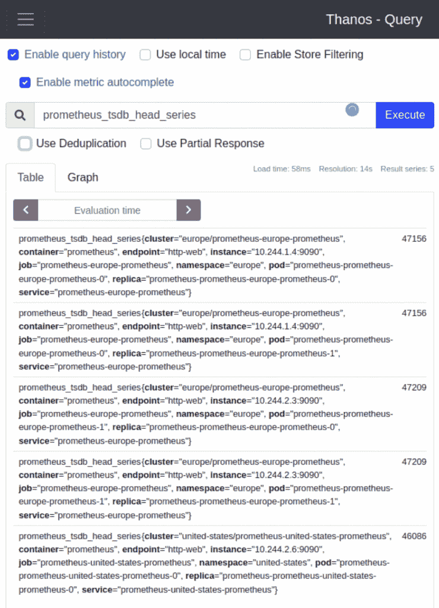
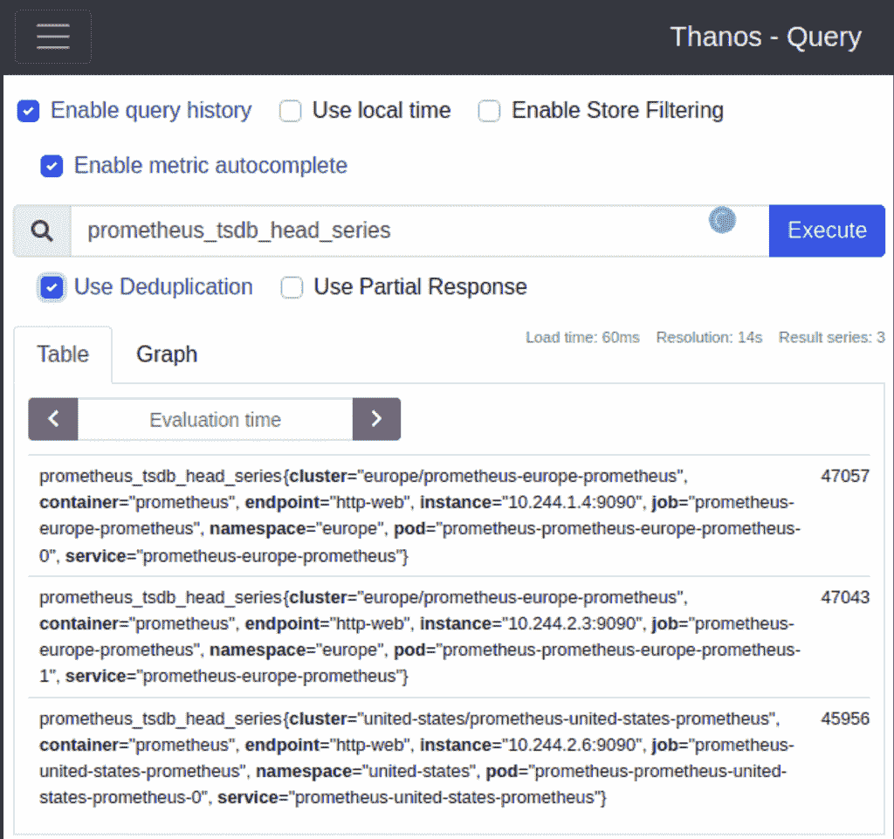
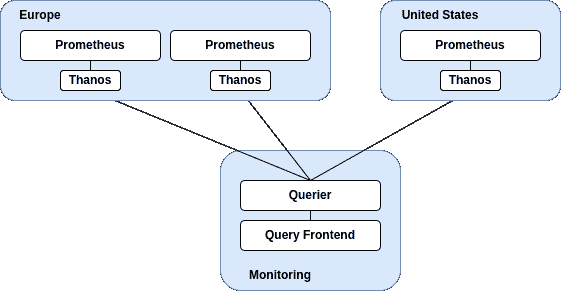

# 为 Prometheus 实施全局视图和高可用性

> 原文：<https://thenewstack.io/implement-global-view-and-high-availability-for-prometheus/>

[](https://www.linkedin.com/in/mccricardo/)

 [里卡多·卡斯特罗

里卡多是 Anova 的现场可靠性工程师。他是一名技术作家和演说家，喜欢写作和谈论 SRE、软件工程、DevOps 和原生云。](https://www.linkedin.com/in/mccricardo/) [](https://www.linkedin.com/in/mccricardo/)

确保系统可靠运行是现场可靠性工程师的重要职责。其中很大一部分是收集指标、创建警报和绘制数据图表。从多个位置和服务收集系统指标，并将它们关联起来，以了解系统功能并支持故障排除，这一点至关重要。

[Prometheus](https://prometheus.io/) ，一个[云本地计算基金会](https://cncf.io/?utm_content=inline-mention) (CNCF)项目，已经成为最流行的应用和系统监控开源解决方案之一。单个实例可以处理数百万个时间序列，但是当系统增长时，Prometheus 需要能够伸缩并处理增加的负载。因为垂直扩展最终会达到极限，所以您需要另一种解决方案。

本文将指导您将一个简单的 Prometheus 设置转换成灭霸部署。该设置将使您能够从一个端点对多个 Prometheus 实例执行可靠的查询，无缝地处理高可用性 Prometheus 设置。

## **实施全局视图和高可用性**

[灭霸](https://thanos.io/)提供了一套组件，可以提供高度可用的公制系统，具有几乎无限的存储容量。它可以添加到现有的 Prometheus 部署之上，并提供全局查询视图、数据备份和历史数据访问等功能。此外，这些功能彼此独立运行，这允许您仅在需要时加载灭霸功能。

### **初始集群设置**

您将在一个 [Kubernetes](https://kubernetes.io/) 集群中部署 Prometheus，在那里您将模拟想要的场景。T21 工具是在本地启动 Kubernetes 集群的一个很好的解决方案。您将使用以下配置。

```
# config.yaml
kind:  Cluster
apiVersion:  kind.x-k8s.io/v1alpha4
name:  thanos-demo
nodes:
  -  role:  control-plane
 Image:  kindest/node:v1.23.0@sha256:2f93d3c7b12a3e93e6c1f34f331415e105979961fcddbe69a4e3ab5a93ccbb35
  -  role:  worker
 Image:  kindest/node:v1.23.0@sha256:2f93d3c7b12a3e93e6c1f34f331415e105979961fcddbe69a4e3ab5a93ccbb35
  -  role:  worker
 image:  kindest/node:v1.23.0@sha256:2f93d3c7b12a3e93e6c1f34f331415e105979961fcddbe69a4e3ab5a93ccbb35

```

有了这个配置，您就可以启动集群了。

|  | ~ 种类 创建 集群 - 配置 配置 。 yaml 创建 集群【thanos-demo】...  确保 节点 图像 ( 善良 / 节点:v1)。 23.0 🖼准备 节点 📦  📦  📦  编写 配置 📜  启动 控制 - 平面🕹️安装 CNI 🔌  安装 存储类 💾  加入 的工人 节点 🚜设置 kubectl 上下文【kind-thanos-demo】你 可以 现在 使用 你 集群【T132 👋 |

随着集群的启动和运行，您将检查安装，以确保您准备好启动 Prometheus。您将需要 [kubectl](https://kubernetes.io/docs/reference/kubectl/kubectl/) 与 Kubernetes 集群进行交互。

```
~  kind get clusters
thanos-demo
~  kubectl get nodes
NAME                      STATUS ROLES                AGE    VERSION
thanos-demo-control-plane Ready    control-plane,master  119s v1.23.0
thanos-demo-worker        Ready    <none>                88s v1.23.0
thanos-demo-worker2 Ready    <none>                88s v1.23.0
~  kubectl get pods  -o  name  -Apod/coredns-64897985d-mz8bv</p>
pod/coredns-64897985d-pxzkq
pod/etcd-thanos-demo-control-plane
pod/kindnet-27cdw
pod/kindnet-42kcv
pod/kindnet-5rlcj
pod/kube-apiserver-thanos-demo-control-plane
pod/kube-controller-manager-thanos-demo-control-plane
pod/kube-proxy-49mgg
pod/kube-proxy-nhvkm
pod/kube-proxy-z4fpn
pod/kube-scheduler-thanos-demo-control-plane
pod/local-path-provisioner-5bb5788f44-hj5c4

```

有了这个配置，您就可以启动集群了。

|  | ~ 种类 创建 集群 - 配置 配置 。 yaml 创建 集群【thanos-demo】...确保 节点 图像 ( 最善良 / 节点:v1)。 23.0 ) 🖼准备 节点 📦  📦  📦写作 配置 📜起动 控制 - 平面🕹️安装CNI🔌 安装 存储类 💾加入 工人 节点 🚜  设置 kubectl 上下文【kind-thanos-demo】你 能 现在 使用 你 - 语境-种类-thanos-demo有 有 好听的 天！ 👋 |

集群启动并运行后，你将检查安装以确保你准备好启动普罗米修斯。您将需要 [kubectl](https://kubernetes.io/docs/reference/kubectl/kubectl/) 与 Kubernetes 集群进行交互。

```
~  kind get clusters
thanos-demo
~  kubectl get nodes
NAME                        STATUS ROLES                  AGE    VERSION
thanos-demo-control-plane Ready    control-plane,master 119s v1.23.0
thanos-demo-worker          Ready    <none> 88s    v1.23.0
thanos-demo-worker2 Ready    <none> 88s    v1.23.0
~  kubectl get pods  -o  name  -A
pod/coredns-64897985d-mz8bv
pod/coredns-64897985d-pxzkq
pod/etcd-thanos-demo-control-plane
pod/kindnet-27cdw
pod/kindnet-42kcv
pod/kindnet-5rlcj
pod/kube-apiserver-thanos-demo-control-plane
pod/kube-controller-manager-thanos-demo-control-plane
pod/kube-proxy-49mgg
pod/kube-proxy-nhvkm
pod/kube-proxy-z4fpn
pod/kube-scheduler-thanos-demo-control-plane
pod/local-path-provisioner-5bb5788f44-hj5c4

```

### **初始普罗米修斯设置**

您的目标是在现有 Prometheus 安装的基础上部署灭霸，并扩展其功能。考虑到这一点，您将从启动三台 Prometheus 服务器开始。拥有多个 Prometheus 实例有几个原因，比如分片、高可用性或来自多个位置的查询聚合。

对于这个场景，让我们设想以下设置:在美国的一个集群中有一个 Prometheus 服务器，在欧洲有两个 Prometheus 服务器的副本，它们抓取相同的目标。



要部署普罗米修斯，你将使用 [kube-prometheus-stack](https://github.com/prometheus-community/helm-charts/tree/main/charts/kube-prometheus-stack) 图表，并且你将需要[头盔](https://helm.sh/)。安装头盔后，你需要[添加](https://helm.sh/docs/helm/helm_repo_add/)库贝-普罗米修斯-堆栈库。

```
~  helm repo add prometheus-community https://prometheus-community.github.io/helm-charts
"prometheus-community"  has been added to your repositories
~ helm repo update
Hang tight while we grab the latest from your chart repositories...
...Successfully got an update from the  "prometheus-community"  chart repository
Update Complete.  ⎈Happy Helming!⎈

```

因为实际上您只有一个 Kubernetes 集群，所以您将通过在不同的名称空间中部署 Prometheus 来模拟多个区域。您将为`europe`和`united-states`分别创建名称空间。

```
~  kubectl create namespace europe
namespace/europe created
~  kubectl create namespace united-states
namespace/united-states created

```

现在你已经有了你的区域，你可以开始部署普罗米修斯了。

```
# prometheus-europe.yaml
nameOverride:  "eu"
namespaceOverride:  "europe"
nodeExporter:
  enabled:  false
grafana:
  enabled:  false
alertmanager:
  enabled:  false
kubeStateMetrics:
  enabled:  false
prometheus:
  prometheusSpec:
    replicas:  2
    replicaExternalLabelName:  "replica"
    prometheusExternalLabelName:  "cluster"

# prometheus-united-states.yaml
nameOverride:  "us"
namespaceOverride:  "united-states"
nodeExporter:
  enabled:  false
grafana:
  enabled:  false
alertmanager:
  enabled:  false
kubeStateMetrics:
  enabled:  false
prometheus:
  prometheusSpec:
    replicaExternalLabelName:  "replica"
    prometheusExternalLabelName:  "cluster"

```

使用上面的配置，您将在每个地区部署 Prometheus 实例。

```
~  helm  -n  europe upgrade  -i  prometheus-europe prometheus-community/kube-prometheus-stack  -f  prometheus-europe.yaml
Release  "prometheus-europe"  does not exist.  Installing it now.
NAME:  prometheus-europe
LAST DEPLOYED:  Sat Jan  22  18:26:22  2022
NAMESPACE:  europe
STATUS:  deployed
REVISION:  1
TEST SUITE:  None
NOTES:
kube-prometheus-stack has been installed.  Check its status by running:
  kubectl  --namespace europe get pods  -l  "release=prometheus-europe"

~  helm  -n  united-states upgrade  -i  prometheus-united-states prometheus-community/kube-prometheus-stack  -f  prometheus-united-states.yaml
Release  "prometheus-united-states"  does not exist.  Installing it now.
NAME:  prometheus-united-states
LAST DEPLOYED:  Sat Jan  22  18:26:48  2022
NAMESPACE:  united-states
STATUS:  deployed
REVISION:  1
TEST SUITE:  None
NOTES:
kube-prometheus-stack has been installed.  Check its status by running:
  kubectl  --namespace united-states get pods  -l  "release=prometheus-united-states"

Visit https://github.com/prometheus-operator/kube-prometheus for instructions on how to create & configure Alertmanager and Prometheus instances using the Operator.

```

你现在可以确保你的普罗米修斯正常工作了。

```
~  kubectl  -n  europe get pods  -l  app.kubernetes.io/name=prometheus 
NAME                                        READY STATUS    RESTARTS AGE
prometheus-prometheus-europe-prometheus-0 2/2 Running 0          18s
prometheus-prometheus-europe-prometheus-1 2/2 Running 0          18s
~  kubectl  -n  united-states get pods  -l  app.kubernetes.io/name=prometheus
NAME READY STATUS    RESTARTS AGE
prometheus-prometheus-united-states-prometheus-0 2/2 Running 0          39s

```

您现在可以查询每个实例的任何指标，但是不能执行多集群查询。

### 部署灭霸边车

kube-prometheus-stack 支持将灭霸作为边车部署，这意味着它将与 prometheus 一起部署。灭霸 [sidecar](https://thanos.io/tip/components/sidecar.md/) 通过 [StoreAPI](https://thanos.io/tip/thanos/integrations.md/#storeapi) 公开 Prometheus，这是一个通用的 gRPC API，允许灭霸组件从各种系统获取指标。

```
# prometheus-europe.yaml
nameOverride:  "eu"
namespaceOverride:  "europe"
nodeExporter:
  enabled:  false
grafana:
  enabled:  false
alertmanager:
  enabled:  false
kubeStateMetrics:
 enabled:  false
prometheus:
  prometheusSpec:
    replicas:  2
 replicaExternalLabelName:  "replica"
 prometheusExternalLabelName:  "cluster"
 thanos:
 baseImage:  quay.io/thanos/thanos
 version:  v0.24.0

# prometheus-united-states.yaml
nameOverride:  "us"
namespaceOverride:  "united-states"
nodeExporter:
  enabled:  false
grafana:
  enabled:  false
alertmanager:
  enabled:  false
kubeStateMetrics:
  enabled:  false
prometheus:
  prometheusSpec:
 replicaExternalLabelName:  "replica"
 prometheusExternalLabelName:  "cluster"
 thanos:
 baseImage:  quay.io/thanos/thanos
 version:  v0.24.0

```

有了更新的配置，你就可以升级普罗米修斯了。

```
~  helm  -n  europe upgrade  -i  prometheus-europe prometheus-community/kube-prometheus-stack  -f  2/prometheus-europe.yaml
Release  "prometheus-europe"  has been upgraded.  Happy Helming!
NAME:  prometheus-europe
LAST DEPLOYED:  Sat Jan  22  18:42:24  2022
NAMESPACE:  europe
STATUS:  deployed
REVISION:  2
TEST SUITE:  None
NOTES:
kube-prometheus-stack has been installed.  Check its status by running:
  kubectl  --namespace europe get pods  -l  "release=prometheus-europe"

~  helm  -n  united-states upgrade  -i  prometheus-united-states prometheus-community/kube-prometheus-stack  -f  2/prometheus-united-states.yaml
Release  "prometheus-united-states"  has been upgraded.  Happy Helming!
NAME:  prometheus-united-states
LAST DEPLOYED:  Sat Jan  22  18:43:06  2022
NAMESPACE:  united-states
STATUS:  deployed
REVISION:  2
TEST SUITE:  None
NOTES:
kube-prometheus-stack has been installed.  Check its status by running:
  kubectl  --namespace united-states get pods  -l  "release=prometheus-united-states"

Visit https://github.com/prometheus-operator/kube-prometheus for instructions on how to create & configure Alertmanager and Prometheus instances using the Operator.

```

你可以检查普罗米修斯舱是否有一个额外的容器在旁边。

```
~  kubectl  -n  europe get pods  -l  app.kubernetes.io/name=prometheus 
NAME                                        READY STATUS    RESTARTS AGE
prometheus-prometheus-europe-prometheus-0 3/3 Running 0          48s
prometheus-prometheus-europe-prometheus-1 3/3 Running 0          65s
~  kubectl  -n  united-states get pods  -l  app.kubernetes.io/name=prometheus
NAME READY STATUS    RESTARTS AGE
prometheus-prometheus-united-states-prometheus-0 3/3 Running 0          44s

```

### **部署灭霸 Querier 实现全局视图**

[query er](https://thanos.io/tip/components/query.md/)实现 [Prometheus HTTP v1 API](https://prometheus.io/docs/prometheus/latest/querying/api/) 通过 [PromQL](https://prometheus.io/docs/prometheus/latest/querying/basics/) 查询灭霸集群中的数据。它将允许您从单个端点获取指标。它首先从底层[store API](https://github.com/thanos-io/thanos/blob/main/pkg/store/storepb/rpc.proto)收集评估查询所需的数据，评估查询，然后返回结果。

你利用[库贝-普罗米修斯-斯塔克](https://github.com/prometheus-community/helm-charts/tree/main/charts/kube-prometheus-stack)部署灭霸边车。不幸的是，该图表不支持其他[灭霸组件](https://thanos.io/v0.6/thanos/getting-started.md/#components)。为此，您将利用 [Banzai 云舵图表库。和以前一样，您将从添加存储库开始，和以前一样。](https://github.com/banzaicloud/banzai-charts) 

```
~  helm repo add banzaicloud https://kubernetes-charts.banzaicloud.com
"banzaicloud"  has been added to your repositories
~  helm repo update
Hang tight while we grab the latest from your chart repositories...
...Successfully got an update from the  "prometheus-community"  chart repository
...Successfully got an update from the  "banzaicloud"  chart repository
Update Complete.  ⎈Happy Helming!⎈

```

为了模拟中央监控解决方案，您将创建一个`monitoring`名称空间。

```
~  kubectl create namespace monitoring
namespace/monitoring created

```

以下配置配置了灭霸查询器，并将其指向普罗米修斯实例。

```
# query.yaml
store:  # https://thanos.io/tip/components/store/
  enabled:  false 
compact:  # https://thanos.io/tip/components/compact.md/
  enabled:  false
bucket:  https://thanos.io/v0.8/components/bucket/
  enabled:  false
rule:  # https://thanos.io/tip/components/rule/
  enabled:  false
sidecar:  # https://thanos.io/tip/components/sidecar/
  enabled:  false
queryFrontend:  # https://thanos.io/tip/components/query-frontend.md/
  enabled:  false
query:  # https://thanos.io/tip/components/query/
  enabled:  true
  replicaLabels:
    -  replica
  stores:
 -  "dnssrv+_grpc._tcp.prometheus-operated.europe.svc.cluster.local"
 -  "dnssrv+_grpc._tcp.prometheus-operated.united-states.svc.cluster.local"

```

有了上面的配置，您就可以部署 Querier 了。

```
~  helm  -n  monitoring upgrade  -i  thanos banzaicloud/thanos  -f  query.yaml
Release  "thanos"  does not exist.  Installing it now.
NAME:  thanos
LAST DEPLOYED:  Sat Jan  22  18:48:03  2022
NAMESPACE:  monitoring
STATUS:  deployed
REVISION:  1
TEST SUITE:  None

~  kubectl  -n  monitoring port-forward svc/thanos-query-http  10902:10902
Forwarding from  127.0.0.1:10902  ->  10902
Forwarding from  [::1]:10902  ->  10902

```

使用[端口转发](https://kubernetes.io/docs/tasks/access-application-cluster/port-forward-access-application-cluster/)，您可以连接到您的集群。您可以确保能够执行多集群查询。在部署 Prometheus 时，设置了 replicateexternallabelname:" replica "和 prometheusExternalLabelName:" cluster "。重复数据删除功能将利用这些优势。通过启用它，您可以确保对来自`europe`集群的指标进行重复数据删除。这是因为灭霸认为它们来自同一个高可用性组。这是因为除了副本标签之外，它们具有相同的标签。





# 

### **部署灭霸查询前端提高可读性**

难题的最后一块是部署[查询前端](https://thanos.io/tip/components/query-frontend.md/)，这是一个可以放在查询者前面以提高可读性的服务。它基于 [Cortex 查询前端](https://cortexmetrics.io/docs/architecture/#query-frontend)组件，支持拆分、重试、缓存和慢速查询日志等功能。

```
# query.yaml
store:
  enabled:  false
compact:
  enabled:  false
bucket:
  enabled:  false
rule:
  enabled:  false
sidecar:
  enabled:  false
queryFrontend:
  enabled:  true
query:
  enabled:  true
  replicaLabels:
    -  replica
  stores:
 -  "dnssrv+_grpc._tcp.prometheus-operated.europe.svc.cluster.local"
 -  "dnssrv+_grpc._tcp.prometheus-operated.united-states.svc.cluster.local"

```

更新之前的配置以部署查询前端，您现在可以更新您的设置。

```
~  helm  -n  monitoring upgrade  -i  thanos banzaicloud/thanos  -f  query.yaml
Release  "thanos"  has been upgraded.  Happy Helming!
NAME:  thanos
LAST DEPLOYED:  Sat Jan  22  18:56:29  2022
NAMESPACE:  monitoring
STATUS:  deployed
REVISION:  2
TEST SUITE:  None

~  kubectl  -n  monitoring port-forward svc/thanos-query-frontend-http  10902:10902
Forwarding from  127.0.0.1:10902  ->  10902
Forwarding from  [::1]:10902  ->  10902

```

再次使用 **port-forward** ，就可以访问查询前端了。



查询前端是向多个 Prometheus 实例发送查询的入口点。执行这些类型的查询的服务，比如 Grafana，应该通过查询前端进行查询。

## **结论**

在本文中，您已经经历了从一个简单的指标收集解决方案到一个全局的、高度可用的设置所需的步骤。在这个设置中，您在一个 [Kubernetes](https://kubernetes.io/) 集群中利用了[普罗米修斯](https://prometheus.io/)和[灭霸](https://thanos.io/)。

您首先分别部署 Prometheus 实例，模拟多区域设置，然后逐步增加功能。你开始注入灭霸作为一个[边车](https://thanos.io/tip/components/sidecar.md/)，在普罗米修斯之上实现商店 API，为部署[查询者](https://thanos.io/tip/components/query.md/)铺平道路。Querier 从底层存储 API 收集数据，评估查询并返回结果。最后，您部署了 [Query Fronted](https://thanos.io/tip/components/query.md/) ，这是一个旨在提高可读性的组件，支持诸如分割、重试、缓存和慢速查询日志等功能。

此设置允许您在高可用性设置中运行多副本 Prometheus 服务器，并为更复杂的场景铺平了道路。

### **Plug:** **使用 K8s 配合 Squadcast 进行更快的解析**

*[Squadcast](https://squadcast.com/?utm_content=inline-mention) 是专为 SRE 打造的事故管理工具。清除不想要的提醒，接收相关通知，并与流行的 ChatOps 工具集成。使用虚拟事故警报室进行协作，并使用自动化来消除繁重的工作。*

<svg xmlns:xlink="http://www.w3.org/1999/xlink" viewBox="0 0 68 31" version="1.1"><title>Group</title> <desc>Created with Sketch.</desc></svg>