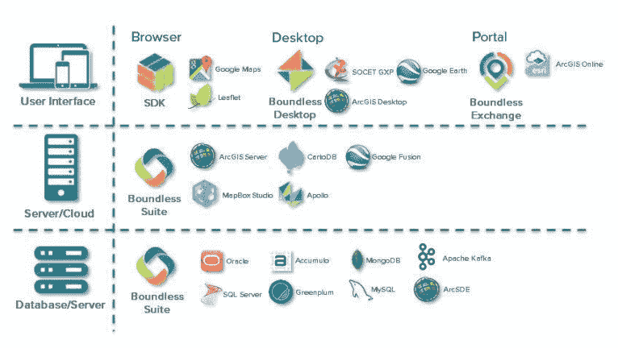
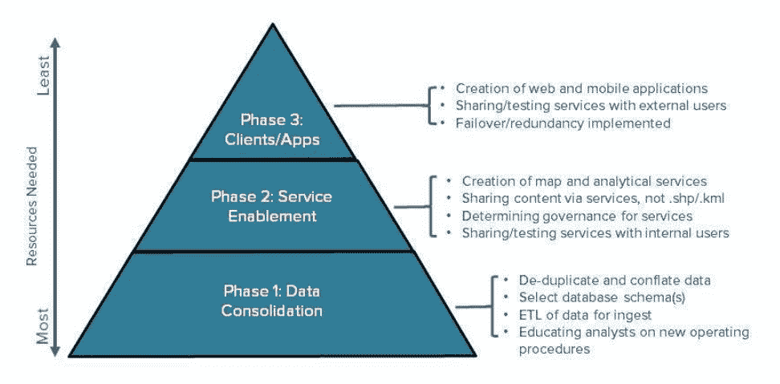

# 如何实现开源地理信息系统的混合架构

> 原文：<https://thenewstack.io/implement-hybrid-architecture-open-source-geographic-information-systems/>

[](https://boundlessgeo.com/)

 [汤姆·英戈尔德，无量

汤姆·英戈尔德是开源地理信息系统(GIS)公司无量的 CTO。Tom 从 Booz Allen 加入 unboundary，当时他在国防和英特尔市场开发 OGC 服务和架构。Tom 拥有敏捷系统和在生产环境中构建 GIS 系统的经验。他拥有哈佛大学自然科学学士学位和宾夕法尼亚州立大学 GIS 研究生证书。](https://boundlessgeo.com/) [](https://boundlessgeo.com/)

现在产生的数据比以往任何时候都多，其中很多都是基于位置的。从互联传感器网络到智能城市，物联网(IoT)的兴起创造了大量新数据流，供大规模消费、处理和分析。

物联网兴起之前是开源软件，如 Linux 等操作系统、Docker 等容器软件和 Ansible 等自动化工具。在地理空间领域，开源已经在过去十年中扎根，其形式就是我们所说的地理空间免费开源软件(FOSS4G)。

开源和物联网的同时激增正在推动地理信息系统(GIS)技术的变革，组织使用该技术在一张地图上可视化许多不同类型的基于位置的数据，以便识别模式和关系。地理空间专业人员和我们所谓的“地理支持用户”(他们将位置信息作为其业务功能的一部分)需要技术性能和价格都可以扩展的技术，并且还需要通过开放和可互操作的接口和标准与其他系统集成。

开源的出现在一定程度上是由于与封闭源代码环境相关的挑战，如单一供应商锁定、扩展或扩展架构的成本增加，以及缺乏与现有软件和硬件的互操作性。开源软件非常灵活，可以与现有架构协同工作并改进其功能，这样 IT 团队就不必淘汰和替换传统系统，后者通常需要数十年的巨额投资。

相反，组织可以在运营速度允许的情况下，分阶段逐步迁移他们的企业。由此产生的架构被称为混合架构，由专有软件和开源软件组成。

## 迁移到混合架构

混合架构的核心是 GIS 软件可以与现有的专有软件无缝集成的概念。由于开放式 GIS 软件在很大程度上是建立在使用标准的基础上的，所以您越是远离专有软件，就越能自然地建立互操作性。无限平台包括数据库、应用服务器和用户界面层的软件。这些都没有严格的相互依赖关系，这意味着您可以一次一层地集成开源，而不会中断整个系统。

[](https://storage.googleapis.com/cdn.thenewstack.io/media/2017/09/a46ffd03-boundless01.png)

### 数据库层迁移

最常见的是在数据库级别开始迁移过程，因为最终用户很难看到更改。他们仍然有他们习惯的相同用户界面，但只是连接到不同的端点来检索他们的数据(有时是不知不觉的)。例如，一个组织可能会将他们专有的数据库技术换成开源数据库。尽管数据库层发生了变化，但客户仍然可以通过组织使用专有 web 制图库构建的相同自定义 web 应用程序来访问内容。

[例如，Oracle Spatial](https://www.oracle.com/database/spatial/index.html) 可以轻松地用 PostGIS(Postgres 的空间扩展)替换。事实上，开源的 GDAL/OGR 工具使得数据迁移成为一个简单的命令:

```
ogr2ogr  -f  "PostgreSQL"  PG:"host=localhost user=pguser dbname=myspatialdb password=pgpassword port=5432"  OCI:oracleuser/oraclepassword myspatialtable

```

在几秒钟内，数据从单一供应商的专有数据库转移到开源数据库——可以免费获得，也可以通过许多不同的商业支持选项获得。功能几乎相同，大多数应用服务器(包括开源的地理服务器)可以透明地切换。

最重要的是，使用应用服务器数据的最终用户不会意识到您做了更改，因为他们继续使用他们习惯使用的前端应用程序。

### 应用服务器层迁移

在应用程序服务器上迁移到开源会为您的架构注入更多的互操作性。例如，unboundary Suite 允许您以[开放地理空间联盟](http://www.opengeospatial.org/) (OGC)标准服务和格式发布空间数据。标准的使用意味着一个发布一次的服务可以在任意数量的专有或开源最终用户应用程序中同时使用。

通过使用这些标准接口和数据格式(无论您是否迁移了上述数据库),您将自己与客户机和服务器之间添加的任何 API 变化隔离开来。只要服务器实现了标准，任何客户端都可以使用任何数据。例如，OGC 的[网络地图服务](http://www.opengeospatial.org/standards/wms)是一个定义明确的标准，无论它是从 ArcGIS Server、Mapserver、QGIS Server 还是 unlimited Suite 发布，其行为都是一样的。

### 用户界面层迁移

迁移用户界面层允许您利用 80/20 规则的力量。80%只需要基本功能的用户最有可能使用健壮的开源应用程序来完成他们的工作。没有了 80%用户群的许可成本，您可以将预算用于支持剩下的 20%需要 edgecase 功能的高级用户，这些功能只能在专有软件中找到。

unlimited Desktop 是一个跨平台的桌面 GIS(意味着它可以在 Windows、Linux 和 Mac 上工作)，允许用户管理、分析、可视化和传播各种矢量、栅格和数据库格式的地理空间数据，包括:PostGIS、Oracle、SQL Server、Shapefile、KML/KMZ、OGC·WMS/WFS、GeoTiff、NITF 等等。它支持动态重投影、数据编辑、空间分析、网络分析等。unlimited Desktop 可以通过一个广泛的插件库进行扩展，并且能够使用开源 Python 脚本创建自己的定制插件。

对于简单或可重复的工作流，考虑将功能迁移到专门构建的 web 应用程序。例如，执行简单数据收集或使用桌面 GIS 了解情况的用户可以将工作流迁移到 [OpenLayers](https://openlayers.org/) web 应用程序。

## 分阶段的方法

成功的混合迁移应该在时间表和成本方面设定适当的期望值，同时从一开始就清楚地阐明可实现的里程碑。建议采用包含以下不同步骤的分阶段方法:数据整合、服务支持和客户端/应用程序开发。

[](https://storage.googleapis.com/cdn.thenewstack.io/media/2017/09/2f021b01-boundless3.png)

### 阶段 1:数据整合

成功的混合 GIS 架构需要一个坚实的基础，这首先需要关注数据和数据存储。这应该包括根据需要对数据源进行重复数据删除和合并，最终目标是建立一个集中的、权威的数据集，通过该数据集可以发布服务。

在准备数据时，重要的是进行任何可能的优化，这些优化在通过服务公开数据时可能是有益的。这可能包括将数据重新投影到通常要求的参考系统中，或者创建大图像的小概览。这种预优化往往会为最终用户带来巨大的性能优势，但对于任何可能会无意中降低精度或准确度的优化，都必须小心谨慎。

### 阶段 2:服务支持

第二阶段是将数据服务化到地图和分析服务中。这允许组织维护其源数据的完整性和保真度。在这一阶段，围绕治理和策略的讨论也是必要的，以便确定一组商定的策略，控制谁可以对控股公司内的数据和服务做什么。

这里可以实现进一步的优化。服务旨在提供一种通用的数据分发方式。虽然服务提供商并不总是知道服务的预期最终用途，但通常建议删除无关的元数据或属性。例如，要素数据具有多个冗余字段的情况并不少见，例如州名、州名缩写，甚至可能还有州 id。将它简化为一个属性字段可能看起来是一个无关紧要的步骤，但是它可以显著减少数据库 IO、缩减带宽并简化客户端配置。

### 阶段 3:客户端/应用程序开发

最后，必须考虑外部用户将如何访问、连接和使用数据和服务。除了向组织外的用户开放和共享服务端点，该阶段通常还包括桌面、web 和移动应用程序开发，因为这是一种利用数据和服务的流行方式。

由专有和商业支持的开源软件组成的混合 GIS 架构通过更好的互操作性、可扩展性、可用性和灵活性，降低风险并增加项目价值，从而增强组织的能力。按照上面的步骤，迁移到混合架构是一种简单而有效的方法，可以改进个人的专有系统并推动组织内的创新。

特色图片:无边的桌面

<svg xmlns:xlink="http://www.w3.org/1999/xlink" viewBox="0 0 68 31" version="1.1"><title>Group</title> <desc>Created with Sketch.</desc></svg>