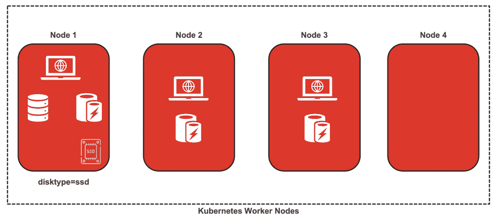
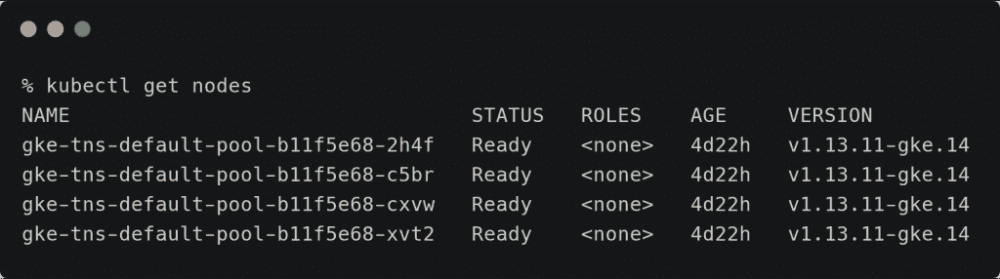
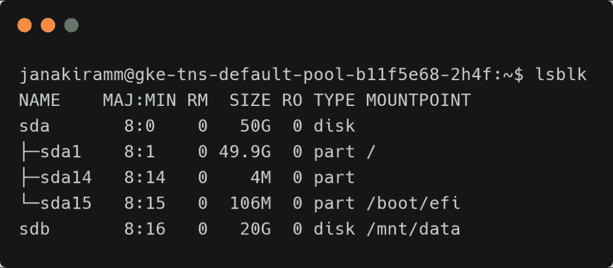
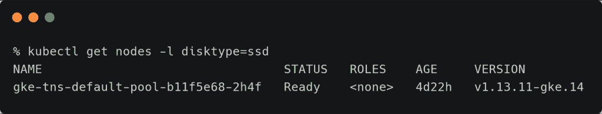
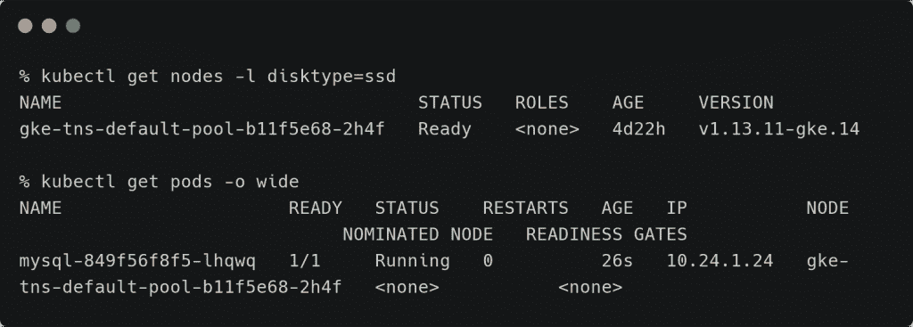
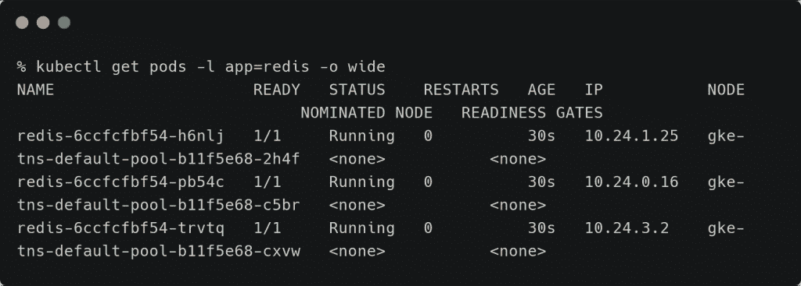
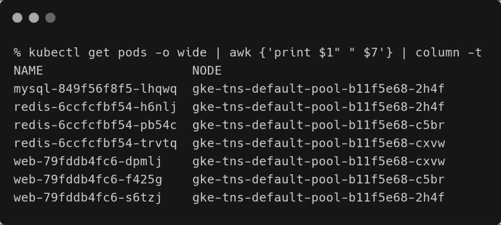
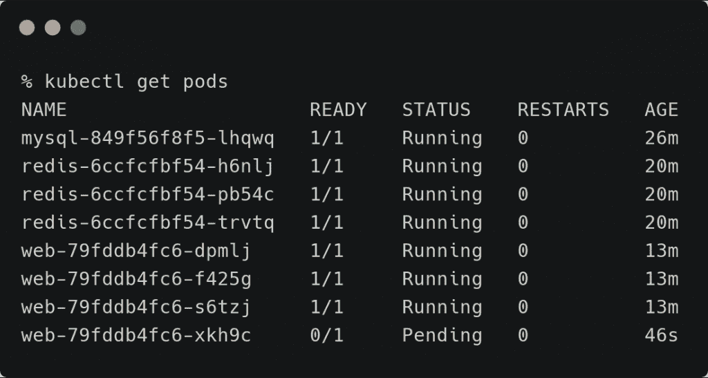

# 在 Kubernetes 中实现节点和 Pod 关联/反关联:一个实际例子

> 原文：<https://thenewstack.io/implement-node-and-pod-affinity-anti-affinity-in-kubernetes-a-practical-example/>

我在上周的教程中介绍了[节点和 pod 亲和/反亲和](/strategies-for-kubernetes-pod-placement-and-scheduling/)的概念。我们将通过一个真实的场景进一步探讨这个想法。

## 目标

我们将在四节点 Kubernetes 集群中部署三个微服务——MySQL、Redis 和一个 Python/Flask web 应用程序。由于其中一个节点连接到 SSD 磁盘，我们希望确保 MySQL Pod 安排在同一个节点上。Redis 用于缓存数据库查询以提高应用程序性能。但是没有一个节点会运行超过一个 Pod 的 Redis。因为 Redis 被用作缓存，所以在每个节点上运行多个 Pod 没有意义。下一个目标是确保 web Pod 和 Redis Pod 放在同一个节点上。这将确保 web 和缓存层之间的低延迟。即使我们扩展 web Pod 的副本数量，它也永远不会被放在没有 Redis Pod 的节点上。



### 设置 GKE 集群并添加 SSD 磁盘

让我们启动一个 GKE 集群，向其中一个节点添加一个 SSD 持久磁盘，并标记该节点。

```
gcloud container clusters create  "tns"  \
  --zone  "asia-south1-a"  \
  --username  "admin"  \
  --cluster-version  "1.13.11-gke.14"  \
  --machine-type  "n1-standard-4"  \
  --image-type  "UBUNTU"  \
  --disk-type  "pd-ssd"  \
  --disk-size  "50"  \
  --scopes  "https://www.googleapis.com/auth/compute","https://www.googleapis.com/auth/devstorage.read_only","https://www.googleapis.com/auth/logging.write","https://www.googleapis.com/auth/monitoring","https://www.googleapis.com/auth/servicecontrol","https://www.googleapis.com/auth/service.management.readonly","https://www.googleapis.com/auth/trace.append"  \
  --num-nodes  "4"  \
  --enable-stackdriver-kubernetes  \
  --network  "default"  \
  --addons HorizontalPodAutoscaling,HttpLoadBalancing

```

这将产生一个 4 节点 GKE 集群。

[](https://thenewstack.io/implement-node-and-pod-affinity-anti-affinity-in-kubernetes-a-practical-example/np-aff-0/)

让我们创建一个 GCE 持久磁盘，并将其连接到 GKE 集群的第一个节点。

```
gcloud compute disks create  \
  mysql-disk-1  \
  --type pd-ssd  \
  --size  20GB  \
  --zone asia-south1-a

```

```
  gcloud compute instances attach-disk gke-tns-default-pool-b11f5e68-2h4f  \
  --disk mysql-disk-1  \
  --zone asia-south1-a

```

我们需要在节点中挂载磁盘，以便应用程序可以访问它。

```
gcloud compute ssh gke-tns-default-pool-b11f5e68-2h4f  \
--zone asia-south1-a

```

通过 SSH 进入 GKE 节点后，运行以下命令来挂载磁盘。

```
sudo mkfs.ext4  -m  0  -F  -E  lazy_itable_init=0,lazy_journal_init=0,discard  /dev/sdb
sudo mkdir  -p  /mnt/data
sudo mount  -o  discard,defaults  /dev/sdb  /mnt/data
sudo chmod  a+w  /mnt/data
echo UUID=`sudo blkid  -s  UUID  -o  value  /dev/sdb`  /mnt/data ext4 discard,defaults,nofail  0  2  |  sudo tee  -a  /etc/fstab

```

运行 lsblk 命令确认磁盘安装在/mnt/data



退出 shell 并运行以下命令，将该节点标记为 disktype=ssd。

```
kubectl label node gke-tns-default-pool-b11f5e68-2h4f  \
disktype=ssd  --overwrite

```

让我们验证该节点确实被标记了。

```
kubectl get nodes  -l  disktype=ssd

```



### 部署数据库窗格

让我们继续部署一个针对上述节点的 MySQL Pod。使用下面的 YAML 规范创建数据库 Pod，并将其公开为基于 ClusterIP 的服务。

```
apiVersion:  v1
kind:  Service
metadata:
  name:  mysql
  labels:
    app:  mysql
spec:
  ports:
  -  port:  3306
    name:  mysql
    targetPort:  3306
  selector:
    app:  mysql
---
apiVersion:  apps/v1
kind:  Deployment
metadata:
  name:  mysql
spec:
  selector:
    matchLabels:
      app:  mysql
  template:
    metadata:
      labels:
        app:  mysql
    spec:
      affinity:
        nodeAffinity:
          requiredDuringSchedulingIgnoredDuringExecution:
            nodeSelectorTerms:
            -  matchExpressions:
              -  key:  disktype
                operator:  In
                values:
                -  ssd
      containers:
      -  image:  mysql:5.6
        name:  mysql
        env:
        -  name:  MYSQL_ROOT_PASSWORD
          value:  "password"
        ports:
        -  containerPort:  3306
          name:  mysql
        volumeMounts:
        -  name:  mysql-persistent-storage
          mountPath:  /var/lib/mysql
      volumes:
      -  name:  mysql-persistent-storage
        hostPath:
          path:  /mnt/data

```

从上面的 Pod 规格来看，有一些事情需要注意。我们首先通过在规范中包含下面的子句来实现节点关联:

```
      affinity:
        nodeAffinity:
          requiredDuringSchedulingIgnoredDuringExecution:
            nodeSelectorTerms:
            -  matchExpressions:
              -  key:  disktype
                operator:  In
                values:
                -  ssd

```

这将确保 Pod 被安排在标签为 disktype=ssd 的节点中。因为我们确信它总是指向同一个节点，所以我们利用 hostPath 原语来创建持久卷。hostPath 原语有一个指向我们在上一步中连接的 SSD 磁盘的挂载点的指针。

```
        volumeMounts:
        -  name:  mysql-persistent-storage
          mountPath:  /var/lib/mysql
      volumes:
      -  name:  mysql-persistent-storage
        hostPath:
          path:  /mnt/data

```

让我们将 Pod 规范提交给 Kubernetes，并验证它确实被安排在与标签匹配的节点中。

```
kubectl get nodes  -l  disktype=ssd

```



很明显，Pod 被安排在符合相似性规则的节点中。

### 部署缓存盒

是时候部署充当缓存层的 Redis Pod 了。我们希望确保没有两个 Redis Pods 在同一个节点上运行。为此，我们将定义一个反相似性规则。

下面的规范创建了一个包含 3 个 pod 的 Redis 部署，并将它们公开为一个 ClusterIP。

```
apiVersion:  v1
kind:  Service
metadata:
  name:  redis
  labels:
    app:  redis
spec:
  ports:
  -  port:  6379
    name:  redis
    targetPort:  6379
  selector:
    app:  redis
---
apiVersion:  apps/v1
kind:  Deployment
metadata:
  name:  redis
spec:
  selector:
    matchLabels:
      app:  redis
  replicas:  3
  template:
    metadata:
      labels:
        app:  redis
    spec:
      affinity:
        podAntiAffinity:
          requiredDuringSchedulingIgnoredDuringExecution:
          -  labelSelector:
              matchExpressions:
              -  key:  app
                operator:  In
                values:
                -  redis
            topologyKey:  "kubernetes.io/hostname"
      containers:
      -  name:  redis-server
        image:  redis:3.2-alpine

```

below 子句确保一个节点运行一个且仅运行一个 Redis Pod。

```
      affinity:
        podAntiAffinity:
          requiredDuringSchedulingIgnoredDuringExecution:
          -  labelSelector:
              matchExpressions:
              -  key:  app
                operator:  In
                values:
                -  redis
            topologyKey:  "kubernetes.io/hostname"

```

提交部署规范并检查 pod 的分发情况。

```
kubectl apply  -f  cache.yaml

```

```
kubectl get pods  -l  app=redis  -o  wide

```



很明显，Redis 豆荚被放置在独特的节点上。

### **部署 Web Pod**

最后，我们希望在 Redis Pod 所在的节点上放置一个 web Pod。

提交部署规范以创建 3 个 web 应用程序单元，并通过负载均衡器公开它们。

```
apiVersion:  v1
kind:  Service
metadata:
  name:  web
  labels:
    app:  web
spec:
  ports:
  -  port:  80
    name:  redis
    targetPort:  5000
  selector:
    app:  web
  type:  LoadBalancer    
---
apiVersion:  apps/v1
kind:  Deployment
metadata:
  name:  web
spec:
  selector:
    matchLabels:
      app:  web
  replicas:  3
  template:
    metadata:
      labels:
        app:  web
    spec:
      affinity:
        podAntiAffinity:
          requiredDuringSchedulingIgnoredDuringExecution:
          -  labelSelector:
              matchExpressions:
              -  key:  app
                operator:  In
                values:
                -  web
            topologyKey:  "kubernetes.io/hostname"
        podAffinity:
          requiredDuringSchedulingIgnoredDuringExecution:
          -  labelSelector:
              matchExpressions:
              -  key:  app
                operator:  In
                values:
                -  redis
            topologyKey:  "kubernetes.io/hostname"
      containers:
      -  name:  web-app
        image:  janakiramm/py-red
        env: 
          -  name:  "REDIS_HOST"
            value:  "redis"

```

```
kubectl apply  -f  web.yaml

```

web 应用程序中使用的容器映像只在检查缓存中的行是否可用后才访问数据库中的行。

让我们列出所有窗格以及它们所在的节点名称。

```
kubectl get pods  -o  wide  |  awk  {'print $1" " $7'}  |  column  -t

```



我们可以看到节点 gke-tns-default-pool-b11f 5e 68-2h4f 运行三个 pod——MySQL、Redis 和 Web。另外两个节点分别为 Redis 和 Web 运行一个 Pod，这两个节点位于同一位置以实现低延迟。

让我们玩玩亲和力规则。请记住，我们在集群中运行 4 个节点。其中一个节点没有运行任何 Pod，因为 Kubernetes 调度程序遵循 Web pod 和 Redis Pod 共存的规则。

当我们扩展 Web Pod 的副本数量时会发生什么？由于 Web 部署的反关联性规则强加了一条规则，即 Web 的两个 Pod 不能在同一个节点上运行，并且每个 Web Pod 必须与一个 Redis Pod 配对，因此调度程序将不能放置 Pod。新的 web 窗格将永远处于待定状态。尽管事实上有一个可用的节点上没有运行 pod。

```
  kubectl scale deploy/web  --replicas=4

```



请删除 Web 部署的反关联性规则，并尝试缩放副本。现在 Kubernetes 可以在任何有 Redis Pod 的节点上安排 Web Pods。这使得部署限制更少，允许任何数量的 Web Pods 在任何节点上运行，只要它运行 Redis Pod。

```
kubectl get pods  -o  wide  |  awk  {'print $1" " $7'}  |  column  -t

```


从上面的输出中，我们看到节点 gke-tns-default-pool-b11f 5e 68-cxvw 运行 Web Pod 的两个实例。

但是，由于 pod 相似性/反相似性规则，其中一个节点仍处于空闲状态。如果您想利用它，可以扩展 Redis 部署，在空闲节点上运行一个 Pod，然后扩展 Web 部署，在其上放置一些 Pod。

在本系列的下一部分中，我们将继续在同一节点上共同定位数据库和缓存层的主题，探索在 Kubernetes 上部署低延迟微服务的 sidecar 模式。

贾纳基拉姆·MSV 的网络研讨会系列“机器智能和现代基础设施(MI2)”提供了涵盖前沿技术的信息丰富、见解深刻的会议。在 [http://mi2.live](http://mi2.live) 上注册参加即将举行的 MI2 网络研讨会。

<svg xmlns:xlink="http://www.w3.org/1999/xlink" viewBox="0 0 68 31" version="1.1"><title>Group</title> <desc>Created with Sketch.</desc></svg>