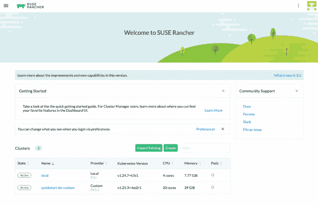
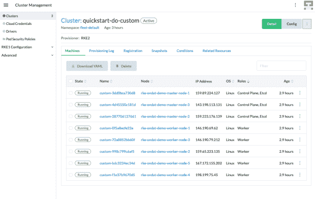

# 与 Ondat 和 SUSE Rancher 一起在 Kubernetes 上实现 Postgres

> 原文：<https://thenewstack.io/implement-postgres-on-kubernetes-with-ondat-and-suse-rancher/>

我们之前探讨了使用 SUSE Rancher 和 [Ondat 在](https://www.ondat.io/?utm_content=inline-mention) [Kubernetes](https://thenewstack.io/category/kubernetes/) 上运行公共云 DBaaS 的[挑战和运行自己的数据库即服务(DBaaS](https://www.ondat.io/blog/key-challenges-of-cloud-dbaas) )的[优势。现在，我们要将理论付诸实践。](https://www.ondat.io/blog/self-managed-dbass-with-ondat-rancher)

本文将带您一步步了解 Percona 的人员如何使用优秀的[操作符实现一个](https://www.percona.com/doc/kubernetes-operator-for-postgresql/index.html) [PostgreSQL DBaaS](https://thenewstack.io/6-things-for-developers-to-know-about-postgres/) 。我们将在 [DigitalOcean](https://www.digitalocean.com/) 上的[Rancher Kubernetes Engine(RKE)](https://www.suse.com/products/rancher-kubernetes-engine/)集群上部署它，但是这些指令应该适用于几乎所有的 [Kubernetes 发行版](https://thenewstack.io/constellation-the-first-confidential-kubernetes-distribution/)。

## 先决条件

本教程是在 macOS 和 Linux 工作站上编写和测试的，所以我们假设您使用的是其中一种。此外，您需要通过首选的软件包管理器在本地安装以下实用程序:

在本教程中，我们将使用 DigitalOcean 作为我们的云提供商，使用 Terraform 供应[droplets](https://www.digitalocean.com/products/droplets)，这些 droplet 将用作我们 RKE 工作负载集群的主节点和工作节点。如果你没有 DigitalOcean 账户，你可以注册一个，用 200 美元信用开始 60 天的[免费试用。](https://try.digitalocean.com/freetrialoffer/)

最后，我也推荐一种饮料来搭配本教程。我要喝茶，但你可以随意用你选择的饮料来代替。

一旦你满足了教程的先决条件，舒服地坐着，喝了一杯好酒，让我们开始吧！

## 步骤 1:在 DigitalOcean 上提供 SUSE Rancher 服务器和 RKE 集群

在我们继续之前，我们需要一个 RKE 集群。我们可以通过大量的手动键盘敲击来做到这一点，但这很乏味；相反，我们将使用 [Terraform](https://thenewstack.io/terraforms-best-practices-and-pitfalls/) 来自动化这个过程。我们已经创建了本教程所需的 Terraform 代码，所以让我们继续用下面的命令克隆它:

```
# Clone the repository.
git clone git@github.com:ondat/demos.git

# Navigate into the “do/” directory.
cd demos/rke-ondat/digitalocean/

```

*   此目录包含 Terraform 配置文件，这些文件将用于提供以下元素:
    *   Rancher 服务器的单节点 [K3s](https://www.suse.com/products/k3s/) 集群，
    *   以及一个具有三个主节点和五个工作节点的高可用性 RKE 集群。

*   还有一个给你的 Terraform 变量文件叫做`terraform.tfvars.example`。我们希望 Terraform 在我们供应资源时使用它，所以继续使用以下命令重命名它:

```
# Rename “terraform.tfvars.example”.
mv terraform.tfvars.example terraform.tfvars

```

*   接下来，插入您的数字海洋[个人访问令牌](https://docs.digitalocean.com/reference/api/create-personal-access-token/)并为 Rancher 设置一个密码。用您喜欢的文本编辑器打开文件，找到并设置以下值:

```
# DigitalOcean API token used to create infrastructure.
do_token  =  ""

# Admin password to use for Rancher server bootstrap.
rancher_server_admin_password  =  ""

```

*   一旦保存了`terraform.tfvars`文件，使用以下命令初始化 Terraform:

```
# Initialize the working directory containing the configuration files.
terraform init

```

*   该命令下载执行自动化所需的各种模块和提供程序。接下来，我们将验证我们的 Terraform 代码，然后创建一个计划。`terraform plan`命令允许我们预览 Terraform 在你应用它时会对你的平台做出的改变。使用以下命令根据 Terraform 代码验证并运行计划:

```
# Validate the configuration files in the working directory.
terraform validate

# Create an execution plan.
terraform plan

```

*   这将创建一个 Terraform 将在您`apply`它时创建的所有资源的列表，检查您对它将要做的事情是否满意是很重要的。审查完计划后，使用以下命令来应用它:

```
# Execute the actions proposed in a plan created earlier.
terraform apply  -auto-approve

```

*   这可能需要一些时间，所以这是一个很好的补充你选择的饮料的时机！资源调配完成后，您将看到类似于以下内容的输出:

```
Apply complete!  Resources:  21  added,  0  changed,  0  destroyed.

Outputs:

rancher_server_node_ip  =  "xxx.xxx.xxx.xxx"
rancher_server_url  =  "https://rancher.xxx.xxx.xxx.xxx.sslip.io"
rke_master_node_1_ip  =  "xxx.xxx.xxx.xxx"
rke_master_node_2_ip  =  "xxx.xxx.xxx.xxx"
rke_master_node_3_ip  =  "xxx.xxx.xxx.xxx"
rke_worker_node_1_ip  =  "xxx.xxx.xxx.xxx"
rke_worker_node_2_ip  =  "xxx.xxx.xxx.xxx"
rke_worker_node_3_ip  =  "xxx.xxx.xxx.xxx"
rke_worker_node_4_ip  =  "xxx.xxx.xxx.xxx"
rke_worker_node_5_ip  =  "xxx.xxx.xxx.xxx"

```

*   此时，你应该有一个完全正常工作的[牧场主](https://thenewstack.io/this-week-in-programming-ranchers-docker-desktop-replacement/)和 RKE 集群。继续进行测试，首先进入 Rancher UI。要访问它，复制并粘贴您的`terraform apply`中的值，名为`rancher_server_url`。这将打开牧场主登录页面。要登录，请使用用户名`admin`和您之前在`terraform.tfvars`文件中为`rancher_server_admin_password`设置的密码。



*   一旦您欣赏完 Rancher UI，您可以使用`kubectl`检查您的 RKE 集群是否也正常工作。然而，首先，您需要您的`kubeconfig`文件来确保`kubectl`知道与哪个集群交互。您可以使用以下命令将您的`kubeconfig`文件放到正确的位置:

```
# Copy the generated kubeconfig file
cp kube_config_workload.yaml  ~/.kube/config

```

*   现在，我们可以使用以下命令检查 RKE 集群中运行的节点和 pod:

```
# Inspect the nodes and pods.
kubectl get nodes
kubectl get pods  --all-namespaces

```

*   这应该会返回一个主节点和工作节点的列表以及一些核心系统单元。您可能会发现并非所有节点都显示出来；节点向 Rancher 服务器注册可能需要一些时间，所以如果您缺少一些，请稍后再来查看。

*   您还可以通过查看**“集群管理**选项卡，通过 Rancher UI 检查节点注册的状态。或者，周期性地执行`kubectl get nodes`，直到所有八个节点都处于`Ready`状态。



## 步骤 2:部署和配置 Ondat

要将 Ondat 安装到您新配置的 RKE 集群上，请在 [Ondat 的门户](https://portal.ondat.io/signup)上登录或创建一个帐户，这将生成正确的安装命令，并允许您注册您的集群以获得免费的[Ondat 社区版许可证](https://www.ondat.io/pricing)。

*   在 Ondat 门户 UI 仪表板**，**中，选择**在您的集群上安装 Ondat**选项。您将被重定向到**集群**选项卡，在**集群名称**文本框下，命名您的集群并为您的 Kubernetes 发行版选择**牧场主**选项。

*   您会注意到，在进入下一页之前，门户将显示需要应用的先决条件。确保满足先决条件，尤其是安装了[本地路径供应器](https://github.com/rancher/local-path-provisioner)实用程序，它用于在您的 RKE 集群中为 Ondat 的专用`etcd`集群提供存储。当您满足部署 Ondat 的先决条件时，单击**下一步**按钮继续下一步以获得安装命令。

*   下一页将为您提供`helm`命令，将 Ondat Helm chart 存储库添加到您的本地索引，更新存储库本地索引，然后将 Ondat 安装到您的 RKE 集群上。继续复制命令，将它们粘贴到您的终端，然后按 **Enter** 执行它们。

*   安装将需要几分钟时间。完成后，您可以使用以下命令来检查 Ondat 资源是否正在运行:

```
# Inspect Ondat resources that have been created.
kubectl get all  --namespace=storageos
kubectl get storageclasses storageos

```

*   这将返回 Ondat 已经安装到集群中的所有组件和资源的列表。

*   现在您已经有了一个 Ondat 集群，我们想要创建一个 Ondat `StorageClass`并为我们的集群设置默认的`StorageClass`。我们将使用[功能标签](https://docs.ondat.io/docs/concepts/labels/)来启用以下功能:

*   首先，使用标签创建自定义的`regions`。让我们使用以下命令创建它们:

```
# Label the worker nodes to define custom regions for the TAP feature.
kubectl label node rke-ondat-demo-worker-node-1  custom-region=1  
kubectl label node rke-ondat-demo-worker-node-2  custom-region=2
kubectl label node rke-ondat-demo-worker-node-3  custom-region=3
kubectl label node rke-ondat-demo-worker-node-4  custom-region=1
kubectl label node rke-ondat-demo-worker-node-5  custom-region=2

# Check that the worker nodes have been labeled successfully.
kubectl describe nodes  |  grep  --context=4  "custom-region"

```

*   接下来，创建一个新的 Ondat `StorageClass`。注意参数部分；这是我们设置一些关键配置的地方，例如副本的数量和我们的拓扑关键字:

```
# Create a customized Ondat StorageClass named “ondat-replication-encryption”.
kubectl create  --filename  -<<EOF 
apiVersion:  storage.k8s.io/v1
kind:  StorageClass
metadata:
  name:  ondat-replication-encryption
provisioner:  csi.storageos.com
allowVolumeExpansion:  true
parameters:
  csi.storage.k8s.io/fstype:  ext4
  storageos.com/replicas:  "2"
  storageos.com/encryption:  "true"
  storageos.com/topology-aware:  "true"
  storageos.com/topology-key:  "custom-region"
  csi.storage.k8s.io/secret-name:  storageos-api
  csi.storage.k8s.io/secret-namespace:  storageos
EOF

```

*   最后，我们将把我们的新 Ondat `StorageClass`设置为我们 RKE 集群中的缺省值。这确保了任何请求存储的 Kubernetes 工作负载在默认情况下都会获得一个 Ondat 卷:

```
# Unmark the “local-path” StorageClass from being the default StorageClass for the cluster first.
kubectl patch storageclass local-path  -p  '{"metadata": {"annotations":{"storageclass.kubernetes.io/is-default-class":"false"}}}'  

# Mark the “ondat-replication-encryption” StorageClass as the new default StorageClass for the cluster.
kubectl patch storageclass ondat-replication-encryption  -p  '{"metadata": {"annotations":{"storageclass.kubernetes.io/is-default-class":"true"}}}'

# Inspect the StorageClass and ensure it's now the default.
kubectl get storageclasses ondat-replication-encryption

```

## 步骤 3:为 PostgreSQL 操作符部署 Percona 的发行版

*   在**步骤 1** 和**步骤 2** 中，我们创建了一个 RKE 集群，然后安装并配置了 Ondat。现在，我们将使用 Percona 开发和维护的 PostgreSQL Kubernetes 操作符来创建 DBaaS 的服务部分。使用以下命令创建一个名称空间，并将操作员部署到其中:

```
# Create a namespace for the operator.
kubectl create namespace pgo

# Deploy the PostgreSQL operator.
kubectl  --namespace pgo apply  --filename https://raw.githubusercontent.com/percona/percona-postgresql-operator/main/deploy/operator.yaml

# Inspect that the pod's status is in a “Running” state.
kubectl get pods  --namespace=pgo

```

*   一旦操作符运行，您就可以用一些简单的 Kubernetes 本地 YAML 创建一个新的 PostgreSQL 数据库。您可以在 PostgreSQL GitHub repository 的 [Percona 操作符](https://github.com/percona/percona-postgresql-operator)中找到一些优秀的例子，我们也在本教程包含的代码中创建了一个例子。我们的示例将使用 PGBouncer 和 PGBadger 创建一个 PostgreSQL 集群。

*   运行以下命令来部署代码中包含的 PostgreSQL 集群:

```
# Deploy the database cluster.
kubectl  --namespace=pgo apply  --filename=../../workloads/percona-postgresql/cr.yaml

# Inspect that the resources have been successfully created in the “pgo” namespace.
kubectl get pods  --namespace=pgo

```

*   现在，您可以随意创建 PostgreSQL 数据库，或者让开发人员能够使用这个操作符将 PostgreSQL 数据库与部署到 Kubernetes 集群中的应用程序包含在一起。

## 步骤 4:探索 Ondat 的复制和数据加密特性

*   *   *   为了使与 Ondat 集群的交互更容易，首先将 Ondat CLI 部署到 RKE 集群中。使用以下命令部署它:

```
kubectl create  --filename  -<<EOF
apiVersion:  apps/v1
kind:  Deployment
metadata:
  labels:
 app:  storageos-cli
 app.kubernetes.io/component:  storageos-cli
 app.kubernetes.io/part-of:  storageos
 kind:  storageos
  name:  storageos-cli
  namespace:  storageos
spec:
  replicas:  1
  selector:
 matchLabels:
 app:  storageos-cli
  template:
 metadata:
 labels:
 app:  storageos-cli
 spec:
 containers:
 -  command:
 -  /bin/sh
 -  -c
 -  while true;  do sleep  3600;  done
 env:
 -  name:  STORAGEOS_USERNAME
 valueFrom:
 secretKeyRef:
 name:  storageos-api
 key:  username
 optional:  false
 -  name:  STORAGEOS_PASSWORD
 valueFrom:
 secretKeyRef:
 name:  storageos-api
 key:  password
 optional:  false
 -  name:  STORAGEOS_ENDPOINTS
 value:  storageos:5705
 image:  storageos/cli:v2.9.0
 imagePullPolicy:  Always
 name:  cli
 ports:
 -  containerPort:  5705
 resources:
 limits:
 cpu:  100m
 memory:  128Mi
 requests:
 cpu:  50m
 memory:  32Mi
 securityContext:
 allowPrivilegeEscalation:  false
 readOnlyRootFilesystem:  true
EOF

```

*   *   *   要使用 CLI，我们需要找到 CLI pod 的名称。使用以下命令获取它:

```
# Get the Ondat CLI pod name 
kubectl get pods  --namespace storageos  |  grep  "storageos-cli"

```

*   *   *   在这一节中，我们将大量使用 CLI，所以请将 pod 名称复制到您可以轻松找到的地方。

### Ondat 持久复制

当您在步骤 3 中创建数据库时，它从集群中的默认`StorageClass`请求存储—由于我们在步骤 2 中执行的步骤，默认为自定义`ondat-replication-encryption` `StorageClass`。因此，如果您在示例中使用默认配置，Ondat 会自动为数据库操作员请求的每个卷创建两个副本卷。

*   *   *   您可以通过运行以下命令来查看创建的卷:

```
# Get the volumes in the “pgo” namespace.
kubectl  --namespace=storageos exec storageos-cli-899d4d47-hxqdr  --  storageos get volumes  --namespace=pgo

```

*   *   *   您应该会得到类似如下的输出:

```
NAMESPACE  NAME                                      SIZE LOCATION ATTACHED ON REPLICAS  AGE
pgo        pvc-2115e4dc-7c06-4ab6-8d63-7e83b13bfa3b  1.0  GiB  rke-ondat-demo-worker-node-4  (online)  rke-ondat-demo-worker-node-4  2/2 1  hour ago
pgo        pvc-8d4f5388-cb88-4f8a-9ebd-ac421301a807  1.0  GiB  rke-ondat-demo-worker-node-5  (online)  rke-ondat-demo-worker-node-5  2/2 1  hour ago
pgo        pvc-1e2c0153-1470-4f56-9801-b28461e38092  1.0  GiB  rke-ondat-demo-worker-node-1  (online)  rke-ondat-demo-worker-node-1  2/2 1  hour ago
pgo        pvc-cf869899-8660-49af-bc52-d1d5c490f1d1  1.0  GiB  rke-ondat-demo-worker-node-3  (online)  rke-ondat-demo-worker-node-3  2/2 1  hour ago

```

*   *   *   复制第一卷的名称；在我们的例子中是`pvc-2115e4dc-7c06-4ab6-8d63-7e83b13bfa3b`。现在，使用 Ondat CLI 通过以下命令检查该卷:

```
# Describe the volume.
kubectl  --namespace=storageos exec storageos-cli-899d4d47-hxqdr  --  storageos describe volume pvc-2115e4dc-7c06-4ab6-8d63-7e83b13bfa3b  --namespace=pgo

```

*   *   *   这将为您提供有关卷的大量信息，包括副本卷的数量和位置。输出将如下所示:

```
Master:
  ID                7afa9ef5-d5ed-4cdd-a58d-947703fd2c80
  Node              rke-ondat-demo-worker-node-4  (685ad0b4-8db7-42c2-923e-dcca2722743b)
  Health            online
  Topology Domain 1

Replicas:
  ID                a80362f1-a410-4d8c-a963-3399f3ac93bf
  Node              rke-ondat-demo-worker-node-5  (410d90d9-836f-44b7-9e78-3a4f60babe01)
  Health            ready
  Promotable        true
  Topology Domain 2

  ID                dc3c8ec1-de9a-45ff-ab5a-319875189654
  Node              rke-ondat-demo-worker-node-3  (84cba793-1a54-40f6-b7e9-b4e6dd0db9d9)
  Health            ready
  Promotable        true
  Topology Domain 3

```

*   *   *   此输出告诉您，每个卷副本都部署在不同的节点上，以确保在某个节点出现短暂故障时的数据保护和高可用性。这演示了 Ondat 如何确保数据被复制以避免任何单点故障。现在，我们的数据被很好地复制了，我们的数据库也运行良好，让我们试着破解它。故障很少是细微的，所以让我们扩大规模，删除主卷所在的 Kubernetes 节点。
    *   *   使用我们的卷描述的输出，我们可以看到主卷位于哪个节点上；在我们这里，`rke-ondat-demo-worker-node-4`。现在我们已经找到了我们的主卷，我们将使用以下命令带着极大的偏见终止它上面的节点:

```
# delete the node with a master volume.
kubectl delete node/rke-ondat-demo-worker-node-4

```

*   *   *   当`rke-ondat-demo-worker-node-4`脱机时，Ondat 会自动检测到主卷不再存在，并选择两个副本卷中的一个作为新的主卷。它还将在不同的节点上创建一个新的副本，以保持在所创建的`StorageClass`的`ondat-replication-encryption`配置中指定的已定义副本卷数。
    *   *   运行以下命令，查看 Ondat 如何管理故障:

```
# Get the volumes in the `pgo` namespace.
kubectl  --namespace=storageos exec storageos-cli-899d4d47-hxqdr  --  storageos get volumes  --namespace=pgo

```

*   *   *   您应该会看到类似如下的输出:

```
NAMESPACE  NAME                                      SIZE LOCATION ATTACHED ON REPLICAS  AGE
pgo        pvc-2115e4dc-7c06-4ab6-8d63-7e83b13bfa3b  1.0  GiB  rke-ondat-demo-worker-node-3  (online)  rke-ondat-demo-worker-node-5  2/2 1  hour ago
pgo        pvc-8d4f5388-cb88-4f8a-9ebd-ac421301a807  1.0  GiB  rke-ondat-demo-worker-node-5  (online)  rke-ondat-demo-worker-node-5  2/2 1  hour ago
pgo        pvc-1e2c0153-1470-4f56-9801-b28461e38092  1.0  GiB  rke-ondat-demo-worker-node-1  (online)  rke-ondat-demo-worker-node-1  2/2 1  hour ago
pgo        pvc-cf869899-8660-49af-bc52-d1d5c490f1d1  1.0  GiB  rke-ondat-demo-worker-node-3  (online)  rke-ondat-demo-worker-node-3  2/2 1  hour ago

```

*   *   *   我们有相同数量的卷，具有完全相同的名称，但主要区别是您将看到`pvc-2115e4dc-7c06-4ab6-8d63-7e83b13bfa3b`的位置现在基于不同的节点。为了进一步研究，让我们使用 Ondat CLI 描述前面的同一个卷:

```
# Describe the same volume again.
kubectl  --namespace=storageos exec storageos-cli-899d4d47-hxqdr  --  storageos describe volume pvc-2115e4dc-7c06-4ab6-8d63-7e83b13bfa3b  --namespace=pgo

```

*   *   *   我们将在输出中看到以下内容:

```
Master:
  ID                dc3c8ec1-de9a-45ff-ab5a-319875189654
  Node              rke-ondat-demo-worker-node-3  (84cba793-1a54-40f6-b7e9-b4e6dd0db9d9)
  Health            online
  Topology Domain 3

Replicas:
  ID                a80362f1-a410-4d8c-a963-3399f3ac93bf
  Node              rke-ondat-demo-worker-node-5  (410d90d9-836f-44b7-9e78-3a4f60babe01)
  Health            ready
  Promotable        true
  Topology Domain 2

  ID                ebe46d45-72f2-41ee-8b30-f48b2aa62778
  Node              rke-ondat-demo-worker-node-1  (c15320f6-2948-4a79-9599-4f06d7472f80)
  Health            ready
  Promotable        true
  Topology Domain 1

```

*   *   *   您可以看到，Ondat 自动选择节点`rke-ondat-demo-worker-node-3`上的副本卷作为主卷，因为节点`rke-ondat-demo-worker-node-4`不再存在于我们的集群中，并且在节点`rke-ondat-demo-worker-node-1`上创建了一个新的副本卷，以确保定义的副本卷数量一致。

### Ondat 的静态加密

除了使用 [Mutual TLS (mTLS)身份验证确保传输中的现成数据加密之外，](https://en.wikipedia.org/wiki/Mutual_authentication) Ondat 还能够为卷提供[加密静态数据](https://www.ondat.io/blog/storageos-kubernetes-encryption-at-rest)的能力。这对于任何自我管理的 DBaaS 来说都是必不可少的，因为它确保了数据的安全，而无需相信应用程序本身正在加密数据库中保存的数据。

*   *   *   通过向 Ondat `StorageClass`参数添加一个名为`storageos.com/encryption=true`的特性标签，可以默认为所有卷启用静态加密，或者使用应用程序的`PersistentVolumeClaim`清单为每个卷启用静态加密。这为集群运营商提供了灵活性，根据平台的需求，可以保留默认的数据加密，也可以让应用程序来决定。
    *   *   为了验证静态数据加密是否按预期工作，我们将尝试访问加密卷上的一些数据，以检查它是否被加密。首先，我们将使用以下命令来查找我们的 Ondat 加密卷之一`cluster1-repl1`位于哪个节点:

```
# Get the node location where “cluster1-repl1” pod is running.
kubectl get pods  --namespace=pgo  --output=wide  |  grep  "cluster1-repl1"

```

*   *   *   这为我们提供了以下信息，表明该卷位于节点上:

```
`rke-ondat-demo-worker-node-1`:

cluster1-repl1-574bdbf868-95lch                  1/1 Running 0          140m    10.42.1.10 rke-ondat-demo-worker-node-1 <none> <none>

```

*   *   *   接下来，使用 [`strings`](https://man7.org/linux/man-pages/man1/strings.1.html) 实用程序在该节点上运行特权容器，让我们能够尝试从位于该节点上的卷中读取数据。使用以下命令运行 pod 并安装实用程序:

```
# Use “kubectl debug” to temporarily run a privileged container on a node `rke-ondat-demo-worker-node-1`.
kubectl debug node/rke-ondat-demo-worker-node-1  -it  --image=ubuntu:latest

# install “binutils” in the container to access the “strings” utility.
apt update  &&  apt install  --yes binutils

```

*   *   *   现在，我们可以使用这个 pod 来尝试从底层节点读取数据。因为它有特权，所以它应该有从节点读取数据的完全权限，通常，这是从运行在该节点上的 pod 读取数据的可靠方法。
    *   *   运行以下命令，尝试访问作为 blob 文件存储在`/var/lib/storageos/data/`目录下的节点上的`cluster1-repl1`部署数据:

```
# Navigate to where data is being stored as blob files on the node and list the files.
cd  /host/var/lib/storageos/data/dev1/
ls  -lah

total  1.6G
drwxr-xr-x  2  root root  4.0K  Oct  14  18:13  .
drwxr-xr-x  4  root root  4.0K  Oct  14  18:13  ..
-rw-------  1  root root  31M  Oct  14  18:19  deployment.1aa18fce-6da2-4346-8dc6-4a7fdd4480f0.0.blob
-rw-------  1  root root  31M  Oct  14  18:19  deployment.1aa18fce-6da2-4346-8dc6-4a7fdd4480f0.1.blob
-rw-------  1  root root  90M  Oct  14  18:23  deployment.28da746d-1cb6-4775-a1e9-fa2b8d7c0809.0.blob
-rw-------  1  root root  90M  Oct  14  18:23  deployment.28da746d-1cb6-4775-a1e9-fa2b8d7c0809.1.blob
-rw-------  1  root root  90M  Oct  14  18:56  deployment.a74344a4-65e3-45b2-b2b7-d7eafe11dc1d.0.blob
-rw-------  1  root root  90M  Oct  14  18:56  deployment.a74344a4-65e3-45b2-b2b7-d7eafe11dc1d.1.blob
-rw-------  1  root root  98M  Oct  14  18:25  deployment.ebe46d45-72f2-41ee-8b30-f48b2aa62778.0.blob
-rw-------  1  root root  98M  Oct  14  18:25  deployment.ebe46d45-72f2-41ee-8b30-f48b2aa62778.1.blob

# Use the “strings” utility to attempt to read the data in the blob files.
# The output of the command will return multiple strings of random, unreadable characters.
strings deployment.*  |  head  -10

B*hJ
"G7+
BiCM
m}Q]
8|nk
k?>JS
`  :>.
Ndz[
Tawg
r`pJ

# Exit from the container.
exit

```

如上面的测试所示，您可以看到，尽管我们拥有对底层节点的特权访问，但我们无法从 Ondat 卷中读取任何数据，因为它是加密的。从[黑帽](https://en.wikipedia.org/wiki/Black_hat_(computer_security))或[白帽](https://en.wikipedia.org/wiki/White_hat_(computer_security))的角度来看，攻击者将无法读取数据，即使他们获得了运行我们创建的 DBaaS 的节点的访问权限。由于 Ondat 的本机静态数据加密，他们无法在没有加密密钥的情况下解密卷数据。

## 结论和整理

这就到了用 RKE 和 Ondat 创建 DBaaS 的教程的结尾。

在你离开我们去给你的茶、咖啡或其他美味饮料加满之前，请按照这些指示来拆除本教程中使用的资源。DigitalOcean 的价格很优惠，但是如果您已经完成了，那么最好不要让您的集群运行而增加费用。在 Terraform 配置文件的当前目录中使用以下命令删除本教程中创建的资源:

```
# Delete the database cluster.
kubectl  --namespace pgo delete  --filename=../../workloads/percona-postgresql/cr.yaml
# Delete the PostgreSQL operator. 
kubectl  --namespace pgo delete  --filename https://raw.githubusercontent.com/percona/percona-postgresql-operator/main/deploy/operator.yaml

# Delete the “ngo” namespace. 
kubectl delete namespace pgo  

# Delete the “storageos-cli” deployment. 
kubectl delete deployment storageos-cli  --namespace storageos  

# Remove Ondat from the cluster.
helm uninstall ondat  --namespace storageos

# Delete the local path provisioner.
kubectl delete  --filename https://raw.githubusercontent.com/rancher/local-path-provisioner/v0.0.21/deploy/local-path-storage.yaml

# Destroy the environment created by Terraform
terraform destroy  -auto-approve

```

请随时[联系](https://www.ondat.io/request-demo)了解更多关于 Ondat 的信息。我们期待着发布未来的教程，概述 Ondat 如何能够使您的 Kubernetes 策略受益。

<svg xmlns:xlink="http://www.w3.org/1999/xlink" viewBox="0 0 68 31" version="1.1"><title>Group</title> <desc>Created with Sketch.</desc></svg>