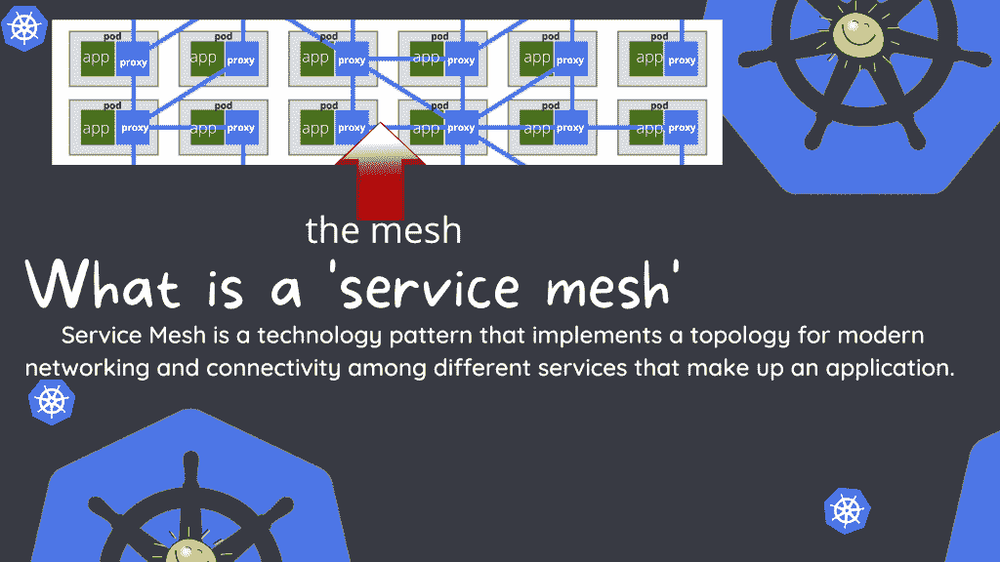
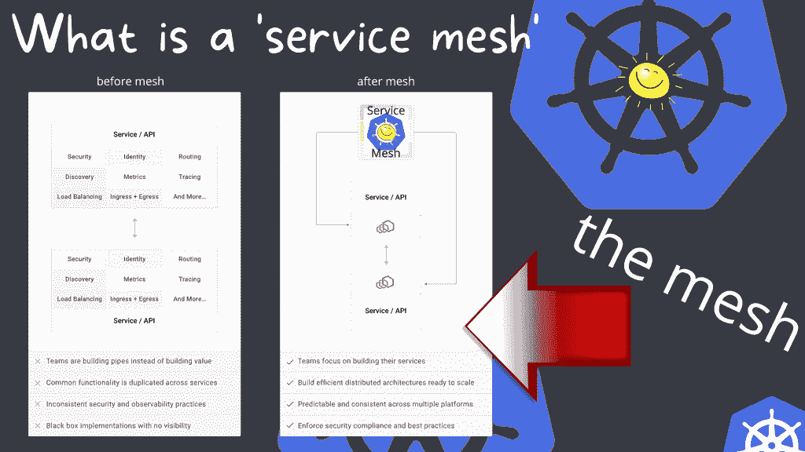

# 实现安全的服务网格

> 原文：<https://thenewstack.io/implementing-a-secure-service-mesh/>

 [乔纳森·凯利

乔纳森已经做了 14 年的技术专家，其中一半时间专注于 DevOps。他目前是 LogDNA 的一名站点可靠性工程师，贡献了他在 Linux、Kubernetes、网络和云基础设施方面的专业知识。](https://www.linkedin.com/in/jonathandkelley/) 

我目前正致力于将我们所有的工作负载整合到一个服务网格中。

服务网格是位于所有集群中每个单元之间的网络层。我们可以使用 mesh 及其相关工具将一系列 pod 注册到离散定义的安全网络数据平面中。

为了这篇博文的目的，我将谈论库马。库马是构建在 Envoy 之上的开源解决方案，充当微服务和服务网格的控制平面。它可以与 Kubernetes 和虚拟机(VM)一起工作，并且可以在一个集群中支持多个网格。

还有其他开源和托管服务网格选项，如 [Istio](https://istio.io/) 、 [Linkerd](https://linkerd.io/) 和 [Kong Mesh](https://konghq.com/kong-mesh/?utm_source=google&utm_medium=cpc&utm_campaign=) 。

## 为什么要使用服务网格

我们使用服务网格的主要目标之一是在内部 pod 服务之间获得相互传输层安全性(mTLS ),以确保安全性。然而，使用服务网格提供了许多其他好处，因为它允许工作负载在多个 Kubernetes 集群之间进行通信，或者运行连接到 Kubernetes 的 100%裸机应用程序。它提供跟踪、记录 pod 之间的连接，并且可以向 Prometheus 输出连接端点健康指标。

此图显示了在实现服务网格之前工作负载的情况。在左边的例子中，团队花时间构建管道，而不是构建产品或服务，公共功能在服务之间重复，存在不一致的安全性和可观察性实践，并且存在不可见的黑盒实现。

在右边，在实现服务网格之后，同一个团队可以专注于构建产品和服务。他们能够构建可随时扩展的高效分布式体系结构，可观察性在多个平台之间保持一致，并且更容易实施安全性和合规性最佳实践。

## 库马服务网状架构如何工作

将应用程序 pod 的套接字通信从纯文本转换到 mTLS 的魔力在于库马控制平面、边车和库马容器网络接口(CNI)。当开发人员合并一些更改，向应用程序添加新服务时，库马会透明地检测所需的位，并将其自动注入通过其自己的网络数据平面的代理流量。

库马服务网有三个主要组成部分:

*   **库马·CNI**:一个 CNI 插件，基于注释识别带有侧柜的用户应用程序，以设置流量重定向。它在 pod 生命周期的网络设置阶段进行设置，当时每个 pod 都通过一个称为变异 webhooks 的过程在 Kubernetes 中进行调度。
*   **库马-sidecar:** 它在每个公开服务的实例上运行。服务将所有连接性和可观察性问题委托给进程外运行时，该运行时将位于每个请求的执行路径上。它将代理所有传出的连接并接受所有传入的连接。当然，它将在运行时执行流量策略，如路由或日志记录。通过使用这种方法，开发人员不必担心加密连接，可以完全专注于他们的服务和应用程序。它被称为 sidecar 代理，因为它是在同一个 pod 上与服务流程并行运行的另一个容器。每个正在运行的服务实例都有一个 sidecar 代理实例，因为所有传入和传出的请求及其数据总是通过 sidecar 代理，这也称为库马数据平面(DP ),因为它位于网络数据路径上。
*   **库马控制平面(kuma-cp)** :这是一个用 GoLang 编写的分布式可执行文件，可以在 Kubernetes 上运行，发布数据平面证书，并在 Kubernetes API 内协调数据平面(DP)状态。您可以使用库马自定义资源定义(CRD)来配置库马设置和策略，sidecars 会自动从控制平面获取更改。

## 结论

今天的服务网状拓扑很像 20 世纪 90 年代和 21 世纪初的企业服务总线(ESB)架构。与 ESB 体系结构根据业务策略来引导代理流量不同，使用网格，您现在可以自由地连接您的应用程序，网格从顶层管理路由和策略。

在我看来，ESB 架构在行业中不太流行的最大原因是因为它必须使其成为可能的单片代码库需求，以及您经常遇到的终极依赖管理问题。您将有几十个项目共享用于管理 ESB 上的对象的依赖关系，这成为软件管理的一个难题。

服务网格技术通过保持与代码的分离来减轻痛苦。它允许开发人员将安全性、可靠性和可观察性的复杂性从他们的应用程序堆栈中转移出来，并将其单独作为基础设施等式的一部分。

<svg xmlns:xlink="http://www.w3.org/1999/xlink" viewBox="0 0 68 31" version="1.1"><title>Group</title> <desc>Created with Sketch.</desc></svg>