# 使用 Kubernetes 实现高级调度技术

> 原文：<https://thenewstack.io/implementing-advanced-scheduling-techniques-with-kubernetes/>

使用像 Kubernetes 这样的高级容器编排工具的优势之一是灵活的调度程序。这为用户提供了广泛的选项来指定将 pod 分配给满足条件的特定工作者节点的条件，而不仅仅是基于节点的可用资源。为了解释 Kubernetes 如何决定将 pod 放置在正确的主机上，我们可以查看以下 Kubernetes 主机及其一些组件的简化图:

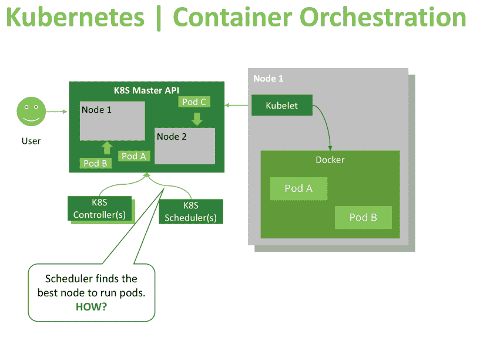

 [Oleg Chunikhin，Kublr 首席技术官

Oleg Chunikhin 已经在软件架构和开发领域工作了近 20 年。奥列格于 2016 年加入 Kublr 担任 CTO。Oleg 在公司的所有工作中都支持 DevOps 的标准化，并且是推动自动化和人工智能应用采用的坚定信徒。Oleg 拥有新西伯利亚州立大学的数学学士学位以及应用数学和计算机科学硕士学位，并且是 AWS 认证的软件架构师。](https://kublr.com/) 

主 API (kube-apiserver)是一种工具，它提供对集群的期望状态和当前状态的读/写访问。像调度程序这样的组件可以使用主 API 来检索当前状态信息，应用一些逻辑和计算，并使用关于所需状态的新信息来更新 API(例如指定新 pod 将被调度到哪个节点，或者哪个 pod 应该被移动到另一个节点)。此外，集群用户和管理员可以更新集群状态或通过 Kubernetes 仪表板查看集群状态，这是一个提供 API 访问的 UI。CI/CD 管道还可以使用 API 创建新资源或修改现有资源。

API 的其他重要消费者是名为“kubelets”的节点代理，它们管理工作节点上的容器运行时(通常是 Docker)。当 Kubelet 识别出报告的期望状态和其主机的实际状态之间的差异时，它将运行或终止所需的容器，以达到主 API 描述的目标状态。Kubelets 经常查询 API，或者观察它们的变化，这就是为什么 Kubernetes 对更新和变化的响应几乎是即时的(几秒钟的事情)。

正如我们所看到的，Kubernetes 使用控制器模式来维护和更新集群状态，调度器控制器单独负责 pod 调度决策。调度程序不断地监视 Kubernetes API 中未计划的 pod，当发现这样的 pod 时，就决定应该在哪个节点上调度/放置这些 pod。

调度程序决定启动一个新的 pod 要经过以下三个阶段:

*   节点过滤
*   节点优先级计算
*   实际调度操作

在第一阶段，调度程序将检查哪些节点适合运行此工作负载。它通过一组过滤器来运行所有节点，并删除那些不兼容的节点。使用以下过滤器:

## 音量过滤器

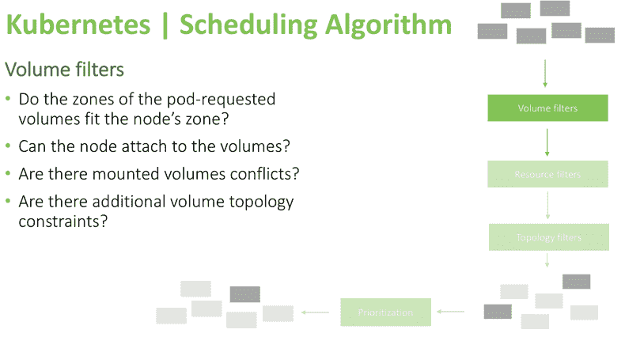

使用这些检查，调度程序可以提前知道哪些节点不能运行 pod，因此它会将这些节点从可能的目标列表中删除。例如，pod 所需的数据量是否与节点位于同一可用性区域？能否在不与基础云提供商规则相冲突的情况下附加它？(例如，在 AWS 中，不可能将一个 EBS 卷从一个可用性区域附加到另一个区域中的节点)。此外，需要满足在卷定义期间指定的卷拓扑约束(由 pod 请求的卷可能具有“节点关联性”约束，该约束仅允许它连接到一组特定的节点，或者明确禁止它连接到某些节点)。

## 接下来是资源过滤器:

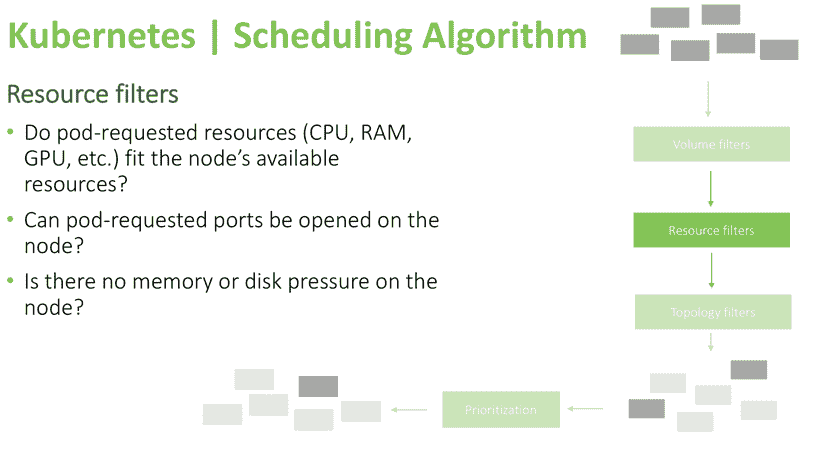

上面的这些过滤器非常简单。调度程序将检查 pod 请求的资源是否可用，确保节点上没有压力，如内存或磁盘空间不足，并确认请求的端口是否可以在节点上打开。例如，如果 pod 指定它需要绑定到主机端口 8080，但是具有类似要求的另一个 pod 已经占用了工作节点上的该端口，则该节点将被排除在考虑范围之外，并且不会成为运行该 pod 的候选节点。

## 最后一组过滤器是关联性选择器:

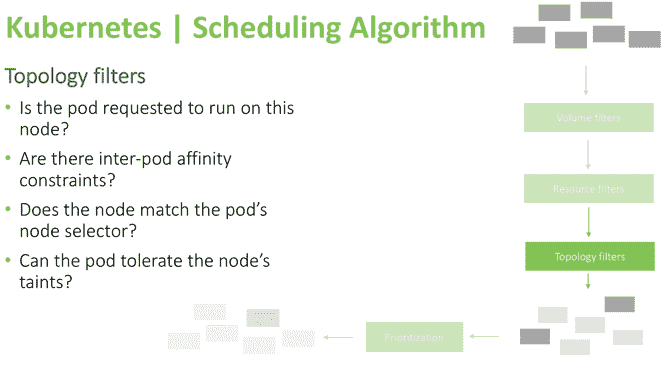

在本例中，您可以看到调度程序验证 pod 是否明确声明它需要在特定节点上运行，或者它是否指定了 pod-affinity(如果它需要仅在一些其他 pod 存在时运行，或者避免在具有特定 pod 的同一节点上运行)。此外，该过滤器检查 pod 是否能够容忍节点的污点和节点条件，如 dedicated _ GPU/maintenance/staging _ only(自定义用户定义污点的一个示例)，或者内存压力/不可达/磁盘压力(系统应用污点的一个示例)。容差是在 pod 定义中指定的，允许在具有某些特定污点的节点上调度 pod。换句话说，所有其他的 pod 将被拒绝在一个节点上调度或执行，除了那些明确声明允许它们在那里运行的 pod。你可以在这里阅读更多关于污点和宽容的内容。这些是微调 Kubernetes 调度行为的重要机制。

完成这些过滤步骤后，有可能找不到该 pod 的可用节点。在这种情况下，该 pod 将保持未调度状态，并将反映在仪表板中，包括运行该 pod 失败的原因(例如，“未找到满足这些 pod 约束的节点”或“没有足够的内存来调度该 pod”)。如果筛选阶段留给您几个可供选择的节点，调度程序将根据以下参数运行优先级检查:

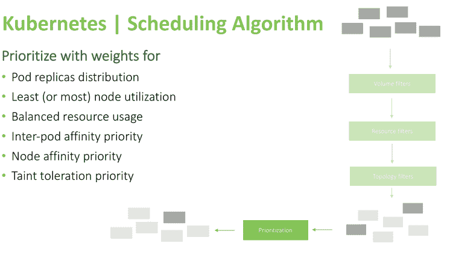

检查完成后，调度程序会计算每个节点的得分，得分最高的节点将运行该 pod。

以下是在 pod 定义期间控制 pod 放置的方法列表，按复杂程度排序，从基本资源要求到高级方法，如使用自定义调度控制器:

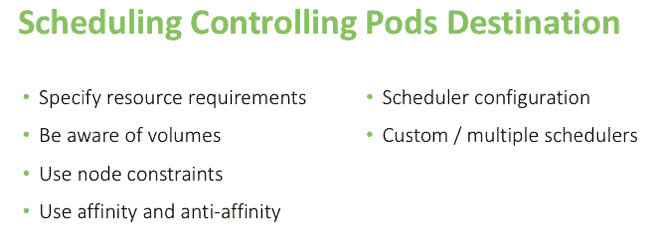

帮助调度程序做出正确决策的第一个基本方法是设置内存/CPU 请求和限制。在调度阶段使用请求，当 pod 已经运行时使用限制(限制决定 pod QOS 级别。你可以在我们的深度文章中阅读更多关于[集群再平衡机制和 pod 驱逐的内容。](https://kublr.com/blog/learn-how-kubelet-eviction-policies-impact-cluster-rebalancing/)

遵循以下基本规则，我们可以避免卷兼容性问题:

*   确保请求的卷与所需的节点位于同一个可用性区域。例如，当您在区域“A”中有一组要运行 pod 的节点，而在区域“B”中有一个需要使用相同 pod 的卷时，首先请确保将这些卷克隆到所需节点所在的正确区域，或者在该特殊卷所在的区域中增加一些新节点，以便它可以连接到这些节点。
*   确保节点没有达到其卷限制(例如，在 Azure cloud 中，可以附加的卷数量是有限制的)。
*   不要指定已经连接到单独节点的卷。如果一个 pod 需要几个卷，但这些卷已经专门连接到另一台主机，则该 pod 将无法运行，因为无法满足同时装载两个卷的条件。
*   通过指定可以或不可以连接卷的节点列表，使用卷拓扑约束。

此外，我们有几个可用的约束选项，应该在 pod 定义中指定:

*   直接设置该 pod 应该运行的节点名。
*   使用 nodeSelector 指定节点应该拥有的标签，以便能够运行 pod。
*   污点(在节点上)和容忍(在 pod 上)——如上所述，污点是节点状况的指示器；没有 pods 将被安排在一个被污染的节点上，除非他们为那种类型的污染指定“容忍”。一个节点可以有多个污点，一个 pod 可以有多个容差。

### 下图说明了污点类型和容差定义示例:

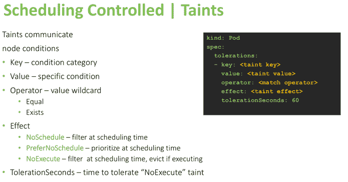

下一个约束机制是可以在 pod 定义中设置的相似性首选项。Affinity 目前有两个范围，并且是一个仍在开发中的特性。现在只有调度阶段亲缘关系可用，如下图所示:

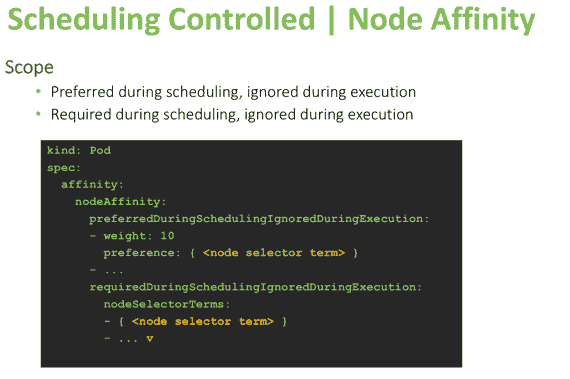

当您使用“计划期间首选”选项时，Kubernetes 将尽最大努力按照该设置来计划 pod。如果使用“在调度期间需要”，它将强制该条件，并且除非满足该条件，否则不会在节点上运行 pod。

有几种不同的方法可以为要运行的节点指定 pod 首选项。许多人都熟悉一个简单的首选项是“节点选择器”(直接指定特定的标签)，它将导致只在具有确切标签值的节点上调度 pod。指定节点首选项的另一种方法是使用带有“节点选择器术语”的节点关联，这允许使用类似下图底部所示的操作符。这允许用户指定一组灵活的规则，基于这些规则将做出安排或避免安排的决定。

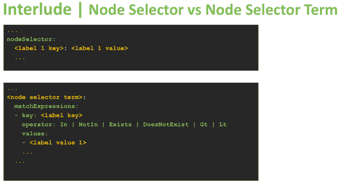

与节点选择器的严格标签匹配不同，在相似性规则的节点选择器术语中可以使用更灵活的匹配表达式。匹配表达式运算符可用于将标签值与可能的变量列表进行比较(“In”运算符)，或者检查标签值是否为指定列表中的值之一(“NotIn”)。此外，它们可以确定标签在节点上是否存在，而不考虑其值。最后，他们可以使用运算符“Gt”(大于)和“Lt”(小于)来比较标签的数值。下面是节点关联性规则的另一个示例:

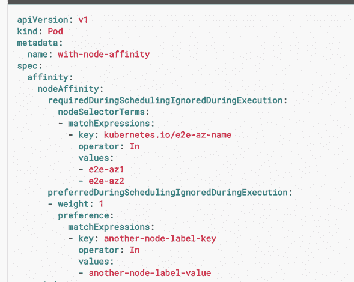

您可以看到，这组规则要求一个节点具有标签“库伯内特斯. io/e2e-az-name”，并带有一个指示可用性区域为“e2e-az1”或“e2e-az2”的值这些规则还优选具有自定义标签“another-node-label-key”的节点，该标签的值为“another-node-label-value”，这意味着如果存在满足这两个约束的节点，则该节点将是运行该 pod 的最优选候选节点。

除了节点关联性设置之外，还有 pod 间关联性和反关联性设置，定义如下:

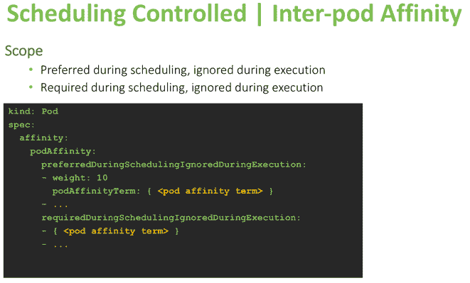

使用这些规则，您可以控制窗格的并排放置。一些 pod 可能接受与其他类型的 pod 共处一地，而其他 pod 可能需要避免与特定类型的 pod 放置在同一台机器上(如 CPU 密集型 pod，这将导致 Kubernetes 可能在同一节点上调度的任务关键型工作负载的性能下降)。

以下是 pod 间关联性规则的一个示例:

*   pod“B”必须在一个节点上运行，以便在该节点上安排 pod“A”。
*   首选运行 pod“B”的节点，否则，在任何节点上运行。

尽管该示例显示了 pod 间反关联性规则:

*   如果 pod“B”正在该节点上运行，请不要计划
*   更喜欢 pod“B”没有破坏的节点，否则在任何节点上运行。

下面是另一个引入 topologyKey 的示例，它是一个标签选择器，将该标签键定义为“协同定位指示器”为了在集群中均匀地分布 pod，调度程序将尝试在这些节点上选择具有不同拓扑关键字标签值的节点。为了“尽可能紧密地堆叠 pod”(这种调度偏好也存在，并在下一步中描述)，它可以再次基于该拓扑关键字标签做出决定，这一次优选具有相同标签值的节点。

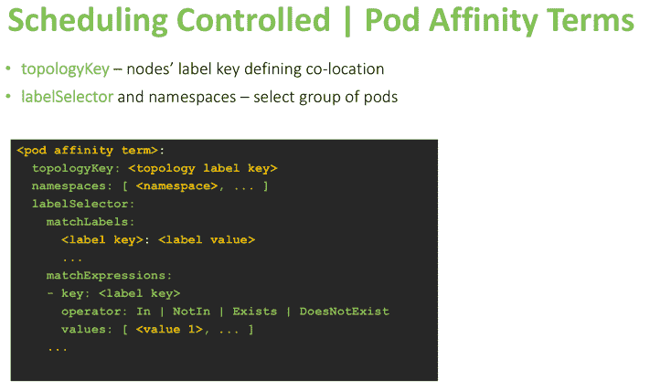

除了上述方法之外，还有其他方法可以修改 Kubernetes 调度程序的行为，比如使用传递给“kube-scheduler”组件(它是运行在主节点上的 Kubernetes 的主组件之一)的标志来设置不同的调度算法。“–algorithm-provider”标志的两个可用选项是:“DefaultProvider”和“ClusterAutoscalerProvider”“DefaultProvider”尝试将 pod 分布在整个集群中，以均衡所有节点的负载。“ClusterAutoscalerProvider”将尝试在每个节点上堆叠最多的 pod，以便更好地利用资源(通常在底层工作节点根据消耗的资源(如 CPU 和内存)自动扩展时使用)。

除了算法提供程序修改之外，还可以使用配置图或文件中定义的策略，使用以下标志提供您自己的调度“逻辑”:

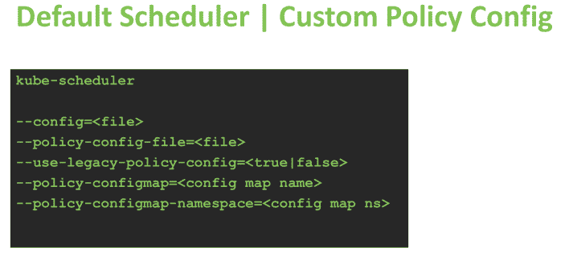

这允许您将定制的策略传递给调度程序，这是一个非常高级的特性，只在 GitHub 上有文档记录(甚至在 Kubernetes 网站的官方文档中也没有)。但是，如果您想深入研究 Kubernetes，您可以在 GitHub 上的链接页面上找到更多信息，并在这里阅读示例策略文件。该策略的每个可用参数决定了算法的流程和规则，从而决定应该将 pod 放置在哪里。本文档对此进行了描述。为了将您的策略放入文件中，请指定“–use-legacy-policy-config = true”+“–policy-config-file。”否则，使用配置映射和配置映射命名空间标志来指定要用作策略的目标配置映射。

定制调度的另一种方法是使用自己的调度程序，可以用任何语言编写。您需要做的就是使用 API，如下面的基本示例所示:

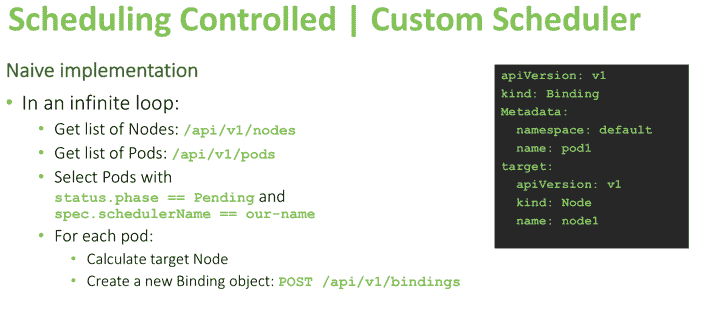

在上面的示例中，自定义调度程序需要通过指定的 API 获取节点和 pod，然后选择带有“phase=Pending”和“scheduler name = your-scheduler-name”的 pod。在计算出需要放置每个 pod 的位置后，调度程序将创建一个绑定对象(为了计算最适合的目标节点，您可以使用 pod 定义和节点定义中的所有信息，如注释、标签、Docker 图像名称、卷或任何有助于根据您的要求确定 pod 的正确位置的信息)。

为了更好地实现自定义调度程序，您应该监视节点并缓存信息以加快计算速度。一个好的起点是派生当前的调度程序，因为它为定制额外的逻辑和功能提供了一个好的起点。

我们希望这篇文章对你有用，欢迎在下面的评论中提问。我们的工程师将非常乐意为不太明显的主题提供更多信息，如定制调度策略或定制调度器实现。

*有关 Kubelet 和其他 Kubernetes 主题的更多信息，请了解 2018 年 5 月 2 日至 4 日在丹麦哥本哈根举行的 [KubeCon + CloudNativeCon EU](https://events.linuxfoundation.org/events/kubecon-cloudnativecon-europe-2018/attend/register/) 。*

<svg xmlns:xlink="http://www.w3.org/1999/xlink" viewBox="0 0 68 31" version="1.1"><title>Group</title> <desc>Created with Sketch.</desc></svg>