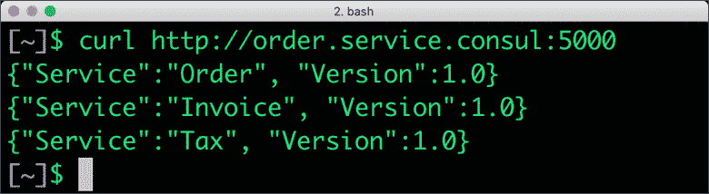

# 用 Consul 实现微服务的服务发现

> 原文：<https://thenewstack.io/implementing-service-discovery-of-microservices-with-consul/>

来自 [HashiCorp](https://thenewstack.io/mitchell-hashimotos-move-from-cto-garners-r-e-s-p-e-c-t/) 的 Consul 是服务网格技术的早期实现之一。它配有一个全功能控制面板，具有[服务发现](https://thenewstack.io/how-does-service-discovery-work-in-kubernetes/)，配置和分段功能。Consul 最大的优点是支持多种环境，包括传统应用程序、虚拟机、[容器](https://thenewstack.io/microservices-vs-monoliths-an-operational-comparison/)和编排引擎，如 Nomad 和 Kubernetes。

在较高层次上，Consul 提供了以下功能:

*   **分布式架构** : Consul 支持多个数据中心，用于交付可扩展、高度可用、抽象且有弹性的服务网状基础设施。Consul 部署可能跨越公共云环境中的多个区域甚至地区。
*   **服务发现**:分布式应用可以使用 Consul 动态发现服务端点。一旦向 Consul 注册了服务，就可以使用典型的 DNS 或自定义 API 来发现它。
*   **健康检查** : Consul 可以跟踪和报告注册服务的健康状况。每个微服务可以提供一个端点，该端点咨询探测器以检查健康状况。这在实现断路等模式时很有用。
*   **键/值存储** : Consul 是流行的分布式、内存 KV 存储之一。应用程序和基础设施可以用来存储任何参与服务都可以访问的分层数据。一个简单的 HTTP API 公开了处理数据的读/写功能。
*   **安全通信**:像大多数服务网格实现一样，Consul 通过 mTLS 为服务启用隐式通信安全。代理/侧柜之间的流量自动加密，无需编码或配置。

本教程通过一个基于三个微服务的简单场景来探索 Consul 的概念。

我们有三个微服务—订单、发票和税务—是在线零售应用程序的一部分。订单调用发票服务，发票服务又调用税务服务。

这些微服务是用 Flask 编写的，具有非常简单的功能——它们返回服务名称和版本。

```
from  flask import  Flask
import  requests
import  os

app  =  Flask(__name__)

@app.route('/')
def  get_invoice():
url=os.environ.get('TAX_SVC_URL')
response  =  requests.get(url)
ver="1.0"
res='{"Service":"Invoice", "Version":'  +  ver  +  '}\n'
res=res  +  response.content.decode('utf-8')
return  res

if  __name__  ==  '__main__':
app.run(debug=True,host='0.0.0.0',port=5001)

```

```
from  flask import  Flask
import  requests
import  os

app  =  Flask(__name__)

@app.route('/')
def  get_order():
url=os.environ.get('INV_SVC_URL')
response  =  requests.get(url)
ver="1.0"
res='{"Service":"Order", "Version":'  +  ver  +  '}\n'
res=res  +  response.content.decode('utf-8')
return  res

if  __name__  ==  '__main__':
app.run(debug=True,host='0.0.0.0',port=5000)

```

订单、发票、税务微服务分别监听端口 5000、5001、5002。

让我们启动服务并调用它们。

```
INV_SVC_URL=http://localhost:5001  python order.py  &
TAX_SVC_URL=http://localhost:5002  python invoice.py  &
python tax.py  &

```

上游服务的 URI 作为环境变量传递。在 5000 上调用订单服务监听将打印以下输出:

[](https://thenewstack.io/implementing-service-discovery-of-microservices-with-consul/consul-0/)

我们现在将向 Consul 注册这些微服务，以进行动态服务发现。

## 安装和运行 Consul

从 [HashiCorp 的官方网站](https://www.hashicorp.com/)下载适当版本的 Consul 二进制文件，并将其移动到添加到您的$PATH 环境变量的目录中。

使用下面的命令行开关启动 Consul。

```
consul agent  -dev  -ui  -datacenter zone1  -node host1

```

-dev 开关指示 Consul 在开发环境中运行。-ui 参数启动使仪表板可用。-datacenter 和-node 为数据中心
和主机提供标识符。

访问 http://localhost:8500/ui 会显示领事仪表盘。

[](https://thenewstack.io/implementing-service-discovery-of-microservices-with-consul/consul-1/)

因为我们还没有注册服务，所以仪表板看起来是空的。让我们用我们的微服务填充它。

## 向 Consul 注册微服务

在我们能够动态地发现服务之前，我们需要向 Consul 注册它们。这是通过用名称和端口为每个服务创建一个 Consul 服务定义文件来完成的。

下面的 JSON 文档保存在名为 order.json 的文件中，表示订单服务定义。

```
{"service":  {"name":  "order",  "tags":  ["order"],  "port":  5000}}

```

为其他服务创建定义，并将 JSON 文件移动到名为 consul.d 的目录中

```
{"service":  {"name":  "invoice",  "tags":  ["invoice"],  "port":  5001}}

```

```
{"service":  {"name":  "tax",  "tags":  ["tax"],  "port":  5002}}

```

服务定义文件就绪后，我们将重新启动 Consul，将它指向 consul.d 目录以加载定义。config-dir 开关告诉 Consul 包含目录中的所有配置文件。

按 CTRL+C 终止 Consul 代理，并使用下面的命令重新启动它。

```
consul agent  -dev  -ui  -datacenter zone1  -node host1  -config-dir  ./consul.d/

```

Consul web UI 现在显示已注册的服务。

[](https://thenewstack.io/implementing-service-discovery-of-microservices-with-consul/consul-2/)

## 使用 DNS 和 HTTP API 发现服务

Consul 有自己的 DNS 服务器监听端口 8600，可以响应标准查询。每个注册的服务都有自己的 DNS 条目，该条目解析为服务端点。

每个服务都采用 service_name.service.consul 格式的 FQDN。Consul 会将该名称解析为在特定数据中心和节点中运行的确切服务。

以下命令显示了 Consul 如何解析订单微服务端点。

```
dig  @127.0.0.1  -p  8600  order.service.consul SRV

```

[](https://thenewstack.io/implementing-service-discovery-of-microservices-with-consul/consul-3/)

SRV 记录显示服务端点所在的端口(5000)和位置(host1.node.zone1.consul)。请随意浏览发票和税务服务的 DNS 条目。

应用程序可以查询 HTTP API 来发现服务。

```
curl http://localhost:8500/v1/catalog/service/order

```

[](https://thenewstack.io/implementing-service-discovery-of-microservices-with-consul/consul-4/)

我们可以将咨询域名系统与主机域名系统集成，以解决服务 FQDN 问题。在 macOS Mojave 上，用下面的条目更新/etc/resolver/consul 使这成为可能。

```
nameserver  127.0.0.1
port  8600

```

您现在可以使用 FQDN 解析服务名称。 [](https://thenewstack.io/implementing-service-discovery-of-microservices-with-consul/consul-5/)

在本教程的下一部分，将在周五发布，我们将看看领事连接，领事的服务网格组件。敬请关注。

*贾纳基拉姆·MSV 的网络研讨会系列“机器智能和现代基础设施(MI2)”提供了涵盖前沿技术的信息丰富、见解深刻的会议。在 [http://mi2.live](http://mi2.live) 注册参加即将举行的 MI2 网络研讨会。*

<svg xmlns:xlink="http://www.w3.org/1999/xlink" viewBox="0 0 68 31" version="1.1"><title>Group</title> <desc>Created with Sketch.</desc></svg>