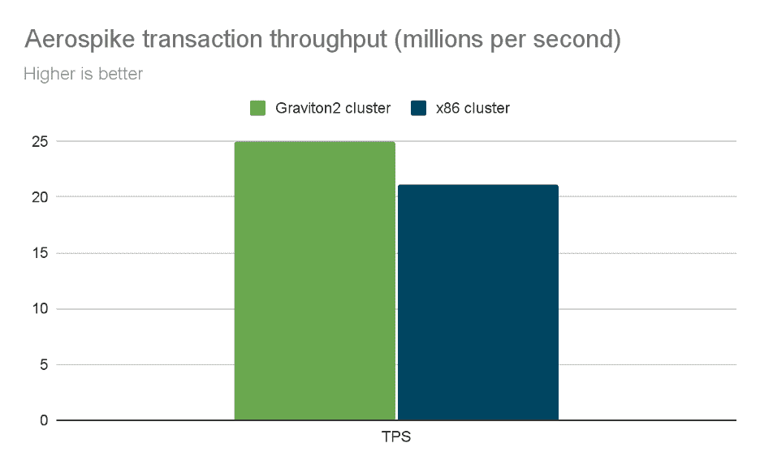
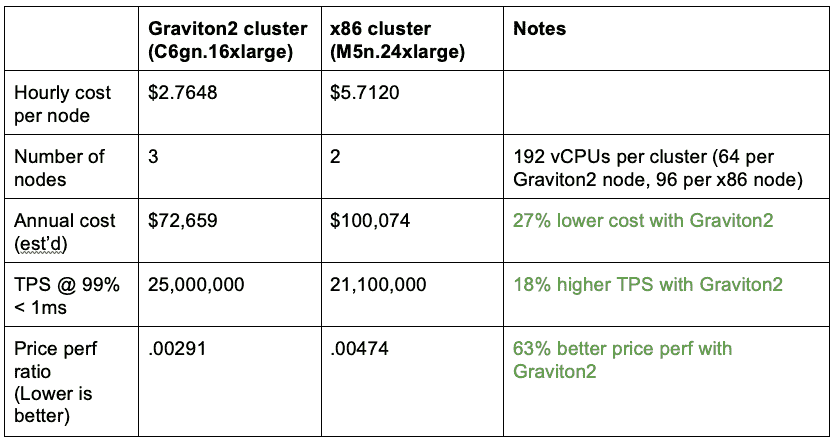

# 提高性价比降低基础设施成本

> 原文：<https://thenewstack.io/improving-price-performance-lowers-infrastructure-costs/>

如今，在不确定的时期，降低基础设施成本同时保持无限的可预测性能至关重要。最近， [Aerospike](https://aerospike.com/) 和 [Amazon Web Services](https://aws.amazon.com/?utm_content=inline-mention) 进行了一项[基准研究](https://aerospike.com/lp/aerospike-aws-graviton-benchmark/)，调查提高实时[应用程序开发](https://thenewstack.io/the-essential-elements-of-modern-application-development/)的性价比。

基准测试揭示了在亚马逊 AWS Graviton2 处理器上运行的 [Aerospike 6 的令人信服的性价比结果。Aerospike 发现，与同等的 x86 集群相比，使用 Graviton2 集群的性价比高出 63%。更高的交易吞吐率和更低的年度集群成本推动了这一性价比优势。](https://aerospike.com/news/press-release/database-6-on-aws-graviton2/)

Figure 1: Price performance (est’d annual cluster cost/number of transactions processed per second) was 63% better on the Graviton2 cluster.)

性能测试比较了 Graviton2 和 x86 集群，其中相同数量的[虚拟 CPU](https://thenewstack.io/the-case-for-virtual-kubernetes-clusters/)在 Aerospike 上运行只读、实时、典型的 Ad Tech 客户工作负载。两个集群都在不到一毫秒的时间内完成了 99%的事务。Graviton2 集群每秒处理 2500 万次事务(TPS)，x86 集群处理 2110 万次；这意味着 Graviton 集群的吞吐率提高了 18%,而 Graviton2 集群的年成本降低了 27%,如图 1 所示。

Figure 2: Transaction throughput (TPS rate) was 18% better on the Graviton2 cluster.

Aerospike 和 AWS 开创的技术进步也可以帮助企业减少碳足迹，以支持绿色目标。例如，AWS 估计，与 x86 环境相比，本次性能测试中使用的 Graviton 环境减少了约 49%的碳排放，同时满足了基准测试的严格事务吞吐量和数据访问延迟目标。

## 自动气象站重力 2 上的气塞

为了展示在 [AWS Graviton2 处理器](https://thenewstack.io/cpu-benchmarks-for-cloud-providers-intel-vs-amd-vs-amazons-arm-based-graviton2/)上运行工作负载的成本效益，Aerospike 在两种 EC2 拓扑结构上对其服务器平台进行了基准测试:一种使用 Graviton 处理器，另一种使用 x86 处理器。目标是通过进行并排比较，探索 Aerospike 如何利用 Graviton CPUs 转化为切实的性价比优势。结果很有启发性。历史上，Aerospike 因其能够从硬件合作伙伴的处理器、存储和网络改进中获得可观的效率而闻名。

## 工作量和实例

工作负载和实例 Aerospike 与 AWS 一起运行 CPU 密集型工作负载，300 个 asbench1 进程连接到 Aerospike 数据库版本 6.2。每个数据库都包含 20 亿条不同的记录。基准测试客户端有条不紊地增加了在集群上执行的事务数量，每秒执行超过 2000 万个只读事务。当 TPS 增加时，对每个集群进行监控，以确定这些事务的 99%延迟超过 1 毫秒的时间点。记录的“1 毫秒 SLA 下的 TPS”用于比较两个集群。

每个集群都在美国东部的单个 AWS 可用性区域中运行。两个集群包含的 vCPUs 总数相同。Graviton2 集群由 3 个 c6gn.16x 大型节点组成，包含 64 个 vCPUs、128 GiB 内存和 100 Gbps 的网络带宽。非引力子集群由 2 个 m5n.24x 大型节点组成，包含 96 个 vCPUs、384 GiB 内存和一个网络。请注意，测试完全在内存中进行，因此相同数据大小的未使用内存不会影响处理，只会影响 vCPUs(保持不变)。

在每个集群上，Aerospike 被配置为内存存储(即，在内存中保留用户数据和索引数据)。这是几个 Aerospike 部署选项之一，也是最适合创建 CPU 密集型工作负载的选项，因为该测试侧重于 CPU 处理能力。

每个气塞式系统使用因子为 2 的复制，这在大多数故障情况下提供了高数据可用性，并且通常用于气塞式生产环境中，但是只读工作负载意味着复制因子不会影响 TPS。

## 结果

Aerospike 和 AWS 使用亚马逊的在线定价计算器和其他公开数据，寻求两种环境的合理成本比较。为此，我们考虑了每个集群中使用的每个节点的每小时成本，该成本基于使用 1 年期 Linux 按需定价结构的美国东部通行费率。对于每个引力子 2 节点，这是每小时 2.7648 美元。对于每个 x86 节点，这是每小时 5.7120 美元。假设每个集群每天 24 小时不间断使用，Graviton2 集群的估计年成本为 72，659 美元，x86 集群为 100，074 美元。

## 气塞式和 AWS

Aerospike 和 AWS 与主要的云和硬件供应商合作，以确保其平台能够利用新出现的技术。对于亚马逊，这包括利用引力子处理器。

基于 Arm 架构，AWS Graviton 处理器采用定制硅和 64 位 Neoverse 内核，与其他替代产品相比，功耗更低，性价比更高，延迟更低，可扩展性更好。Graviton 非常适合高性能计算、机器学习、内存缓存和其他应用，是 Aerospike 的天然选择。为了利用 Aerospike 和 AWS Graviton 实现实时工作负载的卓越性价比，客户可以最大限度地提高成本效益，而不会影响激进的 SLA 或抑制未来的业务增长。

虽然没有在该基准测试中展示，但 Aerospike 还利用了亚马逊最新的 Nitro SSD 技术(im4gn 和 is4gen)，与 AWS i3 和 i3en 实例相比，该技术可将延迟降低高达 60%，延迟可变性降低高达 75%。对于更适合 Aerospike 的全固态硬盘或混合配置(索引在 DRAM 中，用户数据在固态硬盘上)的应用程序，Aerospike 高效使用 Nitro 固态硬盘技术的能力提供了额外的性能和成本优势。更多详情，请参见 AWS 和 Aerospike 的这个 [2021 演示文稿](https://aerospike.com/resources/videos/aws-on-air-nitro-ssds/)。

最后，有能源意识的公司可能会发现，与其他替代方案相比，在 AWS 上运行 Aerospike 可以显著减少碳排放。事实上，最近一篇研究 Aerospike 和 Cassandra 在 AWS 上部署的基础设施和能源成本的 IEEE 论文计算出 Aerospike 的软件效率可以降低 80%的成本和碳排放(见论文中的表 18)。此外，简单地从内部基础架构迁移到云基础架构可以节省大量能源。据估计，AWS 基础设施的能效是美国企业数据中心中值的 3.6 倍。

## 其他方法达不到的地方

经济高效的运营数据管理对数据库基础架构和 IT 组织提出了极高的要求。性能、易操作性、弹性、可用性、数据一致性、企业集成和成本效率是常见的压力点，也是令人烦恼的压力点。

许多开源和商业解决方案在一个或多个重要领域没有严重缺陷的情况下，根本无法管理大量混合工作负载。例如，关系型 DBMSs 通常可以与其他软件很好地集成，并提供强大的数据一致性保证，但无法以较低的总拥有成本提供超高速性能。某些开放源码和商业 NoSQL 系统提供了比关系型 DBMSs 更快、更便宜的替代方案，但是它们的缺点是操作复杂、性能不可预测，以及随着数据库的增长服务器占用空间过大。传统的缓存系统可能会提供初步的缓解，但通常会在 TB 级(甚至更高)表现出不稳定的延迟，引入额外的应用程序和操作复杂性，并提高总拥有成本。

## 摘要

Aerospike 和 AWS 的最新基准为实时工作负载的性价比设立了新的标杆。与 x86 环境相比，AWS Graviton2 处理器上的 Aerospike 提供了 63%的性价比，同时每秒处理 2100-2500 万次读取事务(TPS)；其中 99%的交易在不到 1 毫秒的时间内完成。此外，与其他替代方案相比，在 Graviton 上运行 Aerospike 可以减少 49%的碳排放。对于这个基准测试场景，Aerospike 通过在 Graviton 集群而不是 x86 集群上运行工作负载，显著节省了碳排放。我邀请你在我同事的博客[这里](https://aerospike.com/blog/architect/aerospike-database-6-best-cost-performance-ratio/)了解更多。

<svg xmlns:xlink="http://www.w3.org/1999/xlink" viewBox="0 0 68 31" version="1.1"><title>Group</title> <desc>Created with Sketch.</desc></svg> [Matt 担任 Aerospike 的产品营销主管，Aerospike 的实时多模型 NoSQL 数据平台为 Airtel、Criteo、DBS Bank、Experian、PayPal、Snap、Sony Interactive Entertainment 和 Wayfair 的任务关键型应用提供支持。在他的角色中，Matt 专注于产品...

阅读更多马特·布谢尔作品](https://thenewstack.io/author/matt-bushell/)