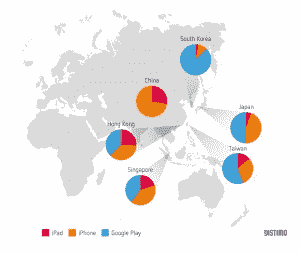
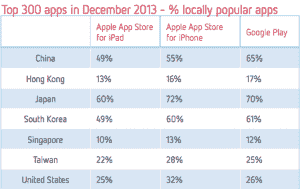

# 福特继续以开源战略吸引中国的开发者和联网汽车

> 原文：<https://thenewstack.io/in-china-ford-races-to-connect-cars-as-fast-as-possible/>

编者按:

[API Days San Francisco](http://sf.apidays.io/)

对 6 月 13 日至 15 日的会议提供 30%的折扣。当...的时候

[registering](http://www.eventbrite.com/e/api-days-san-francisco-connected-cars-and-driver-experience-registration-11536414727)

，使用 NEWSTACK 作为您的折扣代码。会议主题:API 开发者如何为联网汽车铺平道路。

虽然大多数美国家庭已经拥有汽车，但大多数中国家庭仍然不习惯汽车生活。对于这些中国新司机来说，汽车不仅仅是交通工具，或多或少还是成就和专属的象征。这就是为什么我们看到中国人痴迷于更长的轴距、LED 头灯和真皮座椅等其他奢侈品。中国司机真的希望他们的汽车是豪华的——没有什么东西比联网汽车更花哨了。

福特正在通过开源其技术和吸引应用程序开发者的兴趣来争夺中国市场，应用程序开发者的需求越来越大，特别是在联网汽车市场。对这一人才库的需求在正在进行的投资中显而易见。诺基亚将投资 1 亿美元，在中国和世界其他地区培育一个开发者生态系统。

根据 WardsAuto 的一篇报道，去年中国售出了约 1200 万辆汽车，比前一年增长了 12%。智能手机的拥有量正在大幅增长，估计智能手机的安装量超过 5 亿部。这比美国和西欧的总和还要多。

应用生态系统也紧随其后，中国现在是亚洲增长最快的市场之一。

然而，尽管人们对移动应用感兴趣，但仍有一系列问题需要解决:

**更新周期:**手机应用程序通常会自动更新，但汽车只有通过手动方式才能得到维护，通常是将汽车带到店里。

**定制:**如果您的汽车是家庭成员共享的，那么连接必须个性化，以适应不同驾驶员和乘客的口味。例如，我喜欢在开车时听 Pandora，但我妻子可能更喜欢一个告诉她附近是否有销售的应用程序。

**碎片化:**世界上有几十家汽车制造商，每家都有自己的平台和编程要求，这就造成了一个困难的开发环境。

### 将手机连接到汽车

本月早些时候，在北京举行的全球移动互联网大会上，福特推出了其 Applink 技术的开源版本 SmartDeviceLink，并宣布与百度地图和高德地图合作，这两家公司占中国地图业务的一半以上。

Applink 首次出现在 2011 款车型中，是一个移动应用模块，将用户的手机与汽车连接起来。开发人员只需要在现有的 Android 或 iOS 应用程序中添加一个小模块，就可以让它工作。

通过蓝牙或 USB 电缆，移动电话中的信息被投射到车辆的仪表板屏幕上。汽车本身不存储应用程序，把升级和其他的负担留给了手机。

Applink API 自 2013 年 1 月起面向开发者开放。开发者还可以获得位置、油耗和速度等数据。福特将提供测试和测试支持，并帮助推广已获批准的应用。福特表示，全球已有约 5 万名开发者注册。

迄今为止，福特已经在中国推出了 12 款应用程序。除了百度地图和高德地图，该榜单还包括许多其他热门应用，如豆瓣 FM(中国版 Spotify)、搜狗语音助手(中国互联网巨头搜狐开发的类似 Siri 的应用)和新浪微博(中国版 Twitter)。

### 开源提升基础

智能设备链接(Smart Device Link)是 Applink 的开源版本，由福特提供给 GENIVI 联盟，GENIVI 联盟是一个非营利的行业联盟，致力于开发车载信息娱乐系统的开源开发平台。

GENIVI 目前拥有超过 170 家会员，包括日产、沃尔沃和宝马。基于 SDL 的应用不仅适用于福特汽车，也适用于其他制造商。

福特亚太区产品开发副总裁特雷弗·沃星顿表示:“在这个框架下，开发人员将更成功地进入联网汽车市场，因为他们将有更多的机会使用他们的应用程序。”。

鉴于智能设备链接与 Applink 没有根本区别，可以预见的是，Applink 上已经可用的应用程序也将很快引入智能设备链接，尽管目前还没有时间表。

福特正试图增加开发人员的总数。“你的基础必须足够大，才能吸引开发者，”福特亚太区互联服务技术和业务发展高级经理黄大炜说。对于移动应用来说，即使几百万的安装基数也不算大。但对于一家制造商来说，在中国每年销售 100 万辆汽车已经是一个惊人的数字了。

希望有更多的制造商向开发者开放，并继续增加安装基础的规模。

### 未来的挑战

似乎使用开源作为连接汽车的方式将有助于建立一个开发者生态系统。应用程序不需要特别嵌入到车辆中，乘客将能够把他们已经个性化的手机体验带到他们的车上。应用程序的通用标准也将缓解碎片化，使一个应用程序可供多个制造商使用。

但这并不意味着福特将仅仅通过出口其智能设备链接和制定标准来自动领先于汽车连接。智能设备链接和 GENIVI 的共同平台将不得不与其他类似的事业竞争，如[开放汽车联盟](http://www.openautoalliance.net/#about)，谷歌试图通过它将其 Android 系统扩展到汽车上。

此外，即使开发人员可以基于一个通用平台开发应用程序，车载应用程序也有可能激增，但汽车制造商仍然需要改善自己的车载信息娱乐系统的体验。“我打个简单的比方，”黄说。“你有一部 800 美元的安卓手机和一部 80 美元的安卓手机。他们都运行相同的应用程序，但体验不同。SDL 正在统一语言…但体验仍取决于原始设备制造商。”

香然·卢是一名驻京记者。

照片由福特公司提供。

<svg xmlns:xlink="http://www.w3.org/1999/xlink" viewBox="0 0 68 31" version="1.1"><title>Group</title> <desc>Created with Sketch.</desc></svg>