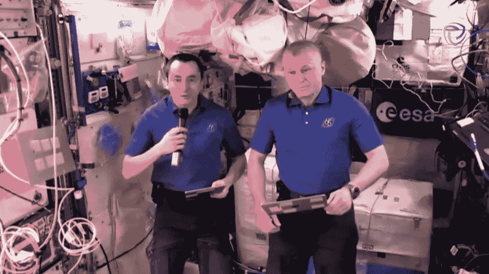
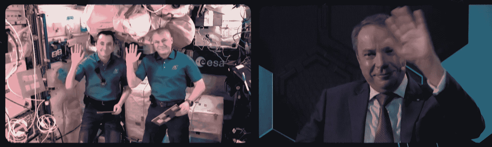

# 在太空中，您可能仍然需要双重身份认证

> 原文：<https://thenewstack.io/in-space-you-might-still-need-two-factor-authentication/>

上周二[亚马逊](https://aws.amazon.com/?utm_content=logo-sponsorpage&utm_source=thenewstack&utm_medium=website&utm_campaign=platform)创始人[杰夫·贝索斯](https://twitter.com/jeffbezos)(和[三个旅伴](https://www.washingtonpost.com/technology/2021/07/20/bezos-space-flight-live-updates-video/))飞到了外太空边缘。九天前，[维珍银河](https://www.virgingalactic.com/)创始人[理查德·布兰森](https://twitter.com/richardbranson)(和五名旅伴)做了同样的事情。

但是 20 年来，一直有一群人生活在那里，在太空中有史以来最大的人造物体中漂浮在遥远的上空。当我们庆祝这个月的技术成就时，一些人也想起了国际空间站上辛勤工作的宇航员，他们自 2000 年以来每次离开地球几个月。

上个月，一个网络安全会议甚至安排了两名俄罗斯宇航员将他们自己的音频和视频传到地球进行现场采访。

[https://www.youtube.com/embed/ho-MExdt-So?feature=oembed](https://www.youtube.com/embed/ho-MExdt-So?feature=oembed)

视频

## 一次“相当特别”的谈话

这场对话是名为 [Cyber Polygon](https://cyberpolygon.com/news/cyber-polygon-2021-iss-steve-wozniak-interpol-unicef-and-many-others/) 的安全活动的一部分，在其网站上被描述为“旨在提高全球网络弹性和扩大针对网络威胁的部门间合作的国际能力建设倡议”这是毕的倡议。ZONE (一家总部位于莫斯科的网络安全解决方案提供商，它是俄罗斯国有银行和金融服务公司 Sber 的一部分)——但得到了世界经济论坛网络安全中心的支持。

一位活动主办方后来宣布，双轨活动包括一个关于转移有针对性的供应链攻击的技术培训轨道，吸引了来自 29 个不同国家的参与者。根据安全新闻网站*Threatpost*的报道，他们来自 200 多个组织，包括主要的金融和科技公司以及执法机构和其他公共机构。但是 *Threatpost* 还指出，超过 700 万观众(来自 78 个国家)收看了[在线讨论轨道](https://www.youtube.com/watch?v=7E00PocVkys)，其中包括[苹果联合创始人史蒂夫·沃兹尼亚克](https://youtu.be/crUovqYD88I)、[国际刑警组织](https://www.interpol.int/en)安全总监[于尔根·斯托克](https://youtu.be/y13_k-dN6N4)、[微软](https://www.microsoft.com/en-us/)首席安全顾问[罗杰·哈尔比尔](https://youtu.be/P2LwnKjyvqA)，以及来自[红十字会](https://youtu.be/-TFXxna78p4)、[的发言人](https://youtu.be/-TFXxna78p4)

当采访宇航员时，主持人亚历山大·图什卡诺称之为“相当特别”的谈话。

*宇航员彼得·杜布罗夫(左)和奥列格·诺维茨基在网络多边形访谈中。*

似乎有意识地试图将讨论与网络多边形的主题联系起来。由于这是一次网络安全会议，自然会问宇航员空间站如何处理他们正在处理并传输到地球的数百万亿字节数据的安全问题。宇航员奥列格·诺维茨基(Oleg Novitskiy)称之为“一个非常有趣且高度相关的问题”，但事实证明，他们的做法与任何组织都有很多共同点:遵循他们 it 部门制定的安全协议，并在必要时使用加密技术。

“我们在这里主要是执行数据传输和数据交换的规则，”诺维茨基说。“当然，我们有封闭、安全的通信渠道，比如，我们可以在这里讨论机组成员的健康状况。这是我们最常用的渠道。在我们工作的不同阶段，许多信息在车站受到保护，我们为此使用特殊的软件——专门的、经过认证的硬件。

“为了传输数据，我们使用特殊的加密技术，因此即使这些技术信息被截获，也不太可能被破译。因此，我认为在车站和我们的通信渠道中，这种信息安全水平非常非常高。”

尽管当然还有其他挑战。采访者斯坦尼斯拉夫·库兹涅佐夫(Stanislav Kuznetsov)说:“看到麦克风在你周围飞来飞去是很不寻常的。”

## 国际合作

库兹涅佐夫是俄罗斯国有银行/金融服务公司俄罗斯储蓄银行(SberBank)执行董事会副主席，他和此次活动的东道主图什卡诺都想强调另一个主题。

“Cyber Polygon 的关键信息之一是，政府和企业需要在全球范围内合作，以成功打击网络犯罪，”图什卡诺在介绍中说。“具有讽刺意味的是，人们似乎在太空中比在地球上合作得更好……这就是网络安全应该有的样子。”

在后来向宇航员提出的问题中，库兹涅佐夫称空间站是“许多许多国家和利益相关者的劳动成果……地球在太空中的代表。”

事实上，美国国家航空航天局(NASA)称国际空间站(International Space Station)为“一项人类成就，同时也是一项技术成就——如何最好地计划、协调和监控该项目众多组织的各种活动。”该机构指出，其主要运营商是来自五个不同国家的航天局:美国，俄罗斯，欧洲，日本和加拿大。(来自 18 个不同国家的宇航员参观过它。所以库兹涅佐夫最后问道:作为确保空间站数据安全的一部分，是否也有涉及多个国家合作的*联合*项目？

宇航员彼得·杜布罗夫给予了肯定的回答。“当然，没有所有各方、所有国家之间的密切合作，就不可能建造和维护国际空间站这样一个庞大而复杂的项目。当然，还有专门的工作组监控与安全相关的一切，尤其是信息安全。他们在不同的国家工作，定期交流。他们定期进行培训、会议、网络研讨会和测试。他们处理的所有问题都被作为指导方针和指令执行，然后在船上传送，我们努力遵循所有的指导方针和建议，以确保空间站的信息安全。

“当然，还有大量的信息备份和复制，以确保飞行过程中数据的安全处理。”

也有一些参考他们的更日常的技术。诺维茨基指出，自 2012 年他首次进入空间站进行 143 天的飞行以来，船上的设备已经发生了变化，系统更加复杂，他特别提到了带来更高速互联网的新技术，“对我们的实验非常有帮助……它们帮助我们更快、更安全地交换信息。”

杜布罗夫说，空间站机组人员目前正在为期待已久的模块对接做准备，他们总体上实施了许多新的先进技术，包括“最先进的平板电脑”(他们似乎正拿在面前)，以及与地球的“非常先进的通信渠道”，提供互联网接入和 IP 电话解决方案。(“感谢我们的合作伙伴…”)

他说，除了平板电脑和工具帮助他们完成任务并与地球上的工作人员交流外，“他们还帮助我们在旅行中保持心理舒适。”

采访者库兹涅佐夫指出，诺维茨基在网上和社交媒体上非常活跃，分享了他自己的经历和高空观察。但说到安全，他有没有遇到过网上诈骗者或自己账户被攻破的问题？"或者我们能确定网络罪犯在任何情况下都不会攻击宇航员吗？"

宇航员笑着回答，“嗯，如果黑客们听你的，那就太好了，”并补充道，“实际上，如果他们不攻击任何人，那就太好了。”

但是他承认“显然有一些尝试，一些电话。我没有经历过直接有针对性的攻击，因为我没有任何他们感兴趣的机密信息。”他说，过去他接到过冒充银行职员的骗子打来的电话，但没有造成伤害，并称“很明显这些是罪犯。”

## 太空程序员

两人都拥有“试验宇航员”的头衔，但背景却截然不同。诺维茨基是一名授勋军官(据 Space.com 称，他曾是俄罗斯空军的中校，飞行时间超过 700 小时)

但是杜布罗夫是一名前软件工程师(根据[美国宇航局的一个专题](https://www.nasa.gov/specials/kidsclub/nowinspace/expedition65-crew2/index.html))。因此，当 Pyotr 被问到他在信息技术和编程方面的背景时，最有趣的时刻出现了。这对他在太空中有帮助吗——他写过代码吗？现在他第一次飞行就到达了空间站，一个程序员和“IT 人”该扮演什么角色呢？

“你知道，我现在主要关注实验，关注空间站的技术维护，”杜布罗夫回答道。“所以我只有*一些*闲暇时间做我自己的事情，做我热爱的事情，但我现在没有那么多空闲时间。”

但看起来他确实在太空中使用了一些他的编码/IT 技能。“我试图让它更舒适，让机组人员更容易使用我们的一些信息资源，如我们的日常日程安排，”他说。“我努力让这些时间表更清晰可见，对我们的工作更有帮助。我真的不能给这些活动分配那么多时间，但我希望奥列格欣赏我正在做的事情，我希望这对我们所有人和我们之后的工作人员都有帮助。”

采访结束时，库兹涅佐夫提出了一个宏大的最后问题:“你认为地球的未来会是什么样的？”

诺维茨基回应了一个会议肯定会接受的信息:“我认为我们星球的未来应该是安全的。

“每个人都在努力。国家机构的所有技术专家都努力确保尖端技术不被用来伤害人类和整个人类。

“我们确实希望有一个更美好的未来，数字安全和保障，以及人类的安全和保障。这是我们希望在地球上实现的目标。”

* * *

# WebReduce

<svg xmlns:xlink="http://www.w3.org/1999/xlink" viewBox="0 0 68 31" version="1.1"><title>Group</title> <desc>Created with Sketch.</desc></svg>