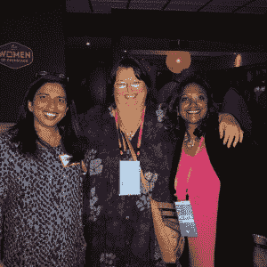

# 奥斯汀 OpenStack 峰会上的包容性

> 原文：<https://thenewstack.io/inclusion-done-right-openstack-summit/>

本周在得克萨斯州奥斯汀举行的 [OpenStack 峰会](https://www.openstack.org/summit/austin-2016/)将由[OpenStack](https://wiki.openstack.org/wiki/Women_of_OpenStack)(WOO)的女性赞助三项活动，所有这些活动都旨在让 open stack 社区的女性相互认识，建立网络，并形成联系，使她们成为社区的成功成员。

“他们会问这样的问题，‘我们能为你的职业生涯提供什么帮助？’OpenStack 基金会的高级营销经理 Heidi Joy Tretheway 说道。

Tretheway 说，WOO 会议的重点都是技能培养。

周日，已获得安妮塔·博格研究所(Anita Borg Institute)和哈佛商业评论(Harvard Business Review)好评的指挥现场研讨会将模拟高层会议，并提供如何处理打断、连珠炮式提问和其他情况的课程。介绍结束后，参与者将进行角色扮演并接受反馈。

> OpenStack 峰会的方法是这个行业向前迈出的一步，这个行业一直在许多会议上与公然或隐蔽的性别歧视作斗争。

周日晚上是由 IBM、英特尔和 EMC 共同赞助的[峰会前社交活动](https://www.openstack.org/summit/austin-2016/summit-schedule/events/8926)，这将为女性在峰会前见面和建立联系搭建舞台。Tretheway 表示，参加这一活动的有董事会、媒体和分析师。WOO 不是一个排斥男人的女人的地方，在这个活动中男人是最受欢迎的。

周一上午是“[快速辅导](https://www.openstack.org/summit/austin-2016/venues/#venue=25)”活动，开发者社区的女性有 5 到 10 分钟的时间采访可能的导师，目的是找到导师和学员的联系。通过在会议开始时举办这一活动，吴希望导师和学员在一周内有最大限度的面对面交流时间。这些关系预计将持续到会议结束之后，导师们预计每个月会花大约一个小时与他们的学员在一起，帮助他们建立行业联系。

Tretheway 指出，OpenStack 的多样性不仅仅是让社区中有更多的女性，而是对整个社区保持敏感。例如，登记表不限于男性和女性，而是提供了其他选项，以包容跨性别参与者。

OpenStack 峰会(T1)的做法是这个行业(T2)向前迈出的一步，这个行业在许多会议上一直在与公然或隐蔽的性别歧视(T3)作斗争。在过去，大声说出性别歧视行为的女性会被避开，甚至[会被解雇。但最近，女性更加直言不讳，称这些事件是不可接受的。公司对此做出了回应。](http://www.buzzfeed.com/courtneystanton/a-woman-walks-into-a-tech-conference#.vnvlWorQX4)

德克萨斯州奥斯汀 OpenStack pre-summit meetup 的女性与英特尔的 Ruchi Bhargava(左)、TNS 记者 T.C. Currie(中)和 San Disk 的 Nithya Ruff(右)。

在 2014 年 Grace Hooper Computing conference of Women in Computing 会议上，一个名为“男性盟友全体小组”的灾难性小组由四名男性领导，他们向女性提供了许多关于她们需要做些什么才能在技术领域取得成功的建议。女性与会者认为这个小组有性别歧视和居高临下，并在社交媒体上表达了她们的不满。主持该小组的谷歌高级副总裁阿兰·尤斯塔斯优雅地回应道。他在推特上建议重来。“你说，我听。”

曾在一家大型科技公司工作的软件工程师凯特·休斯顿(Cate Huston)告诉 ThinkProgress:“他们看到了反馈，并采取了行动，然后过来倾听。“房间里坐满了人，很多女性都在发言，这太不可思议了。”

去年 10 月，Leah Weitz 登上了《黑客新闻》的头版，她在博客中列举了一些男性在科技活动中对她的性别歧视言论。在接受 Business Insider 采访时，她表示，提高对女性经常遇到的偶然性别歧视的认识是让科技行业变得更好的一部分。

虽然情况有所好转，但仍有很长很长的路要走，这是上个月微软的又一次失言，这次引起了 Xbox 的道歉。对这些失误的道歉变得越来越不可接受，尤其是像 OpenStack 和 WOO 这样的组织正在采取措施，让女性觉得她们是团队的一部分。

<svg xmlns:xlink="http://www.w3.org/1999/xlink" viewBox="0 0 68 31" version="1.1"><title>Group</title> <desc>Created with Sketch.</desc></svg>