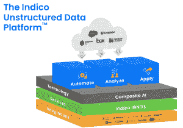

# Indico 应用人工智能和 ML 应对非结构化数据的挑战

> 原文：<https://thenewstack.io/indico-applies-ai-and-ml-to-challenge-of-unstructured-data/>

数据通常被称为新的石油，是推动当今公司发展的关键资源，也是他们在现代商业世界中竞争能力的关键。

然而，数据也带来了挑战，尤其是企业产生的大量数据。IDC 分析师预测，到 2025 年，将会产生 175 的数据，需要对所有这些数据进行收集、处理、存储和分析，以快速得出推动业务决策的相关信息。

由于 80%到 90%的被创建数据是[非结构化数据](https://thenewstack.io/unstructured-data-will-be-key-to-analytics-in-2022/)，包括从电子邮件、文本和社交媒体到图像、视频和语音的一切，这使得情况变得更加复杂。此类数据不适合表格或其他预设模型，并且无法映射到指定字段。它不能存储在传统数据库中，比结构化数据更难管理。

“非结构化领域的一大挑战是它的异构性，”[Indico Data](https://indicodata.ai/)CEO[Tom Wilde](https://www.linkedin.com/in/tomwilde/)告诉新堆栈。“我们从电子邮件、图像[和]音频的角度来考虑它，这些东西在当今任何主要企业中流动，都是非结构化的。它构成了许多关键的前台、中台和后台工作流。”

## **处理非结构化数据**

汤姆·王尔德

过去，它使用正则表达式和布尔逻辑等工具(相对成功)来帮助机器更好地处理非结构化数据。根据 Wilde 的说法，近年来[人工智能(AI)、机器学习](https://thenewstack.io/3-vectors-of-artificial-intelligence-and-machine-learning/) (ML)和[神经网络](https://thenewstack.io/photonic-accelerator-supercharges-optical-neural-networks/)的出现改变了这种动态。

他说:“这是我们第一次可以通过实例而不是指令来教授机器。”“这真是一个深刻的转变。现在，如果我向机器展示足够多的我试图解决的问题的例子，它可以像人类一样通过观察来学习解决问题。这是好消息。我不需要技术来展示例子。我只需要找到一种方法，将这些产品的例子放到神经网络上。”

也就是说，即使是这些新兴技术也存在问题:虽然配备人工智能的机器是聪明的学习者，但它们也很慢。王尔德说，用户可能需要向它展示数万个例子，才能达到人类的熟练程度，“现在我们又回到了商业用户可以承担的工作之外”。

## **Indico 的非结构化数据平台**

总部位于波士顿的 Indico Data 成立于 2014 年，正在寻求通过其非结构化数据平台来解决这一问题，该平台是一个工具集，利用迁移学习方法、学习技术和软件代理来快速创建机器学习模型，这些模型可以多次应用，以从非结构化数据中提取价值。

该公司于 2021 年 9 月推出了该平台，在私有云中或由 Indico 托管提供服务。它包括该公司的 [Indico Ignite 服务](https://indicodata.ai/services/)。

“Indico 在这里所做的事情——真正的颠覆是创办公司的创始人……发明了一种方法，使用一种叫做迁移学习的东西，借此解决问题的一般方法可以一次又一次地重新用于解决具体问题的引导，”Wilde 说。“有些人将其描述为，我们跑完马拉松的前 26 英里，客户跑完最后 0.5 英里。我们建立了对语言、图像等的大量预先训练的理解。，作为一个巨大的通用引导程序，允许商业用户在其上创建定制的机器学习模型，并训练它如何完成他们试图解决的特定任务。这是需要推向市场的技术突破。”

## **定制车型是关键**

这位首席执行官表示，只需少量训练就能创建定制机器学习模型的能力是该战略的三个关键部分之一。此外，应用程序本身本质上是一个点击点，使客户可以轻松地完成创建模型、展示和标记训练数据等任务。让人们参与进来也是一个关键部分。

“通常，客户会问我们，‘你们的解决方案有多准确？’”他说这是个错误的问题。正确的问题是，“对我来说，达到 100%的准确率有多难？”这是一个微妙的区别，但却是重要的区别。关键的区别在于人类的知识。达到 100%的准确率既是机器学习的问题，也是用户体验的问题。"

该应用程序允许用户通过定制模型查看已经处理的内容，并了解它在预测中缺乏信心的地方。然后，用户需要了解发现问题和补救问题的效率。

王尔德说:“所有这些加在一起就是解决这个问题的办法。”。“这就把 Indico 分开了:它是所有这些东西的组合。这不是那些事情之一。”

## **成长中的公司**

布兰迪·科尔贝洛

Indico 已经筹集了 3600 万美元，其中包括 2020 年 12 月的 2200 万美元，这使它能够增加员工人数，扩大渠道覆盖范围。它现在拥有金融服务、保险和商业地产等行业的 15 家企业客户，如 [Cushman & Wakefield](https://www.cushmanwakefield.com/en/united-states) 。这家总部位于芝加哥的全球房地产服务公司在 60 个国家的 400 个办事处拥有约 50，000 名员工，正在投资自动化技术，作为其更大的数字化转型计划的一部分。

该公司已成功利用[机器人流程自动化(RPA)](https://thenewstack.io/what-is-robotic-processing-automation/) 处理结构化数据，并希望处理包括数百万份文档、电子邮件和其他基于文本的信息在内的非结构化数据。

[Brandi Corbello](https://www.linkedin.com/in/brandicorbello/) 当时是高纬环球的转型副总裁。

今年 1 月成为 Indico 业务发展副总裁的 Corbello 告诉 New Stack 说:“在自动化领域，你通常会看到自动化领导者坐在某个职能部门或业务部门中。“他们实际上只面临特定业务部门或职能部门的问题。我所处的位置让我看到了整个组织的所有问题。我们在许多非结构化数据问题中发现，存在许多利基解决方案或孤岛式解决方案，其中一个解决方案只能查看租赁，另一个解决方案只能查看发票。”

## **高纬环球的挑战**

她说，公司需要一种策略来解决整个组织的非结构化数据问题。Indico 解决方案使业务流程专家能够构建模型并在需要时修改它们，而无需 IT 或数据科学家的参与。该产品中的分析识别了多个文档中一个文档中的相关术语，该平台可用于不同业务部门中的无数使用案例和文档类型。

“在每个用例中，我们都创建了定制模型，”Corbello 说。“我的团队知道一种工具，所以我们在平台中有一种工具，而不是两到三种工具，[而且]我们的最终用户实际上对这种工具非常满意，所以从业务角度来看，变更管理很少，我们有良好的用户体验。我们能够跟踪大量用例，而不仅仅是关注组织中的一个问题。”

Wilde 说，创建定制模型的能力也使企业更容易采用这项技术。解决第一个用例通常需要 90 到 120 天，但后续用例需要大约 4 到 6 周。

他说:“一旦他们崛起，一旦客户获得了学习曲线，他们就能够以更快的速度获取价值。

Cushman and Wakefield 使用 Indico 解决方案来处理租赁分析和采购到付款发票工作流等使用案例，并在其交易管理计划上节省了 16，000 个小时，并将每笔交易的周转时间加快了 70%。

“对我们来说，库什曼的关键是我们能够操作这个工具，”Corbello 说。“我们能够将其嵌入到这些流程和业务中。这是他们运营的真实组成部分，而不是一种筒仓技术。”

<svg xmlns:xlink="http://www.w3.org/1999/xlink" viewBox="0 0 68 31" version="1.1"><title>Group</title> <desc>Created with Sketch.</desc></svg>