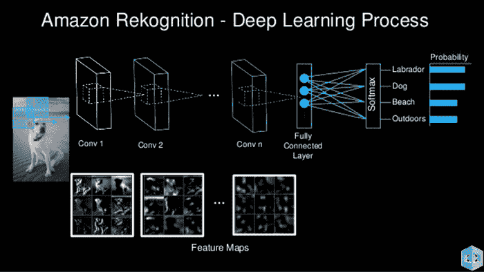
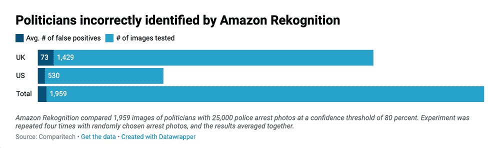

# 行业面部识别人工智能暂停不能解决缺陷和隐私问题

> 原文：<https://thenewstack.io/industry-facial-recognition-ai-moratoriums-dont-address-flaws-privacy-concerns/>

本月早些时候，亚马逊——可以说是世界上最大的执法面部识别人工智能提供商——实施了为期一年的暂停向警察部门出售其 Rekognition 软件的措施,此举令公民自由活动人士和科技界感到惊讶。

批评者警告说，在一个目前几乎没有监管的行业，亚马逊正在朝着正确的方向迈出一步，但这可能太少，太晚了。毕竟，亚马逊的声明是在 IBM 宣布将[完全停止开发面部识别系统](https://www.vox.com/recode/2020/6/10/21285658/ibm-facial-recognition-technology-bias-business)之后发布的，这促使微软加入进来，也促使[停止向警方销售他们的软件](https://www.cnn.com/2020/06/11/tech/microsoft-facial-recognition-police/index.html)。这些回应是在全球持续抗议警察暴行的背景下做出的，这引发了关于当地警察部队对公民使用何种工具的更广泛讨论，特别是强大的面部识别技术，可以从照片和视频中实时识别人们——有时会带来灾难性的，改变生活的后果。

亚马逊的 Rekognition 软件提出了一个特别麻烦的案例。Rekognition 于 2016 年推出，最初是作为一种通用计算机视觉工具上市的，它使用[深度学习](https://thenewstack.io/demystifying-deep-learning-and-artificial-intelligence/)来实时识别物体、场景和人脸，此外还使用户能够搜索人脸并与拥有数千万张人脸的数据库进行比较。它使用由用户设置的被称为[置信度得分或置信度阈值](https://docs.aws.amazon.com/rekognition/latest/dg/face-feature-differences.html)的东西。由于面部识别系统会预测一张脸是否与另一张图像中的另一张脸匹配，因此设置一定的置信度阈值意味着软件将输出符合预定临界值的匹配，而不符合的则被丢弃。尽管亚马逊建议在执法情况下使用 95%的置信度阈值进行重新识别，但没有法规强制当局这样做。

## 隐藏的算法偏差

从 2017 年开始，俄勒冈州华盛顿警察局是美国第一个使用 Rekognition 对嫌疑人进行面部分析的警察局，到 2018 年，已经进行了 1000 多次面部搜索，直到 2018 年 5 月才公开。同年 2 月，一个由麻省理工学院和微软研究人员组成的团队发表了一项具有里程碑意义的研究[T2，该研究揭示了面部识别软件是如何将有害的](https://www.media.mit.edu/publications/full-gender-shades-thesis-17/)[种族和性别偏见](https://thenewstack.io/hidden-gender-racial-biases-algorithms-can-big-deal/)无意中融入他们的算法中的。研究数据显示，这些工具对深色皮肤女性的错误分类明显多于白人男性受试者，表明这些系统没有声称的那么准确。

另一项麻省理工学院附属的[审计](https://www.media.mit.edu/publications/actionable-auditing-investigating-the-impact-of-publicly-naming-biased-performance-results-of-commercial-ai-products/)于 2018 年年中进行，并于 2019 年初发表，重点关注 Rekognition 本身，以及微软、IBM、Face++和 Kairos 的面部识别系统，并发现与白人男性相比，Rekognition 的不准确性最高，错误分类有色人种女性的比例为 31%。2018 年 7 月，美国公民自由联盟(American Civil Liberties Union)进行的另一项[实验](https://www.aclu.org/blog/privacy-technology/surveillance-technologies/amazons-face-recognition-falsely-matched-28)强化了这些结果，该实验发现，亚马逊的软件错误地将 28 名美国国会议员的图像与罪犯的面部照片进行了匹配——有色人种被错误识别的比例最高。

亚马逊[没有解决这些问题，而是驳回了](https://aws.amazon.com/blogs/machine-learning/some-thoughts-on-facial-recognition-legislation/)这些发现，促使 80 名专家——包括一名前亚马逊研究员和人工智能领域的其他几位知名人士——撰写了一封[公开信](https://medium.com/@bu64dcjrytwitb8/on-recent-research-auditing-commercial-facial-analysis-technology-19148bda1832)支持麻省理工学院研究人员的发现，并敦促亚马逊停止向执法部门出售 Rekognition。尽管遭到公开反驳，亚马逊最终发布了 Rekognition 的更新版本，而在幕后，亚马逊正在[投资“人工智能公平”研究](https://hub.packtpub.com/amazon-joins-nsf-funding-fairness-ai-public-outcry-big-tech-ethicswashing/)，还在[游说国会](https://www.politico.com/story/2019/07/23/amazon-facebook-lobbying-record-1611958)关于隐私、劳工和反垄断法规。

## “精确度没有太大提高”

最近在 2020 年 5 月，Rekognition 进行了另一项令人大开眼界的[研究](https://www.comparitech.com/blog/vpn-privacy/facial-recognition-study/)，使用了与 2018 年 ACLU 实验相同的参数。这一次，分析包括了英国议会成员的照片。

“我们重复了四次实验，每次都从 Jailbase.com 上收集了 25，000 张不同的逮捕照片样本，”监督这项研究的技术研究公司 [Comparitech](https://www.comparitech.com/) 的消费者隐私专家[保罗·比肖夫](https://twitter.com/pabischoff)解释道。“在同样的[信心]阈值(80%)下，平均有 32 名美国国会议员被认错，比美国公民自由联盟两年前的研究多了 4 名。这似乎表明 Rekognition 的准确性并没有提高多少。在 12 名被误判为 90%或更高可信度的政客中，有 6 名不是白人。这意味着一半被误认的人是有色人种，尽管非白人只占美国国会的五分之一和英国议会的十分之一。”

这些最近的发现再次强调了需要更多的法律来保护公民免受强大但不完善的工具的侵害。“目前，几乎没有关于警察使用人脸识别的规定，”比肖夫补充道。“谁可以使用它，如何使用，在哪里使用，数据可以与谁共享，以及人们是否被告知他们的面部正在被扫描，这些都由警方决定。这是危险的，因为它允许滥用该系统，可能因错误识别而导致错误逮捕，并侵犯隐私。”

这些担心不是没有根据的:今年早些时候已经有一个确认的案例，一个无辜的人因为不正确的面部识别匹配而被逮捕和拘留。尽管专家们对亚马逊暂停向警察部门提供 Rekognition 一年表示欢迎，但许多人也指出，该公司没有提到这是否也适用于联邦调查局或 ice 等联邦机构，据报道[已经使用了](https://www.nextgov.com/emerging-tech/2019/01/fbi-trying-amazons-facial-recognition-software/153888/)或[正在考虑使用亚马逊的软件](https://www.vice.com/en_us/article/7x59z9/the-facial-recognition-system-amazon-sells-to-cops-can-now-detect-fear)。

“我认为警察使用面部识别有一些合理的原因，”比肖夫说。“绑架和贩卖人口就是几个例子。但我们需要监管，以防止当局肆意滥用和误用。不规范人脸识别的后果最终会影响行动和集会自由。”

点击阅读最新研究[。](https://www.comparitech.com/blog/vpn-privacy/facial-recognition-study/)

亚马逊网络服务是新堆栈的赞助商。

图片:teguhjati pras via Pixabay 亚马逊和 Comparitech

目前，新堆栈不允许直接在该网站上发表评论。我们邀请所有希望讨论一个故事的读者通过推特[或脸书](https://twitter.com/thenewstack)[访问我们。我们也欢迎您通过电子邮件发送新闻提示和反馈:](https://www.facebook.com/thenewstack/)[feedback @ thenewstack . io](mailto:feedback@thenewstack.io)。

<svg xmlns:xlink="http://www.w3.org/1999/xlink" viewBox="0 0 68 31" version="1.1"><title>Group</title> <desc>Created with Sketch.</desc></svg>