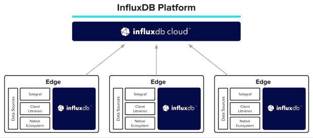
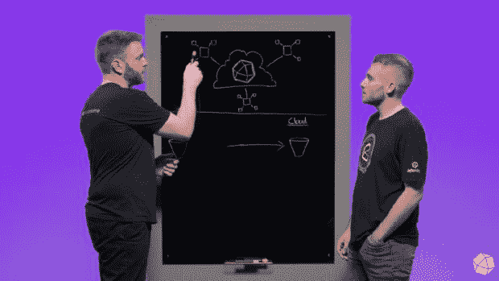

# 一种在边缘复制数据的方法

> 原文：<https://thenewstack.io/influxdatas-edge-data-replication-is-critical-first-step/>

边缘数据正在爆炸式增长，但组织很难将数据集中在一起，以供开发人员、数据科学家和其他 DevOps 团队成员随时随地使用，这是它带来的挑战之一。作为一种潜在的解决方案，InfluxData 的边缘数据复制使开发人员能够在边缘的 InfluxDB 中收集、存储和分析高精度的时间序列数据，同时将这些数据的全部或子集复制到 InfluxDB 云中——该公司表示。

InfluxData 正在宣传其 Edge 数据复制是一个重要版本，以补充其作为时间序列数据平台和监控提供商的面包和更好的产品。该公司将其描述为“InfluxData 之旅的关键第一步”，边缘数据复制旨在帮助解决能源、制造、航空航天和科技领域其他数据密集型行业的分布式工业和物联网(IoT)应用程序的时序数据集成和编排挑战。

“边缘数据复制是我们第一个专门为将我们的产品定向到垂直集成堆栈而构建的产品，这种解决方案不是边缘或数据中心或云，而是一种可以捕获、存储和分析时间序列数据的解决方案，它对您和您的用例最有意义，” [Brian Gilmore，](https://www.linkedin.com/in/industrialdata) [InfluxData](https://www.influxdata.com/?utm_content=inline-mention) 的物联网和新兴技术总监告诉新堆栈。边缘数据复制是我们针对当前 InfluxDB 2 一代的解决方案，但随着我们将 IOx 推向市场，首先在云中，然后在边缘，客户将能够利用更多的便利和功能来实现真正的混合和分布式时序应用。"

## 艰难的道路

Gilmore 说，如果没有边缘数据复制，DevOps 团队必须投资于队列、代理、可观察性管道系统和其他工具，或者自己构建它们，以便协调他们的时序数据管道。相反，边缘数据复制将通常臭名昭著的复杂边缘云数据管理和编排流程的机制和可观察性整合到数据库中，“它可能一直属于那里”，吉尔摩说。“以前可能需要数千行代码和配置的事情现在可以通过几个简单的 InfluxDB API 调用来处理，”Gilmore 说。

这种通过低延迟连接将来自云和边缘的分布式不同来源的数据拉入可通过单一 API 访问的单一数据层的能力，类似于作者心目中的 Kafka 数据流平台。然而，边缘数据复制并非如此，吉尔摩说。这是因为边缘数据复制依赖于磁盘备份队列(而不是 Kafka)来维护复制流。Gilmore 说:“磁盘支持队列与 Kafka 等使用外部流媒体管道的其他解决方案之间的主要区别在于，它完全集成了 InfluxData 的 Flux 处理(InfluxDB 的数据脚本语言)和桶存储模型。

Gilmore 说，最简单的例子是使用 Telegraf (InfluxData 的开源收集代理)将流 IIoT 数据摄取到边缘的 InfluxDB 中，近乎实时地对这些数据进行 Flux 处理，以进行处理、聚合、丰富或分析，并将 Flux 处理的结果输出到复制桶中。“处理后的数据将以尽可能接近实时的方式‘出现’在 InfluxDB 云中，”吉尔摩说。

吉尔摩说:“所以，从高层次来说，如果你在使用卡夫卡，这个模式就是‘把持久性融入流媒体’。”借助边缘数据复制，您可以“将流构建到持久性中”"

## 为什么不保持在边缘呢

然而，问题仍然是为什么将边缘上的时间序列数据集中到云环境中是最佳的。吉尔摩说，这种担心实际上没有抓住重点。问题在于，边缘数据复制“更多的是以最合理的方式智能地将存储和分析工作负载从边缘分发到云，而不是运送到云。吉尔摩说:“将传感器数据直接发送到云端，在那里进行分析，然后将洞察返回到边缘，这对于 IIOT 应用的实时需求来说是不切实际的。“另一方面，由于边缘硬件和网络可用性和可靠性的当前限制，在边缘加载基础设施以实现类似云的机器学习、全球可见性和其他资源密集型处理所需的马力也是不切实际的。”

一个关键的要点是，边缘数据复制实现了“两全其美的解决方案”，即在边缘收集、存储和分析本地化的高精度数据，用于实时用例，并可以战略性地镜像到云计算和存储，或用于全局可见性，在这种情况下，由于云提供商的进出成本，降低精度是可以接受的，并且通常是可取的。

InfluxData IoT/Edge 的高级产品经理 Sam Dillard 与 influx Data 的开发者倡导者 Jay Clifford 一起介绍了边缘数据复制如何在工作分布式环境中发挥作用。

在一个[演示中，](https://www.youtube.com/watch?v=qsj_TTpDyf4&ab_channel=InfluxData)influx Data、IoT/edge 的高级产品经理 Sam Dillard 描述了边缘数据复制如何充当“整个基础设施、整个车队”的中心枢纽或可见性汽车制造商可以利用这个中央数据中心，因为它可能在世界各地都有设施，在不同的地点有本地操作员，他们在这些地点本地操作设备和创建数据。“边缘数据复制提供了云中的所有数据，数据科学家、业务分析师和其他工程师付费，他们可以获得整个车队的整体情况，”迪拉德说。

边缘数据复制在未来也将变得更加重要，因为边缘环境预计将在近期和长期内继续大幅增长。根据 Gartner 分析师 [Julia Palmer](https://www.linkedin.com/in/juliagartner/) 和 [Raj Bala](https://www.linkedin.com/in/rajbala/) 撰写的 Gartner“混合云存储市场指南”。边缘数据也将越来越需要以集中的方式访问，通常通过单个 API，开发运维团队可以按需访问，这正是边缘数据复制的设计目的。

“企业现在采用机器学习模型和边缘计算来预处理数据，而不仅仅是将数据迁移到云中。帕尔默和巴拉写道:“早期采用者正在边缘、核心数据中心和公共云之间进行多方向的数据同步，而不是单向归档。“双向同步允许企业利用云服务提供商计算基础设施的弹性。此外，随着边缘计算的即将扩展，对支持边缘存储和多个公共云提供商之间的数据工作流的解决方案的需求将会越来越大。”

<svg xmlns:xlink="http://www.w3.org/1999/xlink" viewBox="0 0 68 31" version="1.1"><title>Group</title> <desc>Created with Sketch.</desc></svg>