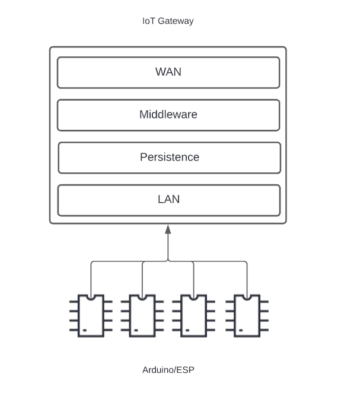
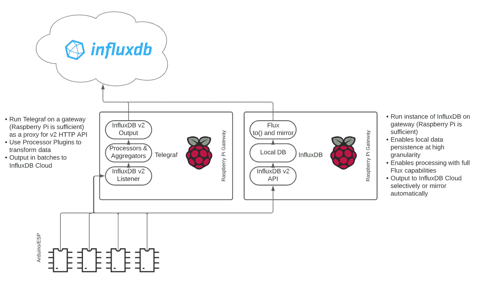
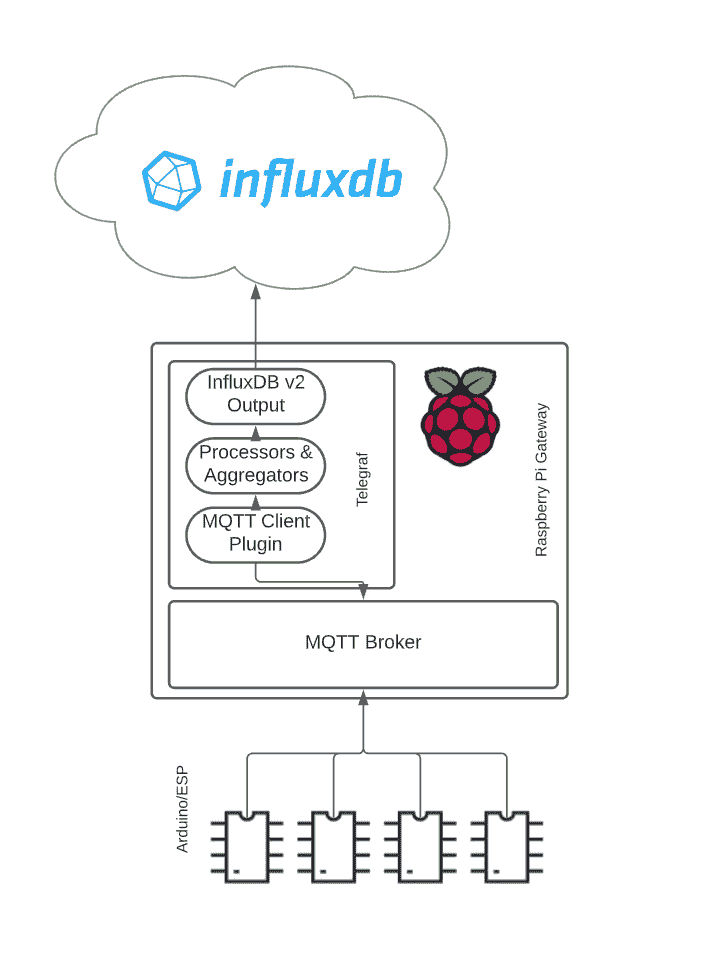

# InfluxDB 和 IoT: Arduino 微控制器最佳实践

> 原文：<https://thenewstack.io/influxdb-and-iot-arduino-microcontroller-best-practices/>

在这篇文章中，您可以了解更多有关 Arduino 和 InfluxDB 如何在实际的物联网应用中协同工作的信息。Arduino 是开源的，并且作为低成本、简单的架构的一部分，它提供了与 InfluxDB 良好协作的灵活性。

## Arduino 是什么？

 [布莱恩·吉尔摩

Brian 是 InfluxDB 的创造者 InfluxData 的物联网产品管理总监。](https://www.linkedin.com/in/industrialdata/) 

你需要知道的关于 Arduino 的一切都在 Arduino 官方网站上有很好的记录: [Arduino.cc](http://arduino.cc/)

总结一下这里的信息，Arduino 是一个开源电子平台。它旨在易于使用和集成，包括紧密耦合的软件和硬件，适用于物联网、工业和家庭实验室环境中的各种应用。Arduino 架构的主要原则是其开源规范、跨平台客户端支持、简单的编程语言、低功耗要求，当然还有每台设备的低成本。你可以在任何在线电子产品零售商那里花大约 20 美元买到一个 Arduino 板。

Arduino 编程的基础依赖于相对简单的脚本，称为“草图”这些脚本是用 Arduino 编程语言创建的，这种语言在大多数情况下是 C++的变体。Arduino IDE 对 C、C++和 Arduino 有很好的支持，但在许多情况下，用户可能会决定使用像 VS 代码这样的全功能 IDE 对 Arduino 或其完整的物联网堆栈进行编程。为 VS 代码安装 Arduino 和 Flux 扩展打开了 Arduino 端到端开发的大门，Arduino 是一个物联网网关，也是基于 InfluxDB 构建的时序应用。

在官方 Arduino 硬件之上，还有几十个或更多来自其他微控制器制造商的兼容板。这些主板是围绕开源的 Arduino 硬件和软件规范构建的，但可能包含其他超出规范的功能。包括 ESP32 和 ESP8266 在内的 Expressif 的几种流行板都属于这一类。在本文中，我们将所有 Arduino 兼容板视为相同。

## Arduino 和 InfluxDB 集成的最佳实践

有一个著名的 [Arduino 库，用于集成 ESP8266 和 InfluxDB](https://www.arduino.cc/reference/en/libraries/esp8266-influxdb/) 。InfluxDB 是这个库的贡献者/维护者，你可以在我们展示 SDK 库的产品中找到对它的引用，甚至在我们新的笔记本界面中。

这个库提供了一个非常好的、直接的方法，将数据从 Arduino 发送到 InfluxDB 的本地实例。它还增加了从同一个本地实例或 InfluxDB 查询数据的功能。虽然 SDK 支持直接写入 InfluxDB 云，但在生产环境中有更好的选择。

当证书过期时，更新单个 Arduino 不成问题，尽管该库目前附带的 ISRG Root X1 证书有效期至 2035 年，但想象一下管理 50 或 100 台基于 Arduino 的物联网设备。定期刷新以取代直拨指令并不是最佳途径。跳过证书验证是一个选项，但是除了点对点家庭实验室和原型制作之外，显然不推荐使用它。

相反，在物联网架构中，通常使用“网关”，即充当边缘设备与外部和云应用或服务之间的代理的中间设备或应用。这种架构的简单表示:

将许多边缘控制器的连接和通信集中化增加了以下便利:

*   **微控制器的局域连接:**对于大多数应用来说，对网络进行分段，使微控制器、执行器和传感器位于网络的一个划分好的网段上，而不是公共互联网上，这对于可管理性和安全性来说是一大优势。

*   **更少的点对点连接:**上图中，边缘层用四个 Arduinos 表示。在许多情况下，这可能是数十或数百台设备。当需要通过 IP 进行点对点连接时，远程监控如此多的设备可能是一个挑战。无论是管理静态 IP 地址还是通过 ngrok 之类的代理服务，从 IDE、Arduino 到 Arduino 以及 Arduino 到云的安全连接在规模上都会极其困难。使用网关提供了可以监控和保护的单一访问点。

*   **更好的数据管理:**在网关中启用持久层和处理层(中间件)将带来几个好处。首先，Arduinos 之间的数据共享可以通过网关上的代理来完成。这是一种常见的架构，它还可以显著减少点对点通信，并在网关上实现有保证的消息传递和本地数据存储，这在网络通信不完全可用和可靠时非常重要。

好消息是，你可以使用像树莓派(约 35 美元)这样的低成本硬件。还有研华、戴尔等优秀的“工业级”物联网网关。您的主要选择标准是连接端口、处理器选择和操作系统。如果你已经在用 Arduino 编程，你很可能能够使用基于 Linux 的 Raspberry Pi，特别是如果你正在为家庭使用进行原型开发或开发。

以下是使用此模型进行 InfluxDB 数据收集的两种基本架构—一种使用 telegraf，另一种使用边缘部署的 InfluxDB 添加本地持久性:

这两种模型都允许您使用 REST 或 Arduino SDK 向 InfluxDB 端点发送数据。或者，如果您使用 USB 或 pin 上的串行连接，您可以在 Raspberry Pi 上运行 Python 脚本，定期从 Arduinos 收集数据，将其格式化为 line 协议，并将其推送到 localhost 上的流入端点。我们的团队已经写了一篇使用这种架构的很棒的博文。你可以在这里了解更多信息。

## 额外奖励:向您的网关添加 MQTT 代理:

如上所述，向您的网关添加一个代理提供了一个潜在的关键层，以允许多个消费者和生产者以发布/订阅的方式进行通信。MQTT 代理使用主题，有时称为通道，作为客户机创建和传输的特定信息的端点。

主题是分层的，因此您可以在其中定义模式，以使机器对机器的通信变得简单和自文档化。例如，以下是您可以在家庭实验室中使用的主题列表:

#/HomeLab/Arduino1/temp

#/HomeLab/Arduino1/hum

#/HomeLab/Arduino1/press

#/HomeLab/Arduino2/temp

#/HomeLab/Arduino3/temp

可以看出，访问信息就像理解主题结构一样简单。客户端可以发布到他们自己的主题树，或者订阅对等体的主题树，以便在发布时交换信息。InfluxDB 已经开发了一个 telegraf 插件来轻松订阅和解析 MQTT 主题，因此在上面左侧的架构中添加一个 MQTT 代理将在可靠性、安全性和长期可支持性方面带来显著的好处。在这种情况下，您的 Arduinos 对上游的 InfluxDB 一无所知。有许多关于从 Arduino 发布到 MQTT 主题的操作方法。

您也可以在这个架构中添加一个本地 InfluxDB，尽管目前需要在网关上加载 Telegraf 和 InfluxDB，这可能根本不是问题。

总之，有几种可能的架构可以将数据从连接到 Arduino 的传感器传送到 InfluxDB。使用最佳实践和强大的物联网架构，我们可以始终确保我们的试点或原型随时准备好扩展到生产。

<svg xmlns:xlink="http://www.w3.org/1999/xlink" viewBox="0 0 68 31" version="1.1"><title>Group</title> <desc>Created with Sketch.</desc></svg>