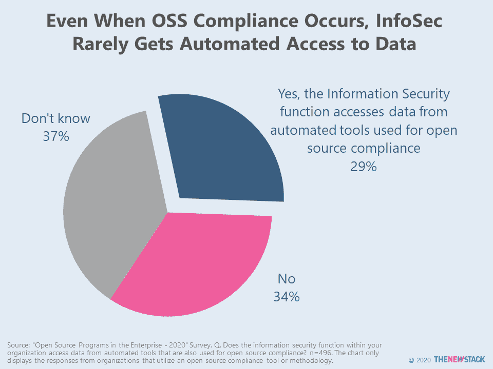
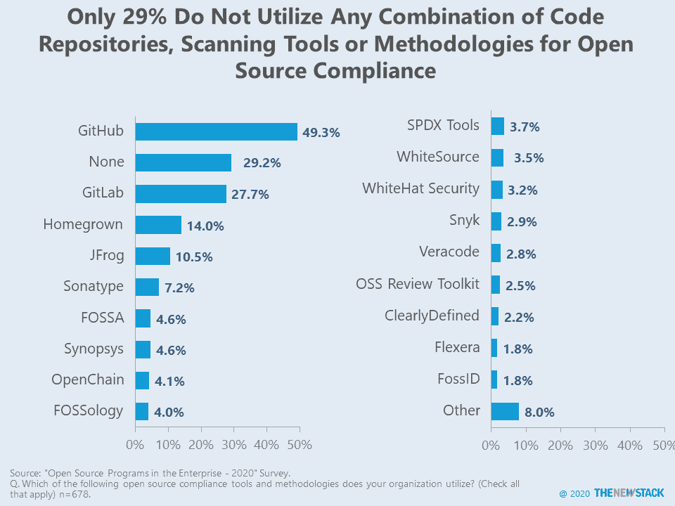

# InfoSec 使用开放源码软件合规工具

> 原文：<https://thenewstack.io/infosec-use-of-open-source-software-compliance-tools/>

不要再问如何[将安全性集成到开发管道](https://thenewstack.io/software-supply-chain-secure-3)中，开始谈论信息安全专业人员如何利用开源合规性。

安全专家对开发人员如何利用传统应用安全软件感到[不满](https://thenewstack.io/culture-vulnerabilities-and-budget-why-devs-and-appsec-disagree)。根据 WhiteSource Software 最近的[调查](https://www.whitesourcesoftware.com/whitesource-devsecops-insights/)，他们认为如果他们的工具更容易集成、更准确，那么开发人员就更有可能采用他们。该调查比较了 220 多名安全专业人员和 280 多名软件开发人员、架构师和 DevOps 从业者的回答。

但是易于集成可能不会阻碍开发人员。虽然 48%的安全受访者认为集成的容易性是采用特定 AppSec 工具的开发人员最重要的特性，但只有 22%的开发人员持同样的观点。这种差异是因为许多开发人员不认为任何额外的功能会让他们更有可能使用为安全专业人士构建的工具。

一种不同的看待事物的方式是从开发者、架构师和开发者的角度。这些工作角色通常利用软件组合分析软件，该软件同时扫描许可证合规性、依赖性和漏洞。

在我们最近的[“企业中的开源”](https://thenewstack.io/open-source-contributions-on-the-rise-in-fintech-healthcare-and-government/)中，近 500 家受访企业使用了开源合规工具或方法，这表明开源合规已被许多企业接受。但它仍有很长的路要走，因为该群体中只有 29%的人肯定地同意信息安全职能部门从用于开源合规性的自动化工具中访问数据。另有 37%的人回答“不知道”，这表明在所谓的 DevSecOps 生态系统中的各个群体之间明显缺乏可见性。

尽管基于相当小的样本量，TNS 进行的另一项[调查发现，在 DevOps 领导选择扫描工具的公司中，信息安全团队更有可能利用依赖扫描。应用程序开发团队通常不会领导在 CI/CD 管道的部署或发布管理阶段使用的扫描工具的选择过程。如果](https://thenewstack.io/unmaintained-dependencies-and-other-ways-to-measure-ci-cd-security/)[开发商再次掌权，这种情况会改变吗？](https://thenewstack.io/developers-are-in-charge-again/)

与五年或十年前相比，开发商是否真的在 it 和软件产品的购买过程中获得了额外的投入或影响，这是有争议的。然而，不可否认的是，开发人员继续对云、数据、安全、企业和许多其他类型的架构的方向产生巨大的影响。有时，开发人员的建议会影响将在公司范围内使用的软件的采购，但通常采用是逐渐发生的，一次一个同事和一个部门。

风险投资家[泰勒·朱厄尔](https://github.com/TylerJewell)一直在追踪他所描述的[开发者主导的景观](https://tylerjewell.substack.com/p/the-developer-led-landscape-20-08-28?utm_source=thenewstack&utm_medium=website&utm_campaign=platform)产品直接卖给开发者，受购买影响，或被开发者消费。他特别感兴趣的是 277 家公司，这些公司被他确定为构建硬件和软件以支持可重复软件构建的开发者基础设施。在这个部分中是工件存储库和代码+应用程序安全空间。

我们期待为朱厄尔的[产品和公司](https://github.com/TylerJewell/DevLandscape/blob/master/Companies)列表提供更多建议。同时，看看我们的调查对象在开源软件合规性方面的使用情况。

本图更新于 2020 年 10 月 13 日。标题不再引起对图表领导者的注意，少于 1%的选择被归入“其他”类别。

<svg xmlns:xlink="http://www.w3.org/1999/xlink" viewBox="0 0 68 31" version="1.1"><title>Group</title> <desc>Created with Sketch.</desc></svg>