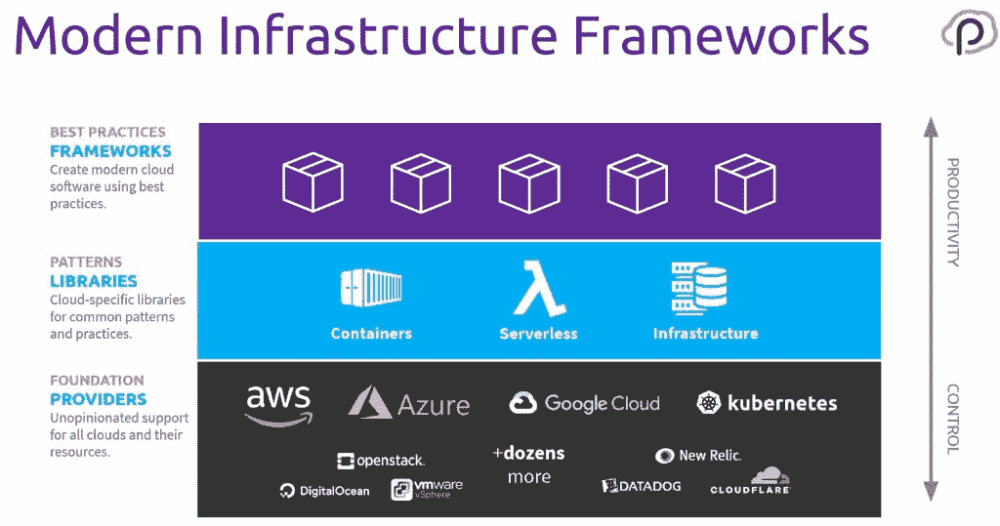

# 基础设施是代码，在 Pulumi 2.0 中，架构和策略也是

> 原文：<https://thenewstack.io/infrastructure-is-code-and-with-pulumi-2-0-so-is-architecture-and-policy/>

Pulumi 平台背后的想法是，当开发人员、运营团队，尤其是 devo PS(T2)使用编程语言、开发工具和开发管道构建基础设施时，他们会更有效率。不仅仅是因为他们很熟悉，还因为他们有丰富的工具和强大的构造和抽象来创建软件——而现代基础设施(大部分)是软件。

软件开发也是关于模块化的、可重用的组件，这些组件可以共享和分发，使用生态系统工具，如包管理器，让您将资源组合到一个架构中。有了 Pulumi 2.0 版，团队现在可以像开发应用程序一样重用代码、应用策略和进行基础设施的集成测试。

Pulumi 创始人兼首席执行官 [Joe Duffy](https://www.linkedin.com/in/joejduffy/) 告诉 New Stack:“在团队中如何运营基础设施的端到端生命周期跨越了供应之外的许多不同方面。“您如何在您的组织中实现持续交付，您如何制定应用程序和基础架构代码策略，并能够围绕安全性、合规性、成本管理等实施最佳实践。”

他指出，新版本中有更多的 CI/CD 集成，因为尽管命令行界面很受欢迎，“大多数从事生产的人都在使用类似 Spinnaker 或 Azure DevOps Pipelines 或 codefresh 或这些系统中的一种”。

这种方法使得 Pulumi 非常适合 GitOps 模型。“当你在 Pulumi 上做部署时，它几乎就像你在 GitHub 上用 git commits 得到的一样。基础设施的变化也是如此，你可以看到不同之处；您可以看到谁在何时更改了什么，它链接回触发此操作的 git commit、分支和 pull 请求。您甚至可以将它集成到您的拉式请求工作流中，以便在您实际合并变更之前，您可以看到带有基础架构变更注释的拉式请求。”

> “Kubernetes 对于您的计算是什么，Pulumi 对于您的基础设施交付方法是什么。”—乔·达菲

这种端到端的可见性使得在应用基础架构更改之前与同事一起审查它们变得更加容易，因为这样更容易看到效果。将测试创建为代码也是其中的一部分。

“测试实际上是一个非常常见的领域，你可以使用编程语言实现高度自动化，使用大量工具和测试框架，并将其应用于基础设施测试。我们看到人们对不同类型的测试充满热情，无论是单元测试、与短暂环境的集成测试，还是像模糊测试这样的高级测试。如果出现网络故障会怎么样，如果我的一个虚拟机随机死亡会怎么样？”

## 由公共组件组成基础设施

使用代码来部署基础设施不仅仅使部署可重复:它使部署可重复和可重用，因为代码描述的不仅仅是一个实例，而是一个架构。

“使用真正的编程语言意味着你可以共享、重用和包，你可以用更小的东西构建更大的东西。许多团队正在利用这一点来真正提升他们对其架构和云架构的思考方式，并使用编程语言构造对其进行编码。现在，我们已经构建了一个组件模型，这样您就可以创建可重用的组件，这些组件基本上类似于 Pulumi 资源，但您是自己创作的。”

图表由 Pulumi 提供。

软件包符合 Pulumi 用来简化跨多个提供商构建基础设施的分层方法:“我们的大多数主要客户都必须以这样或那样的方式处理多云，”他指出。

“我们将它视为一个范围，在底部，我们有超过 30 个基础提供商，他们只是库，但对于那些想要完全访问整个云的人，我们不会阻止他们；没有固执己见。除此之外，我们对常见模式的库进行分层，如在 Azure 中创建网络或在 Amazon 中发布到私有 Docker 注册表。然后在顶部，我们有这些最佳实践框架，它们确实具有最高的生产力。但你可以选择在光谱的哪个点上编程，你甚至可以混合搭配这些东西。”

大约三分之一的客户使用 Pulumi 来管理 Kubernetes，无论是基础设施还是集群内的资源。“Kubernetes 对于您的计算非常重要，而 Pulumi 对于您的基础设施交付非常重要。当一个组织将 Kubernetes 引入组合时，它会发生如此大的变化，以至于在大多数情况下，团队会后退一步，重新思考整个方法。”

但这并不意味着他们只使用 Kubernetes。

“即使是采用 Kubernetes 的公司，他们仍然会使用 AWS 服务，他们会使用 s3，他们会使用 RDS，而不是在 Kubernetes 中托管自己的数据库，这对大多数人来说是多余的。他们的组合中仍有一些虚拟机。我们并不试图抽象不同云之间的差异，也不试图向您隐藏 AWS 的伟大之处。我们试图接纳让每个云提供商变得伟大的因素，并为您提供一种一致的做事方式。

Pulumi 2 还支持 Duffy 所说的使用包的“策略即代码”,这对安全工程师也很有用。“您可以使用自己喜欢的语言，并且可以编写这些策略包，如‘确保 RDS 运行的是 MySQL 版或更高版本’或‘确保我的安全组没有对互联网开放的入口规则’。”

策略与 Pulumi 的开源版本一起工作，但企业版具有在整个组织中强制执行策略的功能，集成了 SAML SSO 和身份系统，如 GitHub、Okta 和 Azure Active Directory，用于基于角色的控制。他说:“如果你想说‘我的生产堆栈不同于我的开发堆栈’，你可以‘通过政策’做到这一点。或者，如果您想说“我的安全工程师可以应用策略包，但我的开发人员无法控制运行什么策略，他们只是在部署时自动运行”，您可以在您的组织中单独设置这些角色。"

使用 Pulumi 消费基础设施和策略包依赖于熟悉的开发生态系统。“如果您将 npm 用于您的应用程序包，现在您可以将其用于基础架构包。或者，如果您使用 Artifactory 是因为您在发布新的二进制文件时需要端到端的签名流程，那么现在您可以将其应用于基础架构和策略。

作为开源供应链的一部分，包身份和出处的问题正在受到更多的审查，Duffy 指出，使用现有的包管理器意味着 Pulumi 将继承他们采用的解决方案，但对于策略包已经有了额外的保护措施。

该公司将语义版本化应用于“策略代码包，并且企业管理的一部分能够应用策略包的特定版本，并且知道那些版本是签名的并且来自正确的地方。我们在路线图中增加了额外的功能，对检查本身进行额外的签名，这样运行的策略就会有某种校验和，以确保正确的策略在运行时实际运行。”

## **按需开发**

即使使用 DevOps 和 Kubernetes 作为公共接口，许多组织中仍然存在开发人员和基础设施运营的孤岛。达菲说，这减缓了云的采用和应用程序的现代化。“团队选择 Pulumi 的原因是他们希望他们的开发人员在构建软件时将云视为头等大事。他们不希望这是事后的想法。他们不希望开发人员开发出新功能，然后把它扔在墙上，让基础设施团队来处理。他们想推倒那些墙。”

使用代码来管理基础设施、架构、策略和测试意味着他们可以基于单一方法实现标准化，并将其转变为内部平台。“基础架构团队可以采用他们的体系结构并将其编码到包中，然后安全团队可以与他们合作，以确保他们制定了正确的策略，然后开发人员可以更加自助化，并知道他们正在以正确的方式做事，安全团队已经确保以正确的方式实施策略。”

过去，基础架构团队可能会为开发人员提供预打包的虚拟机以供启动。现在，他们可以更加细化，但将有模式和政策。“开发者可能会说‘给我一个新的微服务吧。’什么是微服务？这是基础设施团队构建的蓝图，它封装了所有关于网络的混乱细节，以及您如何知道它如何使用或不使用 Kubernetes API 或私有 Docker 注册表。"

### 更多语言向更多开发者开放基础设施

支持 Python，Go，。Net 和 C#在 Pulumi 2 中更加成熟。“当我们做到了。达菲指出:“Net 我们也得到了 F#。"用函数式语言做基础设施是非常自然的，因为在某种意义上它是声明性的."

PowerShell 支持仍然是一个概念验证，Pulumi 计划在 2.0 发布一个月后将它添加到 2.1 版本中之前，与一些企业客户进行验证。

已经有很多支持 Java 的请求(对 Scala 支持的请求也几乎一样多)；达菲说，这和 Ruby 一起“即将出现”。“没有承诺，但几乎肯定会在某个时候发生。”

对语言的全面支持意味着使用正确的工具和语言的习语。这意味着能够使用带有 Python 代码的 IDE 调试器。“作为一家初创公司，我们不必为世界上所有不同的编辑器疯狂地实现插件:这只是点亮和工作而已。你已经知道的工具，无论是 linter 还是测试框架，静态分析，代码搜索，重构；现在，您所知道的所有这些都适用于您的基础设施代码。”

达菲说，增加新的语言会带来新的生态系统和新的开发者社区。“我们发现 Node.js 对开发人员有很大的吸引力。坦率地说，大多数基础设施团队都会说‘我不想接触 JavaScript，但我喜欢 Python。’许多运营人员都有一些 Boto 脚本，他们做过 Chef 和 Puppet，所以他们知道 Ruby——所以 Python 对他们来说是很容易掌握的。Go 确实引起了构建大型系统的人们的共鸣，其中基础设施供应是该系统的一部分。"

例如，蟑螂实验室正在使用 Pulumi 为新客户构建数据库即服务的新实例。“你进入他们的页面，点击一个按钮，它就会转出一个新的蟑螂数据库；在后端，他们实际上是使用 Pulumi 来构建 Kubernetes 集群，部署到其中，对资源进行版本控制，并跨多个云完成这些工作。”

这种集成曾经需要相当专业的知识来构建。Duffy 说，Pulumi 使它成为更多开发者的选择。

“如今大学毕业的人没有学过一些 YAML 方言或专有领域语言；但是他们确实学了 Python，他们确实学了 JavaScript。我们发现，与过去相比，这种方法使基础设施作为代码更容易被更多人访问。”

<svg xmlns:xlink="http://www.w3.org/1999/xlink" viewBox="0 0 68 31" version="1.1"><title>Group</title> <desc>Created with Sketch.</desc></svg>