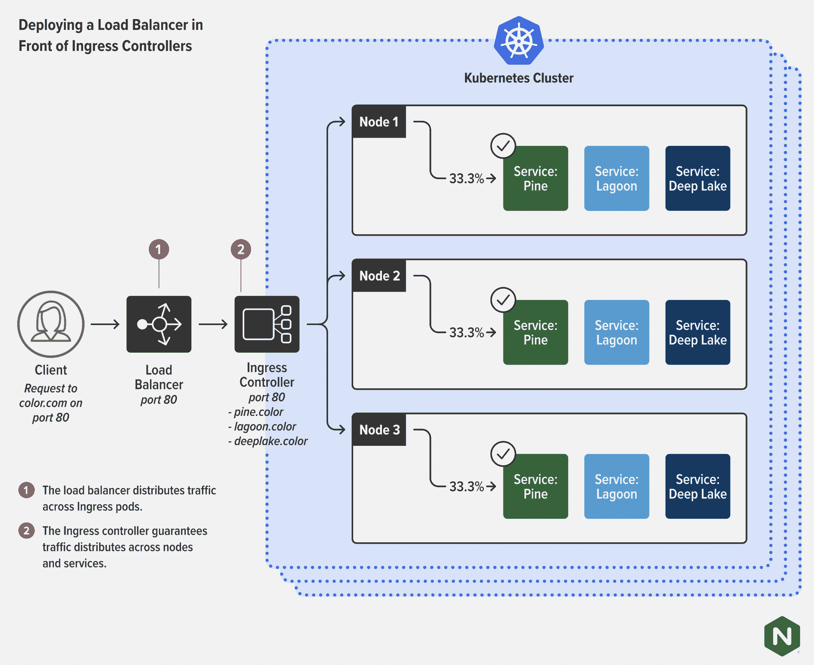

# 入口控制器:Kubernetes 的瑞士军刀

> 原文：<https://thenewstack.io/ingress-controllers-the-swiss-army-knife-of-kubernetes/>

一个[入口控制器](https://www.nginx.com/resources/glossary/kubernetes-ingress-controller)可能看起来只是 [Kubernetes](https://thenewstack.io/category/kubernetes/) 领域的另一个技术部件。许多人认为它们是低价值的商品，但实际上，它们可能是你手中的强大工具。如果部署和配置得当，入口控制器可以从根本上简化 Kubernetes 集群的操作，同时增强安全性并提高性能和弹性。

入口控制器通过悄悄地承担其他工具或解决方案提供的许多功能来做到这一点。因为入口控制器是专门为 Kubernetes 设计的，所以它们可以更容易地承担这些功能——而不是试图将现有的技术结构，如[负载平衡器](https://www.nginx.com/resources/glossary/load-balancing/)、 [API 网关](https://www.nginx.com/learn/api-gateway/)和[应用交付控制器](https://www.nginx.com/resources/glossary/application-delivery-controller/)(ADC)，适应 Kubernetes 的怪异而精彩的[世界。入口控制器的多功能性是它们如此像瑞士军刀的部分原因。](https://www.nginx.com/blog/kubernetes-networking-101/)

## 为什么需要入口控制器

*入口控制器对于定义和管理 Kubernetes 中的入口(南北)流量至关重要，Kubernetes 是一个比非 Kubernetes 应用更复杂的入口环境。*

默认情况下，外部网络和流量无法访问 Kubernetes pods(和容器)中运行的应用。库伯内特斯的豆荚只能相互交流。Kubernetes 确实有一个用于 HTTP(第 7 层)负载平衡的内置配置对象，称为 *ingress* 。该对象定义了 Kubernetes 集群之外的实体如何连接到标有一个或多个 Kubernetes 服务的 pod。当您需要提供对 Kubernetes 服务的外部访问时，您可以创建一个[入口资源](https://kubernetes.io/docs/concepts/services-networking/ingress/)来定义连接性规则。这包括 URI 路径、支持服务名称和其他信息。然而，入口资源本身并不做任何事情。您必须部署和配置入口控制器应用程序(使用 Kubernetes API)来实现入口资源中定义的规则。

换句话说，您确实需要部署一个入口控制器来利用 Kubernetes 现有的资源和对象结构。不这样做意味着要更加努力地使用服务对象和外部设备的组合来创建更详细的规则。无入口控制器方法不可扩展、昂贵，并且需要大量工程时间。

## 入口控制器如何与负载平衡器一起工作(或替换负载平衡器)

*入口控制器可以独立工作来平衡和调整流量，也可以与您的负载平衡器配合使用来释放 Kubernetes 的能量并提供更好的应用性能。*

提醒:“负载平衡器”服务不同于专用负载平衡器。

入口控制器有时被描述为 Kubernetes 的“专用负载平衡器”。这就引出了一个问题:您需要负载平衡器和入口控制器吗？嗯，答案是:视情况而定。正如前一篇文章“[复制，而不是整合:应用的前进之路](https://thenewstack.io/duplication-not-consolidation-the-path-forward-for-apps/)”中所讨论的，有时您需要根据谁在使用该工具以及它部署在哪里来进行一些功能复制。

对于许多用例，尤其是如果您要扩展 Kubernetes 或在高合规性环境中，组织会同时部署入口控制器和负载平衡器。尽管它们部署在不同的地方，用于不同的目的，并由不同的团队管理。

*   **负载均衡器(或 ADC):**
    *   **管理者:**网络运营团队(或者安全运营团队)
    *   **部署:**在 Kubernetes 之外，作为向集群之外的用户交付服务和应用的唯一面向公众的端点。用作更通用的设备，旨在提高安全性并提供更高级别的网络管理。
*   **入口控制器:**
    *   **管理者:**平台运营或开发运维团队
    *   **部署:**在 Kubernetes 内部实现细粒度的南北负载均衡能力(HTTP2、HTTP/HTTPS、SSL/TLS 终止、TCP/UDP、WebSocket、gRPC)。授予应用程序团队的某些配置方面——如 URI 或路径——以及高级反向代理或 API 网关功能。

在此图中，负载平衡器处理多个集群之间的流量分配，而集群具有入口控制器，以确保服务的平均分配。

## 入口控制器=安全工具

*入口控制器可为应用安全提供精细的集成层，适用于“左移”安全状态，并与应用团队而非网络运营或全球安全团队使用的低级安全工具更好地集成。*

入口控制器可以成为您安全武器库中的一个关键工具，并帮助您将安全转移到左边，更好地匹配微服务和[现代应用](https://www.nginx.com/blog/defining-a-modern-app/)的需求和风险。入口控制器的一些主要安全优势包括:

*   **防止通过配置不良的负载平衡器直接访问 pod**
    入口控制器充当第二层访问控制，以防全局负载平衡器配置漂移到不安全的设置。
*   **实施 mTLS** 由于入口控制器设计为在节点和 pod 级别运行，并且是运行在服务之上的控制环路，因此它们是实施加密行为的最佳位置，最接近实际应用。
*   **异常检测和强制执行** 入口控制器使制定逻辑规则来处理可能是不良行为迹象的异常变得更加容易。在全球层面上，这些异常可能难以理解或衡量。虽然对于管理微服务的较小团队来说，生成这种逻辑的最佳位置是在 DevOps 和服务开发者本身的级别；他们知道他们的流量应该是什么样子，以及应该应用什么规则。
*   **与 WAFs 更紧密的集成** 在大多数情况下，任何在 Kubernetes 中部署生产应用的人都需要使用 web 应用防火墙(WAF)来保护应用和集群。WAFs 可以过滤掉不良流量，保护暴露的应用程序。也就是说，像异常检测一样，配置为在企业环境的全局级别进行保护的 waf 就像是钝器，不太适合在应用程序层实现更细粒度的安全性。出于这个原因，许多团队现在在 Kubernetes 的入口层运行他们自己的 WAFs，并与全球 WAFs 分开管理。这些特定于应用的 waf 在入口控制器级别更易于管理、集成和配置，了解应用的团队可以设置入口/出口和安全策略。

## 入口控制器= API 网关

*入口控制器以 Kubernetes-native 的方式整合了大多数 API 网关功能，在提高性能的同时降低了复杂性和成本。*

采用入口控制器的最佳理由之一是成本节约和简单性。由于入口控制器是一种专用代理，它有可能满足许多与更传统的代理(负载平衡器/反向代理或 ADC)相同的使用情形。这包括许多负载平衡和 API 网关功能，例如:

*   TLS/SSL 终端
*   客户端身份验证
*   速率限制、重启和超时
*   细粒度访问控制
*   第 4 层和第 7 层的按请求路由
*   蓝色/绿色和淡黄色部署
*   传统协议(UDP、TCP)的路由
*   新协议路由(gRPC)
*   报头和请求/响应操作
*   SNI 路由
*   基于高级服务/pod 运行状况规则的路由

注意:“API 网关”经常被当作一个独特的产品来讨论。事实上，它是一组可以由代理完成的用例。最常见的情况是，负载平衡器、ADC 或反向代理被实现为 API 网关。然而，在 NGINX，我们越来越多地看到入口控制器和服务网格被用于 API 网关功能。

您不一定会发现入口控制器和标记为 API 网关的工具之间的功能相同，这没关系。在 Kubernetes 中，您实际上并不需要所有那些额外的特性，并且试图实现它们可能会给您带来麻烦。Kubernetes 中两个最适用的 API 网关用例是流量管理(协议、整形、分割)和安全性(认证、端到端加密)。考虑到这一点，您需要一个入口控制器来处理以下问题:

*   方法级路由/匹配
*   认证/授权卸载
*   基于授权的路由
*   协议兼容性(HTTP、HTTP/2、HTTP/3、WebSockets、gRPC)

您的开发人员将会感谢您，因为入口控制器允许他们以 Kubernetes-native 方式(声明性/命令性 YAML)定义 API 网关或负载平衡器功能，从而轻松融入他们的工作流。您的法律和财务团队也是如此，成本更低，需要跟踪的许可证更少。最后，客户和用户可以获得更好的体验，因为从流量路径中移除额外的控制元素总是会带来更好的性能。

阅读"[我该如何选择？API 网关与入口控制器与服务网格"](https://www.nginx.com/blog/how-do-i-choose-api-gateway-vs-ingress-controller-vs-service-mesh/)，了解有关该主题的更多信息，包括南北和东西 API 流量的示例场景。

## 入口控制器=可观察性和监控发电站

*入口控制器监控所有进出的流量，这意味着入口控制器有可能提供一个轻量级、集成且易于管理的监控和可观察层。*

因为它位于集群的前面，控制 L4-L7 流量和传统或非 HTTP 协议流量，所以您的入口控制器可以优先查看您的应用和基础架构的运行状况。这是强大而有用的。您可以轻松地将流量监控从现有的数据和控制平面扩展到观察工具中，如 [Prometheus](https://prometheus.io/) 。事实上，大多数入口控制器都与众所周知的 [CNCF](https://www.cncf.io/) 监控和观察工具集成在一起，比如前面提到的普罗米修斯及其紧密联系的朋友[格拉夫纳](https://grafana.com/)。有两种使用情况可以通过入口控制器解决:

*   **缓慢的应用程序:**如果你的应用程序很慢——或者停机！—具有实时监控功能的入口控制器可以帮助您准确定位问题所在。每秒请求数低可能表明配置错误，而响应时间延迟可能表明上游应用程序有问题。
*   **HTTP 错误:**如果您的集群或平台资源不足，您可以使用来自 ingress 控制器的历史数据来寻找趋势。这就是 Grafana 这样的工具对可视化数据特别有用的地方。

[“如何提高 Kubernetes 中的可见性”](https://www.nginx.com/blog/how-to-improve-visibility-in-kubernetes/)更深入地涵盖了这些用例，包括一个使用 NGINX 工具与 Prometheus 和 Grafana 一起解决 Kubernetes 问题的演示。

对于某些[服务网格](https://www.nginx.com/resources/glossary/service-mesh/)、负载平衡器和其他 Kubernetes 风格的网络工具，创建监控和可观察性会增加负载和延迟。此外，它们无法以与入口控制器相同的粒度级别解析流量。因为入口控制器不需要额外的 CRD 或对象添加到您的配置文件和 Kubernetes 堆栈中，所以您可以避免不必要的复杂性和延迟。毕竟，你部署的 CRD 越多，你的 Kubernetes 生活就变得越复杂。

## 结论:入口控制器不仅仅控制入口

希望现在你能更多地理解为什么入口控制器是 Kubernetes 网络的无名英雄，不使用入口控制器是一个真正的错误。有些警告是适当的:

*   并非所有入口控制器都能够满足本文中讨论的各种用例。NGINX 博客系列“[入口控制器选择指南](https://www.nginx.com/blog/guide-to-choosing-ingress-controller-part-1-identify-requirements/)”可以帮助您确定需求、规避风险、面向未来，并在复杂的入口控制器环境中导航。
*   如果你的入口规则设计得不好，你的 pod 资源不足，那么入口控制器会降低应用程序的速度。但是如果你设计好你的规则，在你的集群边缘放置一个入口控制器的名义成本将是你在性能上所能创造的改进的一小部分。

也就是说，入口控制器继续改进和增加功能，事实上，[网关 API](https://kubernetes.io/blog/2021/04/22/evolving-kubernetes-networking-with-the-gateway-api/) 的发布是社区投资入口控制器的一个很好的例子。

赌入口控制器就是赌 Kubernetes 的未来。因为构建现代应用程序完全是为了构建松散耦合的服务并使开发人员更加独立，所以部署入口控制器可以加速应用程序开发并加快迭代。Kubernetes 网络工具的瑞士军刀正是普通开发人员或 DevOps 团队智能、高效和安全地在应用之间转移流量所需要的。

<svg xmlns:xlink="http://www.w3.org/1999/xlink" viewBox="0 0 68 31" version="1.1"><title>Group</title> <desc>Created with Sketch.</desc></svg>