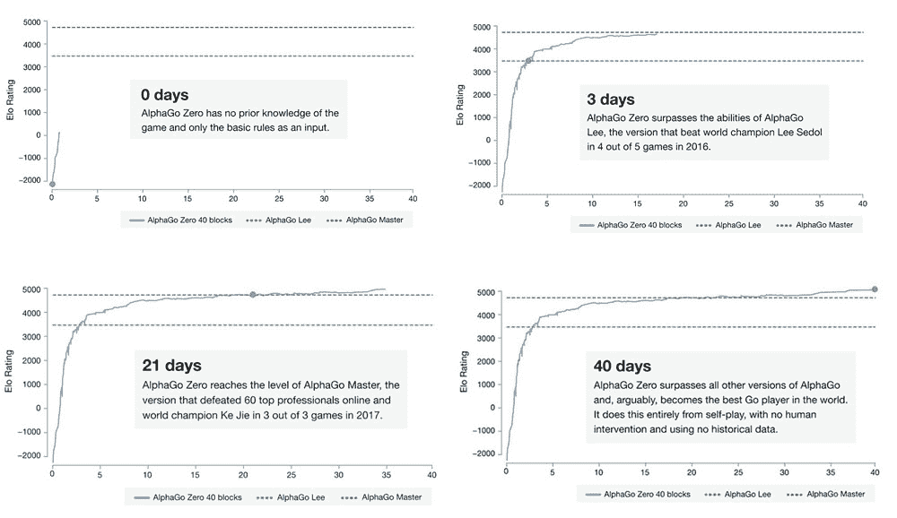
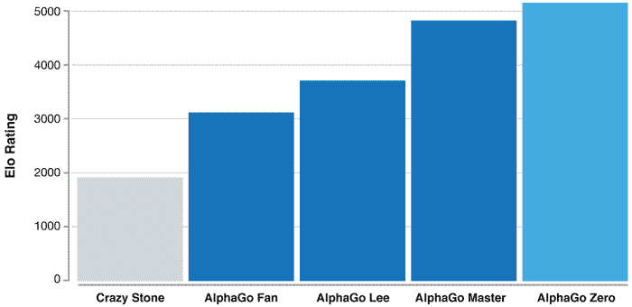

# 随着创新的游戏移动，谷歌的人工智能在 3 天内成为围棋大师

> 原文：<https://thenewstack.io/innovative-gaming-moves-googles-ai-becomes-go-grandmaster-three-days/>

这似乎是很久以前的事了，但就在去年，在这个机器越来越智能的加速时代，一个旨在在古老而复杂微妙的围棋比赛中击败世界上最好的人类选手的人工智能实现了这一壮举。AlphaGo 是由总部位于伦敦的人工智能实验室[谷歌](https://cloud.google.com/kubernetes-engine)的子公司 [DeepMind](https://deepmind.com/) 创造的围棋人工智能，去年当[击败传奇棋手 Lee Sedol](https://thenewstack.io/alphagos-win-human-go-champion-means-ai/) 时，它让许多专家观察者感到惊讶，并在今年早些时候决定性地赢得了围棋世界冠军柯洁的三场比赛，然后退出比赛。

尽管 AlphaGo 有着明显的实力，但它依赖人类的专业知识来训练它。人工智能从超过 100，000 个大师级游戏的数据集学习，此外还从多次与自己玩游戏中收集到改进。然而，开发它的团队表示，使用过去比赛的数据可能会无意中给 AlphaGo 的表现“强加一个上限”。

现在，DeepMind 表示，它已经开发出了一种更强大的围棋人工智能——alpha Go Zero——它能够学习下大师级别的围棋，而且它可以在完全没有任何人类干预的情况下自主学习。

[https://www.youtube.com/embed/mJ4tEDMksWA?feature=oembed](https://www.youtube.com/embed/mJ4tEDMksWA?feature=oembed)

视频

## 没有人类数据

根据该公司最近发表在《自然》*上的发现，AlphaGo Zero 一开始只精通围棋的基本规则，并且能够达到特级大师的水平——只用了*三天*。*

 *它通过跳过 AlphaGo 早期版本使用的人类生成的训练数据来实现这一点，即来自人类业余爱好者和专业人士玩的数千场游戏的游戏数据，这些数据被输入到系统中。相反，AlphaGo Zero 通过与自己对弈来学习掌握游戏，使用一种新形式的强化学习来有效地成为自己的老师。通过这样做，AlphaGo Zero 甚至能够以 100 比 0 击败其机器前辈，这促使 DeepMind 团队将其称为“可以说是历史上最强的围棋选手”。

## *白板*学习

AlphaGo 和 AlphaGo Zero 之间有一些有趣的差异，这使得最新的迭代如此强大和高效。正如 DeepMind 研究人员在他们的论文中解释的那样， [*桅杆 e 环 th 例如ame of Go withouthuman kno AlphaGo 的最初版本有两个深度神经网络——一个是选择下一步棋的“政策网络”，另一个是从每个可能的位置评估和预测游戏获胜者的“价值网络”。 价值网络的任务是预测政策网络与自身博弈的赢家。*](https://www.nature.com/articles/nature24270.epdf?referrer_access_token=227wNPPNRfgwssJ8LgtNkdRgN0jAjWel9jnR3ZoTv0PVW4gB86EEpGqTRDtpIz-22SehS6IfIWP6NGb0V5cWu-EoVfAGki0u6km0LszOuzp5t4V7Cfz3E7s7jHnzbQ4qzuSk0MignCMZouLbzvn5mW4_ZI9kEVTtgqcdzq12Y3aiXmloMr_KNd0zP9S3BBjnv3VhV01dC25xz0WByl2IGns6O4YjkOFYnAHY3lwSzlCMDAtdapoeGE79u0gdfakFNmPSEa8mtT10pVafTZIW6Q%3D%3D&tracking_referrer=www.theverge.com)

一旦这些神经网络得到训练，它们就会与蒙特卡洛树搜索结合起来——蒙特卡洛树搜索使用重复的随机采样算法来模拟各种行动和反行动的风险、可能的结果和概率。政策网络用于选择具有最佳结果的移动，而价值网络评估相对于树搜索的其余部分的位置。这种方法帮助 AlphaGo 决定采取哪一步棋，经常用暗示机器中某种幽灵“想象力”的意想不到的举动来惊讶它的人类竞争对手。

然而，AlphaGo Zero 只使用一个神经网络，将政策和价值网络结合成一个网络，以便可以更有效地训练它。这与一种新形式的“自我游戏”强化学习算法结合使用，该算法在训练循环中融入了前瞻搜索功能，这意味着系统能够更快、更一致地学习。这个新系统还取消了前面提到的 AlphaGo 化身中的蒙特卡罗方法模拟的随机“首次亮相”游戏，而是依靠它自己强大的神经网络来分析移动。

研究人员解释说:“(AlphaGo Zero)下棋时，神经网络会进行调整和更新，以预测下一步棋，以及游戏的最终赢家。”。“这个更新的神经网络然后与搜索算法重新组合，创建一个新的、更强的 AlphaGo Zero 版本，这个过程再次开始。在每次迭代中，系统的性能都会有少量的提高，自我游戏的质量也会提高，从而导致越来越准确的神经网络和越来越强的 AlphaGo Zero 版本。”

最终结果是:通过将人类完全从等式中移除，系统“不再受人类知识限制的约束”，可以学习从一张白纸开始，或 *tabula rasa* ，每次都是从世界上最强大的玩家:它自己开始。

更令人惊讶的是，一旦 AlphaGo Zero 在大约 40 天的自我训练和数百万场比赛后超过了之前最强版本所达到的特级大师水平，它随后似乎发展出了完全非传统和意想不到的机动——或者按照该团队的描述，“发现新知识”。AlphaGo Zero 甚至放弃了围棋中某些传统的[开局棋步和序列](https://en.wikipedia.org/wiki/Joseki)，这些棋步和序列是人类在 2500 年的围棋历史中苦心开发的，转而支持自己的创新。

这里有许多潜在的影响:最重要的是，这种自我学习系统背后的算法很可能是开发一个强大的通用人工智能的一部分，它能够掌握许多不同的领域，就像人类可能做的那样——而不是所谓的只精通一项特定任务的弱人工智能。另一个优势是不再需要大型数据集作为此类系统的培训素材，因为这些数据集通常成本高昂或难以获得，或者在某些情况下根本不存在。

AlphaGo Zero 的首席程序员大卫·西尔弗(David Silver)表示:“*白板*学习对我们在 DeepMind 的目标和雄心极其重要。“原因是，如果你能实现 *tabula rasa* 学习，你就有了一个可以从围棋游戏移植到任何其他领域的代理。你把自己从你所在领域的细节中解放出来，然后你想出了一个通用的算法，它可以应用于任何地方。”

如果 AlphaGo Zero 能够在如此短的时间内实现的创新性飞跃是某种指标，那么这种“通用”算法可能会加速发现新的、意想不到的知识，以诊断和治疗疑难杂症，解决日益严重的气候危机，甚至帮助我们获得对宇宙奥秘的一些科学见解。从现在到那时还有很长的一段路要走，但是这样一个人工智能的未来现在看起来更有可能了。

谷歌是新堆栈的赞助商。

图片:DeepMind

<svg xmlns:xlink="http://www.w3.org/1999/xlink" viewBox="0 0 68 31" version="1.1"><title>Group</title> <desc>Created with Sketch.</desc></svg>*