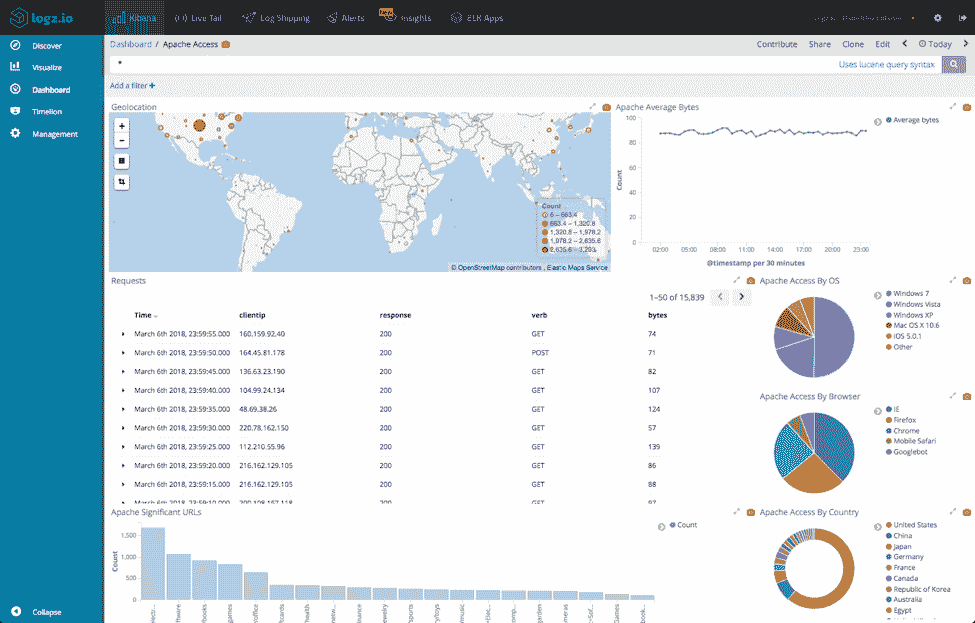
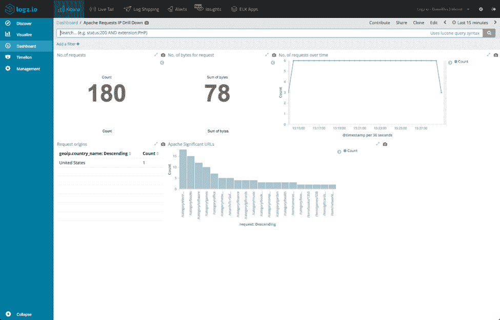
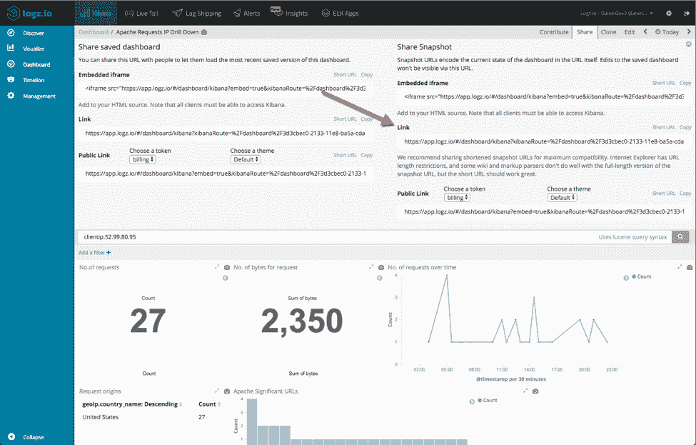
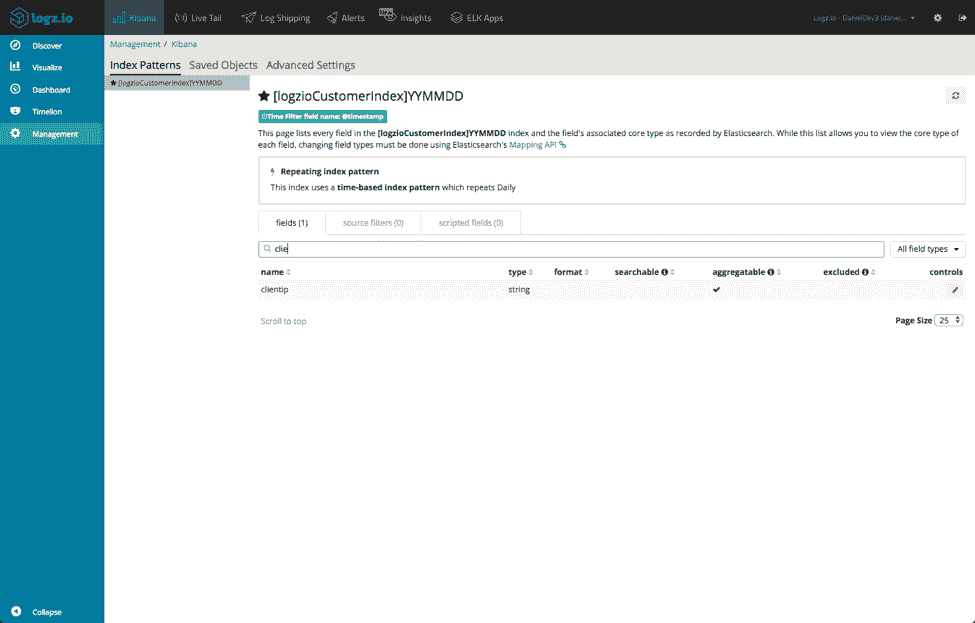
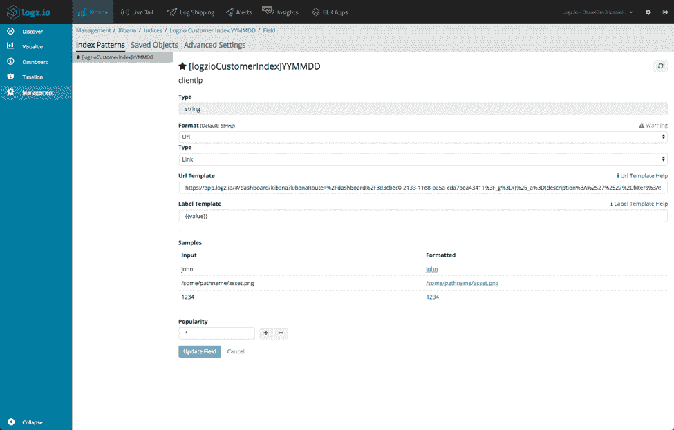
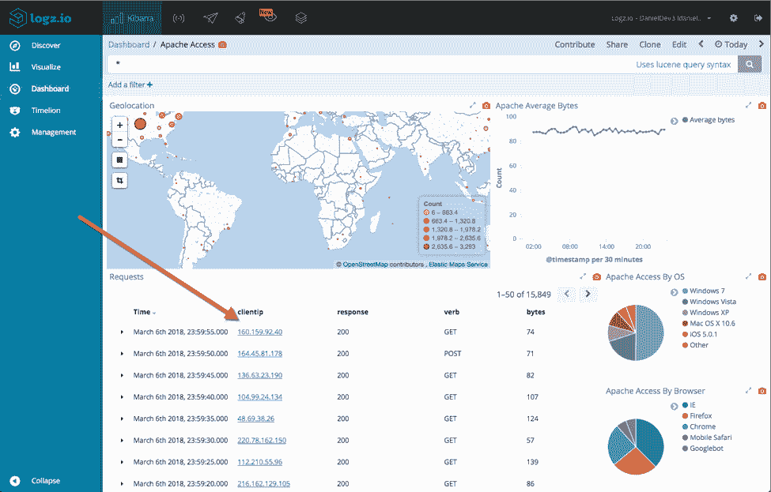
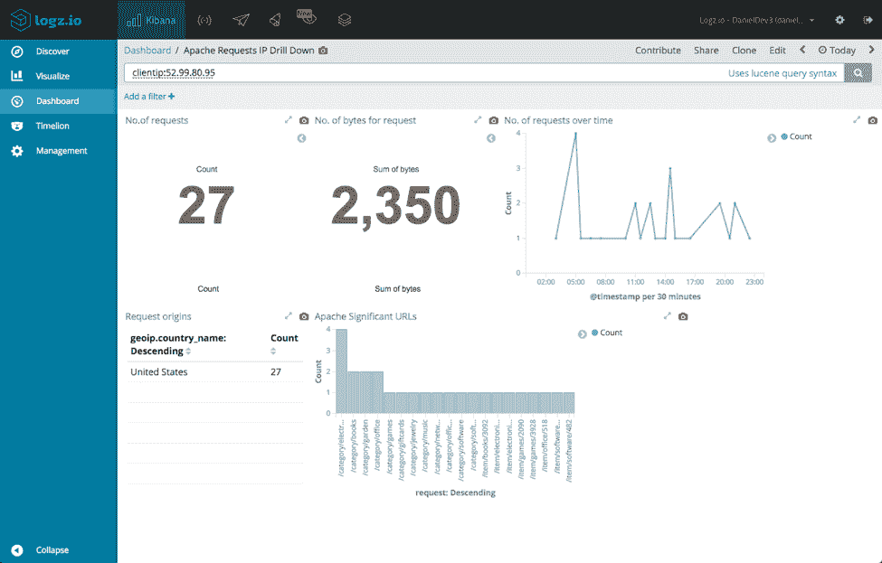

# 在 Kibana 仪表板中插入链接

> 原文：<https://thenewstack.io/inserting-links-kibana-dashboards/>

[](https://Logz.io)

 [丹尼尔·伯曼

伯曼是 Logz.io 的一名传道者，他把自己的职业时间花在了撰写和讲述日志、数据源和生成日志的机器上。他用自己的私人时间照顾家人，为利物浦足球俱乐部跑来跑去](https://Logz.io) 

Kibana 是一个非常棒的分析和可视化工具。但是就像任何软件一样，它也不是完美的。毫无疑问，从 UI 和 UX 的角度来看，Kibana 的最新版本 5.x 和更高版本 6.x 已经取得了巨大的进步，但仍有一些小的缺失会使监控和故障排除变得有点麻烦。

其中一个问题是在 Kibana 仪表板中插入链接的简单而基本的能力，令人惊讶的是没有内置的机制来做到这一点。好消息是这个特性[正在开发中](https://github.com/elastic/kibana/issues/12560)。或者至少看起来是在发展中。坏消息是，在 Elastic 的好人们将它投入生产之前，就要靠我们来破解解决方案了。

## 1:使用降价

一种解决方法是使用降价可视化。事实上，这是用户最常用的方法。markdown 中的 URL 可能会因为圆括号的呈现而显得有些古怪。

一个有效的方法是使用这种格式:

```
[Hello world!][1]

[1]:  https://logz.io

```

虽然这是可行的，但从可用性的角度来看，这种解决方法并不理想。在监控您的环境和查看控制面板时，更自然的工作流程是单击特定字段的链接，打开另一个控制面板进行进一步分析和深入查看。

## 2:使用 URL 格式

另一个解决方法是将特定字段的格式改为 URL 格式。这需要更多的工作，但结果更有用。

例如，假设我正在使用一系列仪表板监控 Apache 访问日志。一个主仪表板为我提供了通过我的服务器路由的所有流量和请求的总体视图:



另一个控制面板更加具体，旨在深入查看发送请求的 IP:



如果我们可以在我的主监控控制面板中单击特定的 IP，并在我的专用控制面板中进一步分析它，这不是很好吗？

第一步是，第二个解决方法是检索一个 URL，用作 clientip 字段的目的地。

打开我们的专用控制面板，我将输入一个特定的查询:


接下来，我将单击页面顶部的“Share”按钮。



然后，我将复制快照 URL 进行共享，并将其粘贴到我的文本编辑器中。URL 相当长(取决于仪表板中的对象)，但是我们在这个阶段感兴趣的是查询部分。

在基巴纳 5.x 中:

```
%2Cquery%3A(query_string%3A(query%3A%2527clientip%3A52.99.80.95%2527))

```

在基巴纳 6.x 中:

```
query:(language:lucene,query:'clientip:52.99.80.95')

```

在这个字符串中，我们需要将 IP 改为{ { value } }——clientip 字段值的占位符。

在基巴纳 5.x 中:

```
%2Cquery%3A(query_string%3A(query%3A%2527clientip%3A{{value}}%2527))

```

在 Kibana 6.x 中:

```
query:(language:lucene,query:'clientip:{{value}}')

```

记下整个修改后的 URL。

接下来，打开管理页面上的 Index Patterns 选项卡，并找到有问题的字段(在我们的例子中，是 *clientip* )。



单击右侧的编辑图标，并输入以下设置:

*   格式—打开下拉菜单并选择 URL
*   类型—保留为“链接”
*   URL 模板—输入您保存的 URL
*   标签模板—输入{{value}}

单击更新字段按钮。



再次打开您的主控制面板——瞧，我们的 IP 现在有了超链接:



单击其中一个 IP 将打开我们的专用仪表板，相关的 Kibana 查询会对其进行过滤:



## 尾注

上面的例子和截图是用在 [Logz.io 的](https://logz.io)托管的 ELK 栈上的，但是你当然可以在你自己的部署中执行完全相同的过程。

Kibana 有很多锦囊妙计，所以如果你们知道在仪表板中插入链接的另一种变通方法——我很想听听！

链接愉快！

<svg xmlns:xlink="http://www.w3.org/1999/xlink" viewBox="0 0 68 31" version="1.1"><title>Group</title> <desc>Created with Sketch.</desc></svg>