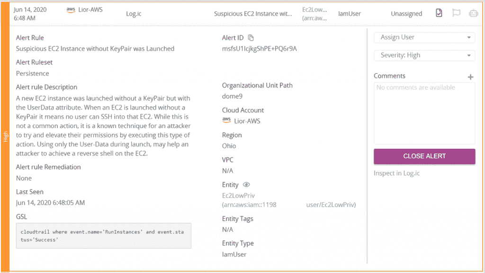
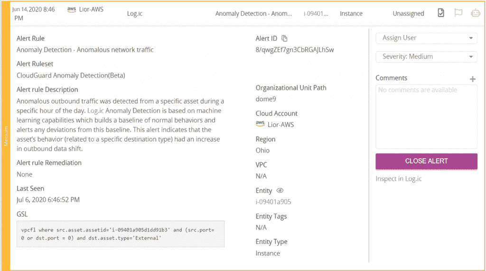
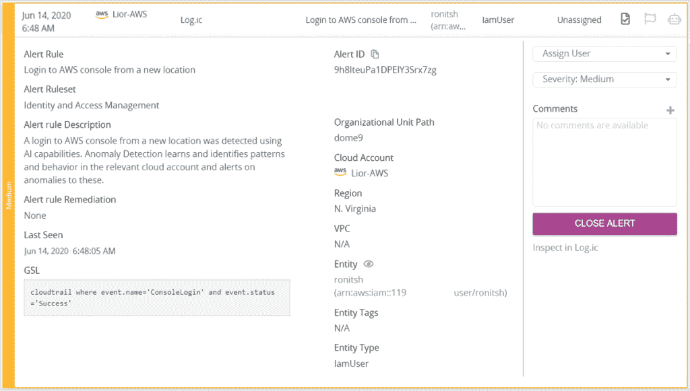
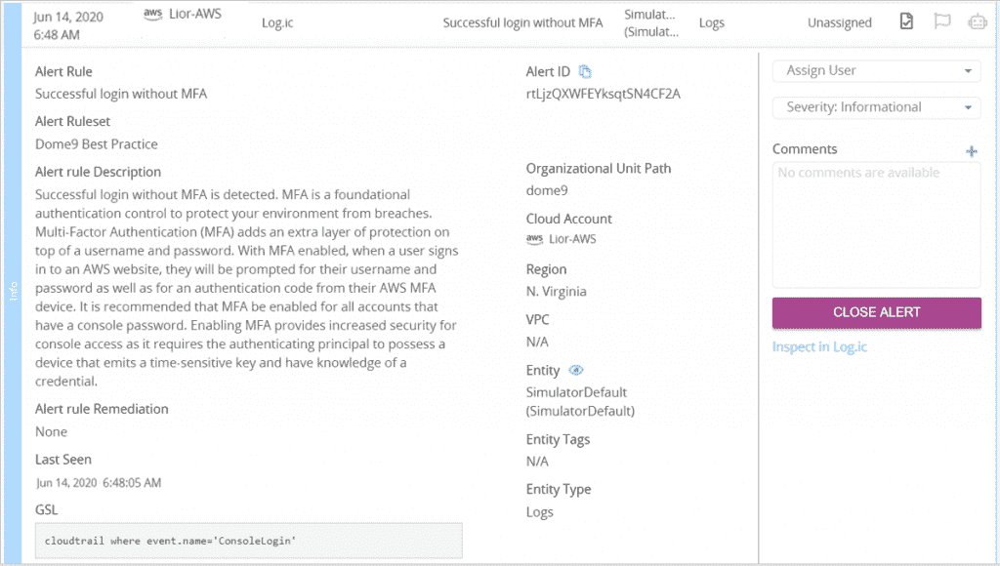

# 在通过亚马逊网络服务的 EC2 的权限提升攻击中

> 原文：<https://thenewstack.io/inside-a-privilege-escalation-attack-via-amazon-web-services-ec2/>

在这个现代数字时代，云漏洞变得越来越普遍。攻击者在云违规期间部署的更危险的策略之一是权限提升。他们利用这一点在云环境中横向移动并访问敏感资产。

在这里，我们将回顾一个攻击场景，该场景利用启动一个没有密钥对的 [Amazon Web Services](https://aws.amazon.com/?utm_content=inline-mention) 弹性云计算(EC2)实例。

## 袭击

 [玛雅·莱文

Maya 是一名专注的分析型安全工程师，是 Check Point Software 的技术营销工程师，专注于云技术。她在多个领域(安全、软件工程、云)拥有深厚的技术知识，并拥有与技术和业务受众沟通的认真简洁的沟通风格。](https://www.linkedin.com/in/maya-levine-2ba05aa7/) 

在这次攻击中，攻击者能够使用低权限用户的凭据登录控制台。攻击者可以通过多种方式获得这些凭证:暴力、网络钓鱼、在黑网上购买偷来的凭证等等。但是，一旦他们获得了凭证，就可以访问 AWS 控制台，而不需要任何编程权限。假设该用户被窃取的权限不过分，攻击者将尝试提升到可以访问敏感资产的更高权限。

该攻击者将查看 Amazon 机器映像(AMI)，这是一个允许您启动实例的模板，其中包含软件配置(如操作系统、应用服务器和应用程序)。他们会选择启动最有可能访问数据库的 AMI。

由于攻击者无法访问现有的密钥对，并且创建一个新的密钥对可能会提醒安全人员它们出现在帐户中，因此他们将在没有密钥对的情况下启动这个 AMI。他们通过将有效载荷插入用户数据本身来实现这一点。这不是大多数组织的常见行为，也不是最佳实践。

另一个可能危及帐户的攻击媒介是允许用户将用户数据传递给实例。这是为了执行常见的自动配置任务。但是，它也可以用于在实例启动后运行脚本，攻击者将会利用这一点。在这种攻击中，攻击者上传一个带有负载脚本的文件，一旦实例启动，就会在攻击者的机器上创建一个反向外壳。

从这里开始，提升权限只需找到包含访问数据库的凭证的正确文件。一旦攻击者登录到数据库，他们就会搜索敏感内容进行渗透。

## 调查

调查此类攻击的关键第一步是实时、相关的警报。然而，对于那些在云环境中负责分析和识别潜在违规的人来说，警报疲劳是一个严重的问题。毕竟，如果相关警报被完全的数字所掩盖，威胁情报解决方案又有什么用呢？因此，这些警报应该是自动化的，并且以安全为中心。一个有用的威胁情报解决方案会对这些警报进行优先级排序，并为分析师提供足够的背景信息，以便轻松调查攻击并进行整合。

生成的警报应该对应于不同的攻击技术，这些技术在[米特 ATT & CK](https://attack.mitre.org/matrices/enterprise/cloud/) 框架中有所概述。按优先级(风险级别)排序，以下是使用云情报和威胁搜索功能针对此攻击生成的相关警报示例:

1.第一个是可疑的 EC2 实例，启动时没有 KeyPair，但具有 UserData 属性。如前所述，这是攻击者利用的一种已知的权限提升技术。

【T2

2.第二个是异常检测—异常网络流量。使用机器学习建立了正常行为的基线。它将警告任何偏离该基线的情况。此警报提供了了解从您的环境中提取数据所需的上下文。日志将向您显示涉及的所有相关 IP 地址以及与出站数据转移相关的特定字节。

3.下一个警报是从新位置登录到 AWS 控制台。这个警报还利用了机器学习和人工智能能力。如果登录发生在正常行为范围之外的位置，应该生成一个警报来提供有关登录的信息，如国家/地区和 IP 地址。

4.最后一个警报是在没有 MFA 的情况下成功登录。此警报具有最低的优先级或风险级别(信息性)。就其本身而言，这并不令人担忧；除非有严格执行的使用 MFA 的公司政策。但是，与所有其他警报并行的是，它有助于全面了解所发生的攻击。

了解云漏洞是如何以及何时发生的并不容易。这个难题有许多部分必须拼在一起。为了有效应对这些攻击类型，组织需要利用创新来提供云情报和威胁搜寻所需的上下文和面向安全的警报。这些措施将有助于理解违规是如何发生的以及为什么会发生。

[https://www.youtube.com/embed/A0hZOwvGAgk?feature=oembed](https://www.youtube.com/embed/A0hZOwvGAgk?feature=oembed)

视频

通过 Pixabay 的特征图像。

<svg xmlns:xlink="http://www.w3.org/1999/xlink" viewBox="0 0 68 31" version="1.1"><title>Group</title> <desc>Created with Sketch.</desc></svg>