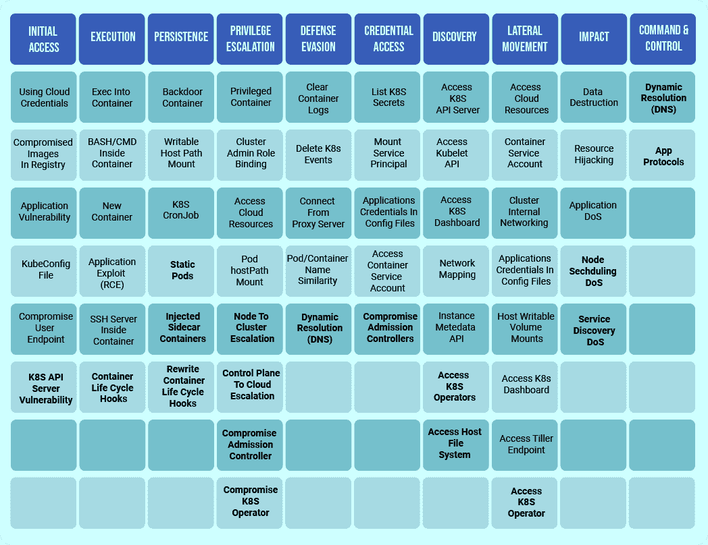

# 库伯内特袭击者的内心世界

> 原文：<https://thenewstack.io/inside-the-mind-of-a-kubernetes-attacker/>

[Cloud Native Computing Foundation](http://cncf.io/)赞助了这篇文章，期待于 11 月 17 日至 20 日举行的 [KubeCon + CloudNativeCon 北美 2020–虚拟](https://events.linuxfoundation.org/kubecon-cloudnativecon-north-america/)。

 [加迪瑙尔

Gadi Naor 作为首席技术官和 Alcide 的联合创始人，拥有 15 年领导网络安全产品开发的经验。Gadi 将他的管理和技术背景融合在不同的岗位上。Gadi 曾在 CheckPoint 工作，担任业务开发经理和高级开发人员，领导 CheckPoint 的防火墙核心安全引擎和 VPN 软件的开发。](https://www.linkedin.com/in/gadinaor/) 

***一个理解攻击者战术和构建自己防御的框架。***

Kubernetes 中的新漏洞会定期被发现。事实上，今年已经发现了 17 个 CVEs(Kubernetes 和与 Kubernetes 相关的漏洞)。如果不加以检查，这些漏洞可能会成为攻击您的云本机应用程序的手段，从而导致灾难性的容器泄漏、权限升级或整个集群的完全接管，并最终导致敏感数据泄露或寄生的密码挖掘操作。

好消息是这些漏洞是可以修补的。坏消息是，Kubernetes 的威胁格局是一个移动的目标，并在不断演变。总会有新的已知或未知的漏洞被攻击者试图利用。这就是为什么要阻止 Kubernetes 攻击者，修补您的 Kubernetes 环境并保持最新漏洞是一个很好的开始，但最终还不够。你需要像攻击者一样思考，并建立防御机制来预测他们的攻击。

幸运的是，有一些框架可以帮助你了解攻击者的想法。4 月份，微软 Azure 发布了一个适用于 Kubernetes 独特安全问题的[版本](https://www.microsoft.com/security/blog/2020/04/02/attack-matrix-kubernetes/)米特 ATT[CK&框架。威胁矩阵确定了网络攻击中常见的各个阶段使用的策略。下面，你可以看到 Azure 的 Kubernetes 威胁矩阵的扩展版本，其中包括几个原始矩阵中遗漏的新策略——其中一些是最近的 CVEs 暴露的(新策略以粗体显示)。](https://attack.mitre.org/)

矩阵中的每一列代表一个不同的攻击阶段，每一列中的项目代表攻击者在该阶段部署的策略。反过来说，每一列也代表了一个机会，层您的防御。例如，如果攻击者通过受损的用户终端获得对您环境的初始访问权限，您仍然可以通过减少或消除基于角色的访问控制(RBAC)权限来缓解权限提升。以这种方式对您的安全性进行分层可以防止任何一个弱点危及您的集群。

为了更好地理解如何使用矩阵，让我们使用上个月发现的 [CVE-2020-14386](https://cve.mitre.org/cgi-bin/cvename.cgi?name=CVE-2020-14386) 漏洞作为例子。该漏洞利用 Linux 内核中的内存损坏从无特权的进程获取根权限。在共享主机操作系统内核的容器化环境中，这可能导致容器逃逸，从而为多种威胁打开大门，包括暴露敏感数据、转向集群中的其他资产或威胁系统可用性。

在基于容器的系统中，容器通常共享主机内核。因此，在这种情况下，一个受损的容器利用 Linux 内核来逃离容器沙箱。在这个特定的漏洞中，攻击者创建网络流量，并通过容器网络接口将其发送出去。一旦流量到达某个内核代码，就会导致内核内存损坏，从而导致容器溢出。有趣的是，应该指出的是，谷歌的 gVisor 和基于虚拟机管理程序的沙箱对这个特定的漏洞是免疫的。

但是要利用这一弱点，攻击者首先需要获得对满足这一攻击先决条件的容器的初始访问权；在这种情况下，这是制作和发送网络流量的能力。例如，攻击者可以通过破坏图像注册表或利用应用程序漏洞来实现这一点。在矩阵的第一列中可以找到其他初始访问策略。

一旦获得初始访问权限，攻击者就可以通过直接在主机上植入持久 Docker 容器来持续攻击并转移到下一项资产，即使系统重新启动，该容器也会运行，例如，它可以运行加密挖掘软件。他们还可以通过安装注入恶意边车容器的变异准入控制器，或通过重写容器生命周期挂钩在容器启动前运行脚本来持续攻击。这些坚持策略可以在矩阵的第三列找到。

在 CVE-2020-14286 的情况下，如果容器运行 CAP_NET_RAW 功能(这是 Kubernetes 中不安全的默认配置，因此需要显式降低权限)，攻击者可以利用托管系统并提升权限来逃离容器。通过利用另一个 CVE，攻击者可以将 kube let(Kubernetes 节点代理)的权限提升到整个集群。从那里，攻击者可以窃取 Kubernetes 的秘密。特权提升策略可以在第四列中找到。

## **使用 Kubernetes 威胁矩阵构建您的防御体系**

原生的 Kubernetes 安全控制是减轻威胁的良好开端。首先，您希望建立一个坚实的安全基础来防止初始访问。这包括用于管理对 Kubernetes 集群的访问的强大身份认证机制，以及针对集群执行操作的严格 RBAC 特权——注意不要向不需要特权的人员或自动化系统过度提供特权。

您还想锁定软件供应链。应该从一个或一组非常特定的容器映像注册表中提取映像，以尽量减少可以在集群中运行的软件来源。此外，您的图像注册表推送策略应该通过代码扫描和容器图像扫描进行筛选。这将阻止通过先前在 CVE-2020-14286 的上下文中提到的被破坏的图像注册表的初始访问。

在运行时，您应该最小化容器的功能和特权，让攻击者有更少的机会来升级攻击。一般来说，应用程序工作负载不应该是根用户，也不应该访问 API 服务器，除非有特殊的需要。在 CVE-2020-14286 的例子中，这将涉及放弃容器使用 CAP_NET_RAW 套接字的能力——或任何类似的能力——这将阻止进程发起攻击。这个案例说明了如何在开发过程中通过 CI 或 CD 尽早调整您的配置，从而显著减少您环境中的攻击面。

你还想防止敏感资产的蔓延，尤其是涉及[机密](https://kubernetes.io/docs/concepts/configuration/secret/)的资产。去年我们发现 [89%](https://containerjournal.com/news/news-releases/new-analysis-by-alcide-finds-89-of-kubernetes-deployments-not-leveraging-secrets-resources/) 的 Kubernetes 部署没有恰当地利用秘密资源。这使得敏感信息——如 API 密钥、令牌和密码——暴露无遗，任何攻击者都可以读取 Kubernetes API 服务器资源。正确地管理和使用机密对加强集群安全性大有帮助。

为了跟上新发现的漏洞，请确保您有一个修补和升级 Kubernetes 基础设施的剧本。如果您使用完全托管的环境，如 EKS，您的云提供商将为您修补您的集群。但是如果您自己管理您的环境，您应该有一个计划来定期升级或修补您的集群。

不幸的是，总会有未被发现的漏洞，在它们被修补之前就可能造成严重破坏。监控您的运行时环境可以大大减轻这些威胁，预防甚至可以更进一步。分析集群 API 服务器运行时活动和应用程序工作负载网络活动，以及构建描述用户和应用程序行为的自适应模型，是补充 Kubernetes 的本地安全控制和基于策略的安全控制的关键组件。有效的监控还可以克服威胁矩阵中的防御规避和持续策略。

实施安全措施时，不要忘记留意负责人。您的安全团队应该足够大，足够熟练，能够处理委派给他们的职责。例如，CVE 扫描会产生大量警报，小型团队可能很难处理。重要的是，您的运行时安全控制、安全工具堆栈和事件响应工作流与您团队的技能相匹配。幸运的是，自动化可以减轻团队管理安全控制的负担，让您的生活更加轻松。

无论您的团队的安全技能集是什么，您都应该从站在攻击者的角度出发。你最重要和最敏感的资产是什么？攻击者需要通过哪些关卡才能找到他们？一旦您确定了这两个组件，您就可以在 Kubernetes 威胁矩阵中沿着它们的路径逐层构建防御。

*要了解更多关于 Kubernetes 和其他云原生技术的信息，请考虑参加 11 月 17 日至 20 日举行的 [KubeCon + CloudNativeCon 北美 2020](https://events.linuxfoundation.org/kubecon-cloudnativecon-north-america/) 。*

云计算原生计算基金会和 Red Hat 是新堆栈的赞助商。

通过 Pixabay 的特征图像。

<svg xmlns:xlink="http://www.w3.org/1999/xlink" viewBox="0 0 68 31" version="1.1"><title>Group</title> <desc>Created with Sketch.</desc></svg>