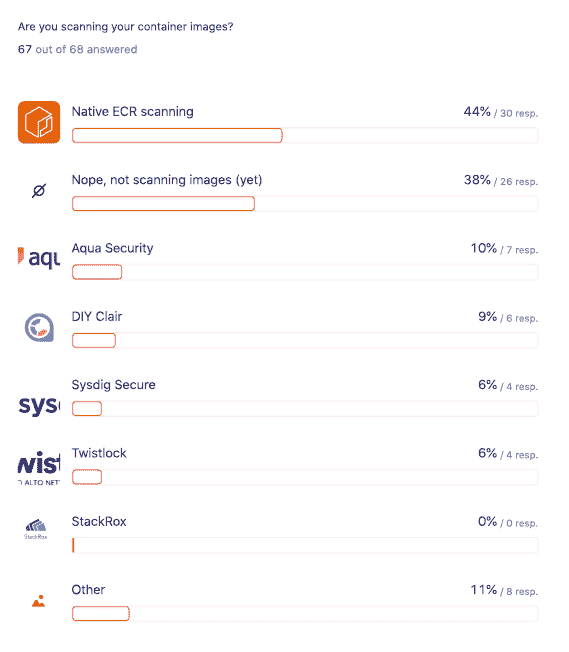
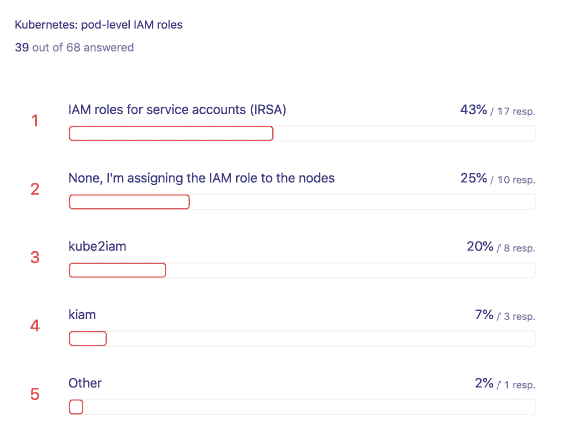

# 关注 AWS 集装箱安全的 68 位人士的见解

> 原文：<https://thenewstack.io/insights-from-68-people-who-care-about-aws-container-security/>

2019 年末，亚马逊网络服务的开发者倡导者 [迈克尔·豪森布拉斯](https://twitter.com/mhausenblas)调查了 68 名在 AWS 上使用容器的人。[公开发布的结果](https://github.com/mhausenblas/aws-container-security-survey-2019)提供了关于全球最大云提供商客户采用模式的一些轶事线索。在这一小组容器用户中，有一半在 EC2 实例上使用 Amazon Elastic Kubernetes 服务(EKS)。AWS Fargate 也有强大的存在，但并不完全是 Kubernetes 的故事。相反，许多人通过亚马逊弹性容器服务(ECS)或 EKS 使用 Fargate 部署容器。

该研究还表明，许多公司需要完善其网络状态和容器安全策略。而很少非 AWS 服务被用于集装箱安全。虽然 62%扫描集装箱图像，但集装箱安全状况仍相对不成熟。例如，39 个 Kubernetes 用户中只有 17 个(43%)拥有 Kubernetes pods 的安全策略。我们看到服务网格开始被使用的迹象，尽管还不清楚这是否主要是为了流量管理而不是实施安全策略。您可以在下面找到更多见解。

## Kubernetes 收养

*   **没有 Kubernetes 的亚马逊 ECS 依然常见。68 个用户中有 29 个(43%)仍然根本不使用 Kubernetes，这与去年一份[数据狗报告](https://www.datadoghq.com/container-report/)中的[报告](https://thenewstack.io/fargate-grows-faster-than-kubernetes-among-aws-customers/)的使用水平相差甚远。在这个组中，有 20 个(69%)通过 EC2 之上的 ECS 在 AWS 上运行容器。包括 Kubernetes 用户在内，58%(68 人中的 40 人)的受访者在 EC2 或 Fargate 上使用 ECS。**
*   **亚马逊 EKS 在 EC2 上占优势。**39 个 Kubernetes 用户中有 35 个(90%)在 EKS 上运行部署在 EC2 之上的容器。此外，39 个 Kubernetes 用户中只有 4 个(10%)完全采用 DIY(自己动手)方法，而不是利用 EKS。
*   Fargate 的使用量很大。68 名受访者中有 31 名(46%)使用 Fargate。这远远高于我们在 2019 年 11 月[的](https://thenewstack.io/fargate-grows-faster-than-kubernetes-among-aws-customers/)中所写的 AWS 容器组织中 19%的 Fargate 采用率。
*   **Fargate and Kubernetes can co-exist.** 17 of 31 (55%) Fargate users also utilize Kubernetes. Looking at the data a different way, 17 of 39 (44%) of Kubernetes using respondents are also utilizing Fargate. All six respondents that deploy EKS on Fargate also do so on EC2, but only one respondent is using both ECS and EKS to deploy containers with Fargate.

    来源:“AWS 集装箱安全调查 2019”。

## 安全性和网络

*   **集装箱扫描不通用。**62%(67 个中的 41 个)正在扫描集装箱图像。73%(41 个中的 30 个)，原生 ECR 扫描是最常见的方法。此外，36%(67 个中的 20 个)通过 Aqua Security 等第三方扫描集装箱图像。只有 30%(30 个中的 9 个)的 AWS 原生扫描功能用户也使用另一种工具扫描集装箱图像。只有 17%的人在运行时扫描容器，云本地计算基金会的 Falco 是最常见的方式。
*   **印花布因执行库伯内特政策而广受欢迎。**三分之二(27 人中的 18 人)在描述他们如何管理 Kubernetes 网络政策时提到了 Calico。在这些 Calico 用户中，76%(18 人中的 13 人)有管理 Kubernetes 豆荚的政策。
*   **与 AWS 一起使用的服务网格正在出现。**在描述他们如何管理 Kubernetes 网络策略的人中，有 37%(27 人中有 10 人)通过服务网格管理网络策略。这些服务网格用户中有一半还管理服务账户的 pod 级 [IAM(身份和访问管理)。目前还不清楚](https://docs.aws.amazon.com/eks/latest/userguide/iam-roles-for-service-accounts-technical-overview.html) [AWS 应用网格](https://aws.amazon.com/app-mesh/)是否是首选的服务网格，但它旨在与 AWS IAM 一起用于服务帐户。

请注意，百分比是基于使用 Kubernetes 的 39 名受访者。来源:“AWS 集装箱安全调查 2019”。

亚马逊网络服务和云计算原生计算基金会是新堆栈的赞助商。

图片由来自 Pixabay 的 Gerd Altmann 提供。

<svg xmlns:xlink="http://www.w3.org/1999/xlink" viewBox="0 0 68 31" version="1.1"><title>Group</title> <desc>Created with Sketch.</desc></svg>