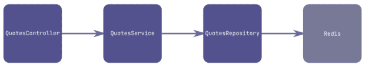
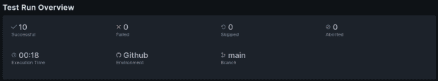
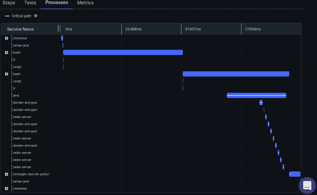
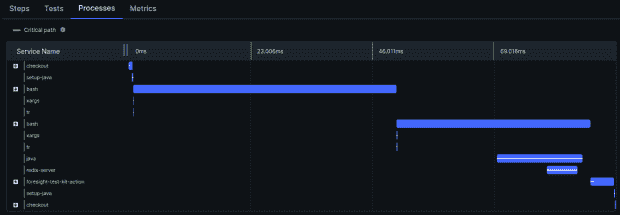

# 有远见地洞察集成测试

> 原文：<https://thenewstack.io/insights-on-integration-tests-with-foresight/>

作为一个熟练而勤奋的软件工程师，你知道测试有多重要。研究表明，随着代码在其生命周期中向左移动，修复缺陷的[成本呈指数增长](https://www.researchgate.net/figure/IBM-System-Science-Institute-Relative-Cost-of-Fixing-Defects_fig1_255965523)。但是增加的成本并不是唯一的问题。测试也变得更加复杂。

将[单元测试](https://thenewstack.io/unit-testing-time-consuming-product-saving/)中的简单断言与容易出错的手动测试进行比较。单元测试需要几毫秒，但是手动检查可能需要几分钟。为此，测试金字塔应运而生。这个想法很简单:使用更多便宜的测试和更少昂贵的测试。

在这篇博文中，我们将讨论金字塔的中间层——集成测试。我们还将展示预见如何帮助您在真实服务的[集成测试](https://thenewstack.io/surprise-software-testing-is-every-developers-job-now/)中发现问题——没有模仿！

[集成测试](https://www.runforesight.com/blog/introduction-to-software-testing)完美平衡了价格、速度和覆盖范围。因为集成测试是由开发人员编写的，通常使用与项目其余部分相同的技术堆栈，所以它们很容易集成到 SDLC 中，自动化成本低廉，并且覆盖了相对较大的功能部分。

然而，测试人员和 QA 工程师说不到一半的项目拥有它们。

## 集成测试的问题

为什么很少有团队使用集成测试？

一个可能的原因是做一个好的集成测试比做一个单元测试需要更多的努力。但是真正的问题是所有的依赖，而不是测试本身。

软件从来不会单独运行。它使用数据库来存储数据，并与其他软件进行通信。所以当你超越单元测试时，你必须向被测试的系统提供这些依赖。开发人员通常会使用模拟进行集成测试，因为它们更快、更容易配置、更可靠。但是[使用模拟](https://www.runforesight.com/blog/difficult-mock-life)违背了集成测试的理念。集成测试应该使用真正的依赖关系，因为重点是检查它们之间的集成。

从历史上看，第一种方法是在可控的专用环境中运行测试。可以想象，这对于大项目来说效果并不好。不同的团队可能会将应用程序的不同版本及其数据部署到测试环境中，共享版本几乎总是会导致冲突。

为了解决这个问题，您可以尝试手动管理测试的所有依赖项。但是您的设置阶段将很快超越测试，并成为维护和保持与现实世界同步的噩梦。

最终，像 Docker、Docker Compose 甚至 Kubernetes 这样的工具被开发出来，以简化集成测试的设置。今天，这些通常被认为是集成测试隔离的事实工具。

这些解决方案是通用的，适用于任何技术。但是许多 Java 开发人员钟爱的技术 test containers T1 则更进一步。它基本上是 Docker，但是包装成一个方便的 API。

然而，即使有像 Testcontainers 这样的顶级工具，也很容易搞砸集成测试。配置中的一个缺陷可能导致不正常的[测试执行时间](https://thenewstack.io/typemock-simplifies-net-c-unit-testing/)或者不可靠的测试。

桑德拉没有责怪开发人员，让他们去寻找自己的错误，而是开发了提供改进的测试可观察性的工具。我们去看看。

## 整合测试远见卓识

想象一个简单的报价 API。为了简单和快速，它将报价存储在 Redis 中。这是一个非常简单的 Spring Boot 应用程序，由五个类组成，包括一个配置、一个实体和一个 Spring 数据接口。

这意味着只有两个类包含代码:服务和控制器。该项目被配置为使用 [GitHub Actions](https://github.com/features/actions) 运行一些检查。



图 2:演示项目架构

这个演示的[代码可以在 GitHub 上获得。](https://github.com/cuongld2/quotes-service-jacoco)

现在，我们要测试持久性逻辑，应用程序应该能够将引号保存到 Redis 中。当然，我们可以只是模仿 QuotesRepository，但是，正如我们之前所说的，这不会是一个好的集成测试。这将是一个单元测试。

这里有一个集成测试的例子:

```
@SpringBootTest
@Testcontainers
public  class  QuotesServiceTest  {
  @Container
  private final GenericContainer<?>  redis  =  new GenericContainer<>(DockerImageName.parse("redis:6")).withExposedPorts(6379);

  private QuotesService sut;

  @BeforeEach
  public void initialize()  {
 final var lettuceConnectionFactory  =  new LettuceConnectionFactory(redis.getHost(),  redis.getMappedPort(6379));
        // Omitting some trivial configuration
 final var quotesRepository  =  redisRepositoryFactory.getRepository(QuotesRepository.class);

 sut  =  new QuotesService(quotesRepository);
  }

  @ParameterizedTest(name  =  "{0}")
  @MethodSource
  public void test(Quote quote)  {
 sut.save(quote);

 var savedQuote  =  sut.get(quote.getId());

 Assertions.assertTrue(savedQuote.isPresent());
 Assertions.assertEquals(quote,  savedQuote.get());
  }

  static Stream<Arguments>  test()  {
 return IntStream
 .range(0,  10)
 .mapToObj(Integer::toString)
 .map(test  ->  Arguments.of(Named.of(test,  new Quote(test,  test))));
  }
}

```

在这里，我们只是保存 10 次报价并做一些检查。一个更复杂的测试应该检查拐角情况，但是为了简单起见，这里所有的数据只有索引不同。

为此，请遵循[文档](https://docs.runforesight.com/advanced-configuration/test-kit)。下面是 GitHub 工作流文件中用于收集工作流和测试指标的 YAML 脚本。

```
  -  name:  Collect Workflow Telemetry
 uses:  runforesight/foresight-workflow-kit-action@v1
 if:  success()  ||  failure()
 with:
 api_key:  ${{  secrets.THUNDRA_APIKEY  }}
 -  name:  Foresight test kit
 if:  success()  ||  failure()
 uses:  runforesight/foresight-test-kit-action@v1
 with:
 api_key:  ${{  secrets.THUNDRA_APIKEY  }}
 test_format:  JUNIT
 test_framework:  JUNIT
 test_path:  ./build/test-results/test/TEST-io.thundra.foresight.quotes.QuotesServiceTest.xml
 coverage_format:  JACOCO/XML
 coverage_path:  ./build/reports/jacoco/test/jacocoTestReport.xml

```

如您所见，Foresight 为您提供了一个可重用的 GitHub 动作，它将执行统计数据发送到 Foresight 后端。

现在，如果您触发一个构建，您将会看到即使这个单独的测试也需要大约一分钟来完成。如果你试图增加测试的数量(通过改变。范围从(0，10)到。范围(0，1000))，您会注意到执行时间呈线性增长，您必须等待大约 10 分钟。很明显，它没有伸缩性。

让我们更深入地了解一下执行时间细分:



图 Foresight 中的测试执行时间分解

我们看到 10 个测试的执行时间是 18 秒。这应该不会超过五秒钟，因为我们使用 Testcontainers 与 Testcontainers 中的内部 Redis 数据库进行交互，而不是调用远程 Redis 数据库。查看工作流中每个步骤的流程日志，我们看到 Redis 服务器在测试执行期间被启动了几次。



图 5: Redis 服务器在测试过程中被初始化了几次

在执行之间缓存容器会更好，Testcontainers 支持这一点！他们甚至有一些这样做的策略，但是最简单的一个是给容器字段添加一个`static`修饰符:

```
@Container
private static final GenericContainer<?>  redis  =  new GenericContainer<>(DockerImageName.parse("redis:6")).withExposedPorts(6379);

```

提交变更，工作流将自动触发。现在向下钻取与第一次完全不同，运行测试的总时间现在只有两秒钟。

检查 Foresight 中“变更影响分析”的最新变更代码，我们看到启动 Redis 的新代码现在使用“私有静态最终”变量，而不是以前使用的“私有最终”变量。

现在，Redis 服务器在测试期间只启动一次，这大大减少了测试的执行时间。



图 8: Redis 服务器只启动一次

持怀疑态度的读者可能会问，为什么我们不仅仅依靠日志。所有的数字都已经在那里了。但事实并非如此。

日志可能会给你一些时间戳，你可以自己做计算，但执行钻取通常不会被记录。可以从测试报告中访问它，但是首先，应该显式地启用这些报告，然后上传，最后，汇总。值得一提的是，每个测试框架都有自己的报告格式。远见为你做了所有繁重的工作，而且它统一了表现。当所有的数据都摆在你面前时，有些问题就容易解决了。

没有比亲自尝试更好的学习方法了。创建一个免费的 Foresight 账号，克隆[库](https://github.com/cuongld2/quotes-service-jacoco)，配置集成(基本上就是在回购秘笈里设置自己的密钥)，玩不同的选项。

## 摘要

集成测试是一个复杂而微妙的话题。复杂性是集成测试的本质所固有的。将它们转换回单元测试是很诱人的，但是你会知道你没有写出好的测试，你的应用程序会证明这一点。

凭借对您的 CI 渠道的度量和深入了解， [Foresight](https://www.runforesight.com/) 让开发人员对他们的测试充满信心。

<svg xmlns:xlink="http://www.w3.org/1999/xlink" viewBox="0 0 68 31" version="1.1"><title>Group</title> <desc>Created with Sketch.</desc></svg>