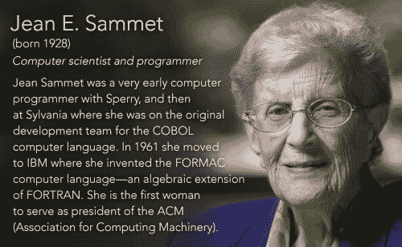

# 计算机先驱 Jean E. Sammet 在编程出现之前就编程了

> 原文：<https://thenewstack.io/inspiring-life-computing-pioneer-jean-e-sammet/>

我们看到了对 Jean E. Sammet 的新一轮赞赏，他是开发 FORMAC 编程语言的计算机程序员，也是发明 COBOL 团队的关键成员。她下个月就 89 岁了。

原来，她的粉丝之一是女演员[吉莉安·雅各布斯](https://www.imdb.com/name/nm1843026/)，你可能已经在 NBC 情景喜剧《T4 社区中见过她六季，或者在网飞系列剧[爱情](https://www.imdb.com/title/tt4061080/)中见过她两年前，雅各布斯还执导了一部关于格蕾丝·赫柏的纪录片，这也是她成为萨米特粉丝的原因。

这个月，雅各布斯终于为《魅力》杂志采访了她的偶像。在采访中，Sammet 透露，从 7 岁起，她就对数学产生了兴趣，大学毕业后，她成为了大都会人寿的一名精算师(或“红利技师”)。“我在《纽约时报》上寻找适合女性的工作——当我告诉年轻人，招聘广告曾经是按性别划分的，他们感到震惊——精算师是为数不多的不是家政或护理的工作之一，所以我去了。”

但是很快 Sammet 就在 Sperry 公司工作了，这是一家历史悠久的电子公司，于 1910 年在布鲁克林成立。(Sperry 的部分业务今天仍然存在，现在被 Unisys 和 Honeywell 吸收)。“在相当长的一段时间里，那里的一切都是自学的，”她告诉《魅力》杂志。"据我所知，没有任何书籍、课程或会议."她还记得当她的主管问她是否想成为一名程序员时，她的第一反应。

“什么是程序员？”

“我不知道，”他回答，“但我知道我们需要一个。”

不到五年，她就成了 Sylvania Electric Products 的 MOBIDIC 编程部门的负责人，同时还担任了语句语言工作组的主席和 1959 年开发 COBOL 编程语言的小组的编辑委员会。根据一个关于她在 2009 年获得 IEEE“[计算机先锋奖](https://www.computer.org/web/awards/pioneer-jean-sammet)的网页，在此期间，她还从 1956 年到 1958 年在阿德尔菲学院教授美国首批研究生水平的计算机编程课程之一。

“在这一点上——这是我的意见；我知道和我同龄的其他人不同意这个观点——相对来说，对女性的歧视很少，”Sammet 告诉 Glamour，“因为程序员非常稀缺。所以不管你有没有三个头都没关系。”

最终，她开始简单地申请报纸男性版上的工作。到 1961 年，Sammet 加入了 IBM，“组织和管理 IBM 数据系统部门的波士顿编程中心，从事编程方面的高级开发工作，”她在 IEEE 计算机历史网站上的“[计算机先锋”页面](http://history.computer.org/pioneers/sammet.html)解释道。在那里，她创建了 FORMAC(公式操作编译器)，这是一个基于 FORTRAN 的系统，用于执行代数计算。她在 IBM 工作了 27 年。

FORMAC 并不是 Sammet 参与编码的终结。她在 1969 年出版的书《[编程语言:历史和基础](https://www.amazon.com/Programming-Languages-History-Fundamentals-Sammet/dp/B00283JST6)》被描述为编程语言的标准著作，书中有一段发人深省的评论:“我不认为汇编语言(即使是复杂的语言)是编程语言。”

多年来，Sammet 还在 IBM 内部讲授编程语言，并发表了 50 多篇论文。直到今天，根据 IEEE 的说法，她关于编程语言历史的“大量”文件“已经被两个博物馆描述为该领域世界上最好的”

“从童年开始，我就讨厌扔掉文件，”萨姆特回忆道。计算机历史博物馆引用她的话说“当我长大后，这种特征与我对计算机历史的兴趣融合在一起。因此，我创建了自己的重要文件和文档，并开始关注让其他人发布他们重要工作的材料，以便让事实(而不是神话)被公众所知。”

https://www.instagram.com/p/BDXMqPfjFpk/?taken-by=gillianjacobs&hl=en

在她的职业生涯中，Sammet 还活跃于计算机械协会，并于 1974 年成为该组织的第一位女性主席。

雅各布斯最终在马里兰州银泉的退休社区找到了萨姆特。当被问及退休后保持如此高的生产率是什么感觉时，Sammet 回答说:“最初几年比较艰难，但我在这里有很多事情要做。

"我担任了三年计算机俱乐部的主席！"

* * *

# WebReduce

通过 Teepublic 的特征图像[。](https://www.teepublic.com/t-shirt/707160-jean-e-sammet-hirsute-history)

<svg xmlns:xlink="http://www.w3.org/1999/xlink" viewBox="0 0 68 31" version="1.1"><title>Group</title> <desc>Created with Sketch.</desc></svg>