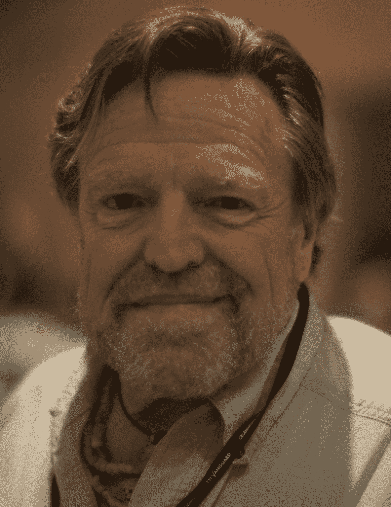

# 约翰·佩里·巴洛鼓舞人心的一生

> 原文：<https://thenewstack.io/inspiring-life-john-perry-barlow/>

很容易列出约翰·佩里·巴洛的成就，从共同创立 T2 电子前沿基金会到为感恩而死乐队作词。但是很难量化他在 20 世纪 90 年代早期带给互联网的*灵感*的数量。本着先锋这个词最真实的精神，他创造了一个帮助塑造未来世界的愿景。

这个月早些时候去世的男人，也对*我*产生了个人影响…

“他粗犷的五官就像他来自的怀俄明州坚硬的土地，”[记得《经济学家》杂志](https://www.economist.com/blogs/prospero/2018/02/music-never-stopped)称巴洛为“边疆和自由的诗人，无论他们采取什么形式。”他的父亲是州议员，但约翰的思想似乎总是回到人类的未来本身。“网络空间和开放空间有很多相似之处，”巴洛曾经告诉《人物》杂志。“定义自己的空间很大。你可以随便给自己化妆。”

感恩而死吉他手(也是[预科好友](https://www.spin.com/2018/02/john-perry-barlow-obit/) ) [鲍勃·威尔](https://twitter.com/BobWeir)总结了他朋友的精神。“约翰有办法将生活中最困难的事情视为挑战，因此是冒险——通过它们的本性觉醒，甚至可能是乐趣。”(“哦，我们惹了很多麻烦，”巴洛后来告诉《人物》杂志。“他被踢出去，而我没有，我觉得真的很不公平。”)在卫斯理大学(Wesleyan University)继续学习比较宗教之后——和迷幻大师蒂莫西·利瑞相处了一段时间——巴洛最终为感恩而死写了 30 多首歌。

https://www.youtube.com/watch?v=h5D_j6mtCA4

但是巴洛有一个改变了他一生的愿景。“巴洛是第一个，如果不是第一个*的话，全心全意看到互联网前景的‘旧’世界的内容创作者之一，”[TechDirt 编辑迈克·马斯尼克](https://www.techdirt.com/articles/20180208/00422639190/end-era-saying-goodbye-to-john-perry-barlow.shtml)写道，“他一生致力于让互联网成为我们所有内容创作者的强大之地。”*

 *他最大的遗产可能是他吸引其他人的方式。EFF 的第一位律师迈克·戈德温(Mike Godwin)写道，他第一次见到巴洛时，“我立刻就知道我会和这个家伙相处得很好”——其他人也有同样的感觉。记者史蒂文·利维称他为“传奇人物”，他记得见过巴洛的人都觉得他是他们的灵魂伴侣。"他会用他和蔼可亲的举止、引人注目的观察和对人类处境的尖刻评论赢得你的芳心。"

戈德温似乎已经认识到，巴洛真正的天赋在于*分享了他令人信服的愿景。"他的伟大思想和个性常常掩盖了我所认为的巴洛作为一名作家被低估的力量。"他[总结了巴洛更大的洞察力](https://www.techdirt.com/articles/20180208/12170739195/mike-godwin-remembers-john-perry-barlow.shtml):“也许我们对计算机和互联网的威胁的感觉，以及伴随着超级计算机技能成长起来的第一代人类，只是我们人类对变化和新事物的恐惧的又一次重复。”*

1990 年，巴洛参与创立了世界上最有影响力的数字版权组织之一。最初的推动力是美国特勤局为调查一份关于 911 紧急电话系统的文件被盗而进行的一系列突袭，这导致他们扣押了德克萨斯州奥斯汀一家名为史蒂夫·杰克逊游戏公司的小型(无辜)图书出版商的计算机。一场关于此案的讨论发生在“全球电子通讯”(现在的 WELL.com)上，引起了莲花开发公司前总裁米切尔·卡普尔和太阳微系统公司早期雇员约翰·吉尔摩的兴趣。这些人和巴洛一起成立了电子前沿基金会。

EFF 在该案件中开创性的法律工作最终确立了电子邮件有权获得与电话相同的隐私保护的原则。“今天，我们理所当然地认为，执法部门在扣押和阅读电子邮件之前，必须有一份特别描述所有电子邮件的授权令。史蒂夫·杰克逊游戏案确立了这一原则，”一个关于其历史的 EFF 网页[断言](https://www.eff.org/about/history)。

戈德温记得[是巴洛创造了电子前沿基金会](https://www.techdirt.com/articles/20180208/12170739195/mike-godwin-remembers-john-perry-barlow.shtml)这个名字——这是对早期建议“计算机自由基金会”的巨大改进前面还有许多战斗。(“我确信版权即将成为网络空间的越南，”巴洛在 1995 年告诉*人物*杂志。)而且《人物》杂志还报道说，巴洛帮助筹集资金创办了《连线》杂志。《经济学人》记得他是“[第一个互联网活动家](https://www.economist.com/blogs/prospero/2018/02/music-never-stopped)”，并补充道“随着互联网的迅速发展，巴洛先生是它的预言家，被邀请到世界各地解释西装的新领域……”

## 履历

我还得补充一点，虽然我从未见过巴洛，但他让我上了网。早在 1993 年，我是一名有抱负的作家，白天的工作是——利用晚上和周末的时间为一部小说打笔记，这部小说我从未在一台二手打字机上写完，那台打字机是我在车库拍卖中买的。但是我读过一篇关于互联网的文章，这篇文章认为互联网将会是下一个激动人心的前沿。让它变得绝对不可抗拒的是这句来自巴洛的几乎是精神上的引用。

“很明显，我们正在做一些伟大的工作……集体人类意识的物质连接。对于像我这样的嬉皮士神秘主义者来说，用全双工宽带连接每个人的想法有着明确的神学含义。”

我不是唯一一个觉得这句话鼓舞人心的人。25 年后，我发现它被宾夕法尼亚州立大学存档在网上，是一些叫做“[约翰·佩里·巴洛，一个网络空间纲要](http://citeseerx.ist.psu.edu/viewdoc/download?doi=10.1.1.114.1444&rep=rep1&type=pdf)的课程材料的一部分巴洛认为我们最终会从这位伟大的全球头脑中学到什么？

“我们将建造它，然后找出答案。”

当我登上互联网时，巴洛正等在那里欢迎我。不可能错过他 1996 年的“[网络空间独立宣言](https://www.eff.org/cyberspace-independence)”，据说该宣言一度在 4 万个不同的网站上被重新发布。它将世界工业政府称为“疲惫的钢铁巨人”，将互联网称为“思想的新家园”，天然地独立于“你们试图强加给我们的暴政……为了未来，我请过去的你们放过我们……在我们聚集的地方，你们没有主权。”

“他基本上将互联网视为他童年时代未被驯服的风景的数字延伸，”[回忆 Spin 杂志](https://www.spin.com/2018/02/john-perry-barlow-obit/)说，并补充说“这一愿景对网络发展的影响很难被夸大。”戈德温[写道](https://www.techdirt.com/articles/20180208/12170739195/mike-godwin-remembers-john-perry-barlow.shtml)巴洛“激励了新一代的律师和活动家投入时间和精力来保护互联网和其他数字技术带给我们的伟大新世界。”

几年后，当我写了一篇引起 DMCA 版权欺诈的文章时，EFF 就在那里等着我。它实际上同意免费代理我的网络出版商*——并最终通过谈判让诈骗犯完全投降。他不仅同意撤回所有伪造的版权声明，甚至承诺参加版权法课程，还录制了一段视频向互联网道歉。*

 *2012 年，巴洛帮助共同建立了新闻自由基金会——一个正在进行的权利项目，该项目就在本月宣布努力保护 Gawker 的档案。巴洛的“独立宣言”认为，我们的虚拟自我对过度监管的政府的主权“免疫”，巴洛[告诉《连线》](https://www.wired.com/2016/02/its-been-20-years-since-this-man-declared-cyberspace-independence/)EFF 和新闻自由基金会都增强了互联网的“免疫系统”

他补充说，他看到了我们未来不可避免的东西:“将会有一个包括全人类的全球公域。”

“巴洛花了几十年时间教我们互联网上更美好世界的可能性，有时温和，有时有力地将我们推向那个方向……”[TechDirt 的马斯尼克](https://www.techdirt.com/articles/20180208/00422639190/end-era-saying-goodbye-to-john-perry-barlow.shtml)写道。“我们都应该努力以巴洛的原则和他的愿景为指导，不断推动将技术世界塑造成我们希望的世界——不是忽视负面因素，而是寻找超越负面因素的方法，扩大展现正面因素的机会。”

2 月 7 日，EFF 执行董事辛迪·科恩分享了一个他的作品网上图书馆的链接，并发表了一份关于巴洛生平的声明。“毫不夸张地说，我们今天所了解和喜爱的互联网的主要部分之所以存在并蓬勃发展，是因为巴洛的远见和领导。他一直将互联网视为一个自由的基本场所，在这里，长期被压制的声音可以找到听众，人们可以与他人联系，而不管物理距离如何。”

今年六月，巴洛将与人合著一本新书，记录他的狂野生活:“[美国母亲之夜:我在疯狂时代的生活](https://www.penguinrandomhouse.com/books/554592/mother-american-night-by-john-perry-barlow-with-robert-greenfield/9781524760182/)”他的出版商称之为“一个美国偶像的狂野、有趣、令人心碎、通常难以置信(但完全真实)的故事。”

他们还补充道，巴洛的人生故事“追溯了反主流文化成为主流文化的时代变迁。”

* * *

# WebReduce

图片来自维基百科。

<svg xmlns:xlink="http://www.w3.org/1999/xlink" viewBox="0 0 68 31" version="1.1"><title>Group</title> <desc>Created with Sketch.</desc></svg>**