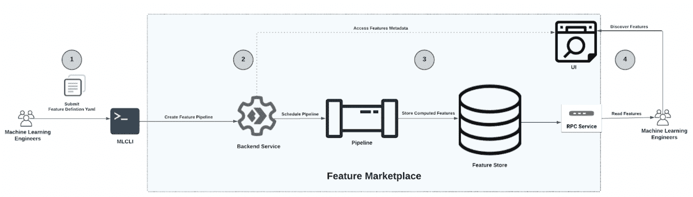

# Instacart 通过混合 MLOps 平台加快 ML 部署

> 原文：<https://thenewstack.io/instacart-speeds-ml-deployments-with-hybrid-mlops-platform/>

杂货递送服务 [Instacart](https://www.instacart.com/?utm_medium=sem&utm_source=instacart_google&utm_campaign=ad_demand_search_brand_us-ny-newyork_exact_us&utm_content=accountid-1732890876_campaignid-10023670539_adgroupid-102598116882_device-c_adid-517921742800_network-g&utm_term=matchtype-e_keyword-instacart_targetid-kwd-297369219725_locationid-9004402&kskwid=1571783&ksadid=1664210&gclid=Cj0KCQjwn4qWBhCvARIsAFNAMiiFbmp9WP_pziGCO-WhFo1DWLwGgMnsEwihF3guWxJ59N0yzrMhQd8aArzMEALw_wcB) 最近推出了一个新的[机器学习](https://thenewstack.io/category/machine-learning/)平台，名为 Griffin，该服务一年内推出的 ML 应用数量增加了两倍。

Instacart 在 2016 年开始用 [Lore](https://github.com/instacart/lore#lore) 开发其机器学习基础设施，这是一个开源框架。经过多年的快速发展，导致了 ML 应用程序的数量、多样性和复杂性的增加，Lore 的整体架构日益成为一个瓶颈。

这一瓶颈挑战导致了 Griffin 的开发，这是一个混合的、可扩展的平台，支持不同的数据管理系统，并与多种 ML 工具和工作流集成。Sahil Khanna 最近的博客文章详细介绍了 Griffin，包括它的优点、组件和工作流程。

Instacart 非常依赖机器学习进行产品和运营创新。这种创新并不容易，因为多个机器学习模型通常必须一起工作才能提供服务。Griffin 由机器学习基础设施团队构建，现在在支持以下机器学习应用和授权创新方面发挥着基础性作用。

简而言之，Griffin 为该服务提供了以下优势:

*   帮助客户在超过 10 亿种产品的目录中找到正确的商品。
*   支持 600，000 多名购物者向美国和加拿大的数百万客户运送产品。
*   将人工智能融入 Instacart，为美国和加拿大 5000 多个城市的 70000 多家商店的 800 多家零售商提供支持。
*   让 5，000 多家品牌合作伙伴将其产品与潜在合作伙伴联系起来。

## **格里芬:Instacart 的 MLOps 平台**

为了让 Instacart 能够在部署专业化和多样化解决方案的同时，与 ML 运营(MLOps)的最新技术保持同步，Griffin 被设计为混合模式。Griffin 允许机器学习工程师(MLE)利用第三方解决方案，如 Snowflake、 [Amazon Web Services](https://aws.amazon.com/?utm_content=inline-mention) 、Databricks 和 Ray 来支持各种用例以及内部抽象层，以提供对这些解决方案的统一访问。

Griffin 的主要目标是帮助 MLEs 快速迭代机器学习模型，轻松管理产品发布，并密切跟踪生产应用。考虑到这一点，构建该系统时考虑了以下主要因素:

*   **可扩展性**它需要支持成千上万的机器学习应用。
*   **可扩展性**它需要足够灵活，以便扩展和集成许多数据管理和机器学习工具。
*   **通用性**尽管与第三方解决方案广泛集成，It 部门仍需要提供统一的工作流程和一致的用户体验

下图说明了格里芬系统的架构。

上图清楚地说明了注意事项。格里芬集成了多个 SaaS 解决方案，包括 Redis、Scylla 和 S3，展示了支持 Instacart 增长的可扩展性，展示了其可扩展性。MLEs 的集成接口显示了 Griffin 的通用性。

Instacart 可以为不同的用例(如实时推荐)开发专门的解决方案，这是以下介绍的四个基本概念的结果，这四个概念也被认为是不同的元素。

*   MLCLI: 开发机器学习应用程序和管理模型生命周期的内部机器学习命令行界面。
*   **工作流管理器和 ML 启动器:**调度和管理机器学习管道的编排器&容器化任务执行。
*   **功能市场:**它使用第三方平台进行实时和批量功能工程。
*   **训练和干扰平台:**采用开源框架的与框架无关的训练和推理平台。

### MLCLI

MLCLI 允许 MLEs 在容器(例如 Docker)内的应用程序中定制和执行任务，例如训练、评估和推理。容器化消除了由执行环境的变化引起的错误，并提供了一个统一的接口。

下图说明了 MLE 在 ML 应用程序开发过程中使用的 MLCLI 功能。

### **工作流管理器和 ML 启动器**

工作流管理器处理机器学习流水线的调度和管理。它利用[气流](https://airflow.apache.org/)来调度容器，并利用 ML Launcher(一个内部抽象)来容器化任务执行。

ML Launcher 集成了第三方计算后端，如 Sagemaker、Databricks 和 Snowflake，以执行容器运行并满足 ML 的独特硬件要求。Instacart 选择了这种设计，因为它允许在短时间内扩展到数百个有向无环图(Dag)和数千个任务，而不用担心气流运行时间。

下图说明了工作流管理器和 ML 启动器的架构设计。

### **功能市场(FM)**

由于数据是任何 MLOps 平台的中心，Instacart 开发了 FM 产品来支持实时和批处理工程。FM 管理特征计算，提供特征存储，支持特征可发现性，消除离线/在线特征漂移，并允许特征共享。该产品使用第三方平台，如 Snowflake、Spark 和 Flint，并集成了多个存储后端、Scylla、Redis 和 S3。

下图说明了功能市场的架构设计。

### **推理和训练平台**

推理和训练平台允许 MLEs 定义模型架构和推理例程以定制应用程序，这使得 Instacart 在一年内将 ML 应用程序的数量增加了两倍。Instacart 标准化了包、元数据和代码管理，以支持框架的多样性并确保可靠的模型部署。已经采用的一些框架是 Tensorflow、XGBoost 和 Faiss。

下图说明了推理和训练平台的架构设计。

## **一些重要的经验**

在 Griffin 的开发过程中，我们学到了一些宝贵的经验。

*   **购买与构建**在支持快速增长的功能集和避免重复劳动方面，利用第三方解决方案非常重要。为了从解决方案之间的无缝切换中获益，同时保持较低的迁移开销，谨慎的平台集成是关键。
*   **逐步取得进展**优先安排定期入职培训会议简化反馈并保持设计简单。定期动手的代码实验室和入职培训鼓励早期反馈和协作。这种环境阻止了工程师想设计“完美”平台的想法。

<svg xmlns:xlink="http://www.w3.org/1999/xlink" viewBox="0 0 68 31" version="1.1"><title>Group</title> <desc>Created with Sketch.</desc></svg>