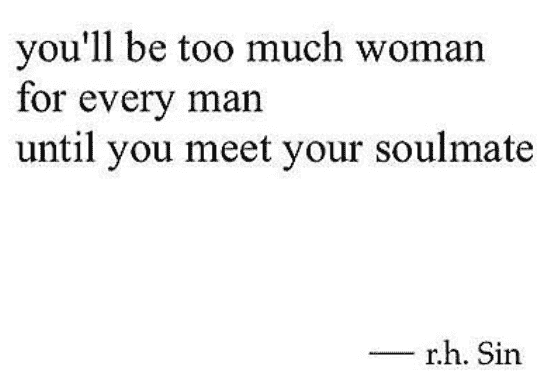
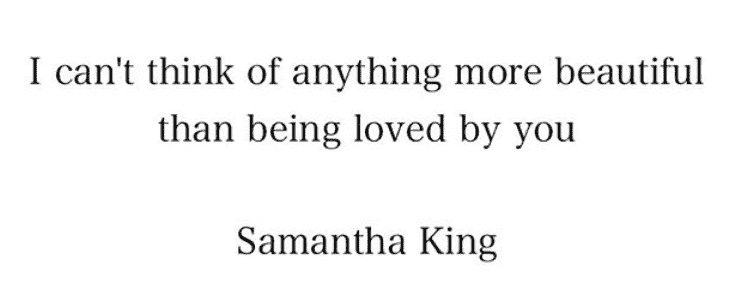

# Instagram 如何给女权主义诗人 r.h. Sin 带来文学上的成功

> 原文：<https://thenewstack.io/instagram-brought-literary-success-feminist-poet-r-h-sin/>

周三，在全世界庆祝国际妇女节之际，《纽约客》的“文化”版块刊登了一篇鼓舞人心的关于 T2 的报道，这个男人一直在为国际妇女节加油。

这是对“一个 Instagram 诗人的生活”的迷人审视——具体来说就是 [r.h. Sin](https://www.instagram.com/r.h.sin/) (他的真名是鲁本·霍姆斯)。《纽约客》指出，他的“第四波女权主义的精粹”在网上吸引了大量观众。14 个月前，辛的亲女性诗歌在 Instagram 上聚集了 251，018 名粉丝。一年后，在 2017 年初，这一数字翻了一番，达到 515，164 名粉丝，并且仍在增长。在过去的 10 周里，这个数字攀升到了 58 万。

“你的账户应该增长，你也应该增长，”霍姆斯告诉《纽约客》。“进化是关键。”

像一个真正的诗人一样说话…

但这可能是 Instagram 诗人第一次被文学界的堡垒如此重视。“很荣幸能够说，我出现在@newyorkermag 的文化部分,”Reubens [周三发布在 Instagram](https://www.instagram.com/p/BRY6rzVBj9G/)上，提出了下一代伟大诗人是否会在 Tumblr 和 insta gram 上被发现的问题。

“如果他们不以某种形式或身份追随你，你怎么能指望影响到这一代人？”他告诉杂志。

《纽约客》指出，他们的简短采访花了四个多小时——有长时间深思熟虑的打字停顿(大概也是为了写答案)——还有一点多任务处理。甚至在他回答问题的时候，他已经在创作更多的 Instagram 诗歌了。“在这里写作启发了我在别处的写作。”她问他有多少首诗，他回答说“可能有 11 首”

但这些话最初部分来自一段糟糕的关系，一个女人和一个“在认识我之前就伤透了心”的父亲一起长大。这让他想到了一个主题，那就是鼓励女人向她们的男人要求更多。“我的话是我会对我的姐妹、我的母亲或我想保护的妇女说的话。”

鲁本·霍姆斯出生在新泽西州的不伦瑞克，但父母离异后，他在佛罗里达州的公共住宅中长大。“罪恶来自一个痛苦的生活是常态，毁灭是永恒的地方，”他在亚马逊上的传记中写道，尽管他努力过上了更好的生活。"通过在很小的时候就对阅读和写作的热爱，r.h. Sin 能够摆脱困扰许多同龄人的一些社交干扰。"

据《纽约客》报道，到了三年级，他已经开始掠夺当地图书馆的诗歌宝藏，临摹埃德加·爱伦·坡的诗歌，这样即使在书到期后，他仍然可以拥有它们。年轻的霍姆斯写日记，写满了文章和故事，但他最终决定不上大学，他描述说，朋友们陷入了学生债务的困境，他们的工作无法帮助他们偿还，他十几岁时就在当地的塔吉特百货公司找了份工作。

从 2006 年开始，霍姆斯也开始尝试使用 Twitter，试图建立一个在线受众。还有其他工作——他显然在网上为人工引导的搜索引擎 ChaCha 工作，并通过在推特上发布大品牌的促销信息赚了一些钱(包括狮门影业电影 MTV 和三星手机)。他说这让他了解到在网上引起人们的注意有多难。

《纽约客》指出了这些在线演出的重要性。"不受办公室束缚给了福尔摩斯写作的空间。"他的新形式是简短的(社交媒体友好的)智慧和诗歌，压缩成 140 个字符的推特。在那里，他的观众增加了，粉丝数量从[飙升至超过 627，000](https://twitter.com/byRHSin)，Instagram 是一个吸引更多粉丝的合乎逻辑的地方。

他形容自己是一个努力工作的人，不满足于只是一个苦苦挣扎的艺术家，每天发布 15 到 20 次，吸引了多达 100 万个赞。(他的目标是每天正好写 7222 个字。)有一些适时的话题——一首关于尊重和成为赢家的诗恰逢[超级碗](https://thenewstack.io/super-bowl-sunday-age-data-tech/)和新英格兰爱国者队戏剧性的后来居上的胜利。“目标是被看到或听到，”鲁本斯告诉《纽约客》，“我制造了很多噪音。”

《纽约客》写道，一件事不可避免地会引发另一件事。

"这些短语很有启发性，适合转贴和印在 t 恤上。"果然，他出售印有他的诗歌的衣服。福尔摩斯还在亚马逊网站上出售他的诗集。但这一切都导致了一首诗完美的大团圆结局。

鲁本斯的诗歌最终吸引了另一位作家——萨曼莎·金(Samantha King)在决定性的一天通过他的 Instagram 账户联系了他。她想分享一首她说是他启发她写的诗，然后整个晚上他们都在 Instagram 上互相发消息。然后是电话(和 Skype 电话)。诗人辛说:“我意外地爱上了一个熟悉的陌生人。”

幸运的是，[的感觉是相互的](https://www.instagram.com/p/BRLayAdDwgt/)。

他搬到纽约市和她在一起，或者，正如他的亚马逊个人资料所描述的，“为了追求爱情和获得成功的机会。”

这对夫妇现在订婚了。

https://www.instagram.com/p/BRY-exTBxga/?被摄体=r.h.sin

直到今天，他的 Instagram 账户显示他只关注一个人:萨曼莎·金。周四，在一首新的短诗中，福尔摩斯将金描述为“[那种你会和](https://www.instagram.com/p/BRbILHHhI9T/)一起去打仗的女人。”在一个非常特殊的日子里，他们的作品还特别联合出现在亚马逊最畅销的非裔美国诗人排行榜上:

https://www.instagram.com/p/BRHuzO0BYlH/?被摄体=r.h.sin

本周，辛的三本书被列入亚马逊两大类十大畅销书——爱情诗歌和非裔美国人——其中一本书仅基于预订销售。这是他的诗集《一把铲子》的特别更新版本，其中“每一件作品都被重新审视和修改，以反映作者与他的搭档萨曼莎·金的持续旅程，没有他，这本书就不会存在。”

“萨曼莎是缪斯，作家所说的‘她’；她是每个觉得自己不够好的女人，每个努力寻找爱情的女人。”

他的诗集的两个精装版也同时被列入亚马逊的 2000 本最畅销书籍中。还有第二个系列——名为“威士忌、单词和铲子 II”——在亚马逊上吸引了超过 368 条评论(超过 90%的正面评价，平均四颗半星)。最后，也许真诚的希望、爱和坚持的话语总会被热情的观众接受。“这本书是自爱的关键……”一位经历了两年分分合合关系的评论家写道。

“就好像我曾经感觉到但一直不敢说出来的东西都在这本书里。”

* * *

## WebReduce

<svg xmlns:xlink="http://www.w3.org/1999/xlink" viewBox="0 0 68 31" version="1.1"><title>Group</title> <desc>Created with Sketch.</desc></svg>