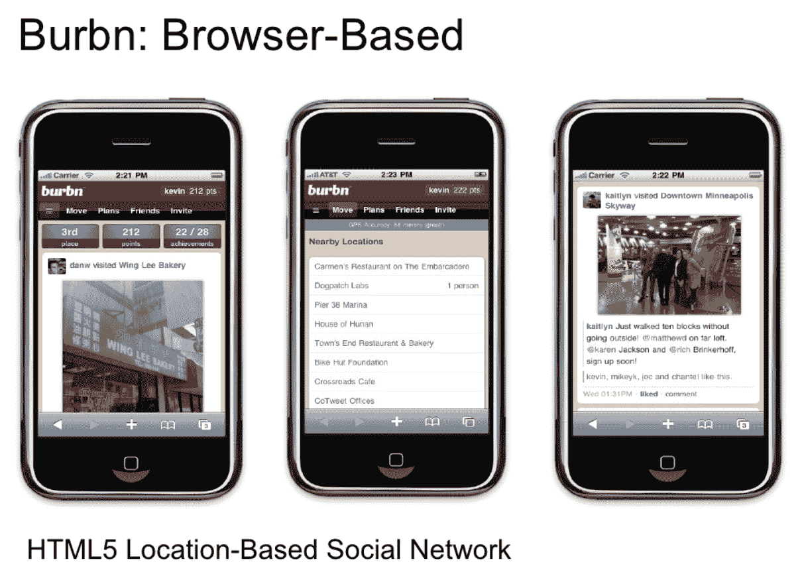

# Instagram Lite 不再是一个渐进式的网络应用程序，现在是一个用 Bloks 构建的原生应用程序

> 原文：<https://thenewstack.io/instagram-lite-is-no-longer-a-progressive-web-app-now-a-native-app-built-with-bloks/>

Instagram Lite 是 Instagram 应用程序的一个版本，仅重 2MB——相比之下，完整的 iOS 和 Android 应用程序重 30MB 于本月早些时候在 Android 上重新推出。奇怪的是，Instagram 决定抛弃之前的 Instagram Lite 的[渐进式网络应用](https://thenewstack.io/was-parler-really-a-progressive-web-app/) (PWA)版本，并使用一个名为 Bloks 的内部框架将其重建为一个 Android 应用。换句话说，Instagram Lite 不再是一个 web 应用程序。

那么，为什么 insta gram——以及其母公司脸书——决定放弃对新兴网络标准(PWAs)的支持，转而支持原生应用呢？

我们目前对称为 Bloks 的定制框架知之甚少。据 TechCrunch 的[报道，Bloks 将 Instagram Lite 的大部分应用逻辑移到了服务器端，并将其呈现为原生应用。](https://techcrunch.com/2021/03/10/facebook-targets-emerging-markets-with-instagram-lite-a-new-android-app-that-takes-up-just-2mb-in-170-countries/)[简·满春·王](https://github.com/wongmjane)，一位逆向工程博客作者[将](https://twitter.com/wongmjane/status/1369630165878272001)这种情况比作“React 服务器组件的工作方式”她指出，该应用程序“是原生的，有自己的引擎，可以接受和呈现服务器端发送的定制格式(不是 HTML 也不是 JS)的布局和内容。”

Bloks 很可能是脸书早期轻量级框架项目的延续。光速项目是最近的一个例子——它是去年[宣布的](https://engineering.fb.com/2020/03/02/data-infrastructure/messenger/)一种“让 Messenger 的 iOS 应用更快、更小、更简单”的方式 LightSpeed 是一个内部工具，但脸书多年来的许多开发项目都是开源的，例如 Android 的声明式 UI 框架 Litho。Litho 使用“React 声明性模型和 [Yoga](https://yogalayout.com/) 布局系统，”另外两个脸书开源项目。

因此，在脸书，以开发人员为中心的项目有着丰富的历史，其中一些是开源的，一些(如 Bloks)对外界来说是黑箱。不过，我觉得最有趣的是脸书对网络标准的不断挑逗，这种挑逗从未真正实现过。Instagram Lite 有几年是 PWA，但现在突然又变成了原生应用。

 [理查德·麦克马努斯

Richard 是 New Stack 的高级编辑，每周撰写一篇关于 web 和应用程序开发趋势的专栏文章。此前，他在 2003 年创立了读写网，并将其打造为全球最具影响力的科技新闻和分析网站之一。](https://twitter.com/ricmac) 

当然，脸书足够大，可以创建自己的科技栈*并*维护它。这样做的一个好处是，脸书不需要依赖浏览器供应商来实现它想要的功能。这不仅给了脸书对其开发渠道的灵活性和控制权，还允许该公司在新产品功能上快速前进(尽管它试图不再“[打破东西](https://www.businessinsider.com.au/mark-zuckerberg-on-facebooks-new-motto-2014-5?r=US&IR=T)”)。

值得注意的是，脸书**不是**WHATWG 小组的成员，该小组与万维网联盟( [W3C](https://www.w3.org/) )合作创建和维护网络标准。WHATWG 由领先的浏览器供应商运营:苹果、谷歌、Mozilla 和微软。这可能部分解释了 Instagram Lite 为何远离 PWA 技术。

我应该补充一点，脸书并没有完全放弃 PWA——本月早些时候[它在微软商店发布了](https://thewincentral.com/facebook-app-beta-again-available-in-the-microsoft-store-as-a-pwa-requires-latest-edge-build-on-windows-10/)其主要应用的新 PWA 版本，以取代该平台上之前的桌面应用。所以脸书可以——也经常——使用最新的网络应用技术。毕竟，正是这家公司创建了 React JavaScript 库，而 Facebook.com 当前的技术堆栈正是基于这项技术。

然而，Instagram 本身在网络浏览器支持方面有着更丰富的历史，可以追溯到 2010 年的开端。

## Instagram 的网络标准历史

在 2010 年末成为 iOS 照片分享应用之前，Instagram 的创始人创建了一个名为 Burbn 的 HTML5 移动网站。这是一个基于位置的社交网络，是当时流行的 Web 2.0 类别。2010 年 5 月，我之前的公司读写网在山景城举办了一次会议，凯文·斯特罗姆和 T2 的迈克·克里格在会上展示了 Burbn。在[我的主题演讲](https://web.archive.org/web/20100510055057/http://www.readwriteweb.com/archives/rww_mobile_web_summit_keynote_mobile_trends_for_20.php)中，我提到 Burbn 是新兴(我当时认为)移动网络的典范。

我 2010 年 5 月演讲中的一张幻灯片，提到了 Instagram 的前身 Burbn。

好吧，我们都知道那里的历史:移动网络很快让位于来自 iOS 和 Android 的原生应用，这让 HTML5 失去了所有的动力。在 2010 年 10 月推出后，Instagram 成为了一个病毒式的轰动，然后在 2012 年 4 月以 10 亿美元的价格卖给了脸书(同月它发布了一个安卓应用)。

Instagram 是第一批专为智能手机设计的主要在线产品之一——作为一款原生应用——而不是桌面电脑。当脸书收购 Instagram 时，它的网页浏览器功能非常有限。虽然随着时间的推移，这种情况有所改善，但直到 2019 年 2 月[日](https://techcrunch.com/2019/02/12/instagram-direct-desktop/)Instagram 的浏览器版本才获得消息功能(举个例子)。

但值得称赞的是，Instagram 也注意到，自 2010 年初的 Burbn 时代以来，移动浏览器已经变得更好了。由于网络浏览器对 PWAs 和 HTML5 的支持[大大改善，移动网络重新扬帆起航。因此在 2018 年，在早期 PWA 如](https://thenewstack.io/flash-is-gone-and-web-standards-now-reign-supreme-in-multimedia/) [Twitter Lite](https://blog.twitter.com/en_us/topics/product/2017/introducing-twitter-lite.html) 的引领下，Instagram 选择推出自己的 PWA Lite 版本。

当 PWA Instagram Lite 在 2018 年 6 月推出[时，它只有 573 千字节(大约是本月推出的新版 Android 的四分之一)。当时，Instagram Lite 被定位于“发展中国家的移动用户，他们通常使用存储空间较小、网络连接速度较慢或负担不起大数据套餐的旧手机。”新的 Lite 应用程序并没有改变信息传递——只是改变了技术。PWA 版本](https://techcrunch.com/2018/06/27/instagram-lite/)[去年消失](https://techcrunch.com/2020/05/11/instagram-lite-shuts-down-in-advance-of-a-relaunch/)，直到现在我们才看到它的官方替代品。

## 结论

从我们目前对 Bloks(新的 Android Instagram Lite 所基于的框架)的了解来看，脸书将其视为 PWA 版本所提供功能的升级。 [Tzach Hadar](https://www.linkedin.com/in/tzachhadar/) ，脸书 Lite apps 的产品管理总监[告诉 TechCrunch](https://techcrunch.com/2021/03/10/facebook-targets-emerging-markets-with-instagram-lite-a-new-android-app-that-takes-up-just-2mb-in-170-countries/)Bloks“性能更好，有更多的特性和功能。”

脸书是否会继续以这种方式开发其 Lite 应用程序，作为应用逻辑服务器端的原生应用程序，还有待观察。或者事实上，Bloks 框架是否会开源。至少对发展中国家来说，它可能是艾滋病毒/艾滋病的可行替代方案。

<svg xmlns:xlink="http://www.w3.org/1999/xlink" viewBox="0 0 68 31" version="1.1"><title>Group</title> <desc>Created with Sketch.</desc></svg>