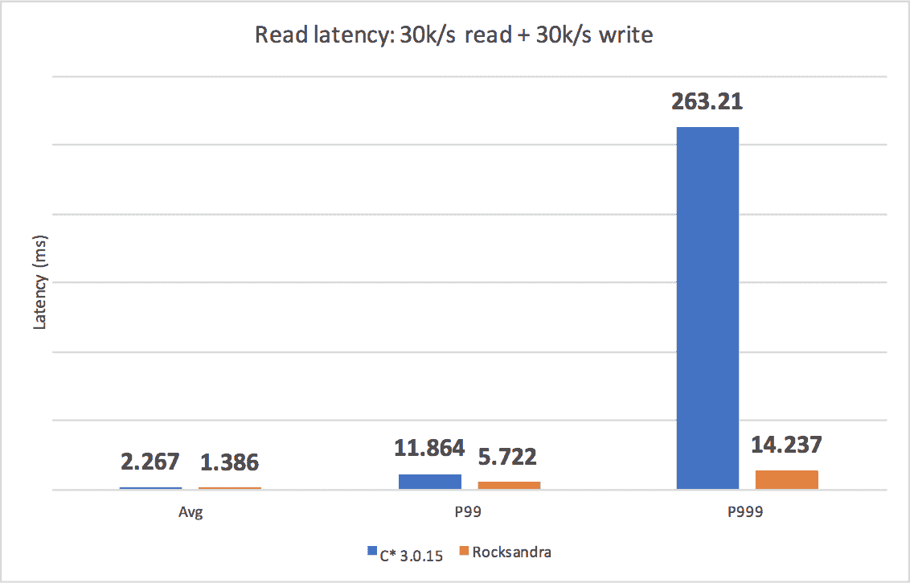

# Instagram 用一个可插拔的 RocksDB 存储引擎为 Cassandra 充电

> 原文：<https://thenewstack.io/instagram-supercharges-cassandra-pluggable-rocksdb-storage-engine/>

为了提高 Cassandra 的关键任务实例的性能，Instagram 工程师用另一个数据库 RocksDB 中更快的基于 C++的存储引擎替换了这个基于 Java 的分布式开源数据库的存储引擎。

凭借由此产生的被称为“Rocksandra”的高性能数据库，该公司的工程师希望此举将有助于推动 [Apache Cassandra](http://cassandra.apache.org/) 开发团队采用他们开发的这种[插件存储引擎架构](https://issues.apache.org/jira/browse/CASSANDRA-13474)，这可以为更灵活地使用 Cassandra 铺平道路。该公司已经开源发布了 [Rocksandra 代码库](https://github.com/Instagram/cassandra/tree/rocks_3.0)和[基准框架](https://github.com/Instagram/cassandra-aws-benchmark)。

Instagram 工程经理 Francois Deliege 说:“Rocksandra 是一把叉子，但不是用来和 Cassandra 竞争的。”。“我们并不试图向社区推销特定的 RocksDB 实现，但这只是展示它如何能有所帮助。如果我们有任何其他数据库或存储引擎支持这一点，这将是一个伟大的社区胜利，”他说。

Instagram 使用 Cassandra 作为一般的键值存储服务，以支持用户照片馈送、直接消息以及欺诈检测。虽然 Instagram 向磁盘写入数据的速度非常快，但它发现读取时间开始增加，导致用户的性能变慢。性能滞后来自 Java 的垃圾收集例程，该例程定期停止所有客户端请求来清理未使用的内存。“Cassandra 真的很擅长编写查询，但在读取方面，这有点痛苦，”Deliege 说。

“Cassandra 真的很擅长跨所有不同节点的通信，但 Java 不是与操作系统内核交互的最有效语言，”参与该项目的脸书软件工程师 Dikang Gu 解释道。

存储引擎可以被视为数据库的心脏。它负责格式化数据，以便可以将数据放在磁盘上，并在以后从磁盘中读取数据。用 C++编写的 leaner [RocksDB](http://rocksdb.org/) 存储引擎没有这个问题。这个由脸书开发的存储引擎针对性能进行了优化，尤其是在 SSD 这样的快速存储上。其他人将它插入到 MySQL、MongoDB 和其他流行的数据库中，以提高性能。

这项任务最初的挑战是 Cassandra 没有一个可以轻松嵌入 RocksDB 引擎的可插拔存储引擎架构。因此，工程团队继续定义了一个新的存储引擎 API，该 API 将分布层与存储引擎完全分离，集成了最常见的读/写和流接口。

“通过这种方式，我们可以在 API 背后实现新的存储引擎，并将其注入到 Cassandra 内部的相关代码路径中，”开发人员在解释这项工作的博客文章中写道[。](https://engineering.instagram.com/open-sourcing-a-10x-reduction-in-apache-cassandra-tail-latency-d64f86b43589)

【T2

他们在移植过程中还面临着其他挑战。他们必须将 Cassandra 对丰富数据类型的支持与 RocksDB 更简单的键-值接口相匹配。这需要为这些数据模型定义编码/解码算法。

最后，该公司需要适应其流数据架构。每当一个节点加入集群或从集群中移除时，传入的数据流都会流经所有节点。这个模型必须被改变以适应 RocksDB APIs。

## 结果

该团队已经在这个项目上工作了一年多的时间，并能够在生产中进行测试，他们发现新架构的红色延迟从 60 毫秒到 20 毫秒。此外，垃圾收集导致的临时操作延迟从 2.5%下降到 0.3%，降幅为 10 倍。

Instagram 工程师正在寻找向代码库中添加更多 C/C++功能的方法，以涵盖其他功能，如二级索引、修复等。

<svg xmlns:xlink="http://www.w3.org/1999/xlink" viewBox="0 0 68 31" version="1.1"><title>Group</title> <desc>Created with Sketch.</desc></svg>