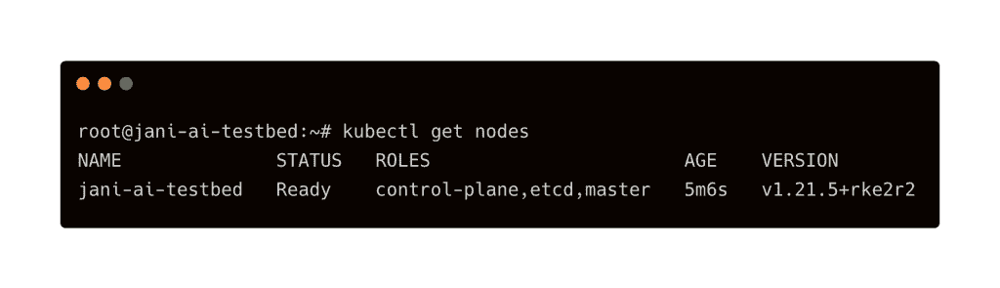
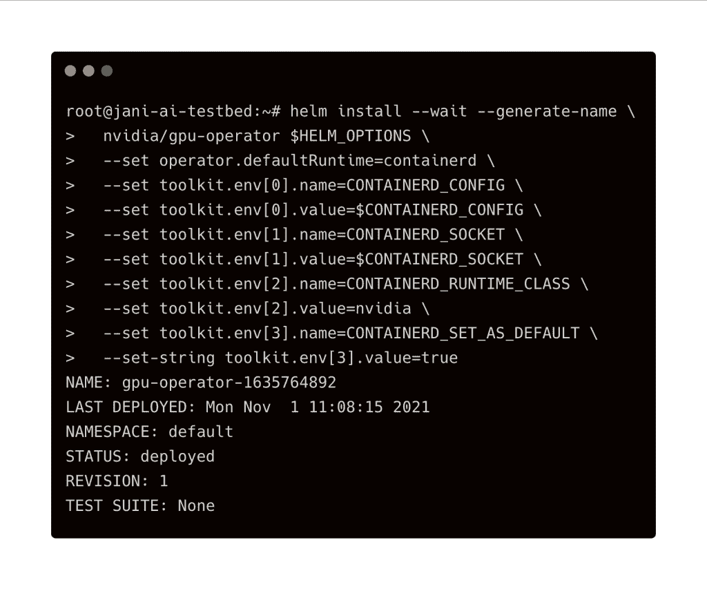
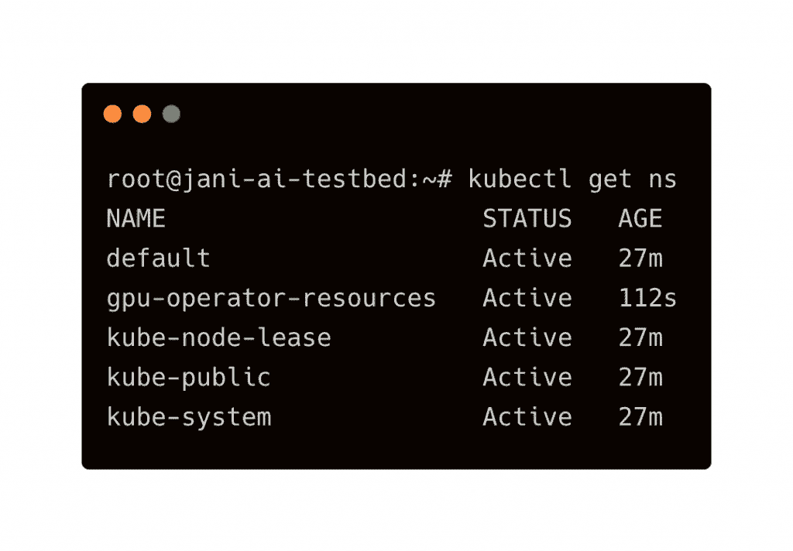
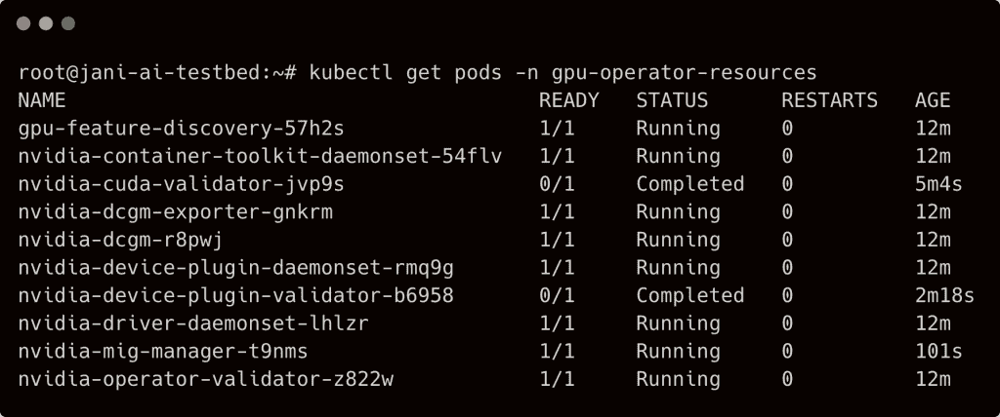
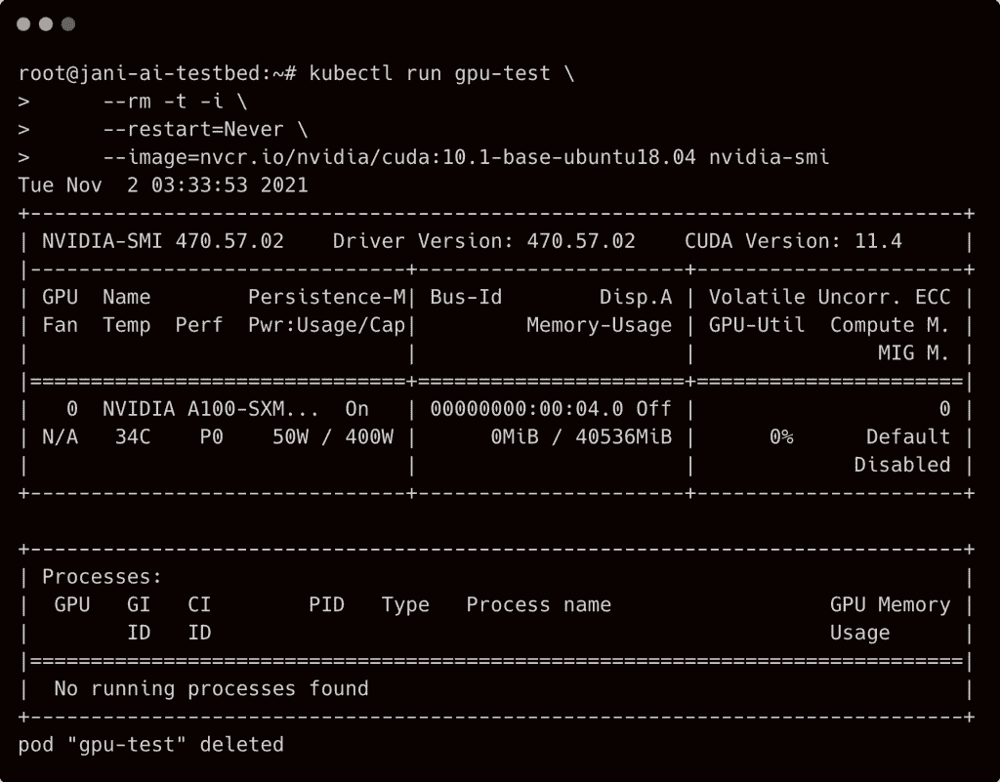

# 在 RKE2 Kubernetes 集群上安装一个 Nvidia GPU 运算符

> 原文：<https://thenewstack.io/install-a-nvidia-gpu-operator-on-rke2-kubernetes-cluster/>

在典型的基于 GPU 的 Kubernetes 安装中，例如对于[机器学习](https://thenewstack.io/category/machine-learning/)，每个节点都需要配置正确版本的 Nvidia 图形驱动程序、CUDA 运行时和 cuDNN 库，然后是容器运行时，例如 Docker Engine、containerd、podman 或 CRI-O

然后， [Nvidia 容器工具包](https://github.com/NVIDIA/nvidia-docker)被部署来提供对容器化应用的 GPU 访问。[用于 Kubernetes 的 Nvidia 设备插件](https://github.com/NVIDIA/k8s-device-plugin)在 GPU 和容器编制器之间架起了一座桥梁。最后， [Kubernetes](https://thenewstack.io/category/kubernetes/) 被安装，它将与选择的容器运行时交互，以管理工作负载的生命周期。

Nvidia GPU 操作员极大地简化了该过程，无需手动安装驱动程序、CUDA 运行时、cuDNN 库或 Nvidia 容器工具包。它可以安装在任何满足特定硬件和软件需求的 [Kubernetes 集群](https://thenewstack.io/what-does-it-take-to-manage-hundreds-of-kubernetes-clusters/)上。

与上游 Kubernetes 分布上的安装相比，RKE2 上的安装略有不同。关键的区别是 RKE2 带有一个嵌入式 containerd，需要稍微调整一下以支持 Nvidia 容器工具包。

一旦 RKE2 配置了 GPU 操作符，您就可以运行能够利用 GPU 进行 AI 加速的工作负载，如 [Kubeflow](https://thenewstack.io/kubeflow-where-machine-learning-meets-the-modern-infrastructure/) 和 [Triton 推理服务器](https://developer.nvidia.com/nvidia-triton-inference-server)。

在本教程中，我将带你完成在 Rancher 的 [RKE2 Kubernetes 发行版](https://rancher.com/products/rke)上安装 Nvidia GPU Operator 的所有步骤。

对于这个设置，我使用的是运行在谷歌计算引擎上的 Ubuntu 20.04 服务器。虚拟机的类型为 *a2-highgpu-1g* ，由 [Nvidia Tesla A100 GPU](https://www.nvidia.com/en-in/data-center/a100/) 驱动。已经用 *v1.21.5+rke2r2* 版本的 RKE2 发行版测试过了。但是您可以在能够访问 Nvidia GPU 的裸机或 IaaS 环境中使用本指南。

### 步骤 1:安装 RKE2

SSH 到实例中，用以下内容创建文件`/etc/rancher/rke2/config.yaml`:

该文件包含 RKE2 服务器所需的配置。不要忘记用 GCE 实例的主机名、内部 IP 和外部 IP 地址替换`tls-san`部分。

下载并运行 RKE2 的安装脚本。完成后，激活并使服务在引导时启动。

将包含 Kubernetes 二进制文件的目录添加到该路径中，并运行 kubectl 命令来检查服务器的状态。

### 步骤 2:安装舵和修补集装箱配置

既然我们会通过 Helm 图表来部署 GPU 操作符，那我们就先安装 Helm 3 吧。

下一步对于部署 Nvidia GPU Operator 来说至关重要。我们将修补配置文件以启用 v2 支持，如果没有 v2 支持，Nvidia 容器工具包将无法运行。

重启 RKE2 服务器，确保一切完好无损。

`systemctl restart rke2-server` 

### 步骤 3:在 RKE2 上部署 Nvidia GPU Operator

我们已经做好了部署 GPU 操作符的一切准备。

我们来添加 Nvidia Helm Chart Repo，刷新 Helm，安装 GPU 算子。

参考 [Nvidia GPU 操作员文档](https://docs.nvidia.com/datacenter/cloud-native/gpu-operator/getting-started.html)了解定制舵图表值的详细信息。在这种情况下，我们实际上是将 GPU 操作符指向自定义容器运行时类、配置和端点。

GPU 操作员的完整安装将需要几分钟时间。耐心点！

### 步骤 4:验证和测试 Nvidia GPU Operator 的安装

舵轮图创建了一个新的名字空间叫做`gpu-operator-resources`

等待`gpu-operator-resources`名称空间中的 pod 准备就绪。

最后，让我们运行著名的`nvidia-smi`命令来检查 Kubernetes pod 是否可以访问 GPU。

从输出中我们可以看到，GPU 操作员已经成功安装和配置了 Nvidia 驱动程序、CUDA 运行时和容器工具包，无需任何手动干预。

<svg xmlns:xlink="http://www.w3.org/1999/xlink" viewBox="0 0 68 31" version="1.1"><title>Group</title> <desc>Created with Sketch.</desc></svg>