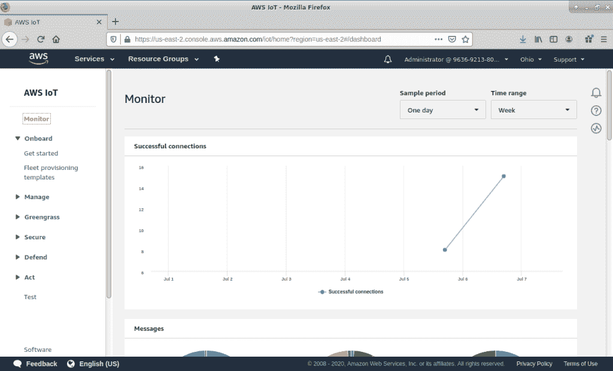
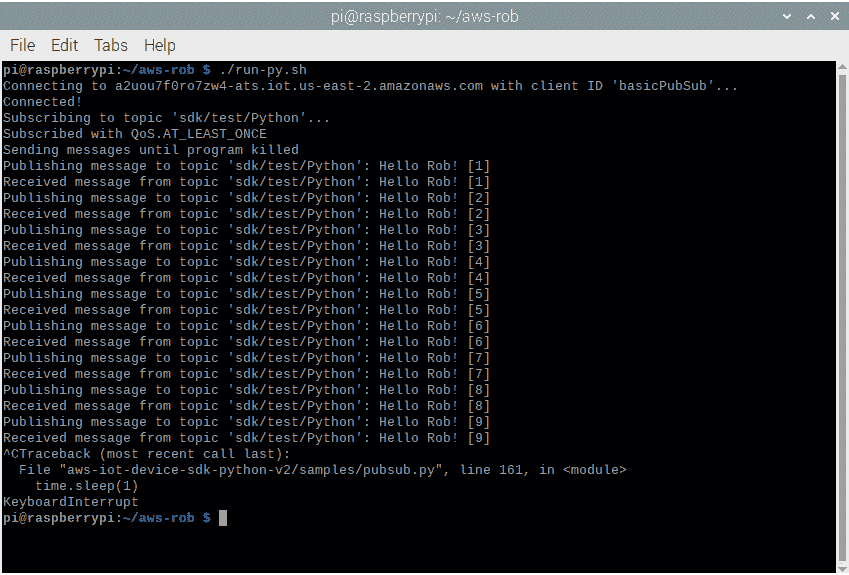

# Torq 博士:在 Raspberry Pi 上安装 AWS 物联网连接套件

> 原文：<https://thenewstack.io/install-an-aws-iot-connect-kit-on-the-raspberry-pi/>

能够说“Alexa，打开餐厅的灯”并让灯亮着是很好的。能够控制 Linux 驱动的项目不是很酷吗？

例如，我喜欢说“Alexa，让 Barkley 说话”这样的话，并让我的新骨骼机器狗发出几声“汪汪”的回应。巴克利很快将成为我不断进化的机器人头骨赫德利的忠实伴侣，并将使用某种类型的 Linux 驱动的“Pi ”,如大脑。

起初，我试图让快捷的 Python fauxmo 库在一个库存的 Raspberry Pi 4 上工作。一个“fauxmo”欺骗 Alexa 认为这盏灯是一个商业的物联网设备。它非常可靠——我使用“faux mo”Arduino 库构建了一个[小节点 MCU 控制的交换机项目](https://thenewstack.io/off-the-shelf-hacker-control-your-home-projects-with-amazon-alexa/)。网上有很多 fauxmo 的例子。

在这种情况下，它没有成功，所以我深入研究了亚马逊 AWS 开发环境，发现了很多新的可能性。我还意识到，使用“亚马逊方式”连接东西有相当多的部分幸运的是，亚马逊通过 AWS 核心物联网连接套件简化了这一过程。您在开发站点上配置“工具包”,然后下载并在您的目标 Pi 上安装结果。它配置 Python 程序所需的所有认证和安全数据，在 Pi 上运行以连接后端的 Amazon 服务。更好的是，MQTT 被烘焙到亚马逊核心物联网环境中。 [MQTT](http://mqtt.org/) 是一个分布式的轻量级消息传递系统，让机器之间可以轻松地进行通信。运气好的话，巴克利和赫德利可以通过我的语音指令和 Alexa 互动。

让 Alexa 将我的愿望传递给 Barkley 的第一步是建立 Pi 和亚马逊物联网云之间的通信链接。这是通过“连接套件”完成的我们将在以后的文章中讨论 Alexa 语音服务。

## 构建您自己的连接套件

你需要一个开发者账户。转到 [AWS 物联网帐户设置屏幕](https://docs.aws.amazon.com/iot/latest/developerguide/setting-up.html)并按照指示进行操作。您还应该创建一个 IAM 用户供日常使用。整个过程都讲得很清楚。一切都可以在 Raspberry Pi(带有显示器、键盘和鼠标)上的网络浏览器和命令行终端中完成。我用的是一个树莓派 4 型号 B，最新版本的树莓派 OS。我最初在我的华硕 Xubuntu 笔记本上探索了 Connect kit，在那台机器上一切正常。当然，您没有任何通用输入/输出(GPIO)功能，就像英特尔驱动的 Linux 笔记本电脑上的 Pi 一样。Alexa 与笔记本电脑的连接可能仍然对启动应用程序、调整音频播放音量或集成文本到语音输出功能感兴趣。

首先，作为 IAM 用户登录您的 AWS IoT 帐户。我的用户名是“管理员”输入您的密码。

主 AWS 核心物联网屏幕

将出现 AWS 物联网主屏幕。

*   选择“板载”,然后从左侧导航窗格中选择“开始”。
*   在板载设备面板上选择“开始”。
*   按下“连接到 AWS 物联网”屏幕底部的“开始”按钮。
*   选择“Linux 作为您的平台”和“Python”作为 AWS 物联网设备 SDK，然后点击屏幕底部的“下一步”按钮。
*   在“注册一个东西”文本框中命名您的设备，然后单击“下一步”按钮。我把我的覆盆子设备叫做“robthing-pi”。
*   现在将连接工具包下载到您的 Pi。将其保存到一个目录中。我使用了 Pi 的默认“下载”目录。

## 在 Pi 上设置和测试套件

接下来，在 Pi 上打开一个 Linux 终端，使用下面的命令构建 Python 程序。我在我的主目录下创建了一个“rob-aws”目录来整合我的 aws 开发工作。

`rob-pi% cd`
`rob-pi% mkdir rob-aws`

将下载的 zip 文件复制到本地目录。

`rob-pi% cp ~/Downloads/connect_device_package.zip .`

不要忘记“.”这样文件就在本地目录中了。

`rob-pi% unzip connect-device_package.zip`

在尝试构建连接工具包之前，需要使生成的 start.sh 脚本可执行。

`rob-pi% chmod +x start.sh`

接下来可以运行 start.sh 脚本。

`rob-pi% ./start.sh`

此时，start.sh 在我的华硕 Xubuntu 笔记本上运行，但在我的 Pi 上失败，原因是安全问题。默认情况下，cmake 也没有安装在 Pi 上。按照以下步骤让 start.sh 在 Pi 上正常运行。

`rob-pi% sudo apt update`
`rob-pi% sudo apt upgrade`
`rob-pi% sudo apt install cmake`

运行 start.sh 脚本安装所需的库并构建 Python 程序。一串状态文本将滚动显示，需要几分钟来配置/编译。最后，Pi 将连接到 Amazon 物联网云，并开始向 AWS 代理发布/订阅 MQTT 测试消息。您会看到信息在终端窗口中滚动。

AWS 核心物联网连接套件 Python 程序的 MQTT 发布/订阅输出

键入通常的 Ctrl-C 组合来停止 MQTT 测试消息并返回到命令行。

## 包裹

我们已经了解了如何在 Raspberry Pi 上下载和安装 AWS 物联网连接套件。如果您喜欢 Node.js 和 Java 编程语言，您还可以为它们构建一个工具包。

关于使用 AWS 核心物联网服务，有很多需要学习的地方。随着巴克利和赫德利的发展，我们将深入探讨。稍加想象，这里学到的经验可以很容易地应用到其他 Alexa/Linux/Pi 项目中。未来的故事将会谈到将 Alexa 连接到 MQTT 消息，这样我们就可以让巴克利和赫德利做一些很酷的事情，比如说话或移动伺服系统。

一如既往，这是科技、Linux 和物理计算史上最伟大的时代。

*在[doc@drtorq.com](mailto:doc@drtorq.com)或 407-718-3274 联系 [Rob "drtorq" Reilly](/author/rob-reilly/) 咨询、演讲约定和委托项目。*

亚马逊网络服务是新堆栈的赞助商。

目前，新堆栈不允许直接在该网站上发表评论。我们邀请所有希望讨论一个故事的读者通过推特或脸书访问我们。我们也欢迎您通过电子邮件发送新闻提示和反馈:[feedback @ thenewstack . io](mailto:feedback@thenewstack.io)。

<svg xmlns:xlink="http://www.w3.org/1999/xlink" viewBox="0 0 68 31" version="1.1"><title>Group</title> <desc>Created with Sketch.</desc></svg>