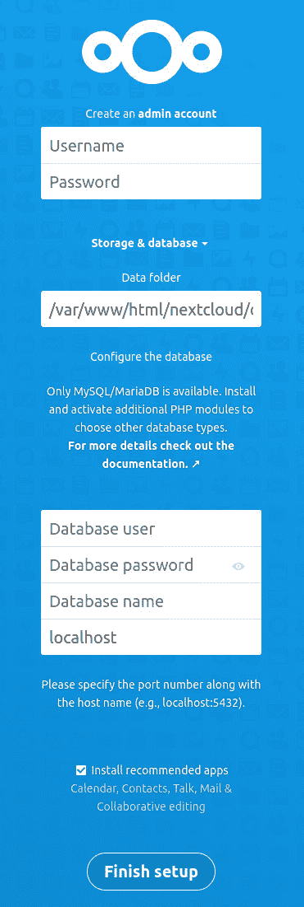

# 在 Ubuntu Linux 服务器上安装缓存增强的 Nextcloud 云存储

> 原文：<https://thenewstack.io/install-cache-enhanced-nextcloud-cloud-storage-on-the-ubuntu-linux-server/>

当越来越多的人和企业不得不改变他们的工作方式时，内部协作友好的 [Nextcloud](https://nextcloud.com/) “云”存储服务提供了一个易于使用、可靠且可扩展(可安装数百个应用程序)的选项。把它想象成你(虚拟)Linux 电脑上的 Google Drive 或者 Dropbox 共享文件驱动器，但是是用开源构建的。随着每一次新的迭代，开发人员都会添加新的功能并完善现有的功能。

Nextcloud 20 的最新版本包括一些重要的变化，其中两个是新的仪表盘——用于快速概述 next cloud 实例上发生的事情——和 Talk 集成，因此你可以将本地聊天工具与 IRC、Slack、MS Teams 等服务联系起来。

换句话说，如果你还没有搭上下一代云计算的顺风车，现在是一个非常好的时机。

我想带您了解一下 Nextcloud 20 的安装过程。我将在 Ubuntu Server 20 上演示，所以您需要有一个开放源码服务器平台的实例并运行。

我还将向您展示如何通过将缓存集成到组合中来提高 Nextcloud 的性能(否则，Nextcloud 可能会显得有点慢)。

说完这些，我们开始工作吧。

## 安装必要的依赖项

我们要做的第一件事是安装必要的依赖项。登录到您的 Ubuntu 服务器实例，使用以下命令管理 web 服务器和数据库:

`sudo apt-get install apache2 mysql-server -y`

现在，我们将使用以下命令安装 PHP 和其他一些依赖项:

`sudo apt-getinstall php zip libapache2-mod-php php-gd php-json php-mysql php-curl php-mbstring php-intl php-imagick php-xml php-zip php-mysql php-bcmath php-gmp -y`

## 照顾好数据库

接下来，我们将处理数据库。首先，我们必须使用以下命令来保护 MySQL:

`sudo mysql_secure_installation`

您需要首先设置一个管理员密码，然后对剩下的问题回答“是”(通过键入“y”)。

确保数据库安装安全后，现在可以创建数据库和新用户。使用以下命令登录 mysql 控制台:

`sudo mysql`

在 MySQL 提示符下，使用以下命令创建新数据库:

`CREATE DATABASE nextcloud;`

使用以下命令创建新的 Nextcloud 数据库用户:

`CREATE USER 'nextcloud'@'localhost' IDENTIFIED BY 'PASSWORD';`

其中 PASSWORD 是唯一的强密码。

使用以下命令授予新用户对数据库的适当权限:

`GRANT ALL PRIVILEGES ON nextcloud.* TO 'nextcloud'@'localhost';`

最后，清空 MySQL 权限，并使用以下命令退出控制台:

`FLUSH PRIVILEGES;exit`

## 下载、打开包装并找到 Nextcloud

我们现在将下载 Nextcloud 文件。使用以下命令切换到 tmp 目录:

`cd /tmp`

使用以下命令下载 Nextcloud 文件:

`wget https://download.nextcloud.com/server/releases/nextcloud-20.0.2.zip`

使用以下命令解压 zip 文件:

`unzip nextcloud-20.0.2.zip`

如果您发现 unzip 命令不存在，请使用以下命令安装它:

`sudo apt-get install zip -y`

文件解压缩后，使用以下命令将其重新定位到 web 服务器文档根目录:

`sudo mv nextcloud /var/www/html/`

使用以下命令更改 nextcloud 目录的所有权，以便 web 服务器可以访问:

`sudo chown -R www-data:www-data /var/www/html/nextcloud`

## 为 Nextcloud 配置 Apache

为了让 Apache 了解 Nextcloud，我们必须创建一个配置文件。使用以下命令创建文件:

`sudo nano /etc/apache2/sites-available/nextcloud.conf`

将以下内容粘贴到新文件中:

```
Alias  /nextcloud  "/var/www/html/nextcloud/"
<Directory  /var/www/html/nextcloud/>
    Options  +FollowSymlinks
    AllowOverride All
      <IfModule mod_dav.c>
        Dav off
      </IfModule>

     SetEnv HOME  /var/www/html/nextcloud
    SetEnv HTTP_HOME  /var/www/html/nextcloud
<Directory>

```

保存并关闭文件。

使用命令启用新配置:

`sudo a2ensite nextcloud`

接下来，使用以下命令启用必要的 Apache 模块:

`sudo a2enmod rewrite headers env dir mime`

使用以下命令为 Nextcloud 配置 PHP 内存限制:

`sudo sed -i '/^memory_limit =/s/=.*/= 512M/' /etc/php/7.4/apache2/php.ini`

使用以下命令重新启动 Apache:

`sudo systemctl restart apache2`

## 通过 Web 安装程序完成安装

现在，您可以连接到 Nextcloud 以完成安装。打开 web 浏览器，将其指向 http://SERVER/nextcloud(其中 SERVER 是托管服务器的 IP 地址或域)。在结果页面中(图 1)，创建一个新的 admin 用户，并填写数据库信息。



图一。Nextcloud 安装的最后一步。

确保选中“安装推荐的应用程序”复选框，然后单击“完成安装”。给安装人员一些时间来完成这个过程。当安装完成时，您会发现自己在新的 Nextcloud 仪表板上(图 2)，在这里您可以开始配置新的本地云服务器，以完全满足您的需求。


Figure 2: The new Nextcloud Dashboard is configured on a per-user basis.

## 启用缓存以获得更好的性能

对于我们的下一个技巧，我们将启用缓存，这将大大减少 Nextcloud 对象和页面的加载时间。第一步是安装 Redis、memcached 和 PHP apcu 模块。使用命令执行此操作(在托管 Nextcloud 的同一台计算机上运行):

`sudo apt-get install redis-server php-memcached memcached php-apcu -y `

安装完成后，使用以下命令启动并启用 Redis 服务器和 memcached:

`sudo systemctl start redis-server`

`sudo systemctl enable redis-server`

`sudo systemctl start memcached`

`sudo systemctl enable memcached`

安装 Redis 后，我们需要调整配置文件。使用以下命令打开该文件:

`sudo nano /etc/redis/redis.conf`

在该文件中，您将需要对下面的行进行如下修改(您必须删除后两行中的#字符):

```
port  0
unixsocket  /var/run/redis/redis.sock
unixsocketperm  700

```

为了使 Redis 能够与 web 服务器一起工作，必须使用以下命令将其添加到正确的组中:

`sudo usermod -aG redis www-data`

下一步是配置 Nextcloud 以使用 Redis 服务器。使用命令打开 Nextcloud 配置文件进行编辑:

`sudo nano /var/www/html/nextcloud/config/config.php`

将以下内容粘贴到文件最后一行的上方:

```
 'memcache.local'  >'\OC\Memcache\APCu',
  'memcache.locking'  >  '\\OC\\Memcache\\Redis',
  'redis'  =>
   array  (
    'host'=>'/var/run/redis/redis.sock',
    'port'  =>  0,
    'timeout'  =>  0,
    'password'  =>  '',
    'dbindex'  =>  0,
),

```

该配置的底部应该类似于:

```
 'memcache.local'  =>  '\OC\Memcache\APCu',
  'memcache.locking'  =>  '\\OC\\Memcache\\Redis',
  'redis'  =>
   array  (
    'host'  =>  '/var/run/redis/redis.sock',
    'port'  =>  0,
    'timeout'  =>  0,
    'password'  =>'',
    'dbindex'  =>  0,
),
);

```

保存并关闭文件。

使用以下命令重新启动 Apache:

`sudo systemctl restart apache2`

我们接下来必须调整 PHP 以使用 Opcache，这将改进基本功能。用以下命令打开 php.ini 文件:

`sudo nano /etc/php/7.X/apache2/php.ini`

其中 X 是您的服务器上的 PHP 版本。

从第 1769 行开始，您需要对以下几行进行如下修改(删除任何前导；人物):

```
opcache.enable=1
opcache.enable_cli=1
opcache.interned_strings_buffer=8
opcache.max_accelerated_files=10000
opcache.memory_consumption=128
opcache.save_comments=1
opcache.revalidate_freq=1

```

保存并关闭文件。

使用以下命令重新启动 Apache:

`sudo systemctl restart apache2`

回到你的浏览器，重新加载 Nextcloud。虽然一开始您不会注意到速度的提高，但最终(一旦缓存被充分填充)速度会提高。

这就是你如何在 Ubuntu Server 20.04 上安装 Nextcloud 20，并通过缓存给它一点性能提升。随着这个云平台的建立和运行，您可以做更多的事情，而不必依赖第三方主机来存放您的文件和其他个人或业务相关的文档。

<svg xmlns:xlink="http://www.w3.org/1999/xlink" viewBox="0 0 68 31" version="1.1"><title>Group</title> <desc>Created with Sketch.</desc></svg>